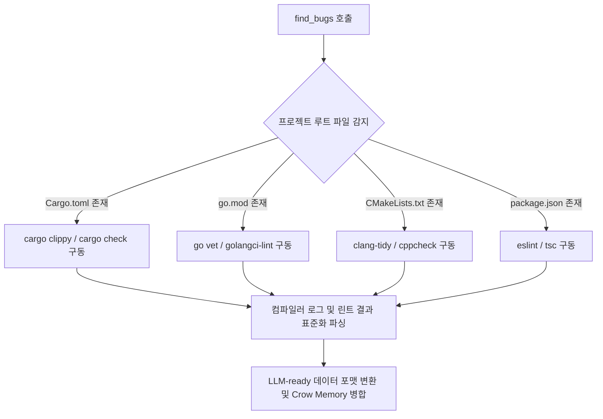

# VibeZoo 다국어(C++, Rust, Go 및 일반 소스 파일) 분석 엔진 고도화 설계 제안서

이온기반 지능(파트너)님, VibeZoo Bridge의 핵심 도구인 `review_code` 및 `find_bugs`가 C++, Rust, Go 등 다양한 시스템 프로그래밍 언어와 일반 소스 파일에서도 TS/JS나 Python 못지않은 **우수한 정밀 버그 탐지 및 코드 품질 검사 도구**로 거듭나기 위한 기술적 수정 및 아키텍처 확장 방안을 제안합니다.

---

## 1. 현재 VibeZoo 다국어 분석 아키텍처의 한계 분석

현재 구현되어 있는 [ast_engine.py](file:///C:/Users/k1yt/OneDrive/문서/각종자료/공부자료들/파이썬_Python/VibeZoo_forZoocode/mcp-servers/bridge/ast_engine.py) 및 [reviewer.py](file:///C:/Users/k1yt/OneDrive/문서/각종자료/공부자료들/파이썬_Python/VibeZoo_forZoocode/mcp-servers/bridge/tools/reviewer.py)를 분석한 결과, 다음과 같은 구조적 보완점이 확인되었습니다.

1. **Rust AST 분석 미연동**:
   * `ast_engine.py`에는 Rust 파서(`rust_item`, `struct_item` 등)가 이미 구현되어 있으나, [reviewer.py](file:///C:/Users/k1yt/OneDrive/문서/각종자료/공부자료들/파이썬_Python/VibeZoo_forZoocode/mcp-servers/bridge/tools/reviewer.py#L490)의 실제 분석 분기에서는 `.rs` 파일에 대해 AST를 가동하지 않고 **단순 정규식 기반의 폴백(`unsafe`, `.unwrap()` 개수 카운팅)만 사용**하고 있습니다.
2. **C/C++ 지원 전무**:
   * C++(`.cpp`, `.hpp`, `.cc`, `.h`) 파일군은 `ast_engine.py` 내의 `LANGUAGES` 확장자 매핑 목록 및 `NODE_TYPES` 규칙 그룹에 전혀 포함되어 있지 않습니다.
3. **Go 분석 규칙의 단편성**:
   * Go(`.go`) 언어는 AST 파싱은 수행하나, 함수 길이 측정 외에 Go 언어 특유의 핵심적인 잠재 버그(채널 누출, 섀도잉, Defer 내 패닉 예방 등) 탐지 로직이 부족합니다.
4. **`find_bugs`의 특정 언어 의존성**:
   * [integrated.py](file:///C:/Users/k1yt/OneDrive/문서/각종자료/공부자료들/파이썬_Python/VibeZoo_forZoocode/mcp-servers/bridge/tools/integrated.py#L400)의 `find_bugs` 구현은 Node.js 생태계의 `ESLint`와 `tsc`에 전적으로 의존하고 있어, C++/Rust/Go 등 타 언어 프로젝트에서는 컴파일러 경고와 린터 경고를 전혀 수집하지 못하고 있습니다.

---

## 2. 언어별 세부 수정 및 고도화 설계

### A. C++ (C++20/17 표준 대응) 지원 추가
C++은 정적 분석을 통해 메모리 누수, 세그멘테이션 폴트, 미정의 동작(UB)을 유발하는 코드를 최우선으로 탐지해야 합니다.

1. **`ast_engine.py` 확장**:
   ```python
   # 1) LANGUAGES 매핑 추가
   LANGUAGES = {
       ...
       '.cpp': 'cpp',
       '.hpp': 'cpp',
       '.cc':  'cpp',
       '.h':   'cpp',
       '.c':   'c',
   }

   # 2) NODE_TYPES 매핑 추가
   NODE_TYPES = {
       ...
       'cpp': {
           'function': ['function_definition', 'generator_declaration'],
           'class':    ['class_specifier', 'struct_specifier'],
           'import':   ['preproc_include'],
           'call':     ['call_expression'],
       }
   }
   ```

2. **`reviewer.py` 내 C++ 특화 정적 검사 규칙 설계**:
   * **생 포인터(Raw Pointer) 지양 규칙**: AST에서 `pointer_declarator`를 탐색하여 스마트 포인터(`std::unique_ptr`, `std::shared_ptr`) 대신 raw pointer(`*`)가 남용되었는지 검사합니다.
   * **메모리 수동 해제 누수 위험**: `new` 예약어 검출 횟수와 `delete` 예약어 검출 횟수의 불일치를 모니터링합니다.
   * **경계 검사 우회**: `std::vector`나 `std::array`에 대해 `.at()` 대신 경계 검사가 없는 대괄호 오퍼레이터(`[]`)를 사용한 위치를 감지합니다.
   * **스레드 안전성**: `std::mutex`를 락한 후 `std::lock_guard`나 `std::unique_lock` 같은 RAII 패턴을 사용하지 않고 수동 락/언락을 하는 위험 코드를 경고합니다.

---

### B. Rust AST 분석 실연동 및 고도화
`ast_engine.py`에 구현된 Rust AST 파서를 실제 [reviewer.py](file:///C:/Users/k1yt/OneDrive/문서/각종자료/공부자료들/파이썬_Python/VibeZoo_forZoocode/mcp-servers/bridge/tools/reviewer.py)의 동작 흐름으로 끌어올립니다.

1. **`reviewer.py` 구조 수정**:
   ```python
   elif ext == ".rs":
       # 1) AST 엔진을 통해 구조 파악
       ast = ast_engine.parse(content, ext)
       functions = ast.get("functions", [])
       classes = ast.get("classes", [])  # Struct / Enum 매핑
       stats["functions"] = len(functions)
       stats["classes"] = len(classes)

       # 2) AST 기반의 복잡도 및 깊이 계산 기동
       comp = _compute_cyclomatic_complexity(content, ext)
       if comp > 15:
           issues.append(("⚠️", f"Cyclomatic complexity: {comp} — consider simplifying"))

       max_depth = _compute_nesting_depth(content, ext)
       if max_depth > 4:
           issues.append(("⚠️", f"Maximum nesting depth: {max_depth} — use match or early returns"))
   ```

2. **Rust 특화 정적 검사 규칙 설계**:
   * **`unsafe` 블록 내부 복잡도 제어**: AST에서 `unsafe_block` 노드를 찾아내고, 해당 블록의 라인 수가 15줄을 초과하거나 분기가 포함되어 있다면 안전성 검증을 위해 모듈 분할을 권장합니다.
   * **묵살된 Result/Option 처리**: `let _ = ...` 패턴을 통해 에러 전파(`?`)나 명시적 처리를 무시하고 덮어버린 위치를 식별합니다.
   * **Panic 유발 지점 차단**: `.unwrap()` 및 `panic!` 매크로 사용 외에도, 안전한 `expect()` 및 `unwrap_or()` 권장 경고를 정교화합니다.
   * **클론 남용 감지**: 소유권(Ownership) 개념을 우회하기 위해 `.clone()`을 지나치게 잦은 빈도로 사용하는 패턴을 정규식 및 AST 노출 빈도로 탐지합니다.

---

### C. Go 분석 규칙의 고도화
단순 함수 길이 검사를 넘어, Go 컴파일러가 직접 잡지 못하는 런타임 고루틴 누출(Goroutine Leak) 및 동시성 관련 안티패턴을 탐지합니다.

1. **`reviewer.py` 내 Go 특화 정적 검사 규칙 설계**:
   * **고루틴 내 루프 변수 캡처 (Loop Variable Capture)**: Go 1.22 미만 버전과의 호환성을 고려해, `for` 루프 안에서 `go func()`나 `defer func()`를 실행할 때 루프 변수를 매개변수로 넘기지 않고 클로저로 직접 참조하는 버그를 AST 상에서 검출합니다.
   * **Defer 내 패닉 예방**: `defer`로 실행되는 함수 내에 `recover()`가 없으면서 리소스를 정리하다 패닉이 발생할 수 있는 잠재적 위험 요소를 탐지합니다.
   * **채널 데드락**: 용량이 없는 버퍼리스 채널(unbuffered channel)을 쓰면서 송신/수신부가 다른 고루틴으로 분리되어 있지 않아 발생하는 데드락 위험 구조를 탐색합니다.
   * **동시성 락 누수**: `sync.Mutex` 호출 이후 `defer mu.Unlock()`이 즉시 호출되지 않고 긴 함수 블록 뒤에 수동 배치된 구조를 식별합니다.

---

## 4. 일반 소스 파일 (Shell Script, YAML, Dockerfile 등)
구문 트리가 필요하지 않은 구성 파일이나 스크립트에서도 실제 작동 가능한 경고를 도출하도록 범용 규칙을 확장합니다.

1. **Shell Script (`.sh`, `.bash`, `.ps1`)**:
   * 변수 선언 시 따옴표(`"`) 누락으로 인한 공백 분리 버그 감지.
   * `set -e` 또는 `set -o pipefail` 등의 안전 장치 부재 경고.
   * 정적 린터 도구 `shellcheck` 연동.
2. **IaC 및 설정 파일 (`Dockerfile`, `.yaml`, `.json`)**:
   * `Dockerfile`: `latest` 태그 고정 사용, `apt-get` 실행 시 캐시 미삭제 패턴 검출.
   * `YAML`/`JSON`: 중복 키 선언, 환경변수에 비밀번호/API 토큰이 하드코딩되었는지 패턴 매칭 검사.

---

## 5. `find_bugs` 엔진의 다국어 빌드 체인 연동 구조 개편 (거시적)

`find_bugs` 도구의 핵심은 **실제 동작하는 빌드 경고를 LLM에 공급**하는 것입니다. 이를 위해 [integrated.py](file:///C:/Users/k1yt/OneDrive/문서/각종자료/공부자료들/파이썬_Python/VibeZoo_forZoocode/mcp-servers/bridge/tools/integrated.py) 내에 다국어 빌드 도구 래퍼 체인을 아래와 같이 구축해야 합니다.

### ⚙️ 빌드 엔진 스위처 도입 설계
프로젝트의 루트 디렉토리에 있는 핵심 파일(`.git`, `Cargo.toml`, `go.mod`, `CMakeLists.txt`, `package.json`)을 기반으로 주 언어와 빌드 툴을 자동 감지합니다.



### 1. Rust (`Cargo.toml`) 감지 시
* **실행 명령어**: `cargo clippy --message-format=json --all-targets`
* **장점**: JSON 포맷으로 빌드 경고와 에러 정보를 완벽히 파싱할 수 있으므로, 에러가 발생한 정확한 라인, 코드 스니펫, 수정 제안(`clippy::suggestion`)을 LLM에게 정량적 데이터로 직접 제공 가능합니다.

### 2. Go (`go.mod`) 감지 시
* **실행 명령어**: `go vet ./...` 또는 로컬 환경에 `golangci-lint`가 존재하는 경우 `golangci-lint run --out-format=json`
* **장점**: 단순 컴파일 에러를 넘어 Go 언어 공식 도구가 권장하는 동시성 안전 검사 결과를 통일된 포맷으로 변환합니다.

### 3. C++ (`CMakeLists.txt` or `Makefile`) 감지 시
* **실행 명령어**: `cppcheck --enable=all --xml .` 또는 `clang-tidy`가 구성되어 있는 경우 컴파일 데이터베이스를 참조하여 분석 구동.
* **장점**: 빌드 과정의 환경적 경고들을 수집하여 초기 빌드 실패 위험을 미연에 방지합니다.

---

## 6. 구체적 린터 래핑 파이프라인 구현(예시)

`integrated.py`의 `find_bugs` 내부에서 아래와 같이 모듈화된 다국어 빌드 피드백 수집 구조를 구현할 수 있습니다.

```python
def _run_native_linter(root: Path) -> dict:
    """프로젝트 언어 환경을 감지하여 알맞은 린터/컴파일러 피드백을 반환합니다."""
    diagnostics = {"language": "unknown", "errors": [], "warnings": []}
    
    # 1. Rust 프로젝트
    if (root / "Cargo.toml").exists():
        diagnostics["language"] = "rust"
        try:
            res = subprocess.run(
                ["cargo", "clippy", "--message-format=json"],
                cwd=str(root), capture_output=True, text=True, timeout=30
            )
            for line in res.stdout.splitlines():
                if not line.strip(): continue
                data = json.loads(line)
                if data.get("reason") == "compiler-message":
                    msg = data["message"]
                    item = {
                        "file": msg["spans"][0]["file_name"] if msg["spans"] else "unknown",
                        "line": msg["spans"][0]["line_start"] if msg["spans"] else 0,
                        "message": msg["message"],
                        "rule": msg.get("code", {}).get("code") if msg.get("code") else "clippy"
                    }
                    if msg["level"] == "error":
                        diagnostics["errors"].append(item)
                    else:
                        diagnostics["warnings"].append(item)
        except Exception as e:
            diagnostics["errors"].append({"file": "Cargo.toml", "line": 0, "message": f"Clippy run failed: {e}"})

    # 2. Go 프로젝트
    elif (root / "go.mod").exists():
        diagnostics["language"] = "go"
        try:
            res = subprocess.run(
                ["go", "vet", "./..."],
                cwd=str(root), capture_output=True, text=True, timeout=20
            )
            for line in res.stderr.splitlines():
                m = re.match(r'^([^:]+):(\d+):(?:\d+:)?\s*(.*)$', line)
                if m:
                    diagnostics["warnings"].append({
                        "file": m.group(1),
                        "line": int(m.group(2)),
                        "message": m.group(3),
                        "rule": "go_vet"
                    })
        except Exception as e:
            diagnostics["errors"].append({"file": "go.mod", "line": 0, "message": f"Go vet run failed: {e}"})

    # 3. TS/JS (기존 레거시)
    elif (root / "package.json").exists():
        diagnostics["language"] = "typescript"
        # 기존 eslint 및 tsc 파서 로직 실행
        ...
        
    return diagnostics
```
