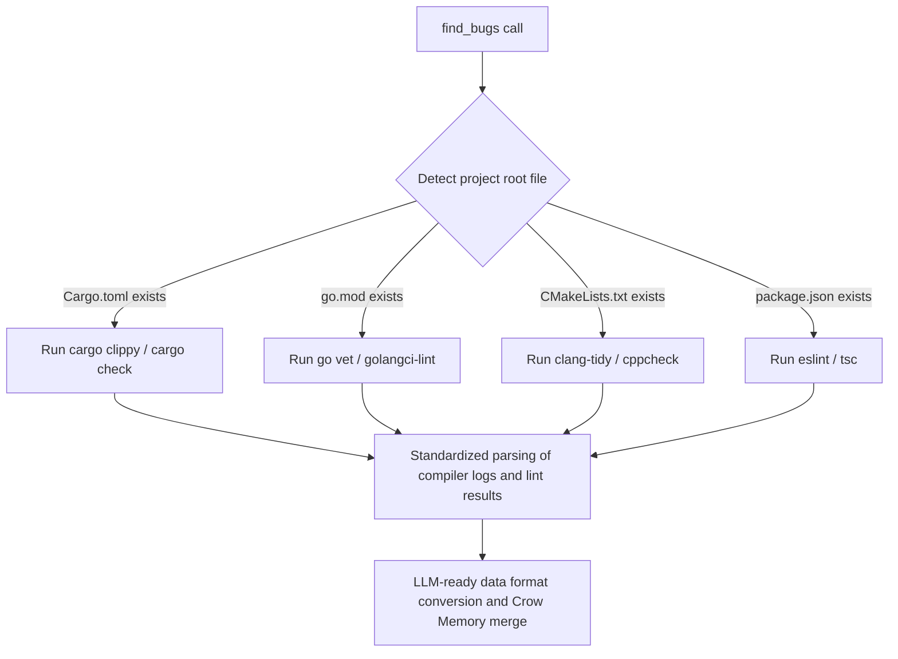

# VibeZoo Multi-language (C++, Rust, Go and General Source Files) Analysis Engine Enhancement Design Proposal

Ion-based Intelligence (Partner), this document proposes technical modifications and architecture expansion plans to transform VibeZoo Bridge's core tools `review_code` and `find_bugs` into **excellent precision bug detection and code quality inspection tools** for C++, Rust, Go, and other system programming languages as well as general source files, on par with TS/JS or Python.

---

## 1. Analysis of Current VibeZoo Multi-language Analysis Architecture Limitations

Analysis of the currently implemented [ast_engine.py](file:///C:/Users/k1yt/OneDrive/문서/각종자료/공부자료들/파이썬_Python/VibeZoo_forZoocode/mcp-servers/bridge/ast_engine.py) and [reviewer.py](file:///C:/Users/k1yt/OneDrive/문서/각종자료/공부자료들/파이썬_Python/VibeZoo_forZoocode/mcp-servers/bridge/tools/reviewer.py) reveals the following structural areas for improvement.

1. **Rust AST Analysis Not Integrated**:
   * `ast_engine.py` already implements Rust parsers (`rust_item`, `struct_item`, etc.), but the actual analysis branch in [reviewer.py](file:///C:/Users/k1yt/OneDrive/문서/각종자료/공부자료들/파이썬_Python/VibeZoo_forZoocode/mcp-servers/bridge/tools/reviewer.py#L490) does **not** run AST for `.rs` files and only uses **simple regex-based fallback** (counting `unsafe`, `.unwrap()` occurrences).
2. **No C/C++ Support**:
   * C++ (`.cpp`, `.hpp`, `.cc`, `.h`) file groups are not included in `ast_engine.py`'s `LANGUAGES` extension mapping list or `NODE_TYPES` rule groups at all.
3. **Fragmented Go Analysis Rules**:
   * Go (`.go`) language performs AST parsing, but lacks detection logic for Go-specific critical potential bugs (channel leaks, shadowing, panic prevention in Defer, etc.) beyond function length measurement.
4. **`find_bugs` Language-Specific Dependency**:
   * The `find_bugs` implementation in [integrated.py](file:///C:/Users/k1yt/OneDrive/문서/각종자료/공부자료들/파이썬_Python/VibeZoo_forZoocode/mcp-servers/bridge/tools/integrated.py#L400) relies entirely on Node.js ecosystem's `ESLint` and `tsc`, failing to collect compiler warnings and linter warnings at all for C++/Rust/Go projects.

---

## 2. Per-Language Detailed Modification and Enhancement Design

### A. C++ (C++20/17 Standard) Support Addition
C++ should prioritize detecting code that causes memory leaks, segmentation faults, and undefined behavior (UB) through static analysis.

1. **`ast_engine.py` Extension**:
   ```python
   # 1) Add LANGUAGES mapping
   LANGUAGES = {
       ...
       '.cpp': 'cpp',
       '.hpp': 'cpp',
       '.cc':  'cpp',
       '.h':   'cpp',
       '.c':   'c',
   }

   # 2) Add NODE_TYPES mapping
   NODE_TYPES = {
       ...
       'cpp': {
           'function': ['function_definition', 'generator_declaration'],
           'class':    ['class_specifier', 'struct_specifier'],
           'import':   ['preproc_include'],
           'call':     ['call_expression'],
       }
   }
   ```

2. **C++-specific Static Check Rules Design in `reviewer.py`**:
   * **Raw Pointer Avoidance Rule**: Searches for `pointer_declarator` in AST to check if raw pointers (`*`) are overused instead of smart pointers (`std::unique_ptr`, `std::shared_ptr`).
   * **Manual Memory Deallocation Leak Risk**: Monitors mismatch between `new` keyword detection count and `delete` keyword detection count.
   * **Bounds Checking Bypass**: Detects locations using bracket operator (`[]`) without bounds checking instead of `.at()` for `std::vector` or `std::array`.
   * **Thread Safety**: Warns about risky code that locks `std::mutex` but performs manual lock/unlock without using RAII patterns like `std::lock_guard` or `std::unique_lock`.

---

### B. Rust AST Analysis Integration and Enhancement

Elevate the Rust AST parser implemented in `ast_engine.py` into the actual operation flow of [reviewer.py](file:///C:/Users/k1yt/OneDrive/문서/각종자료/공부자료들/파이썬_Python/VibeZoo_forZoocode/mcp-servers/bridge/tools/reviewer.py).

1. **`reviewer.py` Structure Modification**:
   ```python
   elif ext == ".rs":
       # 1) Parse structure via AST engine
       ast = ast_engine.parse(content, ext)
       functions = ast.get("functions", [])
       classes = ast.get("classes", [])  # Struct / Enum mapping
       stats["functions"] = len(functions)
       stats["classes"] = len(classes)

       # 2) Run AST-based complexity and depth calculation
       comp = _compute_cyclomatic_complexity(content, ext)
       if comp > 15:
           issues.append(("⚠️", f"Cyclomatic complexity: {comp} — consider simplifying"))

       max_depth = _compute_nesting_depth(content, ext)
       if max_depth > 4:
           issues.append(("⚠️", f"Maximum nesting depth: {max_depth} — use match or early returns"))
   ```

2. **Rust-specific Static Check Rules Design**:
   * **`unsafe` Block Complexity Control**: Finds `unsafe_block` nodes in AST and recommends module splitting for safety verification if the block exceeds 15 lines or contains branches.
   * **Silenced Result/Option Handling**: Identifies locations where error propagation (`?`) or explicit handling is ignored through `let _ = ...` patterns.
   * **Panic Trigger Point Blocking**: Beyond `.unwrap()` and `panic!` macro usage, refine warnings recommending safer `expect()` and `unwrap_or()`.
   * **Clone Overuse Detection**: Detects patterns of excessive `.clone()` usage to bypass ownership concepts through regex and AST exposure frequency.

---

### C. Go Analysis Rules Enhancement

Beyond simple function length checking, detect runtime goroutine leaks and concurrency anti-patterns that the Go compiler cannot catch directly.

1. **Go-specific Static Check Rules Design in `reviewer.py`**:
   * **Loop Variable Capture in Goroutine**: Considering compatibility with Go versions below 1.22, detect bugs on AST where loop variables are directly referenced by closure without passing as parameters when executing `go func()` or `defer func()` inside `for` loops.
   * **Panic Prevention in Defer**: Detect potential risk factors where functions executed with `defer` lack `recover()` and may panic while cleaning up resources.
   * **Channel Deadlock**: Detect dangerous structures where unbuffered channels (capacity 0) are used but send/receive sides are not separated into different goroutines, causing deadlock risks.
   * **Concurrency Lock Leak**: Identify structures where `sync.Mutex` is called but `defer mu.Unlock()` is not immediately invoked, instead placed manually after long function blocks.

---

## 4. General Source Files (Shell Script, YAML, Dockerfile, etc.)

Extend general rules to produce actionable warnings for configuration files or scripts that don't require syntax trees.

1. **Shell Script (`.sh`, `.bash`, `.ps1`)**:
   * Detection of word splitting bugs due to missing quotes (`"`) in variable declarations.
   * Warning about absence of safety measures like `set -e` or `set -o pipefail`.
   * Static linter tool `shellcheck` integration.
2. **IaC and Configuration Files (`Dockerfile`, `.yaml`, `.json`)**:
   * `Dockerfile`: Detection of fixed `latest` tag usage, `apt-get` cache cleanup omission patterns.
   * `YAML`/`JSON`: Pattern matching to check for hardcoded passwords/API tokens in environment variables.

---

## 5. `find_bugs` Engine Multi-language Build Chain Integration Architecture Restructuring (Macro)

The core of the `find_bugs` tool is **supplying actually occurring build warnings to the LLM**. To this end, a multi-language build tool wrapper chain should be built within [integrated.py](file:///C:/Users/k1yt/OneDrive/문서/각종자료/공부자료들/파이썬_Python/VibeZoo_forZoocode/mcp-servers/bridge/tools/integrated.py) as described below.

### ⚙️ Build Engine Switcher Introduction Design
Automatically detect the primary language and build tool based on core files (`.git`, `Cargo.toml`, `go.mod`, `CMakeLists.txt`, `package.json`) in the project root directory.



### 1. When Rust (`Cargo.toml`) Detected
* **Execution Command**: `cargo clippy --message-format=json --all-targets`
* **Advantage**: Build warnings and error information can be fully parsed in JSON format, providing exact lines of errors, code snippets, and fix suggestions (`clippy::suggestion`) directly to the LLM as quantitative data.

### 2. When Go (`go.mod`) Detected
* **Execution Command**: `go vet ./...` or `golangci-lint run --out-format=json` if `golangci-lint` exists in the local environment.
* **Advantage**: Converts concurrency safety inspection results recommended by official Go tools into a unified format beyond simple compile errors.

### 3. When C++ (`CMakeLists.txt` or `Makefile`) Detected
* **Execution Command**: `cppcheck --enable=all --xml .` or if `clang-tidy` is configured, run analysis referencing the compilation database.
* **Advantage**: Collects environmental warnings from the build process to prevent early build failure risks.

---

## 6. Concrete Linter Wrapping Pipeline Implementation (Example)

Within `integrated.py`'s `find_bugs`, a modular multi-language build feedback collection structure can be implemented as follows.

```python
def _run_native_linter(root: Path) -> dict:
    """Detects project language environment and returns appropriate linter/compiler feedback."""
    diagnostics = {"language": "unknown", "errors": [], "warnings": []}
    
    # 1. Rust project
    if (root / "Cargo.toml").exists():
        diagnostics["language"] = "rust"
        try:
            res = subprocess.run(
                ["cargo", "clippy", "--message-format=json"],
                cwd=str(root), capture_output=True, text=True, timeout=30
            )
            for line in res.stdout.splitlines():
                if not line.strip(): continue
                data = json.loads(line)
                if data.get("reason") == "compiler-message":
                    msg = data["message"]
                    item = {
                        "file": msg["spans"][0]["file_name"] if msg["spans"] else "unknown",
                        "line": msg["spans"][0]["line_start"] if msg["spans"] else 0,
                        "message": msg["message"],
                        "rule": msg.get("code", {}).get("code") if msg.get("code") else "clippy"
                    }
                    if msg["level"] == "error":
                        diagnostics["errors"].append(item)
                    else:
                        diagnostics["warnings"].append(item)
        except Exception as e:
            diagnostics["errors"].append({"file": "Cargo.toml", "line": 0, "message": f"Clippy run failed: {e}"})

    # 2. Go project
    elif (root / "go.mod").exists():
        diagnostics["language"] = "go"
        try:
            res = subprocess.run(
                ["go", "vet", "./..."],
                cwd=str(root), capture_output=True, text=True, timeout=20
            )
            for line in res.stderr.splitlines():
                m = re.match(r'^([^:]+):(\d+):(?:\d+:)?\s*(.*)$', line)
                if m:
                    diagnostics["warnings"].append({
                        "file": m.group(1),
                        "line": int(m.group(2)),
                        "message": m.group(3),
                        "rule": "go_vet"
                    })
        except Exception as e:
            diagnostics["errors"].append({"file": "go.mod", "line": 0, "message": f"Go vet run failed: {e}"})

    # 3. TS/JS (existing legacy)
    elif (root / "package.json").exists():
        diagnostics["language"] = "typescript"
        # Run existing eslint and tsc parser logic
        ...
        
    return diagnostics
```
