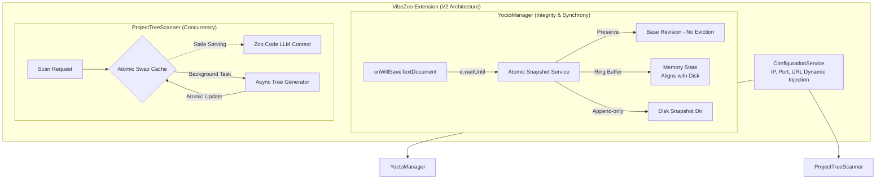

# VibeZoo Architecture Master Plan V2: Enhanced Design for Concurrency Control and Integrity Guarantee

> [!NOTE]
> This document is an **upgraded Master Plan V2** written by the senior architect to fully implement the macro philosophy of the VibeZoo system. It focuses on fundamentally resolving 4 critical architectural defects discovered through the debugger agent's in-depth code review (synchronous backup failure, memory-disk inconsistency and initial original loss, race conditions, IP hardcoding). Beyond simple refactoring, it presents a structural blueprint for achieving **'Data Integrity'** and **'Perfect Concurrency Control'**.

---

## 1. Architecture Philosophy and Justification for V2 Improvements (Philosophy & Alignment)

VibeZoo is an intelligent companion that provides 34 powerful MCP tools and 'Crow Memory (Synaptic Memory)' in conjunction with Zoo Code. Given the nature of an extension that handles file systems and code, perfect snapshot integrity and seamless context provision are essential. However, the first implementation revealed the following limitations.

1. **Lack of File Lock and Synchronous Guarantee**: The timing of the editor saving a file and the extension creating a backup were separated (Race Condition), causing backups to be made with corrupted originals.
2. **Collapse of Dual State Management**: The storage structure between disk (timestamp split) and memory (cumulative method) was inconsistent, making it impossible to find restore points, and the Ring Buffer size limitation caused the most important 'initial original' to be lost.
3. **Cache Invalidation Strategy Harming Availability**: The context cache was nullified during background scanning, causing a race condition where the AI reads an empty file tree for a brief moment and hallucinates.
4. **Residual Hardcoding**: Although ports were made dynamic, core network settings like IP addresses ('127.0.0.1') remained in the source code, undermining the non-intrusiveness principle.

Accordingly, a transition to a V2 architecture that strengthens the foundation of the system is necessary.

---

## 2. To-Be Architecture Vision

Control system data flow transactionally and introduce an SWR (Stale-while-revalidate) based caching strategy.

---

## 3. Core Architecture Enhancement Strategies (Core Strategies V2)

### Pillar 1: Perfect Synchronization and Data Integrity of YoctoManager
> **Problem to Solve:** Asynchronous backup failure of `onWillSaveTextDocument`, memory-disk structure inconsistency, prevention of 'initial original' loss

- **Synchronous Authentic Backup via `e.waitUntil`**:
  - Must use `e.waitUntil(Promise)` within the `onWillSaveTextDocument` event listener. Block VSCode's save operation until the backup is completely written to disk and the memory index is updated, fundamentally eliminating race conditions between file changes and backups.
- **Memory-Disk 1:1 Synchronization (Snapshot Alignment)**:
  - If the disk stores files split by timestamp each time, the memory state should also be loaded/managed in Snapshot ID units. Ensure memory and disk have the same reference key to resolve load inconsistency.
- **Permanent Preservation of Initial Original (Base Revision Protection)**:
  - Designate the snapshot taken when a file is first tracked by YoctoManager as the **Base Revision (Initial Original)**. This original is completely excluded from Ring Buffer (Eviction) targets (e.g., 500 items), permanently preserved, guaranteeing rollback to the initial state at any time.

### Pillar 2: Complete Resolution of ProjectTreeScanner Race Conditions
> **Problem to Solve:** Returning empty strings to LLM due to existing cache (`null`) invalidation during background scanning

- **Stale-while-revalidate (SWR) Based Atomic Cache Swap**:
  - Never nullify the existing cache (`string | null`) when a scan task begins.
  - Maintain previous scan results (Stale Cache) for immediate return on request, and atomically swap the reference only when the background scan is completely finished and the full tree string is built.
  - This ensures a valid context is always provided to the LLM, even during scanning.

### Pillar 3: Eradication of Residual Hardcoding in ConfigService
> **Problem to Solve:** Remaining hardcoded values like '127.0.0.1', endpoint URLs besides ports

- **Complete Network Layer Abstraction**:
  - Migrate all network-related magic strings such as localhost IP ('127.0.0.1'), bridge server endpoint paths, etc., into `ConfigService`.
  - Configure them to be injected through the user's VSCode `settings.json` settings (`workspace.getConfiguration`) or environment variables, allowing unrestricted operation in remote server environments or container (DevContainer) environments.

---

## 4. Execution Roadmap

`Coder` agent, immediately perform refactoring of the following 3 core areas according to this V2 architecture plan.

* **Phase 1 (YoctoManager Integrity)**:
  * Refactor `onWillSaveTextDocument` handler: Apply `e.waitUntil` promise chain.
  * Introduce `Base Revision` concept and modify Ring Buffer Eviction logic.
  * Align memory map and disk directory structure based on snapshot ID.
* **Phase 2 (ProjectTreeScanner Concurrency)**:
  * Remove cache initialization logic (`this.cache = null`) inside scan functions.
  * Implement Atomic Swap pattern that assigns local variable to `this.cache` only after background operation completes.
* **Phase 3 (ConfigService Finalization)**:
  * Search codebase globally to eradicate all network hardcoding remnants like '127.0.0.1', 'localhost'.
  * Add Getter properties in `ConfigService` to centrally manage these.

> [!WARNING]
> **To Coder Agent**: The core of this V2 update is 'Concurrency' and 'Integrity'. Thoroughly verify that async (`async/await`) flows operate thread-safe (from Node.js event loop perspective), and that Promises are not left dangling or resolved at incorrect timings while writing code.
