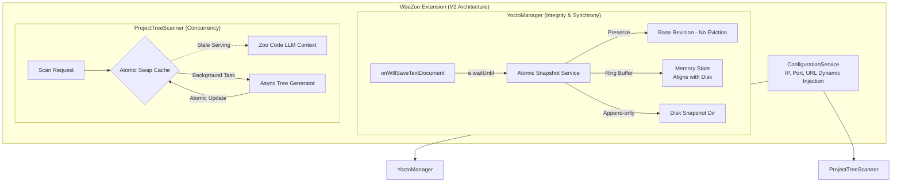

# VibeZoo 아키텍처 마스터 플랜 V2: 동시성 제어 및 무결성 보장을 위한 심화 설계

> [!NOTE]
> 본 문서는 VibeZoo 시스템의 거시적 철학을 완벽하게 구현하기 위해 수석 아키텍트가 작성한 **업그레이드된 마스터 플랜 V2**입니다. 디버거 요원의 심층 코드 리뷰를 통해 발견된 4가지 치명적 아키텍처 결함(동기식 백업 실패, 메모리-디스크 불일치 및 최초 원본 유실, 레이스 컨디션, IP 하드코딩)을 근본적으로 해결하는 데 초점을 맞추었습니다. 단순한 리팩터링을 넘어, **'데이터 무결성(Data Integrity)'**과 **'완벽한 동시성 제어(Concurrency Control)'**를 달성하는 구조적 청사진을 제시합니다.

---

## 1. 아키텍처 철학과 V2 개선의 당위성 (Philosophy & Alignment)

VibeZoo는 Zoo Code와 연동하여 34개의 강력한 MCP 도구와 'Crow Memory(시냅틱 메모리)'를 제공하는 지능형 동반자입니다. 파일 시스템과 코드를 다루는 확장 프로그램의 특성상, 완벽한 스냅샷 무결성과 끊김없는 컨텍스트 제공이 필수적입니다. 하지만 1차 구현체에서는 다음과 같은 한계가 노출되었습니다.

1. **파일 락(File Lock)과 동기적 보장 부재**: 에디터가 파일을 저장(Save)하는 시점과 확장 프로그램이 백업을 남기는 시점이 분리되어(Race Condition), 진본이 훼손된 채 백업되는 현상이 발생했습니다.
2. **이원화된 상태 관리의 붕괴**: 디스크(타임스탬프 분할)와 메모리(누적 방식) 간의 저장 구조가 불일치하여 복원 지점을 찾지 못하고, Ring Buffer 크기 제한으로 인해 가장 중요한 '최초 원본'이 유실되었습니다.
3. **가용성을 해치는 캐시 무효화 전략**: 백그라운드 스캔이 진행되는 동안 컨텍스트 캐시를 비워버려(Nullify), AI가 찰나의 순간에 빈 파일 트리를 읽고 환각을 일으키는 레이스 컨디션이 발생했습니다.
4. **잔존하는 하드코딩**: 포트는 동적화되었으나, IP 주소('127.0.0.1')와 같은 핵심 네트워크 설정이 여전히 소스 코드에 잔존하여 비침투성 원칙을 훼손했습니다.

이에 따라 시스템의 근간을 단단하게 하는 V2 아키텍처로의 전환이 필요합니다.

---

## 2. To-Be 아키텍처 비전 (Architecture Vision)

시스템의 데이터 흐름을 트랜잭셔널하게 제어하고, Stale-while-revalidate(SWR) 기반의 캐싱 전략을 도입합니다.

---

## 3. 핵심 아키텍처 심화 전략 (Core Strategies V2)

### Pillar 1: YoctoManager의 완벽한 동기화와 데이터 무결성
> **해결 과제:** `onWillSaveTextDocument`의 비동기 백업 실패, 메모리-디스크 구조 불일치, '최초 원본' 유실 방지

- **동기식 진본 백업 (Synchronous Snapshot via `e.waitUntil`)**: 
  - `onWillSaveTextDocument` 이벤트 리스너 내에서 `e.waitUntil(Promise)`를 반드시 사용합니다. 백업이 디스크에 완전히 기록되고 메모리 인덱스가 업데이트될 때까지 VSCode의 저장 동작을 지연(Block)시켜, 파일 변경과 백업 간의 레이스 컨디션을 원천 차단합니다.
- **메모리-디스크 1:1 동기화 (Snapshot Alignment)**: 
  - 디스크에 매번 타임스탬프별로 분할 저장하는 구조라면, 메모리 상태 역시 Snapshot ID 단위로 로드/관리되어야 합니다. 메모리와 디스크가 동일한 참조 키를 가지도록 설계하여 로드 불일치를 해결합니다.
- **최초 원본 영구 보존 (Base Revision Protection)**: 
  - 파일이 처음 YoctoManager에 의해 추적(Track)될 때의 스냅샷을 **최초 원본(Base Revision)**으로 지정합니다. 이 원본은 500개 등의 Ring Buffer(Eviction) 대상에서 완전히 제외되어 영구 보존되며, 언제든 최초 상태로의 롤백(Rollback)을 보장합니다.

### Pillar 2: ProjectTreeScanner의 레이스 컨디션 완전 해소
> **해결 과제:** 백그라운드 스캔 시 기존 캐시(`null`) 무효화로 인해 LLM에게 빈 문자열 반환

- **Stale-while-revalidate (SWR) 기반 원자적 스왑 (Atomic Cache Swap)**: 
  - 스캔 작업이 시작될 때 절대로 기존 캐시(`string | null`)를 null로 비우지 않습니다. 
  - 이전 스캔 결과(Stale Cache)를 유지하여 요청 시 즉각 반환하고, 백그라운드 스캔이 완벽히 종료되어 전체 트리 문자열이 완성된 시점에만 원자적으로(Atomically) 레퍼런스를 교체(Swap)합니다.
  - 이로써 스캔 도중에도 언제나 유효한 컨텍스트가 LLM에게 제공됩니다.

### Pillar 3: ConfigService의 잔재 하드코딩 소탕
> **해결 과제:** 포트 외에 남아있는 '127.0.0.1', 엔드포인트 URL 등의 하드코딩

- **네트워크 레이어 완전 추상화**: 
  - 로컬호스트 IP('127.0.0.1'), 브릿지 서버 엔드포인트 경로 등 네트워크 관련 모든 매직 스트링(Magic String)을 `ConfigService` 내부로 이관합니다.
  - 사용자의 VSCode `settings.json` 설정(`workspace.getConfiguration`)이나 환경 변수를 통해 주입받도록 구성하여, 원격 서버 환경이나 컨테이너(DevContainer) 환경에서도 제약 없이 동작하게 합니다.

---

## 4. 실행 로드맵 (Execution Roadmap for Coder)

`Coder` 에이전트는 본 V2 아키텍처 플랜에 따라 즉시 다음 3가지 핵심 영역의 리팩터링을 수행하십시오.

* **Phase 1 (YoctoManager Integrity)**: 
  * `onWillSaveTextDocument` 핸들러 리팩터링: `e.waitUntil` 프로미스 체인 적용.
  * `Base Revision` 개념 도입 및 Ring Buffer Eviction 로직 수정.
  * 스냅샷 ID를 기준으로 메모리 맵과 디스크 디렉토리 구조 일치화.
* **Phase 2 (ProjectTreeScanner Concurrency)**: 
  * 스캔 함수 내부의 캐시 초기화(`this.cache = null`) 로직 제거.
  * 백그라운드 연산 완료 후 지역 변수를 `this.cache`로 할당하는 Atomic Swap 패턴 구현.
* **Phase 3 (ConfigService Finalization)**: 
  * 코드 베이스 전역을 검색하여 '127.0.0.1', 'localhost' 등 네트워크 하드코딩 잔재 발본색원.
  * `ConfigService`에서 이를 통합 관리하도록 Getter 속성 추가.

> [!WARNING]
> **To Coder Agent**: 이번 V2 업데이트의 핵심은 '동시성(Concurrency)'과 '무결성(Integrity)'입니다. 비동기(`async/await`) 흐름이 스레드-세이프(Thread-safe, Node.js의 이벤트 루프 관점)하게 동작하는지, Promise가 중간에 버려지거나(Dangling) 잘못된 시점에 해소되지 않는지 철저히 검증하며 코드를 작성하십시오.
