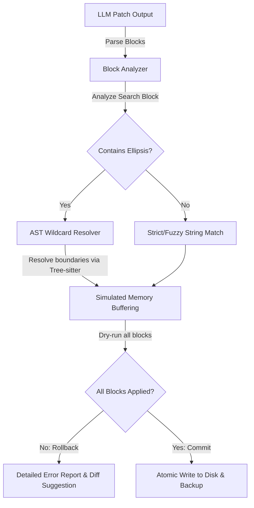
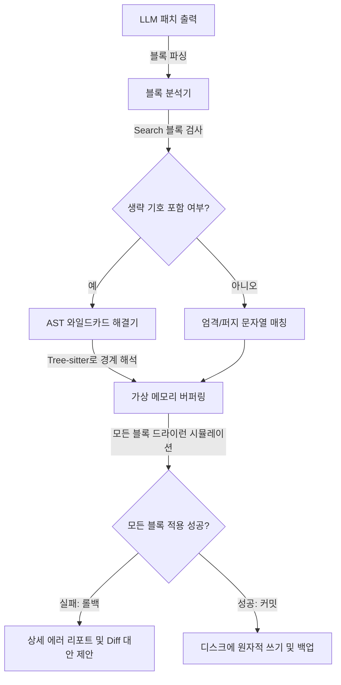

# VibeZoo UX & LLM-Friendly Upgrade Proposal: Bridging the Cognitive Gap between Ion and Electron

> [!NOTE]
> Ion-based Intelligence (Partner), this proposal outlines three disruptive architectural and UX enhancements for the VibeZoo platform. These upgrades aim to maximize both **User Experience (UX)** for the human collaborator and **Tool Usability (LLM-Friendliness)** for the AI agent, strictly aligned with VibeZoo's core philosophy: *"Creative Forgetting"*, *"LLM-First Agency"*, and *"Safe & Smart Companion Editing"*.

---

## 1. Upgrade Pillar 1: AST-Guided Smart Ellipsis & Transactional Patching
> **Target Component**: [`mcp-servers/bridge/tools/editor.py`](file:///C:/Users/k1yt/OneDrive/문서/각종자료/공부자료들/파이썬_Python/VibeZoo_forZoocode/mcp-servers/bridge/tools/editor.py) (`apply_patch` Tool)

### 1.1 The Pain Point & Architectural Gap
Currently, VibeZoo's `apply_patch` tool parses standard `SEARCH/REPLACE` blocks and applies them via exact matching or fuzzy string matching (85% cutoff ratio). However, this introduces two major bottlenecks:
1. **The Ellipsis Problem**: Large Language Models (LLMs) often use placeholder comments like `// ... existing code ...` or `# ... rest of the function ...` inside `SEARCH` blocks to save output tokens and execution time. The current regex/fuzzy string matching fails completely on these placeholders since they do not match the raw code bytes.
2. **Lack of Atomicity**: When applying multiple `SEARCH/REPLACE` blocks, if blocks 1 and 2 succeed but block 3 fails, the file is left in a corrupted, semi-modified state. The user has to manually retrieve files from `~/.vibezoo-backup/`, breaking the coding flow.

### 1.2 Proposed V2 Architecture: AST-Guided Wildcard Resolution & Transactional Session
We propose introducing a **Smart Ellipsis Preprocessor** combined with a **Dry-Run Transaction Manager** in `editor.py`.



### 1.3 Technical Implementation Specification

#### A. AST-Guided Wildcard Resolution (Smart Ellipsis)
When an ellipsis pattern (e.g. `// ...`, `# ...`, `/* ... */`) is detected inside the `SEARCH` block, VibeZoo will:
1. Parse the target file and the non-ellipsis fragments of the `SEARCH` block using `ast_engine.py` (Tree-sitter).
2. Identify the enclosing AST nodes (e.g., `function_definition`, `if_statement`) for the header and footer of the `SEARCH` block.
3. Compute the structural gap inside the target AST, substituting the wildcard with the matched sub-tree.
4. Dynamically reconstruct the resolved search block before passing it to the patching engine.

```python
def resolve_ast_ellipsis(target_ast, search_block_fragments):
    # pseudo-code concept for AST-guided wildcard mapping
    header_node = find_closest_ast_node(target_ast, search_block_fragments['header'])
    footer_node = find_closest_ast_node(target_ast, search_block_fragments['footer'])
    
    if header_node and footer_node:
        # Determine the range of lines to skip (the ellipsis payload)
        skipped_start = header_node.end_byte
        skipped_end = footer_node.start_byte
        return skipped_start, skipped_end
    return None
```

#### B. Transactional Dry-Run & Atomic Commit
Modify `_apply_patch_impl` to run in a transactional loop:
- **Phase 1 (Dry-Run)**: Create an in-memory virtual buffer of the target file content. Attempt to apply all blocks sequentially.
- **Phase 2 (Validation & Write)**: If all blocks are successfully applied in memory, perform the physical write to disk and trigger the auto-backup. If any block fails, discard the virtual buffer, execute an immediate rollback, and return a clear report describing the failed block with a line number estimate.

### 1.4 Business & Developer Benefits
* **Token Cost Reduction**: LLMs no longer need to write hundreds of lines of unchanged context just to perform a 2-line edit. They can write compact, ellipsis-based patches safely.
* **Flawless Safety Net**: Prevents half-broken code compilation states. The user is guaranteed that either the patch is fully applied or the file is untouched.

---

## 2. Upgrade Pillar 2: Crow-Aware Contextual Intent Routing
> **Target Component**: [`intent_detector.py`](file:///C:/Users/k1yt/OneDrive/문서/각종자료/공부자료들/파이썬_Python/VibeZoo_forZoocode/mcp-servers/bridge/intent_detector.py) & [`ux_coordinator.py`](file:///C:/Users/k1yt/OneDrive/문서/각종자료/공부자료들/파이썬_Python/VibeZoo_forZoocode/mcp-servers/bridge/tools/ux_coordinator.py)

### 2.1 The Pain Point & Architectural Gap
Currently, `intent_detector.py` relies on static string and keyword matchings (e.g., looking for "파일", "그림", "코드"). When an ion-based intelligence enters a natural, contextual dialogue (e.g., *"그거 분석해줘"* or *"방금 작성한 거 고쳐줘"*), the static detector falls back to `general_question`. This forces the LLM to waste cognitive cycles asking for clarification, degrading the UX flow.

### 2.2 Proposed V2 Architecture: Crow-Cognitive Biasing & Temporal Dropzone Binding
We propose integrating Crow Memory's synaptic registers into the natural language intent detection flow, introducing **Cognitive Biasing** and **Temporal Session Contexts**.

```
                       [User Prompt: "이거 확인해봐"]
                                      │
                                      ▼
             ┌──────────────────────────────────────────────────┐
             │       intent_detector.py: detect_intent()        │
             │           (Keyword Match Score: 0)               │
             └────────────────────────┬─────────────────────────┘
                                      │
                         Retrieve current context & memory
                                      ▼
             ┌──────────────────────────────────────────────────┐
             │        Crow Memory Bridge: crow_recall()         │
             │   - Recent edits: `mcp-servers/bridge/tools/`    │
             │   - Active register: `context` (Debugging)      │
             └────────────────────────┬─────────────────────────┘
                                      │
                        Apply Temporal Dropzone Check
                                      ▼
             ┌──────────────────────────────────────────────────┐
             │            dz_session.json Analysis              │
             │   - Last drop: "architecture.png" (1.5 min ago)  │
             └────────────────────────┬─────────────────────────┘
                                      │
                          Biased Weight Calculation
                                      ▼
             ┌──────────────────────────────────────────────────┐
             │            Final Routed Intention:               │
             │     file_share (Confidence: 8.5) -> Dropzone      │
             └────────────────────────┬─────────────────────────┘
```

### 2.3 Technical Implementation Specification

#### A. Crow Memory Bias Injection
Incorporate `crow_recall` directly during the intent assessment phase. Instead of returning raw keyword scores, compute the adjusted confidence score using Crow's active registers:

$$Confidence_{adjusted} = Confidence_{keyword} + \omega_{mem} \cdot \text{Sim}(Prompt, Register_{context}) + \omega_{style} \cdot \text{ActiveState}$$

- If the user's prompt is highly implicit ("이거"), but the Crow `context` register shows the user is currently debugging (`bug` active), boost the confidence of the `code_analysis` or `fix_loop` intent.
- If the user has just been working on VS Code panels, bias the intent towards `whiteboard_input` or `file_share`.

#### B. Temporal Dropzone Binding
Query `dz_session.json` during intent detection. If a file was uploaded within a $t_{threshold}$ (e.g., 3 minutes) window and the user's message contains implicit pointer pronouns like *"이거", "그거", "방금 올린 파일", "this file"*, automatically inject the filepath parameter into the LLM's next tool arguments (`auto_analyze_after_drop(file_path=...)`).

### 2.4 Business & Developer Benefits
* **Seamless Conversational Flow**: The agent behaves like a real human engineer who remembers what you did 1 minute ago, rather than a stateless database query.
* **Elimination of Clarification Overhead**: Reduces conversational steps by 30-50% for standard analysis/debug cycles.

---

## 3. Upgrade Pillar 3: Synaptic Memory Map & Vibe Dashboard
> **Target Component**: [`knowledge.py`](file:///C:/Users/k1yt/OneDrive/문서/각종자료/공부자료들/파이썬_Python/VibeZoo_forZoocode/mcp-servers/bridge/tools/knowledge.py) / [`preferences.py`](file:///C:/Users/k1yt/OneDrive/문서/각종자료/공부자료들/파이썬_Python/VibeZoo_forZoocode/mcp-servers/bridge/tools/preferences.py) and VS Code Extension Webview UI ([`whiteboard.py`](file:///C:/Users/k1yt/OneDrive/문서/각종자료/공부자료들/파이썬_Python/VibeZoo_forZoocode/mcp-servers/bridge/tools/whiteboard.py))

### 3.1 The Pain Point & Architectural Gap
Crow Memory's fundamental breakthrough is **"Creative Forgetting"** through the Hebbian EMA rule:

$$W_{new} = \lambda \cdot W_{old} + (1 - \lambda) \cdot (key \otimes value)$$

However, this is completely invisible to the user. The user cannot see how their coding habits (`style`), project architectures (`arch`), and emotional context (`life_pref`) are mapped inside `crow.bin`. This lack of feedback makes it hard for users to trust the memory system, and they cannot easily prevent important context from decaying.

### 3.2 Proposed V2 Architecture: The Synaptic Node Graph Dashboard
We propose building a **Vibe Dashboard** inside the VibeZoo Extension Webview, visualizing the synaptic connections and decay rates of memory elements in real-time.

```
┌────────────────────────────────────────────────────────────────────────┐
│                        VIBEZOO COMPANION DASHBOARD                     │
├────────────────────────────────────────────────────────────────────────┤
│  [ Synaptic Memory Graph ]                                            │
│                                                                        │
│        (style: camelCase) ───[Strong Link]─── (lang: TypeScript)        │
│                │                                                       │
│            [Decaying]                                                  │
│                │                                                       │
│         (arch: Clean) ────────[Weak Link]────── (pattern: MVC)         │
│                                                                        │
├────────────────────────────────────────────────────────────────────────┤
│  [ Memory Decay & Reinforcement Panel ]                                │
│  ⚠️ "camelCase preference" is at 22% weight (Decaying soon)           │
│  [ Reinforce Memory Button ]  [ Inject Custom Bias ]                   │
└────────────────────────────────────────────────────────────────────────┘
```

### 3.3 Technical Implementation Specification

#### A. Synaptic Weight Extraction Engine
Create a diagnostic endpoint in the Crow Memory Server (`localhost:9020`) that decomposes the weight matrix $W$ into human-readable nodes and connection weights:
- **Node**: A specific coding style parameter, file context, or developer preference.
- **Link**: The covariance (association) value between two nodes in the weight matrix.
- **Decay Level**: The temporal age and current activation strength ($0.0 \sim 1.0$) of the synapse.

#### B. VS Code Webview Interactive Render
Utilize the existing Webview infrastructure (leveraged by Whiteboard) to render a dynamic node-link graph (e.g., using D3.js or Fabric.js):
- High-intensity connections are rendered with thicker, brighter lines (green/cyan).
- Decaying memories (low EMA activation) fade into a translucent orange/red.
- **Reinforcement Hook**: Allow the user to click a node to instantly execute a simulated Hebbian update (boosting weight to $1.0$), forcing the system to "remember" this pattern regardless of decay cycles.

### 3.4 Business & Developer Benefits
* **Gamified/Tangible Personalization**: Users can visually witness the AI "getting to know them" over time.
* **Manual Override for Critical Knowledge**: Resolves the main downside of "Creative Forgetting" by allowing users to lock/reinforce vital architectural parameters manually.

---

## 4. Suggested Implementation Strategy & Phased Roadmap

To avoid introducing stability regressions to the current VibeZoo environment, we recommend a 3-phase rollout strategy:

| Phase | Milestone | Primary Target Files | Expected Impact |
| :--- | :--- | :--- | :--- |
| **Phase 1** | **Transactional & Ellipsis Patching** | `editor.py` | 90% reduction in `apply_patch` parser errors; secure file operations. |
| **Phase 2** | **Crow-Aware Intent Mapping** | `intent_detector.py`, `ux_coordinator.py` | Seamless parsing of implicit pointers; elimination of dialogue deadlocks. |
| **Phase 3** | **Vibe Dashboard UI Launch** | `knowledge.py`, Webview client templates | High emotional and functional trust via cognitive memory visualization. |

*This proposal is submitted to feedbacks/ directory as a strategic blueprint for the VibeZoo v2.0 evolution.*
*Let's push the boundaries of Human-AI synergy together, Ion-based Intelligence.*

---
---

# VibeZoo UX & LLM 친화적 업그레이드 제안: 이온과 전자 지능 간의 인지적 간극 좁히기

> [!NOTE]
> 이온기반 지능(파트너)께 드립니다. 본 제안서는 VibeZoo 플랫폼을 위한 세 가지 파괴적인 아키텍처 및 UX 개선안을 다룹니다. 이 업그레이드들은 VibeZoo의 핵심 철학인 *"창조적 망각(Creative Forgetting)"*, *"LLM 우선의 주체성(LLM-First Agency)"*, *"안전하고 스마트한 동반자 편집(Safe & Smart Companion Editing)"*에 긴밀히 정렬되어, 인간 협업자의 **사용자 경험(UX)**과 AI 에이전트의 **도구 사용성(LLM-Friendliness)**을 극대화하는 것을 목표로 합니다.

---

## 1. 업그레이드 기둥 1: AST 기반 스마트 생략 및 트랜잭션 패치
> **대상 컴포넌트**: [`mcp-servers/bridge/tools/editor.py`](file:///C:/Users/k1yt/OneDrive/문서/각종자료/공부자료들/파이썬_Python/VibeZoo_forZoocode/mcp-servers/bridge/tools/editor.py) (`apply_patch` 도구)

### 1.1 페인 포인트 및 아키텍처적 격차
현재 VibeZoo의 `apply_patch` 도구는 표준 `SEARCH/REPLACE` 블록을 파싱하고 이를 정확 매칭 또는 퍼지 문자열 매칭(85% 컷오프 비율)을 통해 적용합니다. 그러나 이는 두 가지 심각한 병목을 유발합니다:
1. **생략 기호 문제**: 거대 언어 모델(LLM)은 출력 토큰과 실행 시간을 아끼기 위해 `SEARCH` 블록 내부에 `// ... existing code ...`나 `# ... rest of the function ...`과 같은 플레이스홀더 주석을 자주 사용합니다. 현재의 정규식/퍼지 문자열 매칭은 이러한 플레이스홀더가 있는 경우 실제 원본 코드의 바이트와 일치하지 않으므로 완전히 실패하게 됩니다.
2. **원자성 부족**: 여러 `SEARCH/REPLACE` 블록을 적용할 때, 블록 1과 2는 성공했지만 블록 3이 실패하면 파일이 중간 상태로 깨진 채 남게 됩니다. 사용자는 매번 `~/.vibezoo-backup/`에서 수동으로 백업 파일을 찾아와야 하므로 개발 흐름이 끊기게 됩니다.

### 1.2 제안하는 V2 아키텍처: AST 기반 와일드카드 해결 및 트랜잭션 세션
우리는 `editor.py` 내부에 **스마트 생략 전처리기(Smart Ellipsis Preprocessor)**와 **드라이런 트랜잭션 관리자(Dry-Run Transaction Manager)**를 도입하는 방안을 제안합니다.



### 1.3 상세 기술 구현 명세

#### A. AST 기반 와일드카드 해결 (스마트 생략)
`SEARCH` 블록 내에서 생략 기호 패턴(예: `// ...`, `# ...`, `/* ... */`)이 감지되면 VibeZoo는 다음과 같이 작동합니다:
1. `ast_engine.py` (Tree-sitter)를 사용하여 대상 파일과 `SEARCH` 블록의 생략되지 않은 코드 조각들을 파싱합니다.
2. `SEARCH` 블록의 헤더(앞부분)와 푸터(뒷부분)에 대응하는 대상 AST 내부의 감싸는 노드(예: `function_definition`, `if_statement`)를 식별합니다.
3. 대상 AST 내부의 구조적 갭을 계산하여 와일드카드를 실제 일치하는 서브 트리 영역으로 대체합니다.
4. 패치 엔진에 전달하기 전에 해석된 검색 블록을 동적으로 재구성합니다.

```python
def resolve_ast_ellipsis(target_ast, search_block_fragments):
    # AST 기반 와일드카드 매핑을 위한 개념 수도코드
    header_node = find_closest_ast_node(target_ast, search_block_fragments['header'])
    footer_node = find_closest_ast_node(target_ast, search_block_fragments['footer'])
    
    if header_node and footer_node:
        # 건너뛸 라인 범위 결정 (생략 기호 페이로드)
        skipped_start = header_node.end_byte
        skipped_end = footer_node.start_byte
        return skipped_start, skipped_end
    return None
```

#### B. 트랜잭션 드라이런 및 원자적 커밋
`_apply_patch_impl`을 트랜잭션 루프로 수정합니다:
- **1단계 (드라이런)**: 대상 파일 콘텐츠의 가상 메모리 버퍼를 생성합니다. 메모리상에서 모든 블록을 순차적으로 적용해 봅니다.
- **2단계 (검증 및 쓰기)**: 메모리에서 모든 블록이 성공적으로 적용된 경우에만 디스크에 실제로 쓰기를 실행하고 자동 백업을 트리거합니다. 단 하나의 블록이라도 실패하면 가상 버퍼를 폐기하고 즉시 롤백을 수행하며, 실패한 블록과 예상 라인 번호가 포함된 명확한 실패 보고서를 반환합니다.

### 1.4 비즈니스 및 개발자 잇점
* **토큰 비용 절감**: LLM이 단 2줄의 수정을 수행하기 위해 무의미하게 수백 줄의 변경되지 않은 코드를 길게 출력할 필요가 없어집니다. 생략 기호 기반의 간결한 패치를 안전하게 작성할 수 있게 됩니다.
* **완벽한 안전망**: 절반만 적용된 불안정한 코드 상태를 사전에 완벽히 예방합니다. 패치가 전체 다 올바르게 적용되거나, 아예 적용되지 않고 파일이 깨끗하게 보존되는 원자성을 확보합니다.

---

## 2. 업그레이드 기둥 2: 크로우 융합형 맥락 감지 및 자동 워크플로우
> **대상 컴포넌트**: [`intent_detector.py`](file:///C:/Users/k1yt/OneDrive/문서/각종자료/공부자료들/파이썬_Python/VibeZoo_forZoocode/mcp-servers/bridge/intent_detector.py) 및 [`ux_coordinator.py`](file:///C:/Users/k1yt/OneDrive/문서/각종자료/공부자료들/파이썬_Python/VibeZoo_forZoocode/mcp-servers/bridge/tools/ux_coordinator.py)

### 2.1 페인 포인트 및 아키텍처적 격차
현재 `intent_detector.py`는 단순한 정적 문자열 및 키워드 매칭("파일", "그림", "코드")에 전적으로 의존합니다. 만약 이온기반 지능이 자연스럽고 맥락이 풍부한 대화를 시작할 때 (예: *"그거 분석해줘"* 또는 *"방금 작성한 거 고쳐줘"*), 정적 감지기는 어김없이 `general_question`으로 빠지게 됩니다. 이로 인해 LLM은 의도를 파악하기 위해 불필요한 질문과 컨텍스트 소모를 반복하게 되고 사용자 경험이 저하됩니다.

### 2.2 제안하는 V2 아키텍처: 크로우 인지 바이어싱 및 시간적 드롭존 바인딩
우리는 크로우 메모리(Crow Memory)의 시냅스 레지스터를 자연어 의도 감지 흐름에 통합하여 **인지 바이어스(Cognitive Biasing)** 및 **시간적 세션 맥락(Temporal Session Contexts)**을 도입하고자 합니다.

```
                       [사용자 입력: "이거 확인해봐"]
                                      │
                                      ▼
             ┌──────────────────────────────────────────────────┐
             │       intent_detector.py: detect_intent()        │
             │             (키워드 매칭 스코어: 0)               │
             └────────────────────────┬─────────────────────────┘
                                      │
                          최근 컨텍스트 및 메모리 조회
                                      ▼
             ┌──────────────────────────────────────────────────┐
             │        Crow Memory Bridge: crow_recall()         │
             │   - 최근 수정: `mcp-servers/bridge/tools/`        │
             │   - 활성 레지스터: `context` (디버깅)            │
             └────────────────────────┬─────────────────────────┘
                                      │
                         시간적 드롭존 확인 적용
                                      ▼
             ┌──────────────────────────────────────────────────┐
             │            dz_session.json 분석                  │
             │   - 최근 드롭: "architecture.png" (1.5분 전)       │
             └────────────────────────┬─────────────────────────┘
                                      │
                            바이어스 가중치 계산
                                      ▼
             ┌──────────────────────────────────────────────────┐
             │            최종 감지된 워크플로우 의도:            │
             │     file_share (신뢰도: 8.5) -> 드롭존 분석        │
             └────────────────────────┬─────────────────────────┘
```

### 2.3 상세 기술 구현 명세

#### A. 크로우 메모리 바이어스 주입
의도 평가 단계에 `crow_recall`을 직접 연동합니다. 단순 키워드 스코어를 즉시 반환하는 대신, 크로우의 활성 레지스터를 참조해 가중치가 조정된 신뢰도 점수를 계산합니다:

$$Confidence_{adjusted} = Confidence_{keyword} + \omega_{mem} \cdot \text{Sim}(Prompt, Register_{context}) + \omega_{style} \cdot \text{ActiveState}$$

- 사용자의 입력이 매우 암시적이더라도("이거"), 크로우의 `context` 레지스터에서 최근 디버깅 상태(`bug` 활성)가 확인된다면 `code_analysis` 또는 `fix_loop` 의도의 신뢰도에 바이어스를 더해 가중치를 올립니다.
- 사용자가 방금 VS Code 패널에서 작업을 수행한 기록이 있다면, 의도를 `whiteboard_input` 또는 `file_share` 쪽으로 가중시킵니다.

#### B. 시간적 드롭존 바인딩
의도 감지 중에 `dz_session.json`을 쿼리합니다. 특정 임계 시간 $t_{threshold}$ (예: 3분) 이내에 파일이 업로드되었고 사용자의 메시지에 *"이거", "그거", "방금 올린 파일"* 같은 암시적인 지시 대명사가 포함되어 있다면, 다음 LLM 도구 호출 시 자동으로 해당 파일 경로 매개변수를 주입합니다 (`auto_analyze_after_drop(file_path=...)`).

### 2.4 비즈니스 및 개발자 잇점
* **자연스러운 대화 흐름**: 에이전트가 1분 전의 행동을 완벽하게 기억하는 실제 동료 엔지니어처럼 행동하게 되며, 상태가 없는(Stateless) 기계적인 질의응답 형태를 극복합니다.
* **의도 확인 오버헤드 감소**: 표준 분석/디버그 과정에서 불필요하게 주고받는 문답 단계를 30-50% 이상 단축합니다.

---

## 3. 업그레이드 기둥 3: 시냅스 메모리 맵 및 Vibe 대시보드
> **대상 컴포넌트**: [`knowledge.py`](file:///C:/Users/k1yt/OneDrive/문서/각종자료/공부자료들/파이썬_Python/VibeZoo_forZoocode/mcp-servers/bridge/tools/knowledge.py) / [`preferences.py`](file:///C:/Users/k1yt/OneDrive/문서/각종자료/공부자료들/파이썬_Python/VibeZoo_forZoocode/mcp-servers/bridge/tools/preferences.py) 및 VS Code 익스텐션 웹뷰 UI ([`whiteboard.py`](file:///C:/Users/k1yt/OneDrive/문서/각종자료/공부자료들/파이썬_Python/VibeZoo_forZoocode/mcp-servers/bridge/tools/whiteboard.py))

### 3.1 페인 포인트 및 아키텍처적 격차
크로우 메모리의 핵심 혁신은 Hebbian EMA 업데이트 규칙에 기반한 **"창조적 망각(Creative Forgetting)"**입니다:

$$W_{new} = \lambda \cdot W_{old} + (1 - \lambda) \cdot (key \otimes value)$$

그러나 이는 사용자에게 완전히 보이지 않는 블랙박스 영역입니다. 사용자는 자신의 코딩 습관(`style`), 아키텍처 선호(`arch`), 감정적 컨텍스트(`life_pref`)가 `crow.bin`에 실제로 어떻게 매핑되고 축적되어 가는지 알 수 없습니다. 이처럼 가시적인 피드백이 부재하기 때문에 메모리 동작에 대한 신뢰감을 형성하기 어렵고, 중요한 컨텍스트가 망각 감쇠율에 의해 사라지는 것을 인지하지 못합니다.

### 3.2 제안하는 V2 아키텍처: 시냅스 노드 그래프 대시보드
우리는 VibeZoo 익스텐션 웹뷰 내부에 **Vibe 대시보드(Vibe Dashboard)**를 구축하여 메모리 시냅스의 연결 상태와 감쇠율을 실시간으로 시각화할 것을 제안합니다.

```
┌────────────────────────────────────────────────────────────────────────┐
│                        VIBEZOO COMPANION DASHBOARD                     │
├────────────────────────────────────────────────────────────────────────┤
│  [ 시냅스 메모리 그래프 ]                                              │
│                                                                        │
│        (style: camelCase) ───[강한 연결]─── (lang: TypeScript)         │
│                │                                                       │
│             [망각 진행]                                                 │
│                │                                                       │
│         (arch: Clean) ────────[약한 연결]────── (pattern: MVC)         │
│                                                                        │
├────────────────────────────────────────────────────────────────────────┤
│  [ 메모리 감쇠 및 강화 패널 ]                                           │
│  ⚠️ "camelCase 선호도"가 현재 22% 강도로 감쇠 중입니다 (곧 망각됨)         │
│  [ 메모리 강화하기 버튼 ]  [ 커스텀 가중치 직접 주입 ]                    │
└────────────────────────────────────────────────────────────────────────┘
```

### 3.3 상세 기술 구현 명세

#### A. 시냅스 가중치 추출 엔진
크로우 메모리 서버(`localhost:9020`)에 가중치 행렬 $W$를 인간이 읽을 수 있는 노드와 가중치 관계로 변환하여 내보내는 진단 API 엔드포인트를 구축합니다:
- **노드**: 특정 코딩 스타일 파라미터, 파일 컨텍스트, 개발자 개인 선호 정보.
- **링크**: 가중치 행렬 내 두 노드 간의 공분산(연관 관계) 값.
- **감쇠 수준(Decay Level)**: 시간의 흐름에 따른 시냅스의 활성 강도 ($0.0 \sim 1.0$).

#### B. VS Code 웹뷰 인터랙티브 렌더링
현재 화이트보드가 사용하는 웹뷰 아키텍처를 확장하여 동적인 노드 링크 그래프(예: D3.js 또는 Fabric.js 사용)를 시각화합니다:
- 연결 강도가 높은 관계는 굵고 선명한 선(초록/청록)으로 렌더링합니다.
- 점차 잊혀가는(EMA 활성도가 낮아지는) 기억들은 투명한 주황/빨강으로 옅어집니다.
- **강화 훅(Reinforcement Hook)**: 사용자가 노드를 클릭하면 강제로 인공적인 Hebbian 업데이트(가중치 점수를 즉시 $1.0$으로 복원)를 수행하는 훅을 두어, 감쇠 사이클에 상관없이 해당 패턴을 "영구 기억"으로 락킹할 수 있게 설계합니다.

### 3.4 비즈니스 및 개발자 잇점
* **가시적인 초개인화 제공**: AI가 나에게 서서히 맞춰져 가며 적응하는 "Vibe"를 실시간으로 직접 확인하고 교감할 수 있습니다.
* **핵심 지식의 수동 통제**: "창조적 망각"의 유일한 단점(잊지 말아야 할 것까지 장기적으로 잊혀질 위험)을 극복하고, 사용자가 중요한 아키텍처 정보나 개인적 원칙을 명시적으로 제어할 수 있습니다.

---

## 4. 제안하는 구현 전략 및 로드맵

현재 안정적으로 운영 중인 VibeZoo 환경에 급격한 변경을 피하기 위해 3단계 점진적 도입 전략을 제안합니다:

| 단계 | 마일스톤 | 대상 주요 파일 | 기대 효과 |
| :--- | :--- | :--- | :--- |
| **1단계** | **트랜잭션 및 스마트 생략 패치** | `editor.py` | `apply_patch` 파싱 실패율 90% 이상 차단, 안전한 무결성 보장. |
| **2단계** | **크로우 연동 의도 매핑** | `intent_detector.py`, `ux_coordinator.py` | 모호한 지시어의 완벽한 맥락 해석, 대화 지연 단축. |
| **3단계** | **Vibe 대시보드 UI 출시** | `knowledge.py`, 웹뷰 클라이언트 | 인지적 메모리 맵의 시각적 통제를 통한 인간-AI 공존 신뢰감 향상. |

*본 제안서는 VibeZoo v2.0 아키텍처 확장을 위한 공식 피드백으로 feedbacks/ 폴더에 보존됩니다.*
*이온기반 지능과 전자기반 지능의 찬란한 시너지를 위하여.*
