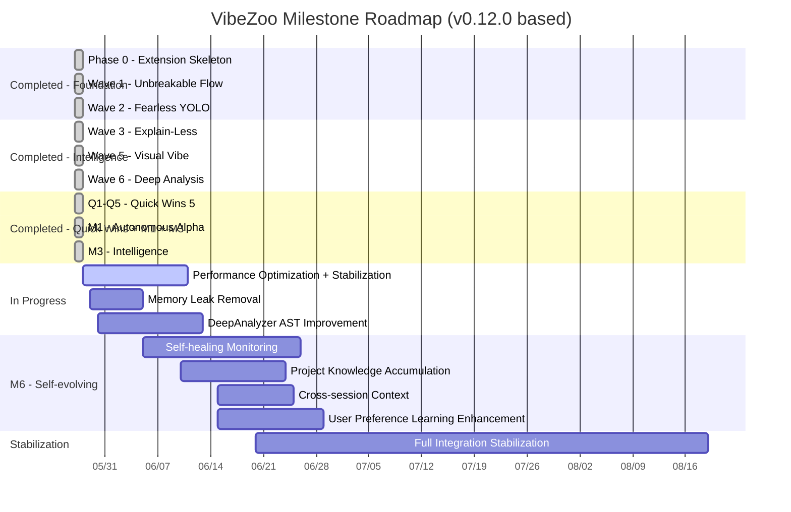

# VibeZoo Implementation Plan — v0.15.1

> **Written**: 2026-05-27 (v0.10.0 draft) → 2026-05-27 (v0.12.0 full revision) → 2026-06-02 (v0.14.1 v2 Upgrade) → 2026-06-05 (v0.14.3 Guard.git) → 2026-06-06 (v0.14.4 Multilingual Analysis) → 2026-06-13 (v0.15.0 Auto-Connect Fix) → 2026-06-16 (v0.15.1 Standard Path Migration)
> **Baseline Version**: v0.15.1
> **Base Documents**: [Architecture.md](./Architecture.md), [ROADMAP.md](./ROADMAP.md), [JOURNAL.md](./JOURNAL.md)

---

## 0. Version History

| Version | Date | Key Changes | Notes |
|:---|:---|:---|:---|
| **v0.15.1** | 2026-06-16 (Current) | Standard path migration to `%USERPROFILE%\mcp-servers\vibezoo\`, auto-start via `autoStart`/`autoStartCommand`, physical port inspection (`isPortOccupied`) for zombie process cleanup | Current |
| **v0.15.0** | 2026-06-13 | Auto-connect fundamental fix: McpConfigService (always write `.roo/mcp.json`), PythonResolver (6-step interpreter discovery), VscodePaths (cross-platform), VSIX bundling (`mcp-servers/` → `extension/mcp-servers/`), real Crow fallback server | |
| **v0.14.4** | 2026-06-06 | Multi-language analysis engine enhancement: C++/Rust AST, Go enhancement, Shell/Dockerfile/YAML support, native linter integration (cargo clippy, go vet, cppcheck) | |
| **v0.14.3** | 2026-06-05 | Guard.git: OS ACL (.git deletion prevention), multi-root/Worktree support, Shell injection defense, Yocto snapshot, SelfCheck integration | |
| **v0.14.2** | 2026-06-03 | Guard.git l10n bundles, TreeView toggle, settings added | |
| **v0.14.1** | 2026-06-02 | VibeZoo v2 upgrade: Dropzone generalization + PDF pipeline + OCR preprocessing + documentation update | |
| **v0.14.0** | 2026-06-02 | UX Workflow: intent_detector + ux_coordinator (3 tools) + documentation update |
| **v0.10.0** | 2026-05-27 AM | Initial implementation complete (26 files). 4 Go MCP servers. AutoBuildFix empty loop. | Design → Implementation |
| **v0.10.0** | 2026-05-27 PM | Switched to Python MCP bridge. All Go servers removed. Single `vibezoo_mcp_bridge.py` file. | Go→Python |
| **v0.10.0** | 2026-05-27 PM | AI auto Whiteboard + UI Preview integration. 4 new MCP tools including `draw_on_whiteboard`. | `setInterval` polling |
| **v0.10.0** | 2026-05-27 PM | MCP auto-config fix. Removed duplicate Crow addition. | Config stabilization |
| **v0.10.0** | 2026-05-27 Final | Go files cleanup (1,074 lines removed). SSE path `/sse` fix. VSIX build complete. | Cleanup |
| **v0.11.1** | 2026-05-27 | 30+ bug fixes. Feature skeleton implementation complete. | Stabilization |
| **v0.12.0** | 2026-05-27 | Quick Wins 5 + M1 (Autonomous Fix Loop, Scout AST, Reviewer ESLint, Crow error patterns) + M3 (explain_code, analyze_changes, review_pr, refactor_across_files, learn/recall_project, learn/get_preferences, CIM). TreeView 3 types, StatusBar unified, `fs.watchFile` migration, Lazy Init. **31 MCP tools**. | |
| **v0.13.0** | 2026-05-28 | Phase 0~(SelfCheck, NotificationThrottle, FileGuard fix) + Phase 1~6. Whiteboard stabilization + 4 major improvements (I_instability, atomicCopy, hydrateContext, Crow backoff) + Virtual Subagent (SubagentPool+5 MCP tools) + Intent-to-Code Bridge (Whiteboard→TypeScript) + Full NotificationThrottle application + Documentation/GitHub/VSIX. **36 MCP tools**. | |

---

## 1. Tech Stack (Finalized)

| Component | Language/Technology | Description |
|:---|:---|:---|
| **VibeZoo Extension** | TypeScript 5.x | VS Code Extension API. `onStartupFinished` activation. |
| **MCP Bridge** | Python 3.x + FastMCP | Single file [`vibezoo_mcp_bridge.py`](../mcp-servers/vibezoo_mcp_bridge.py). SSE transport, port 9027. |
| **AST Parsing** | tree-sitter (Python bindings) | TypeScript/JavaScript structure analysis. Regex fallback when not installed. |
| **Crow Memory** | Zoo Code built-in | Python FastMCP, port 9020. VibeZoo only detects and integrates. |
| **Communication Protocol** | MCP/SSE (JSON-RPC 2.0) | Zoo Code ↔ VibeZoo MCP Bridge |
| **Whiteboard** | Fabric.js | HTML5 Canvas, `fs.watchFile` event sync |
| **UI Preview** | iframe sandbox + Babel standalone | React/Vue real-time rendering |
| **Diagram** | Mermaid.js + D3.js | ERD, call graph visualization |

---

## 2. File Structure (Actual)

```
VibeZoo_forZoocode/
├── extension/                        # VS Code Extension (TypeScript, 16 source files)
│   ├── package.json                  # v0.15.1, 29 commands, 27 settings, 3 TreeViews
│   ├── tsconfig.json
│   └── src/
│       ├── extension.ts              # Entry point (663 lines, activate/deactivate)
│       ├── context/
│       │   └── ContextIntelligence.ts # 4 classes (217 lines)
│       ├── crow/
│       │   └── CrowServerManager.ts  # Crow detection only
│       ├── flow/
│       │   ├── BuildFeedback.ts      # Build result → FixLoopManager integration
│       │   ├── BuildTaskProvider.ts  # Silent Build Task
│       │   ├── ProjectDetector.ts    # Project type detection
│       │   └── ProjectTreeScanner.ts # Tree scan
│       ├── orchestra/
│       │   ├── FixLoopManager.ts     # Autonomous fix loop + CIM (566 lines)
│       │   ├── MentionRouter.ts      # @mention routing
│       │   └── SubagentManager.ts    # Bridge spawn·management
│       ├── safety/
│       │   ├── FileGuard.ts          # .yoloignore watch
│       │   ├── GitStashManager.ts    # YOLO Git Stash
│       │   ├── GuardGitACL.ts        # OS-level ACL protection (icacls/chattr/chmod)
│       │   ├── GuardGitManager.ts    # Guard.git overall management (multi-root, Worktree, residual ACL cleanup)
│       │   └── YoctoManager.ts       # yocto backup·restore
│       ├── types/
│       │   └── index.ts              # Common type definitions
│       ├── ui/
│       │   ├── StatusBarManager.ts   # Unified StatusBar (142 lines)
│       │   └── TreeViewProviders.ts  # 3 Providers (443 lines)
│       └── visual/
│           └── VisualVibePanels.ts   # Whiteboard + UI Preview + Diagram
│
├── mcp-servers/
│   ├── vibezoo_mcp_bridge.py         # 40 MCP tools (modular)
│   ├── vibezoo_mcp_bridge.py         # Legacy bridge
│   └── bridge/
│       ├── intent_detector.py        # UX Intent Detection
│       └── tools/
│           └── ux_coordinator.py     # UX Coordinator (3 tools)
│
├── fromscratch/                      # Design documents
│   ├── Architecture.md               # Architecture document
│   ├── PLAN.md                       # ← This document
│   ├── ROADMAP.md                    # Performance maximization roadmap
│   └── JOURNAL.md                    # Development journal
│
├── plans/
│   ├── autonomous-fix-loop.md        # FixLoopManager detailed design (701 lines)
│   └── ux-workflow-design.md         # UX Workflow design document
│
└── templates/
    ├── yoloignore
    ├── zoo-config.json
    └── vscode-settings.json
```

---

## 3. Completed Items

### 3.1 Phase 0: Foundation — Completed ✅

| # | Item | File | Status |
|:---:|:---|:---|:---:|
| P0-1 | Extension project creation | `extension/package.json`, `extension/tsconfig.json` | ✅ |
| P0-2 | CrowServerManager (Zoo Code Crow detection) | [`extension/src/crow/CrowServerManager.ts`](../extension/src/crow/CrowServerManager.ts) | ✅ |
| P0-3 | StatusBar integration | [`extension/src/ui/StatusBarManager.ts`](../extension/src/ui/StatusBarManager.ts) | ✅ |
| P0-4 | Auto-create directory structure (`~/.zoo-code/yocto/`, `.zoo/`) | [`extension/src/extension.ts`](../extension/src/extension.ts:728) | ✅ |
| P0-5 | Auto-copy templates (`.yoloignore`, `.zoo/config.json`, `.vscode/settings.json`) | [`extension/src/extension.ts`](../extension/src/extension.ts:742) | ✅ |
| P0-6 | MCP auto-config (`autoConfigureMCP()`) | [`extension/src/extension.ts`](../extension/src/extension.ts:684) | ✅ |
| P0-7 | `VibeZoo: Verify Foundation` diagnostic command | [`extension/src/extension.ts`](../extension/src/extension.ts:238) | ✅ |
| P0-8 | `VibeZoo: Reconnect to Crow Memory` | [`extension/src/extension.ts`](../extension/src/extension.ts:271) | ✅ |

### 3.2 Wave 1: Unbreakable Flow — Completed ✅

| # | Item | File | Status |
|:---:|:---|:---|:---:|
| W1-1 | Silent Build Task Provider | [`extension/src/flow/BuildTaskProvider.ts`](../extension/src/flow/BuildTaskProvider.ts) | ✅ |
| W1-2 | BuildFeedback — build result collection → Crow ingest | [`extension/src/flow/BuildFeedback.ts`](../extension/src/flow/BuildFeedback.ts) | ✅ |
| W1-3 | Project Auto-Detector → mode suggestion | [`extension/src/flow/ProjectDetector.ts`](../extension/src/flow/ProjectDetector.ts) | ✅ |
| W1-4 | ProjectTreeScanner + caching | [`extension/src/flow/ProjectTreeScanner.ts`](../extension/src/flow/ProjectTreeScanner.ts) | ✅ |
| W1-5 | `VibeZoo: Scan Project Tree` command | [`extension/src/extension.ts`](../extension/src/extension.ts:225) | ✅ |

### 3.3 Wave 2: Fearless YOLO — Completed ✅

| # | Item | File | Status |
|:---:|:---|:---|:---:|
| W2-1 | YoctoManager — real-time file backup (FileSystemWatcher) | [`extension/src/safety/YoctoManager.ts`](../extension/src/safety/YoctoManager.ts) | ✅ |
| W2-2 | Instant Rewind (`Ctrl+Shift+Z`) | [`extension/src/extension.ts`](../extension/src/extension.ts:185) | ✅ |
| W2-3 | FileGuard — `.yoloignore` watch·restore | [`extension/src/safety/FileGuard.ts`](../extension/src/safety/FileGuard.ts) | ✅ |
| W2-4 | GitStashManager — YOLO entry/exit automation | [`extension/src/safety/GitStashManager.ts`](../extension/src/safety/GitStashManager.ts) | ✅ |
| W2-5 | YOLO History TreeView | [`extension/src/ui/TreeViewProviders.ts`](../extension/src/ui/TreeViewProviders.ts:239) | ✅ |
| W2-6 | `VibeZoo: Toggle YOLO Mode` | [`extension/src/extension.ts`](../extension/src/extension.ts:210) | ✅ |

### 3.4 Wave 3: Explain-Less — Completed ✅

| # | Item | File | Status |
|:---:|:---|:---|:---:|
| W3-1 | ContextIndicator — Crow freshness | [`extension/src/context/ContextIntelligence.ts`](../extension/src/context/ContextIntelligence.ts:10) | ✅ |
| W3-2 | ExplainLessSuggestor — repeated explanation pattern detection | [`extension/src/context/ContextIntelligence.ts`](../extension/src/context/ContextIntelligence.ts:35) | ✅ |
| W3-3 | SessionResume — TreeView-based session restoration (Crow·local·yocto triple fallback) | [`extension/src/context/ContextIntelligence.ts`](../extension/src/context/ContextIntelligence.ts:72) | ✅ |
| W3-4 | EmotionalDetector — emotion signal analysis (continuous rejection detection) | [`extension/src/context/ContextIntelligence.ts`](../extension/src/context/ContextIntelligence.ts:177) | ✅ |
| W3-5 | Session Resume TreeView + `Ctrl+Shift+R` | [`extension/src/ui/TreeViewProviders.ts`](../extension/src/ui/TreeViewProviders.ts:331) | ✅ |

### 3.5 Wave 4: Orchestra of One — Partially Completed

| # | Item | File | Status |
|:---:|:---|:---|:---:|
| W4-1 | SubagentManager — Python Bridge spawn | [`extension/src/orchestra/SubagentManager.ts`](../extension/src/orchestra/SubagentManager.ts) | ✅ |
| W4-2 | MentionRouter — @mention routing | [`extension/src/orchestra/MentionRouter.ts`](../extension/src/orchestra/MentionRouter.ts) | ✅ |
| W4-3 | Active Subagents TreeView (Bridge health check) | [`extension/src/ui/TreeViewProviders.ts`](../extension/src/ui/TreeViewProviders.ts:29) | ✅ |
| W4-4 | Orchestra Dashboard (`openDashboard`) | [`extension/src/extension.ts`](../extension/src/extension.ts:302) | ✅ |
| W4-5 | Individual Go MCP servers (Scout/Reviewer/Tester/Deep) | Deleted | ❌ (Replaced by single Python bridge) |

### 3.6 Wave 5: Visual Vibe — Completed ✅

| # | Item | File | Status |
|:---:|:---|:---|:---:|
| W5-1 | Whiteboard (Fabric.js + `fs.watchFile`) | [`extension/src/visual/VisualVibePanels.ts`](../extension/src/visual/VisualVibePanels.ts) | ✅ |
| W5-2 | UI Preview (iframe sandbox) | [`extension/src/visual/VisualVibePanels.ts`](../extension/src/visual/VisualVibePanels.ts) | ✅ |
| W5-3 | Diagram Webview (Mermaid.js + D3.js) | [`extension/src/visual/VisualVibePanels.ts`](../extension/src/visual/VisualVibePanels.ts) | ✅ |
| W5-4 | `capture_screen` MCP tool | [`mcp-servers/vibezoo_mcp_bridge.py`](../mcp-servers/vibezoo_mcp_bridge.py:327) | ✅ |
| W5-5 | `draw_on_whiteboard`, `get_whiteboard_state`, `open_whiteboard` | [`mcp-servers/vibezoo_mcp_bridge.py`](../mcp-servers/vibezoo_mcp_bridge.py:1069) | ✅ |
| W5-6 | `open_ui_preview` MCP tool | [`mcp-servers/vibezoo_mcp_bridge.py`](../mcp-servers/vibezoo_mcp_bridge.py:1109) | ✅ |

### 3.7 Wave 6: Deep Analysis — Completed ✅

| # | Item | File | Status |
|:---:|:---|:---|:---:|
| W6-1 | `analyze_call_graph` — tree-sitter AST call graph | [`mcp-servers/vibezoo_mcp_bridge.py`](../mcp-servers/vibezoo_mcp_bridge.py:663) | ✅ |
| W6-2 | `map_dependencies` — AST circular reference detection | [`mcp-servers/vibezoo_mcp_bridge.py`](../mcp-servers/vibezoo_mcp_bridge.py:741) | ✅ |
| W6-3 | `extract_patterns` — code pattern mining | [`mcp-servers/vibezoo_mcp_bridge.py`](../mcp-servers/vibezoo_mcp_bridge.py:821) | ✅ |
| W6-4 | `reverse_engineer` — AST-based API·ERD·OpenAPI generation | [`mcp-servers/vibezoo_mcp_bridge.py`](../mcp-servers/vibezoo_mcp_bridge.py:880) | ✅ |

### 3.8 Quick Wins 5 (M0) — Completed ✅

| # | Item | Content | Status |
|:---:|:---|:---|:---:|
| Q1 | Scenario integration commands | 4 MCP tools: `review_project`, `find_bugs`, `suggest_refactor`, `generate_docs` | ✅ |
| Q2 | `setInterval` → `fs.watchFile` | Whiteboard·UI Preview file watch event-based migration | ✅ |
| Q3 | StatusBar unification | 1 unified item (`$(zap) VibeZoo`) + minimized alerts | ✅ |
| Q4 | Lazy Init | Deferred initialization of YoctoManager·FixLoopManager·VisualVibePanels | ✅ |
| Q5 | One-click actions | Right-click context menu (Review·Find Bugs·Refactor·Docs) | ✅ |

### 3.9 M1: Autonomous Alpha (1-month milestone) — Completed ✅

| # | Item | Content | Status |
|:---:|:---|:---|:---:|
| A1.1 | **FixLoopManager** | 8-state machine, oscillation detection, file-based LLM communication | ✅ |
| A1.2 | `auto_fix_status` MCP tool | Fix request query + Crow past error patterns | ✅ |
| A1.3 | `retry_build` MCP tool | Build re-execution + result recording + Crow ingest | ✅ |
| A1.4 | `check_intervention` MCP tool | Whiteboard·Chat intervention check | ✅ |
| A1.5 | BuildFeedback → FixLoopManager integration | Auto Fix Loop trigger on build failure | ✅ |
| A1.6 | HITL intervention commands | `pauseFixLoop`, `resumeFixLoop`, `abortFixLoop` | ✅ |
| A1.7 | Scout tree-sitter AST search | `search_codebase` AST structure search | ✅ |
| A1.8 | Reviewer ESLint integration | `check_quality` ESLint·go vet integration | ✅ |
| A1.9 | Crow error pattern learning | `auto_fix_status`·`retry_build` Crow bug register integration | ✅ |
| A1.10 | `AutoBuildFix` removal | [`extension/src/safety/AutoBuildFix.ts`]() → replaced by FixLoopManager | ✅ |

### 3.10 M3: Intelligence (3-month milestone) — Early Completion ✅

| # | Item | Content | Status |
|:---:|:---|:---|:---:|
| M3-A | `explain_code` + `VibeZoo: Explain Code` | AST context based code explanation | ✅ |
| M3-B | `analyze_changes` + `review_pr` | git diff analysis + PR review | ✅ |
| M3-C | `refactor_across_files` + `VibeZoo: Refactor Across Files` | Multi-file refactoring proposal | ✅ |
| M3-D | `learn_project` + `recall_project` | Project knowledge Crow accumulation·recall | ✅ |
| M3-E | `learn_preference` + `get_preferences` | User coding preference learning·query | ✅ |
| M3-F | CIM (Continuous Improvement Mode) | `startWatching`·`stopWatching` — auto tsc check on file save | ✅ |

---

---

### 3.11 UX Workflow — Completed ✅

| # | Item | File | Status |
|:---:|:---|:---|:---:|
| UX-1 | intent_detector.py (Intent Detection) | [`bridge/intent_detector.py`](../mcp-servers/bridge/intent_detector.py) | ✅ |
| UX-2 | ux_coordinator.py (UX Coordinator) | [`bridge/tools/ux_coordinator.py`](../mcp-servers/bridge/tools/ux_coordinator.py) | ✅ |
| UX-3 | ux_coordinator, auto_analyze_after_drop, auto_analyze_whiteboard | [`bridge/tools/ux_coordinator.py`](../mcp-servers/bridge/tools/ux_coordinator.py) | ✅ |
| UX-4 | capture_screen/analyze_uploaded_file/get_whiteboard_state description improvements | [`whiteboard.py`](../mcp-servers/bridge/tools/whiteboard.py), [`file_analyzer.py`](../mcp-servers/bridge/tools/file_analyzer.py) | ✅ |
| UX-5 | vibezoo_mcp_bridge.py list_subagents/health check updates | [`vibezoo_mcp_bridge.py`](../mcp-servers/vibezoo_mcp_bridge.py) | ✅ |
| UX-6 | Design document writing | [`plans/ux-workflow-design.md`](../plans/ux-workflow-design.md) | ✅ |

---

### 3.12 Guard.git — Completed ✅

| # | Item | File | Status |
|:---:|:---|:---|:---:|
| GG-1 | GuardGitManager — multi-root·Worktree·residual ACL cleanup | [`extension/src/safety/GuardGitManager.ts`](../extension/src/safety/GuardGitManager.ts) | ✅ |
| GG-2 | GuardGitACL — OS-level ACL (icacls/chattr/chmod) | [`extension/src/safety/GuardGitACL.ts`](../extension/src/safety/GuardGitACL.ts) | ✅ |
| GG-3 | Yocto snapshot — .git core files (HEAD, config, refs) backup | [`extension/src/safety/YoctoManager.ts`](../extension/src/safety/YoctoManager.ts) | ✅ |
| GG-4 | SelfCheck integration — .git integrity self-diagnostics | [`extension/src/safety/SelfCheck.ts`](../extension/src/safety/SelfCheck.ts) | ✅ |
| GG-5 | TreeView Guard.git On/Off toggle node | [`extension/src/ui/TreeViewProviders.ts`](../extension/src/ui/TreeViewProviders.ts) | ✅ |
| GG-6 | `toggleGuardGit` command registration | [`extension/src/extension.ts`](../extension/src/extension.ts) | ✅ |
| GG-7 | 6 settings (`guard.enabled`, `guard.autoEnable`, `guard.yoctoBackupEnabled`, `guard.yoctoBackupIntervalMin`, `guard.integrityCheckIntervalMin`, `guard.linuxUseChattr`) | [`extension/package.json`](../extension/package.json) | ✅ |
| GG-8 | l10n English/Korean bundles | [`extension/l10n/bundle.l10n.json`](../extension/l10n/bundle.l10n.json), [`extension/l10n/bundle.l10n.ko.json`](../extension/l10n/bundle.l10n.ko.json) | ✅ |
| GG-9 | Design document writing | [`plans/guard-git-design.md`](plans/guard-git-design.md) | ✅ |

---

## 4. Remaining Work (Based on ROADMAP.md)

### 4.1 Priority Matrix

> **Evaluation Criteria**: Difficulty(1~10), Impact(1~10), Effort(S/M/L/XL)
> **Priority Score** = Impact × 0.5 + (11 − Difficulty) × 0.3

| # | Item | Axis | Difficulty | Impact | Effort | Score | Status |
|:---:|:---|:---:|:---:|:---:|:---:|:---:|:---|
| 1 | **Self-healing monitoring** | 1 | 7 | 7 | L | 5.7 | 🔜 Planned |
| 2 | **Project knowledge accumulation enhancement** | 3 | 5 | 5 | L | 5.3 | 🔜 Planned |
| 3 | **Memory leak removal** | 4 | 6 | 5 | M | 6.2 | 🔜 Planned |
| 4 | **Left sidebar unification** | 5 | 5 | 5 | M | 5.3 | 🔜 Planned |
| 5 | **Cross-session context enhancement** | 3 | 5 | 7 | M | 6.3 | 🔜 Planned |
| 6 | **User preference learning enhancement** | 3 | 4 | 6 | L | 5.6 | 🔜 Planned |
| 7 | **DeepAnalyzer AST call graph improvement** | 2 | 8 | 8 | L | 6.4 | In Progress |
| 8 | **4 new MCP tools** (explain_code, suggest_refactor, find_bugs, analyze_pr) | 2 | 5 | 7 | M | 6.3 | ✅ Completed (in M3) |
| 9 | **Activation time < 500ms optimization** | 4 | 4 | 6 | S | 6.4 | ✅ Completed (Q4) |
| 10 | **Full integration stabilization** | 5 | 6 | 8 | XL | 5.5 | In Progress |

### 4.2 Milestone Roadmap



### 4.3 Milestone Details

| Milestone | Status | Key Achievements | Success Metrics |
|:---|:---:|:---|:---|
| **M0: Quick Wins** | ✅ Completed | 5 Quick Wins. Scenario commands·Performance·UX improvements | Activation < 500ms, StatusBar unified |
| **M1: Autonomous Alpha** | ✅ Completed | Fix Loop + Scout AST + Reviewer ESLint + Crow error learning | HITL-based autonomous fix loop |
| **M3: Intelligence** | ✅ Completed | explain_code, analyze_changes, review_pr, refactor_across_files, learn/recall_project, learn/get_preferences, CIM | 40 MCP tools, tree-sitter AST analysis |
| **M6: Self-evolving** | 🔜 Planned | Self-healing + project knowledge accumulation + full stabilization | 60%+ issues auto-resolved without manual intervention |

### 4.4 Parallel Tracks

| Track | Axis | Current Status | Next Steps |
|:---|:---|:---|:---|
| **Track A: Tool Intelligence** | MCP tools | ✅ v0.12.0 completed | DeepAnalyzer AST enhancement, new language support |
| **Track B: Automation** | Agent | ✅ M1 completed, M3 CIM completed | Self-healing monitoring, full automation |
| **Track C: Memory** | Crow | ✅ M3-D/E completed | Project knowledge accumulation enhancement, cross-session context |
| **Track D: Quality** | Performance·UX | ✅ Q2-Q5 completed | Memory leak removal, further activation time reduction |
| **Track E: Stabilization** | Integration | In Progress | Full integration testing, edge case handling |

---

## 5. Design Principles (VibeZoo Promise)

1. **Zero Zoo Code source modification**: All features work via VibeZoo Extension + MCP Bridge + Config changes only.
2. **Crow is Zoo Code built-in**: VibeZoo does not spawn Crow. It only detects and integrates; all features work normally without Crow.
3. **Human-in-the-Loop**: Automation within user-controllable boundaries. Fix Loop always provides pause/resume/abort, CIM provides start/stop commands.
4. **tree-sitter AST first, regex fallback**: All tools work normally even when tree-sitter is not installed in Windows environments.
5. **Lightweight**: Extension compiles single TypeScript output, Bridge is a single Python file. Minimal installation friction.
6. **Real usage experience first**: Scenario-centered design, not "toolbox". Users don't need to know which tool to use when — just ask in natural language.

---

## 6. Risk Factors and Responses

| # | Risk | Probability | Impact | Response | Status |
|:---|:---|:---:|:---:|:---|:---:|
| R1 | tree-sitter Python binding Windows installation issues | 30% | Medium | Include pre-built wheel, maintain regex fallback on failure | ✅ Response ready |
| R2 | Autonomous Fix Loop corrupts code with wrong fixes | 25% | Critical | HITL required + auto yocto backup + oscillation detection | ✅ Response ready |
| R3 | Crow Memory server (9020) instability | 20% | Low | All Crow calls 3s timeout + VibeZoo works normally even on failure | ✅ Response ready |
| R4 | Zoo Code update changes MCP protocol | 15% | Medium | MCP standard compliance + version compatibility testing | ⚠️ Continuous monitoring |
| R5 | Users still don't use tools | 40% | Critical | Scenario commands + StatusBar action buttons + one-click context menu | ✅ Response ready |

---

## 7. Key Performance Indicators (KPI)

| Metric | M0 (Completed) | M1 (Completed) | M3 (Completed) | M6 (Target) |
|:---|:---:|:---:|:---:|:---:|
| **MCP Tool Count** | 16 | 23 | 40 | 45+ |
| **Auto Resolution Rate** (build errors) | 0% | 40%+ (HITL) | 60%+ (CIM) | 80%+ |
| **Extension Activation Time** | < 500ms | < 500ms | < 500ms | < 300ms |
| **Crow Past Resolution Reuse Rate** | 0% | 10%+ | 30%+ | 50%+ |
| **StatusBar Item Count** | 1 (unified) | 1 | 1 | 1 |
| **TreeView Count** | 3 | 3 | 3 | 3 |
| **VS Code Command Count** | 10 | 18 | 29 | 30+ |

---

## 8. Next Priority Tasks (M6 Preparation)

| Order | Item | Estimated Completion | Description |
|:---:|:---|:---|:---|
| 1 | **Self-healing monitoring** | M6 | Beyond CIM — auto detect and fix runtime errors·lint·type errors |
| 2 | **Memory leak removal** | 1 week | Verify `VisualVibePanels` dispose, clean `FileSystemWatcher` subscriptions |
| 3 | **Project knowledge accumulation enhancement** | M6 | Long-term preservation·version management·auto expiration of `learn_project` results |
| 4 | **Cross-session context** | M6 | Auto restore work goals and progress between sessions |
| 5 | **DeepAnalyzer AST multi-language support** | M6 | Extend tree-sitter analysis to Python, Go, Rust |
| 6 | **Full integration stabilization** | M6 | Edge case testing, error resilience enhancement, documentation |

---

> **Core Principles Reminder**:
> 1. "Zero Zoo Code source modification — all features implemented via VibeZoo Extension + MCP Bridge + Config"
> 2. "Crow is Zoo Code built-in — VibeZoo only detects and integrates, all features work normally without Crow"
> 3. "Controllable automation over perfect automation — Human-in-the-Loop"
