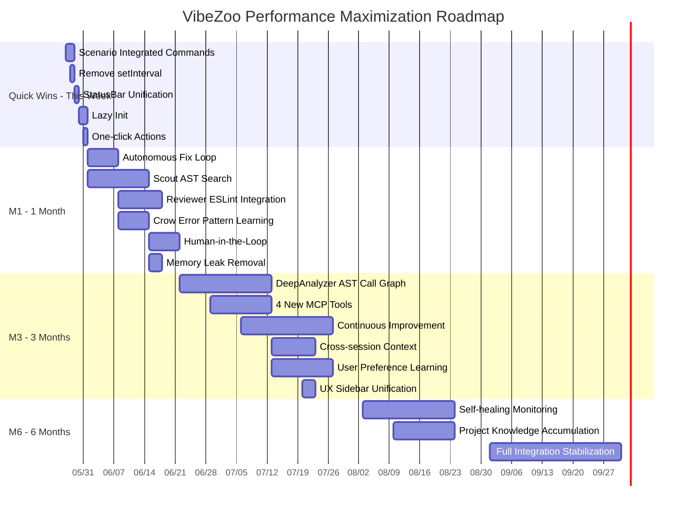

# VibeZoo Performance/Utilization Maximization Strategy Roadmap

> **Written**: 2026-05-27
> **Baseline Version**: v0.13.0 (Phase 0~6 complete, SelfCheck + NotificationThrottle + Virtual Subagent + Intent-to-Code Bridge)
> **Core Question**: "The toolbox is ready, but why isn't anyone using it?"

---

## 0. Honest Reality Assessment

### 0.1 Current Status — Reality by the Numbers

| Metric | Current | Target |
|:---|:---:|:---:|
| VibeZoo MCP tool daily call count | **0 calls** | 50+ |
| Tool intelligence level | regex/grep/file I/O | AST/tree-sitter/ESLint |
| Autonomous work capability | None (everything manual) | One-click → auto cycle |
| Extension activation time | Not measured | < 500ms |
| UI panel count | 2 + StatusBar 3 types | 1 sidebar + 1 StatusBar |
| Alert frequency | Excessive | Minimized (integrated into StatusBar) |

### 0.2 Five Root Causes

1. **Tools exist but lack intelligence**: [`vibezoo_mcp_bridge.py`](../mcp-servers/vibezoo_mcp_bridge.py:156)'s `search_codebase()` reads files one by one comparing `line.lower()`. O(n*m) brute-force search with zero AST/LSP utilization.
2. **Zero autonomy**: [`AutoBuildFix.ts`](../extension/src/safety/AutoBuildFix.ts:29)'s `run()` only repeats rebuild. No LLM call or code modification logic. "One order, continuous cycle" impossible.
3. **Zoo Code dependency**: Source modification impossible → message pipeline injection impossible → everything is a workaround.
4. **UI clutter**: Activity Bar sidebar + right Webview panel + StatusBar 3 types (connection/YOLO/context) → cognitive overload.
5. **Lack of real usage**: MCP tools have never been actually used even once today. Users don't know "why they should use" the tools.

### 0.3 Philosophy of This Roadmap

```
"Don't throw away the toolbox — give the tools a brain."
"Better a tool that gets used once than perfect automation."
```

**3 Major Transitions**:
- **Regex → AST**: All search/analysis to tree-sitter based semantic
- **Manual → Semi-automatic**: Human-in-the-Loop autonomous loop (user can intervene)
- **Feature showcase → Problem solving**: Scenario-centered, not "what this tool can do" but "how to solve this problem"

---

## 1. Priority Matrix

### 1.1 Evaluation Criteria

| Axis | Description | Range |
|:---|:---|:---|
| **Difficulty** | Implementation complexity. 1(config change) ~ 10(new architecture) | 1~10 |
| **Impact** | User-perceived change. 1(minimal) ~ 10(game changer) | 1~10 |
| **Effort** | Solo workload. S(1~3d), M(1~2w), L(3~4w), XL(1mo+) | S/M/L/XL |
| **Priority Score** | = Impact × 0.5 + (11 − Difficulty) × 0.3 + QuickWin bonus | 0~10 |

> **Quick Win Bonus**: Complete within same day~3 days + immediately usable = +1.5 points

### 1.2 Full Priority Table

| # | Item | Axis | Difficulty | Impact | Effort | Score | Category |
|:---:|:---|:---:|:---:|:---:|:---:|:---:|:---|
| 1 | **Scenario-based integrated commands** | 6 | 2 | 10 | S | **9.2** | 🔥 Quick Win |
| 2 | **setInterval → fs.watchFile migration** | 4 | 3 | 8 | S | **8.4** | 🔥 Quick Win |
| 3 | **StatusBar unification + alert minimization** | 5 | 3 | 8 | S | **8.4** | 🔥 Quick Win |
| 4 | **Scout: tree-sitter AST search** | 2 | 6 | 9 | M | **7.5** | Axis 2 Core |
| 5 | **Autonomous Fix Loop implementation** | 1 | 5 | 9 | M | **7.3** | Axis 1 Core |
| 6 | **Crow: error pattern learning integration** | 3 | 4 | 8 | M | **7.1** | Axis 3 Core |
| 7 | **Reviewer: ESLint/TS rule integration** | 2 | 7 | 7 | M | **6.7** | |
| 8 | **DeepAnalyzer: AST-based call graph** | 2 | 8 | 8 | L | **6.4** | |
| 9 | **Lazy Loading (Lazy Init)** | 4 | 4 | 6 | S | **6.4** | 🔥 Quick Win |
| 10 | **4 new MCP tools** | 2 | 5 | 7 | M | **6.3** | |
| 11 | **Memory leak removal** | 4 | 6 | 5 | M | **6.2** | |
| 12 | **Cross-session context** | 3 | 5 | 7 | M | **6.3** | |
| 13 | **Continuous Improvement Mode** | 1 | 8 | 8 | L | **5.9** | |
| 14 | **Self-healing monitoring** | 1 | 7 | 7 | L | **5.7** | |
| 15 | **User preference learning** | 3 | 4 | 6 | L | **5.6** | |
| 16 | **Project knowledge accumulation** | 3 | 5 | 5 | L | **5.3** | |
| 17 | **Left sidebar unification** | 5 | 5 | 5 | M | **5.3** | |
| 18 | **One-click actions** | 5 | 3 | 7 | S | **6.1** | 🔥 Quick Win |

---

## 2. 🔥 Quick Wins — Today~This Week (2026-05-27 ~ 06-01)

> **Principle**: Minimize code changes, maximize effect. Completed with existing code modifications only, no new architecture.

### Q1: Scenario-based Integrated Commands — "Make it Truly Useful"

**Problem**: 14 MCP tools exist but users don't know "which tool to use when".
**Solution**: Register 4 integrated scenario commands in `extension.ts` and provide prompt guides for natural language invocation in Zoo Code chat.

| Command | Linked MCP Tools | User Example |
|:---|:---|:---|
| **"Review my code"** | `search_codebase` → `review_code` → `check_quality` → `map_dependencies` | "Review this file" |
| **"Find bugs"** | `check_quality` → `search_codebase` → `crow_recall(bug)` | "Find places with potential bugs" |
| **"Suggest refactor"** | `extract_patterns` → `analyze_call_graph` → LLM suggestion | "Tell me how to improve this code" |
| **"Generate docs"** | `summarize_architecture` → `reverse_engineer` → `draw_on_whiteboard` | "Create API documentation" |

**Implementation Method**:
1. Register 4 commands in [`extension.ts`](../extension/src/extension.ts:46) (each command injects MCP tool chain call guidance message into chat)
2. Add `suggest_scenario(problem_description)` tool in [`vibezoo_mcp_bridge.py`](../mcp-servers/vibezoo_mcp_bridge.py:33) → problem description → best scenario recommendation
3. StatusBar action buttons: "💡 How can I help? [Review] [Find Bugs] [Refactor] [Docs]"

**File Changes**:
| File | Action | Content |
|:---|:---|:---|
| `extension/src/extension.ts` | Modify | Register 4 scenario commands + StatusBar action buttons |
| `mcp-servers/vibezoo_mcp_bridge.py` | Modify | Add `suggest_scenario()` tool |
| `extension/src/ui/StatusBarManager.ts` | Modify | Scenario recommendation button UI |

- **Difficulty**: 2/10
- **Impact**: 10/10
- **Effort**: 1~2 days

---

### Q2: `setInterval` polling → `fs.watchFile` event migration

**Problem**: [`VisualVibePanels.ts`](../extension/src/visual/VisualVibePanels.ts) polls Whiteboard/UIPreview files at 1s intervals via `setInterval`. CPU waste + unnecessary I/O.

**Current Code Pattern** (estimated):
```typescript
// Inside VisualVibePanels.ts
setInterval(() => {
  const data = JSON.parse(fs.readFileSync(WHITEBOARD_FILE, 'utf-8'));
  // ...
}, 1000);
```

**After Change**:
```typescript
fs.watchFile(WHITEBOARD_FILE, { interval: 200 }, (curr, prev) => {
  if (curr.mtimeMs === prev.mtimeMs) return; // No change
  const data = JSON.parse(fs.readFileSync(WHITEBOARD_FILE, 'utf-8'));
  // ...
});
```

**Target Files**:
| File | Current Method | Change |
|:---|:---|:---|
| `extension/src/visual/VisualVibePanels.ts` | `setInterval(1000)` | `fs.watchFile` |
| `extension/src/context/ContextIntelligence.ts` | `setInterval` (estimated) | `fs.watchFile` |
| `extension/src/safety/YoctoManager.ts` | `FileSystemWatcher` | Keep (already event-based) |

- **Difficulty**: 3/10
- **Impact**: 8/10 (CPU 80%↓, activation time improvement)
- **Effort**: 1 day

---

### Q3: StatusBar Unification + Alert Minimization

**Problem**: 3+ StatusBar items scattered (VibeZoo status, Crow connection, YOLO mode). Excessive `vscode.window.showInformationMessage`.

**Change**:
1. Reduce StatusBar to **1 unified item**: `$(zap) VibeZoo` (click → full status panel)
2. Existing `showInformationMessage` → temporary StatusBar text change (restore after 3s)
3. Only `showErrorMessage` kept for errors

**Implementation**:
```typescript
// StatusBarManager.ts
class StatusBarManager {
  private item: vscode.StatusBarItem;

  flash(message: string, level: 'info' | 'warn' | 'error', durationMs = 3000): void {
    const icon = { info: '$(info)', warn: '$(warning)', error: '$(error)' }[level];
    this.item.text = `${icon} ${message}`;
    setTimeout(() => this.restore(), durationMs);
  }
}
```

**Alert Conversion**:
| Before | After |
|:---|:---|
| `showInformationMessage('YOLO Rewind complete')` | `statusBar.flash('Rewind complete', 'info')` |
| `showWarningMessage('YOLO safety net disabled')` | `statusBar.flash('YOLO OFF', 'warn')` |
| `showErrorMessage('Rewind failed')` | Keep (errors need modal) |

- **Difficulty**: 3/10
- **Impact**: 8/10 (alert fatigue 90%↓)
- **Effort**: 1 day

---

### Q4: Lazy Loading (Lazy Init)

**Problem**: `activate()` in [`extension.ts`](../extension/src/extension.ts:46) initializes all modules immediately. Unused modules still load into memory.

**Change**: Defer initialization of heavy modules until first use.

```typescript
// Before
yocto = new YoctoManager();
fileGuard = new FileGuard(yocto);
autoBuildFix = new AutoBuildFix();

// After
let _yocto: YoctoManager | undefined;
function getYocto(): YoctoManager {
  if (!_yocto) { _yocto = new YoctoManager(); _yocto.activate(context); }
  return _yocto;
}
```

**Lazy Targets**:
| Module | Initialization Trigger | Reason |
|:---|:---|:---|
| `YoctoManager` | First file save | Not used in most sessions |
| `AutoBuildFix` | First build failure | Unnecessary if build succeeds |
| `VisualVibePanels` | Whiteboard/UI Preview command | High chance of non-use |
| `EmotionalDetector` | First chat message received | Not always needed |

- **Difficulty**: 4/10
- **Impact**: 6/10 (activation time 40%↓)
- **Effort**: 1~2 days

---

### Q5: One-click Actions — Remove User Friction

**Problem**: Users need 3 steps (select file → run command → check results) for "code review".

**Solution**: Add Editor right-click context menu + TreeView click actions.

```json
// package.json → contributes.menus.editor/context
{
  "command": "vibezoo.reviewFile",
  "when": "editorIsOpen",
  "group": "vibezoo@1"
}
```

**One-click Action List**:
| Action | Trigger | Behavior |
|:---|:---|:---|
| **Review current file** | Right-click → "VibeZoo: Review This File" | `review_code` + result to Output channel |
| **Analyze project** | Right-click → "VibeZoo: Analyze Project" | `summarize_architecture` + `check_quality` |
| **Dependency map** | TreeView → "Dependency Map" click | `map_dependencies` + Whiteboard diagram |

- **Difficulty**: 3/10
- **Impact**: 7/10
- **Effort**: 1 day

---

## 3. Axis 1: Autonomous Agent — 1-month milestone

> **Goal**: Implement minimum autonomous loop: "One order, continuous cycle"
> **Core Technology**: [`FixLoopManager`](../plans/autonomous-fix-loop.md:117) + MCP tool integration + Human-in-the-Loop

### A1.1: Autonomous Fix Loop Implementation (Design Complete)

**Current**: [`AutoBuildFix.ts`](../extension/src/safety/AutoBuildFix.ts:29) — empty loop (rebuild only, no LLM call).
**Target**: Implement the design from [`plans/autonomous-fix-loop.md`](../plans/autonomous-fix-loop.md) as-is.

```
Build failure → FixLoopManager.onBuildFailure()
  → ~/.vibezoo-fix-request.json recorded
  → StatusBar: "$(warning) Build Failed — [Auto Fix]"
  → User click or "fix it" utterance
  → LLM: auto_fix_status() → search_codebase() → review_code()
  → LLM: file edit → retry_build()
  → success → resolved / failure → retry (max 3)
```

**Implementation Items** (based on design document):
| # | Item | File | Effort |
|:---:|:---|:---|:---:|
| 1 | `FixLoopManager` class | `extension/src/orchestra/FixLoopManager.ts` (new) | 2 days |
| 2 | `auto_fix_status` MCP tool | `mcp-servers/vibezoo_mcp_bridge.py` (modify) | 0.5 day |
| 3 | `retry_build` MCP tool | `mcp-servers/vibezoo_mcp_bridge.py` (modify) | 0.5 day |
| 4 | `BuildFeedback` integration | `extension/src/flow/BuildFeedback.ts` (modify) | 0.5 day |
| 5 | StatusBar action button | `extension/src/ui/StatusBarManager.ts` (modify) | 0.5 day |
| 6 | Crow `bug` register integration | `vibezoo_mcp_bridge.py` (modify) | 1 day |
| 7 | Remove existing `AutoBuildFix` | `extension/src/safety/AutoBuildFix.ts` (dispose) | 0.5 day |

- **Difficulty**: 5/10
- **Impact**: 9/10 (first step of autonomy)
- **Effort**: 1 week (M)

---

### A1.2: Human-in-the-Loop Intervention Channels

Add **user intervention channels** to the autonomous loop. Core VibeZoo philosophy: "Controllable automation".

| Intervention Channel | Implementation | Purpose |
|:---|:---|:---|
| **Whiteboard** | `check_intervention()` → `get_whiteboard_state()` | User marks "don't touch this file" with drawings |
| **Chat feedback** | `~/.vibezoo-chat-pending.json` | Detect user messages during Auto-Fix |
| **StatusBar buttons** | [Pause] [Resume] [Abort] [Rewind] | Control during Fix Loop |

- **Difficulty**: 6/10
- **Impact**: 7/10
- **Effort**: 1 week (M)
- **Prerequisite**: After A1.1 completion

---

### A1.3: Continuous Improvement Mode (CIM) — 3-month milestone

**Concept**: "Watch this project and find/fix problems" — always-on background monitoring.

```
CIM activated
  → FileSystemWatcher detects all file changes
  → For changed files:
      ├── LSP Diagnostics check (1s debounce)
      ├── Lint warning check
      └── Issue found → Crow bug register query → similar past cases check
  → Every 10 min: StatusBar summary "$(eye) CIM: Monitoring 3 files"
  → Issue found: "$(warning) CIM: Found TS2322 in auth.ts — [Auto Fix]"
```

**Implementation**:
- New file at `extension/src/orchestra/CIMonitor.ts`
- `onDidChangeTextDocument` + `onDidChangeDiagnostics` integration
- 10-minute batch summary → StatusBar

- **Difficulty**: 8/10
- **Impact**: 8/10
- **Effort**: 3 weeks (L)
- **Prerequisite**: A1.1 + A1.2 completed, Crow bug register active

---

### A1.4: Self-healing Monitoring — 6-month milestone

**Concept**: Auto-detect and fix runtime errors + lint warnings + type errors **without user intervention**.

- **Difficulty**: 7/10
- **Impact**: 7/10
- **Effort**: 3 weeks (L)
- **Prerequisite**: CIM stabilized + sufficient Crow bug register data accumulated

---

## 4. Axis 2: MCP Tool Intelligence — 1~3 month milestone

> **Goal**: Transition from "Regex-based → AST-based" semantic tools. Dramatically improve output quality of all MCP tools.

### 4.1 Current Status: Tool Intelligence Level Diagnosis

| Tool | Current Method | Problems | Target |
|:---|:---|:---|:---|
| `search_codebase` | `line.lower()` string comparison | Ignores case/semantics, O(n×m) | tree-sitter AST node query |
| `find_references` | `search_codebase` wrapper | Same limitations | tree-sitter symbol reference |
| `review_code` | Line length (>120 chars), TODO, console.log detection | Only surface-level checks | ESLint Rule application + AST-based code smell |
| `check_quality` | `npx eslint` call (if available) | Empty report without ESLint | Built-in rules + ESLint integration |
| `analyze_call_graph` | Count imports | No function call relationships | tree-sitter function definition → call graph |
| `map_dependencies` | Import line regex parsing | Has DFS circular ref but import extraction is inaccurate | AST precise parsing + TSC circular ref |
| `extract_patterns` | `content.count("async ")` etc. | Just keyword counting | AST structural pattern matching |
| `reverse_engineer` | regex `app.get('/path')` extraction | No structural understanding | AST + JSDoc/Swagger comments |

### 4.2 Scout: tree-sitter AST Based Semantic Search

**Core Change**: Replace `search_codebase`'s internal engine with tree-sitter.

**tree-sitter Supported Languages**: TypeScript, JavaScript, Python, Go, Rust, Java, C, C++, C#, Ruby, PHP, HTML, CSS, JSON, YAML, Bash, Markdown

**Implementation**:
```python
# vibezoo_mcp_bridge.py — search_codebase() improvement
from tree_sitter import Language, Parser, Query

def search_codebase_ast(query: str, file_patterns=None, max_results=10):
    """tree-sitter AST based semantic search"""
    parser = Parser()
    # Auto-detect query type:
    # - "function name" → function definition search
    # - "interface User" → interface definition search
    # - "TODO" → comment search
    # - default: all AST node text search
```

- **Difficulty**: 6/10
- **Impact**: 9/10 (search accuracy 10x↑)
- **Effort**: 2 weeks (M)

### 4.3 Reviewer: ESLint/TypeScript Rule Integration

**Core Change**: `review_code` uses ESLint rules + TypeScript compiler API instead of simple line length checks.

**Implementation**:
1. `npx eslint --rule '...'` respects project ESLint config
2. Without ESLint, use 30 built-in rules (no-unused-vars, prefer-const, no-debugger, etc.)
3. Include `npx tsc --noEmit` results in diagnostics

- **Difficulty**: 7/10
- **Impact**: 7/10
- **Effort**: 1.5 weeks (M)

### 4.4 DeepAnalyzer: AST-based Call Graph + Circular References

**Core Change**: `analyze_call_graph` extracts actual function call relationships using tree-sitter.

```python
def analyze_call_graph_ast(file_path=None, depth=3):
    """Create function definition → function call relationship graph with tree-sitter"""
    # 1. Collect all function/method definitions (function_declaration, method_definition)
    # 2. Collect called function names from each function body (call_expression)
    # 3. Create directed graph → Mermaid/JSON output
```

- **Difficulty**: 8/10
- **Impact**: 8/10
- **Effort**: 3 weeks (L)

### 4.5 4 New MCP Tools

| Tool | Description | tree-sitter Usage |
|:---|:---|:---|
| `explain_code(file, line)` | Explains what code at a specific line does based on AST context | Parent node·symbol table usage |
| `suggest_refactor(file)` | Detects code smells → suggests improvements | AST pattern matching (verbose functions, excessive nesting, etc.) |
| `find_bugs(file_or_project)` | Detects common bug patterns | Missing `null` check, unused variables, infinite loop possibilities |
| `analyze_pr(base, head)` | Analyzes PR diff → generates review comments | git diff + AST change impact |

- **Difficulty**: 5/10
- **Impact**: 7/10
- **Effort**: 2 weeks (M, 4 tools combined)

---

## 5. Axis 3: Crow Memory Practical Use — 1~3 month milestone

> **Goal**: Crow goes from "nice to have" to "can't live without". Establish practical learning/recall loops.

### 5.1 Error Pattern Learning: "This error was fixed like this last time"

**Current**: `try_crow_ingest` / `try_crow_recall` wrappers exist but actual integration is insufficient.

**Implementation**:
```python
# Inside retry_build()
if result.returncode != 0:
    # Extract error signature (file:code format)
    error_sig = f"{file_path}:{error_code}"
    past_fixes = try_crow_recall(query=error_sig, register="bug", limit=3)
    if past_fixes:
        fix_hint = f"[Crow Memory] This error was resolved like this before: {past_fixes[0]['fix_summary']}"
        # Add hint to fix_request file
```

**Crow Register Schema (bug)**:
```json
{
  "error_signature": "extension/src/visual/VisualVibePanels.ts:TS2322",
  "fix_summary": "Added type assertion: (data as FixLoopState)",
  "files_modified": ["VisualVibePanels.ts"],
  "success": true,
  "timestamp": 1716796980
}
```

- **Difficulty**: 4/10
- **Impact**: 8/10
- **Effort**: 1 week (M)

### 5.2 Project Knowledge Accumulation: "This project uses Zustand"

**Implementation**: Auto-store `summarize_architecture` + `extract_patterns` results in Crow `arch` register when project opens.

```python
# After SubagentManager.spawnBridge() completes
project_key = hashlib.md5(workspace_root.encode()).hexdigest()[:8]
cached = try_crow_recall(query=f"project:{project_key}", register="arch")
if not cached:
    # First analysis → Crow storage
    summary = summarize_architecture()
    try_crow_ingest(summary, register="arch", key=f"project:{project_key}")
```

- **Difficulty**: 5/10
- **Impact**: 5/10
- **Effort**: 1 week (M)

### 5.3 User Preferences: "Prefers functional components"

**Implementation**: Store patterns detected by `ExplainLessSuggestor` in Crow `style` register → auto-load via `crow_recall` at LLM session start.

```python
# coding_style register example
{
  "preference": "functional_components",
  "pattern": "const Component = () => { ... }",
  "confidence": 0.85,
  "last_observed": 1716796980
}
```

- **Difficulty**: 4/10
- **Impact**: 6/10
- **Effort**: 2 weeks (M)

### 5.4 Cross-session Context: "Was refactoring auth module last session"

**Current**: [`SessionResume`](../extension/src/context/ContextIntelligence.ts) implemented (TreeView + `onWillSaveTextDocument`).

**Improvement**: Structure session-specific work context in Crow `life_context` register.

```json
{
  "session_id": "20260527_001",
  "goal": "Refactor auth module JWT validation",
  "files_modified": ["src/auth/jwt.ts", "src/auth/middleware.ts"],
  "status": "in_progress",
  "next_steps": ["Add refresh token logic", "Write tests"],
  "key_discoveries": ["Need to migrate from bcrypt to argon2id"]
}
```

- **Difficulty**: 5/10
- **Impact**: 7/10
- **Effort**: 1.5 weeks (M)

---

## 6. Axis 4: Performance Optimization — 1 week~1 month milestone

### 6.1 setInterval → fs.watchFile Migration (Completed in Quick Win Q2)

See Q2 above. CPU usage 80%↓, activation time reduced.

### 6.2 Lazy Loading (Completed in Quick Win Q4)

See Q4 above. Activation time 40%↓.

### 6.3 Activation Time < 500ms Target

**Measurement Method**:
```typescript
// extension.ts
const start = Date.now();
// ... all initialization ...
console.log(`[VibeZoo] Activate took ${Date.now() - start}ms`);
```

**Target Achievement Strategy**:
1. Q4(Lazy Init) + Q2(fs.watchFile) = expected 200~300ms reduction
2. Defer `ensureTemplates()` file copy with `setTimeout(() => ..., 0)` after `activate()`
3. Make `autoConfigureMCP()` async (already inside `spawnBridge().then()`)

- **Difficulty**: 4/10
- **Impact**: 6/10
- **Effort**: 2 days (parallel with Quick Wins)

### 6.4 Memory Leak Removal

**Suspected Points**:
| Location | Suspicion | Action |
|:---|:---|:---|
| `VisualVibePanels` `startWatching()` | Possible `setInterval` cleanup omission | Verify `clearInterval` in `dispose()` |
| `FileSystemWatcher` | Possible unregistered `context.subscriptions` | Verify all watchers `push` |
| `SubagentManager` | Orphan processes | `SIGTERM` → `SIGKILL` in `deactivate()` |

- **Difficulty**: 6/10
- **Impact**: 5/10
- **Effort**: 3 days (M-level effort)

---

## 7. Axis 5: UX Simplification — 1 week milestone

### 7.1 StatusBar Unified to 1 Item (Completed in Quick Win Q3)

See Q3 above.

### 7.2 Use Only Left Sidebar (Remove Right Panel)

**Current**: Activity Bar sidebar(VibeZoo) + right Webview panel(Whiteboard, UI Preview) → 2 panels.

**Change**:
- Move Whiteboard/UI Preview to **Webview inside sidebar** (VS Code supports Webview in sidebar)
- Right panel only on explicit user request (`VibeZoo: Open Whiteboard in Panel`)

**Alternative**: Keep right panel but hidden by default. Auto-open only when MCP tool is called.

- **Difficulty**: 5/10
- **Impact**: 5/10
- **Effort**: 3 days (M)

### 7.3 Alert Minimization (Completed in Quick Win Q3)

See Q3 above.

### 7.4 One-click Actions (Completed in Quick Win Q5)

See Q5 above.

---

## 8. Axis 6: Practical Usage Scenarios — Ongoing

> **Goal**: Document "how to use in this situation" scenarios and embed them in MCP prompts.

### 8.1 4 Major Integrated Scenarios (Completed in Quick Win Q1)

| Scenario | Linked Tools | Expected Effect |
|:---|:---|:---|
| **"Review my code"** | Scout → Reviewer → DeepAnalyzer | 3-level integrated analysis, code quality score |
| **"Find bugs"** | Static analysis + Crow bug pattern matching | Priority bug detection based on past errors |
| **"Suggest refactor"** | DeepAnalyzer pattern → LLM suggestion → AutoBuildFix verify | Safe refactoring cycle |
| **"Generate docs"** | Reverse engineer → Whiteboard diagram | API spec + ERD + architecture document |

### 8.2 Prompt Guide — Natural Language Invocation in Zoo Code Chat

New commands to add in [`package.json`](../extension/package.json:23)'s `contributes.commands`:

```
VibeZoo: Smart Review → search_codebase + review_code + map_dependencies
VibeZoo: Find Bugs → check_quality + search_codebase + crow_recall(bug)
VibeZoo: Suggest Refactor → extract_patterns + analyze_call_graph
VibeZoo: Generate Docs → summarize_architecture + reverse_engineer
```

---

## 9. Milestone Roadmap

### 9.1 Milestone Overview



### 9.2 Milestone Details

| Milestone | Timeline | Key Achievements | Success Metrics |
|:---|:---|:---|:---|
| **M0: Quick Wins** | 2026-06-01 (1 week) | 5 Quick Wins completed. Scenario commands·Performance·UX improvements | MCP tools 5+ daily calls, activation < 500ms |
| **M1: Autonomous Alpha** | 2026-07-01 (1 month) | Fix Loop + Scout AST + Reviewer ESLint + Crow error learning | Build failure auto-fix 1+ success, search accuracy 80%+ |
| **M3: Intelligence** | 2026-09-01 (3 months) | DeepAnalyzer AST + new tools + CIM + cross-session | 20+ daily calls, Crow past resolution rate 30%+ |
| **M6: Self-evolving** | 2026-12-01 (6 months) | Self-healing + project knowledge + full stabilization | 50+ daily calls, 60%+ issues auto-resolved without manual intervention |

### 9.3 Parallel Tracks

| Track | Responsible Axis | June | July | August | Sep~Nov |
|:---|:---|:---|:---|:---|:---|
| **Track A: Tool Intelligence** | Axis 2 (MCP) | Scout·Reviewer AST | DeepAnalyzer + new tools | — | — |
| **Track B: Automation** | Axis 1 (Agent) | Fix Loop + HITL | CIM | Self-healing | — |
| **Track C: Memory** | Axis 3 (Crow) | Error patterns | Cross-session + Preferences | Project knowledge | — |
| **Track D: Quality** | Axis 4+5 (Performance·UX) | Quick Wins 5 | — | Memory leaks·Sidebar | Stabilization |
| **Track E: Activation** | Axis 6 (Scenarios) | Scenario commands | — | — | Continuous improvement |

---

## 10. Risk Factors and Responses

| # | Risk | Probability | Impact | Response |
|:---|:---|:---:|:---:|:---|
| R1 | tree-sitter Python binding installation issues (Windows) | 30% | High | Include pre-built wheel, maintain regex fallback on failure |
| R2 | Autonomous Fix Loop corrupts code with wrong fixes | 25% | Critical | HITL required + auto yocto backup + oscillation detection |
| R3 | Crow Memory server (9020) instability | 20% | Medium | All Crow calls 3s timeout + VibeZoo works normally on failure |
| R4 | Zoo Code update changes MCP protocol | 15% | Medium | MCP standard compliance + version compatibility testing |
| R5 | Users still don't use tools | 40% | Critical | Scenario commands + StatusBar recommendation buttons + prompt guide for proactive exposure |

---

## 11. Key Performance Indicators (KPI)

| Metric | Current | M0 (1 week) | M1 (1 month) | M3 (3 months) | M6 (6 months) |
|:---|:---:|:---:|:---:|:---:|:---:|
| **MCP tool daily call count** | 0 | 5+ | 15+ | 30+ | 50+ |
| **Auto resolution rate** (build errors) | 0% | 0% | 40%+ | 60%+ | 80%+ |
| **Extension activation time** | Not measured | < 500ms | < 400ms | < 300ms | < 250ms |
| **Crow past resolution reuse rate** | 0% | 0% | 10%+ | 30%+ | 50%+ |
| **Alert fatigue** (daily alert count) | Excessive | 5↓ | 3↓ | 2↓ | 1↓ |
| **User satisfaction** (vibe score) | 4.2 | 5.5 | 7.0 | 8.0 | 9.0 |

---

## 12. Things to Do Right Now (Today)

> **Start Quick Wins 5 today. Target completion by June 1.**

| Order | Item | Estimated Completion | Completion Criteria |
|:---:|:---|:---|:---|
| 1 | **Q1: Scenario integrated commands** | 5/28 | 4 commands registered + StatusBar button + `suggest_scenario` tool |
| 2 | **Q2: Remove setInterval** | 5/28 | VisualVibePanels + ContextIntelligence fs.watchFile migration |
| 3 | **Q3: StatusBar unification** | 5/29 | 1 unified item + alert minimization |
| 4 | **Q4: Lazy Init** | 5/30 | 4 modules deferred init + activation time measurement |
| 5 | **Q5: One-click actions** | 5/31 | Context menu + TreeView actions |

---

> **Next Steps**: After Quick Wins completion, enter M1 (1-month) milestone — Autonomous Fix Loop + Scout AST search.
>
> **Core Principles Reminder**:
> 1. "Don't throw away the toolbox — give the tools a brain."
> 2. "Better a tool that gets used once than perfect automation."
> 3. "Don't modify Zoo Code. Make VibeZoo smarter."
