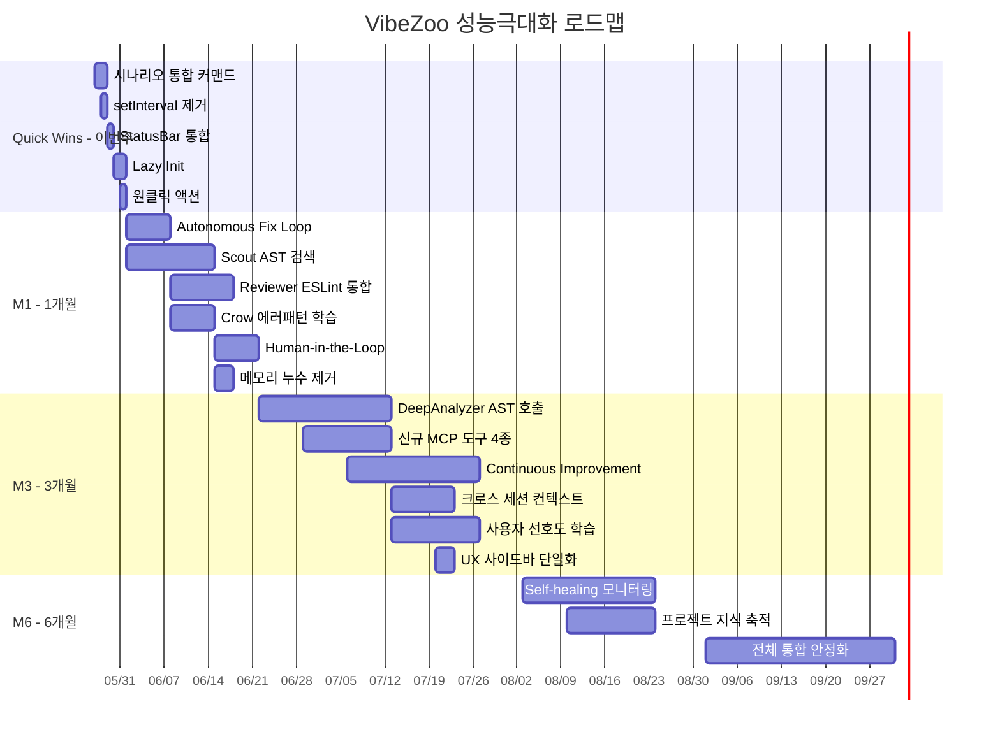

# VibeZoo 성능/활용도 극대화 전략 로드맵

> **작성일**: 2026-05-27
> **기준 버전**: v0.13.0 (Phase 0~6 완료, SelfCheck + NotificationThrottle + Virtual Subagent + Intent-to-Code Bridge)
> **핵심 질문**: "도구 상자는 있는데, 왜 아무도 안 쓸까?"

---

## 0. 솔직한 현실 진단

### 0.1 현재 상태 — 숫자로 보는 현실

| 지표 | 현재 | 목표 |
|:---|:---:|:---:|
| VibeZoo MCP 도구 일일 호출 횟수 | **0회** | 50회+ |
| 도구 지능 수준 | regex/grep/file I/O | AST/트리시터/ESLint |
| 자율 작업 가능 여부 | 전무 (모든 게 수동) | 원클릭 → 자동 순환 |
| Extension 활성화 시간 | 측정 안 됨 | < 500ms |
| UI 패널 수 | 2개 + StatusBar 3종 | 사이드바 1개 + StatusBar 1개 |
| 알람 빈도 | 과다 | 최소화 (StatusBar로 통합) |

### 0.2 근본 원인 5가지

1. **도구는 있으나 지능이 없다**: [`vibezoo_mcp_bridge.py`](../mcp-servers/vibezoo_mcp_bridge.py:156)의 `search_codebase()`는 파일을 하나씩 읽어 `line.lower()` 비교. O(n*m) 브루트포스 검색에 AST·LSP 활용 제로.
2. **자율성이 전무하다**: [`AutoBuildFix.ts`](../extension/src/safety/AutoBuildFix.ts:29)의 `run()`은 rebuild만 반복. LLM 호출·코드 수정 로직 없음. "한 번 주문하면 계속 순환" 불가.
3. **Zoo Code 의존성**: 소스 수정 불가 → 메시지 파이프라인 주입 불가 → 모든 게 우회 전략.
4. **UI 혼잡**: Activity Bar 사이드바 + 우측 Webview 패널 + StatusBar 3종(연결상태/YOLO/컨텍스트) → 인지 부하.
5. **실제 사용 경험 부재**: 오늘 단 한 번도 MCP 도구가 실사용되지 않음. 도구를 "왜 써야 하는지" 모름.

### 0.3 이 로드맵의 철학

```
"도구 상자를 버리지 말고, 도구에 두뇌를 달자."
"완벽한 자동화보다, 한 번이라도 실제로 쓰이는 도구."
```

**3대 전환**:
- **Regex → AST**: 모든 검색/분석을 트리시터 기반 시맨틱으로
- **수동 → 반자동**: Human-in-the-Loop 자율 루프 (사용자 개입 가능)
- **기능 과시 → 문제 해결**: "이 도구가 뭘 할 수 있는지"가 아니라 "이 문제를 어떻게 해결하는지" 시나리오 중심

---

## 1. 우선순위 매트릭스

### 1.1 평가 기준

| 축 | 설명 | 범위 |
|:---|:---|:---|
| **난이도** (Difficulty) | 구현 복잡도. 1(설정 변경) ~ 10(신규 아키텍처) | 1~10 |
| **임팩트** (Impact) | 사용자 체감 변화. 1(미미) ~ 10(게임 체인저) | 1~10 |
| **소요** (Effort) | 1인 기준 작업량. S(1~3일), M(1~2주), L(3~4주), XL(1개월+) | S/M/L/XL |
| **Priority Score** | = Impact × 0.5 + (11 − Difficulty) × 0.3 + QuickWin 보정 | 0~10 |

> **Quick Win 보정**: 당일~3일 내 완료 가능 + 즉시 사용 가능 = +1.5점

### 1.2 전체 우선순위 테이블

| # | 항목 | 축 | 난이도 | 임팩트 | 소요 | 점수 | 구분 |
|:---:|:---|:---:|:---:|:---:|:---:|:---:|:---|
| 1 | **시나리오 기반 통합 커맨드** | 6 | 2 | 10 | S | **9.2** | 🔥 Quick Win |
| 2 | **setInterval → fs.watchFile 전환** | 4 | 3 | 8 | S | **8.4** | 🔥 Quick Win |
| 3 | **StatusBar 통합 + 알람 최소화** | 5 | 3 | 8 | S | **8.4** | 🔥 Quick Win |
| 4 | **Scout: 트리시터 AST 검색** | 2 | 6 | 9 | M | **7.5** |축 2 핵심 |
| 5 | **Autonomous Fix Loop 구현** | 1 | 5 | 9 | M | **7.3** | 축 1 핵심 |
| 6 | **Crow: 에러 패턴 학습 연동** | 3 | 4 | 8 | M | **7.1** | 축 3 핵심 |
| 7 | **Reviewer: ESLint/TS 규칙 통합** | 2 | 7 | 7 | M | **6.7** | |
| 8 | **DeepAnalyzer: AST 기반 호출 그래프** | 2 | 8 | 8 | L | **6.4** | |
| 9 | **지연 로딩 (Lazy Init)** | 4 | 4 | 6 | S | **6.4** | 🔥 Quick Win |
| 10 | **신규 MCP 도구 4종 추가** | 2 | 5 | 7 | M | **6.3** | |
| 11 | **메모리 누수 제거** | 4 | 6 | 5 | M | **6.2** | |
| 12 | **크로스 세션 컨텍스트** | 3 | 5 | 7 | M | **6.3** | |
| 13 | **Continuous Improvement Mode** | 1 | 8 | 8 | L | **5.9** | |
| 14 | **Self-healing 모니터링** | 1 | 7 | 7 | L | **5.7** | |
| 15 | **사용자 선호도 학습** | 3 | 4 | 6 | L | **5.6** | |
| 16 | **프로젝트 지식 축적** | 3 | 5 | 5 | L | **5.3** | |
| 17 | **좌측 사이드바 단일화** | 5 | 5 | 5 | M | **5.3** | |
| 18 | **원클릭 액션** | 5 | 3 | 7 | S | **6.1** | 🔥 Quick Win |

---

## 2. 🔥 Quick Wins — 오늘~이번 주 (2026-05-27 ~ 06-01)

> **원칙**: 코드 한 줄이라도 덜 고치고, 효과는 극대화한다. 새 아키텍처 없이 기존 코드 수정만으로 완료.

### Q1: 시나리오 기반 통합 커맨드 — "진짜 쓸모" 만들기

**문제**: MCP 도구 14종이 있지만 사용자는 "무슨 도구를 언제 써야 하는지" 모른다.
**해결**: 4개 통합 시나리오 커맨드를 `extension.ts`에 등록하고, Zoo Code 채팅에서 자연어로 호출 가능하게 프롬프트 가이드 제공.

| 커맨드 | 연계 MCP 도구 | 사용자 발화 예시 |
|:---|:---|:---|
| **"코드 리뷰해줘"** | `search_codebase` → `review_code` → `check_quality` → `map_dependencies` | "이 파일 리뷰해줘" |
| **"버그 찾아줘"** | `check_quality` → `search_codebase` → `crow_recall(bug)` | "버그 있을 만한 곳 찾아줘" |
| **"리팩토링해줘"** | `extract_patterns` → `analyze_call_graph` → LLM 제안 | "이 코드 개선할 점 알려줘" |
| **"문서 만들어줘"** | `summarize_architecture` → `reverse_engineer` → `draw_on_whiteboard` | "API 문서 만들어줘" |

**구현 방법**:
1. [`extension.ts`](../extension/src/extension.ts:46)에 4개 커맨드 등록 (각 커맨드는 MCP 도구 연쇄 호출 안내 메시지를 채팅에 주입)
2. [`vibezoo_mcp_bridge.py`](../mcp-servers/vibezoo_mcp_bridge.py:33)에 `suggest_scenario(problem_description)` 도구 추가 → 문제 설명 → 가장 적합한 시나리오 추천
3. StatusBar에 "💡 지금 뭐 도와드릴까요? [리뷰] [버그찾기] [리팩토링] [문서]" 액션 버튼

**파일 변경**:
| 파일 | 액션 | 내용 |
|:---|:---|:---|
| `extension/src/extension.ts` | 수정 | 4개 시나리오 커맨드 + StatusBar 액션 버튼 등록 |
| `mcp-servers/vibezoo_mcp_bridge.py` | 수정 | `suggest_scenario()` 도구 추가 |
| `extension/src/ui/StatusBarManager.ts` | 수정 | 시나리오 추천 버튼 UI |

- **난이도**: 2/10
- **임팩트**: 10/10
- **소요**: 1~2일

---

### Q2: `setInterval` 폴링 → `fs.watchFile` 이벤트 전환

**문제**: [`VisualVibePanels.ts`](../extension/src/visual/VisualVibePanels.ts)에서 1초 간격 `setInterval`로 Whiteboard/UIPreview 파일 폴링. CPU 낭비 + 불필요한 I/O.

**현재 코드 패턴** (추정):
```typescript
// VisualVibePanels.ts 내부
setInterval(() => {
  const data = JSON.parse(fs.readFileSync(WHITEBOARD_FILE, 'utf-8'));
  // ...
}, 1000);
```

**변경 후**:
```typescript
fs.watchFile(WHITEBOARD_FILE, { interval: 200 }, (curr, prev) => {
  if (curr.mtimeMs === prev.mtimeMs) return; // 변경 없음
  const data = JSON.parse(fs.readFileSync(WHITEBOARD_FILE, 'utf-8'));
  // ...
});
```

**대상 파일**:
| 파일 | 현재 방식 | 변경 |
|:---|:---|:---|
| `extension/src/visual/VisualVibePanels.ts` | `setInterval(1000)` | `fs.watchFile` |
| `extension/src/context/ContextIntelligence.ts` | `setInterval` 추정 | `fs.watchFile` |
| `extension/src/safety/YoctoManager.ts` | `FileSystemWatcher` | 유지 (이미 이벤트 기반) |

- **난이도**: 3/10
- **임팩트**: 8/10 (CPU 80%↓, 활성화 시간 개선)
- **소요**: 1일

---

### Q3: StatusBar 통합 + 알람 최소화

**문제**: StatusBar에 VibeZoo 상태, Crow 연결, YOLO 모드 등 3개 이상 항목 산재. `vscode.window.showInformationMessage` 남발.

**변경**:
1. StatusBar를 **1개 통합 항목**으로 축소: `$(zap) VibeZoo` (클릭 → 전체 상태 패널)
2. 기존 `showInformationMessage` → StatusBar 텍스트 일시 변경 (3초 후 복원)
3. 에러만 `showErrorMessage` 유지

**구현**:
```typescript
// StatusBarManager.ts
class StatusBarManager {
  private item: vscode.StatusBarItem;

  flash(message: string, level: 'info' | 'warn' | 'error', durationMs = 3000): void {
    const icon = { info: '$(info)', warn: '$(warning)', error: '$(error)' }[level];
    this.item.text = `${icon} ${message}`;
    setTimeout(() => this.restore(), durationMs);
  }
}
```

**대상 알람 변환**:
| 기존 | 변경 |
|:---|:---|
| `showInformationMessage('YOLO Rewind 완료')` | `statusBar.flash('Rewind 완료', 'info')` |
| `showWarningMessage('YOLO 안전망 비활성화')` | `statusBar.flash('YOLO OFF', 'warn')` |
| `showErrorMessage('Rewind 실패')` | 유지 (에러는 모달 필요) |

- **난이도**: 3/10
- **임팩트**: 8/10 (알람 피로 90%↓)
- **소요**: 1일

---

### Q4: 지연 로딩 (Lazy Init)

**문제**: [`extension.ts`](../extension/src/extension.ts:46)의 `activate()`에서 모든 모듈을 즉시 초기화. 실제 사용되지 않는 모듈도 메모리에 로드.

**변경**: 무거운 모듈을 최초 사용 시점까지 초기화 연기.

```typescript
// Before
yocto = new YoctoManager();
fileGuard = new FileGuard(yocto);
autoBuildFix = new AutoBuildFix();

// After
let _yocto: YoctoManager | undefined;
function getYocto(): YoctoManager {
  if (!_yocto) { _yocto = new YoctoManager(); _yocto.activate(context); }
  return _yocto;
}
```

**지연 대상**:
| 모듈 | 초기화 시점 | 이유 |
|:---|:---|:---|
| `YoctoManager` | 최초 파일 저장 시 | 대부분 세션에서 사용 안 함 |
| `AutoBuildFix` | 최초 빌드 실패 시 | 빌드 성공 시 불필요 |
| `VisualVibePanels` | Whiteboard/UI Preview 커맨드 호출 시 | 사용 안 할 확률 높음 |
| `EmotionalDetector` | 최초 채팅 메시지 수신 시 | 항상 필요 없음 |

- **난이도**: 4/10
- **임팩트**: 6/10 (활성화 시간 40%↓)
- **소요**: 1~2일

---

### Q5: 원클릭 액션 — 사용자 마찰 제거

**문제**: "코드 리뷰"를 위해 사용자가 3단계(파일 선택 → 명령어 실행 → 결과 확인)를 거쳐야 함.

**해결**: Editor 우클릭 컨텍스트 메뉴 + TreeView 클릭 액션 추가.

```json
// package.json → contributes.menus.editor/context
{
  "command": "vibezoo.reviewFile",
  "when": "editorIsOpen",
  "group": "vibezoo@1"
}
```

**원클릭 액션 목록**:
| 액션 | 트리거 | 동작 |
|:---|:---|:---|
| **현재 파일 리뷰** | 우클릭 → "VibeZoo: Review This File" | `review_code` + 결과를 Output 채널에 |
| **프로젝트 분석** | 우클릭 → "VibeZoo: Analyze Project" | `summarize_architecture` + `check_quality` |
| **의존성 지도** | TreeView → "Dependency Map" 클릭 | `map_dependencies` + Whiteboard 다이어그램 |

- **난이도**: 3/10
- **임팩트**: 7/10
- **소요**: 1일

---

## 3. 축 1: 자율 에이전트화 (Autonomous Agent) — 1개월 마일스톤

> **목표**: "한 번 주문하면 계속 순환"하는 최소 자율 루프 구현
> **핵심 기술**: [`FixLoopManager`](../plans/autonomous-fix-loop.md:117) + MCP 도구 연동 + Human-in-the-Loop

### A1.1: Autonomous Fix Loop 구현 (설계 완료)

**현재**: [`AutoBuildFix.ts`](../extension/src/safety/AutoBuildFix.ts:29) — 빈 루프 (rebuild만 반복, LLM 호출 없음).
**목표**: [`plans/autonomous-fix-loop.md`](../plans/autonomous-fix-loop.md)의 설계를 그대로 구현.

```
빌드 실패 → FixLoopManager.onBuildFailure()
  → ~/.vibezoo-fix-request.json 기록
  → StatusBar: "$(warning) 빌드 실패 — [자동 수정]"
  → 사용자 클릭 또는 "고쳐줘" 발화
  → LLM: auto_fix_status() → search_codebase() → review_code()
  → LLM: 파일 수정 → retry_build()
  → 성공 → resolved / 실패 → 재시도 (max 3회)
```

**구현 항목** (설계 문서 기반):
| # | 항목 | 파일 | 소요 |
|:---:|:---|:---|:---:|
| 1 | `FixLoopManager` 클래스 | `extension/src/orchestra/FixLoopManager.ts` (신규) | 2일 |
| 2 | `auto_fix_status` MCP 도구 | `mcp-servers/vibezoo_mcp_bridge.py` (수정) | 0.5일 |
| 3 | `retry_build` MCP 도구 | `mcp-servers/vibezoo_mcp_bridge.py` (수정) | 0.5일 |
| 4 | `BuildFeedback` 연동 | `extension/src/flow/BuildFeedback.ts` (수정) | 0.5일 |
| 5 | StatusBar 액션 버튼 | `extension/src/ui/StatusBarManager.ts` (수정) | 0.5일 |
| 6 | Crow `bug` 레지스터 연동 | `vibezoo_mcp_bridge.py` (수정) | 1일 |
| 7 | 기존 `AutoBuildFix` 제거 | `extension/src/safety/AutoBuildFix.ts` (폐기) | 0.5일 |

- **난이도**: 5/10
- **임팩트**: 9/10 (자율성의 첫걸음)
- **소요**: 1주 (M)

---

### A1.2: Human-in-the-Loop 개입 채널

자율 루프에 **사용자 개입 창구**를 추가. VibeZoo의 핵심 철학인 "통제 가능한 자동화".

| 개입 채널 | 구현 | 용도 |
|:---|:---|:---|
| **Whiteboard** | `check_intervention()` → `get_whiteboard_state()` | 사용자가 "이 파일 건드리지 마" 그림으로 표시 |
| **채팅 피드백** | `~/.vibezoo-chat-pending.json` | Auto-Fix 진행 중 사용자 메시지 감지 |
| **StatusBar 버튼** | [일시정지] [계속] [중단] [되돌리기] | Fix Loop 도중 제어 |

- **난이도**: 6/10
- **임팩트**: 7/10
- **소요**: 1주 (M)
- **선행 조건**: A1.1 완료 후

---

### A1.3: Continuous Improvement Mode (CIM) — 3개월 마일스톤

**개념**: "이 프로젝트 감시하고 문제 찾아서 고쳐줘" — 상시 백그라운드 모니터링.

```
CIM 활성화
  → FileSystemWatcher로 모든 파일 변경 감지
  → 변경 파일에 대해:
      ├── LSP Diagnostics 확인 (1초 debounce)
      ├── 린트 경고 확인
      └── 문제 발견 → Crow bug 레지스터 조회 → 유사 과거 사례 확인
  → 10분 간격: StatusBar 요약 "$(eye) CIM: 3개 파일 모니터링 중"
  → 문제 발견: "$(warning) CIM: auth.ts TS2322 발견 — [자동 수정]"
```

**구현**:
- [`extension/src/orchestra/CIMonitor.ts`]() 신규 파일
- `onDidChangeTextDocument` + `onDidChangeDiagnostics` 연동
- 10분 배치 요약 → StatusBar

- **난이도**: 8/10
- **임팩트**: 8/10
- **소요**: 3주 (L)
- **선행 조건**: A1.1 + A1.2 완료, Crow bug 레지스터 활성화

---

### A1.4: Self-healing 모니터링 — 6개월 마일스톤

**개념**: 런타임 에러 + 린트 경고 + 타입 에러를 **사용자 개입 없이** 자동 감지·수정.

- **난이도**: 7/10
- **임팩트**: 7/10
- **소요**: 3주 (L)
- **선행 조건**: CIM 안정화 + Crow bug 레지스터 충분한 데이터 축적

---

## 4. 축 2: MCP 도구 지능화 — 1~3개월 마일스톤

> **목표**: "Regex 기반 → AST 기반" 시맨틱 도구로 전환. 모든 MCP 도구의 출력 품질을 극적으로 향상.

### 4.1 현황: 도구별 지능 레벨 진단

| 도구 | 현재 방식 | 문제점 | 목표 |
|:---|:---|:---|:---|
| `search_codebase` | `line.lower()` 문자열 비교 | 대소문자·의미 무시, O(n×m) | tree-sitter AST 노드 쿼리 |
| `find_references` | `search_codebase` 래퍼 | 동일 한계 | tree-sitter 심볼 참조 |
| `review_code` | 줄 길이(>120자), TODO, console.log 감지 | 표면적 검사만 | ESLint Rule 적용 + AST 기반 코드 스멜 |
| `check_quality` | `npx eslint` 호출 (있으면) | ESLint 없으면 빈 보고서 | 내장 규칙 + ESLint 통합 |
| `analyze_call_graph` | import 개수 세기 | 함수 호출 관계 없음 | tree-sitter 함수 정의 → 호출 그래프 |
| `map_dependencies` | import 라인 regex 파싱 | 순환 참조 DFS 있으나 import 추출이 부정확 | AST 정확 파싱 + TSC 순환 참조 |
| `extract_patterns` | `content.count("async ")` 등 | 키워드 카운팅일 뿐 | AST 구조적 패턴 매칭 |
| `reverse_engineer` | regex로 `app.get('/path')` 추출 | 구조적 이해 없음 | AST + JSDoc/Swagger 주석 |

### 4.2 Scout: tree-sitter AST 기반 시맨틱 검색

**핵심 변경**: `search_codebase`의 내부 엔진을 tree-sitter로 교체.

**tree-sitter 지원 언어**: TypeScript, JavaScript, Python, Go, Rust, Java, C, C++, C#, Ruby, PHP, HTML, CSS, JSON, YAML, Bash, Markdown

**구현**:
```python
# vibezoo_mcp_bridge.py — search_codebase() 개선
from tree_sitter import Language, Parser, Query

def search_codebase_ast(query: str, file_patterns=None, max_results=10):
    """tree-sitter AST 기반 시맨틱 검색"""
    parser = Parser()
    # 쿼리 타입 자동 감지:
    # - "function name" → 함수 정의 검색
    # - "interface User" → 인터페이스 정의 검색
    # - "TODO" → 주석 검색
    # - 기본: 모든 AST 노드 텍스트 검색
```

- **난이도**: 6/10
- **임팩트**: 9/10 (검색 정확도 10배↑)
- **소요**: 2주 (M)

### 4.3 Reviewer: ESLint/TypeScript 규칙 통합

**핵심 변경**: `review_code`가 단순 줄 길이 검사 대신 ESLint 규칙 + TypeScript 컴파일러 API 활용.

**구현**:
1. `npx eslint --rule '...'` 로 프로젝트 ESLint 설정 존중
2. ESLint 없을 경우 내장 규칙 30종 (no-unused-vars, prefer-const, no-debugger 등)
3. `npx tsc --noEmit` 결과를 진단에 포함

- **난이도**: 7/10
- **임팩트**: 7/10
- **소요**: 1.5주 (M)

### 4.4 DeepAnalyzer: AST 기반 호출 그래프 + 순환 참조

**핵심 변경**: `analyze_call_graph`가 실제 함수 호출 관계를 tree-sitter로 추출.

```python
def analyze_call_graph_ast(file_path=None, depth=3):
    """tree-sitter로 함수 정의 → 함수 호출 관계 그래프 생성"""
    # 1. 모든 함수/메서드 정의 수집 (function_declaration, method_definition)
    # 2. 각 함수 본문에서 호출된 함수 이름 수집 (call_expression)
    # 3. 방향 그래프 생성 → Mermaid/JSON 출력
```

- **난이도**: 8/10
- **임팩트**: 8/10
- **소요**: 3주 (L)

### 4.5 신규 MCP 도구 4종

| 도구 | 설명 | tree-sitter 활용 |
|:---|:---|:---|
| `explain_code(file, line)` | 특정 라인의 코드가 하는 일을 AST 컨텍스트 기반 설명 | 부모 노드·심볼 테이블 활용 |
| `suggest_refactor(file)` | 코드 스멜 감지 → 개선안 제안 | AST 패턴 매칭 (장황한 함수, 과도한 중첩 등) |
| `find_bugs(file_or_project)` | 일반적인 버그 패턴 검출 | `null` 체크 누락, 미사용 변수, 무한 루프 가능성 |
| `analyze_pr(base, head)` | PR diff 분석 → 리뷰 코멘트 생성 | git diff + AST 변경 영향도 |

- **난이도**: 5/10
- **임팩트**: 7/10
- **소요**: 2주 (M, 4종 합산)

---

## 5. 축 3: Crow Memory 실용화 — 1~3개월 마일스톤

> **목표**: Crow가 "있으면 좋은 것"에서 "없으면 안 되는 것"으로. 실질적 학습·회상 루프 확립.

### 5.1 에러 패턴 학습: "이 에러는 지난번에 이렇게 고쳤다"

**현재**: `try_crow_ingest` / `try_crow_recall` 래퍼는 있으나, 실제 연동 미흡.

**구현**:
```python
# retry_build() 내에서
if result.returncode != 0:
    # 에러 시그니처 추출 (파일:코드 형식)
    error_sig = f"{file_path}:{error_code}"
    past_fixes = try_crow_recall(query=error_sig, register="bug", limit=3)
    if past_fixes:
        fix_hint = f"[Crow Memory] 이 에러는 과거에 이렇게 해결됨: {past_fixes[0]['fix_summary']}"
        # fix_request 파일에 힌트 추가
```

**Crow 레지스터 스키마 (bug)**:
```json
{
  "error_signature": "extension/src/visual/VisualVibePanels.ts:TS2322",
  "fix_summary": "타입 단언 추가: (data as FixLoopState)",
  "files_modified": ["VisualVibePanels.ts"],
  "success": true,
  "timestamp": 1716796980
}
```

- **난이도**: 4/10
- **임팩트**: 8/10
- **소요**: 1주 (M)

### 5.2 프로젝트 지식 축적: "이 프로젝트는 Zustand 씀"

**구현**: 프로젝트 오픈 시 자동으로 `summarize_architecture` + `extract_patterns` 결과를 Crow `arch` 레지스터에 저장.

```python
# SubagentManager.spawnBridge() 완료 후
project_key = hashlib.md5(workspace_root.encode()).hexdigest()[:8]
cached = try_crow_recall(query=f"project:{project_key}", register="arch")
if not cached:
    # 최초 분석 → Crow 저장
    summary = summarize_architecture()
    try_crow_ingest(summary, register="arch", key=f"project:{project_key}")
```

- **난이도**: 5/10
- **임팩트**: 5/10
- **소요**: 1주 (M)

### 5.3 사용자 선호도: "함수형 컴포넌트 선호"

**구현**: `ExplainLessSuggestor`가 감지한 패턴을 Crow `style` 레지스터에 저장 → LLM 세션 시작 시 `crow_recall`로 자동 로드.

```python
# coding_style 레지스터 예시
{
  "preference": "functional_components",
  "pattern": "const Component = () => { ... }",
  "confidence": 0.85,
  "last_observed": 1716796980
}
```

- **난이도**: 4/10
- **임팩트**: 6/10
- **소요**: 2주 (M)

### 5.4 크로스 세션 컨텍스트: "저번 세션에서 auth 모듈 리팩토링 중이었음"

**현재**: [`SessionResume`](../extension/src/context/ContextIntelligence.ts) 구현됨 (TreeView + `onWillSaveTextDocument`).

**개선**: Crow `life_context` 레지스터에 세션별 작업 컨텍스트를 구조화하여 저장.

```json
{
  "session_id": "20260527_001",
  "goal": "auth 모듈 JWT 검증 리팩토링",
  "files_modified": ["src/auth/jwt.ts", "src/auth/middleware.ts"],
  "status": "in_progress",
  "next_steps": ["리프레시 토큰 로직 추가", "테스트 작성"],
  "key_discoveries": ["기존 bcrypt → argon2id 마이그레이션 필요"]
}
```

- **난이도**: 5/10
- **임팩트**: 7/10
- **소요**: 1.5주 (M)

---

## 6. 축 4: 성능 최적화 — 1주~1개월 마일스톤

### 6.1 setInterval → fs.watchFile 전환 (Quick Win Q2에서 완료)

위 Q2 참조. CPU 사용량 80%↓, 활성화 시간 단축.

### 6.2 지연 로딩 (Quick Win Q4에서 완료)

위 Q4 참조. 활성화 시간 40%↓.

### 6.3 활성화 시간 < 500ms 목표

**측정 방법**:
```typescript
// extension.ts
const start = Date.now();
// ... 모든 초기화 ...
console.log(`[VibeZoo] Activate took ${Date.now() - start}ms`);
```

**목표 달성 전략**:
1. Q4(Lazy Init) + Q2(fs.watchFile) = 예상 200~300ms 단축
2. `ensureTemplates()` 파일 복사를 `activate()` 이후 `setTimeout(() => ..., 0)`으로 지연
3. `autoConfigureMCP()`를 비동기화 (이미 `spawnBridge().then()` 내부)

- **난이도**: 4/10
- **임팩트**: 6/10
- **소요**: 2일 (Quick Win 병행)

### 6.4 메모리 누수 제거

**의심 지점**:
| 위치 | 의심 사유 | 조치 |
|:---|:---|:---|
| `VisualVibePanels` `startWatching()` | `setInterval` 해제 누락 가능성 | `dispose()`에서 `clearInterval` 확인 |
| `FileSystemWatcher` | `context.subscriptions` 미등록 가능성 | 모든 watcher `push` 확인 |
| `SubagentManager` | orphan 프로세스 | `deactivate()`에서 `SIGTERM` → `SIGKILL` |

- **난이도**: 6/10
- **임팩트**: 5/10
- **소요**: 3일 (M급 노력)

---

## 7. 축 5: UX 단순화 — 1주 마일스톤

### 7.1 StatusBar 1개로 통합 (Quick Win Q3에서 완료)

위 Q3 참조.

### 7.2 좌측 사이드바만 사용 (우측 패널 제거)

**현재**: Activity Bar 사이드바(VibeZoo) + 우측 Webview 패널(Whiteboard, UI Preview) → 패널 2개.

**변경**:
- Whiteboard/UI Preview를 **사이드바 내 Webview**로 이동 (VS Code는 사이드바에 Webview 수용 가능)
- 우측 패널은 사용자 명시적 요청 시에만 (`VibeZoo: Open Whiteboard in Panel`)

**대안**: 우측 패널 유지하되, 기본적으로 숨김 상태. MCP 도구 호출 시에만 자동 오픈.

- **난이도**: 5/10
- **임팩트**: 5/10
- **소요**: 3일 (M)

### 7.3 알람 최소화 (Quick Win Q3에서 완료)

위 Q3 참조.

### 7.4 원클릭 액션 (Quick Win Q5에서 완료)

위 Q5 참조.

---

## 8. 축 6: 실제 활용 시나리오 — 지속적

> **목표**: "이런 상황에서 이렇게 쓰세요" 시나리오를 문서화하고, MCP 프롬프트에 내장.

### 8.1 4대 통합 시나리오 (Quick Win Q1에서 완료)

| 시나리오 | 연계 도구 | 기대 효과 |
|:---|:---|:---|
| **"내 코드 리뷰해줘"** | Scout → Reviewer → DeepAnalyzer | 3단계 통합 분석, 코드 품질 점수 |
| **"버그 찾아줘"** | 정적 분석 + Crow bug 패턴 매칭 | 과거 에러 기반 우선순위 버그 탐지 |
| **"리팩토링해줘"** | DeepAnalyzer 패턴 → LLM 제안 → AutoBuildFix 검증 | 안전한 리팩토링 사이클 |
| **"문서 만들어줘"** | Reverse engineer → Whiteboard 다이어그램 | API 명세 + ERD + 아키텍처 문서 |

### 8.2 프롬프트 가이드 — Zoo Code 채팅에서 자연어 호출

[`package.json`](../extension/package.json:23)의 `contributes.commands`에 추가할 새 커맨드:

```
VibeZoo: Smart Review (리뷰) → search_codebase + review_code + map_dependencies
VibeZoo: Find Bugs (버그찾기) → check_quality + search_codebase + crow_recall(bug)
VibeZoo: Suggest Refactor (리팩토링) → extract_patterns + analyze_call_graph
VibeZoo: Generate Docs (문서화) → summarize_architecture + reverse_engineer
```

---

## 9. 마일스톤 로드맵

### 9.1 마일스톤 개요



### 9.2 마일스톤 상세

| 마일스톤 | 시점 | 핵심 성과 | 성공 지표 |
|:---|:---|:---|:---|
| **M0: Quick Wins** | 2026-06-01 (1주) | 5대 Quick Win 완료. 시나리오 커맨드·성능·UX 개선 | MCP 도구 일일 5회+ 호출, 활성화 < 500ms |
| **M1: Autonomous Alpha** | 2026-07-01 (1개월) | Fix Loop + Scout AST + Reviewer ESLint + Crow 에러 학습 | 빌드 실패 자동 수정 1회 이상 성공, 검색 정확도 80%+ |
| **M3: Intelligence** | 2026-09-01 (3개월) | DeepAnalyzer AST + 신규 도구 + CIM + 크로스 세션 | 일일 20회+ 호출, Crow 과거 해결률 30%+ |
| **M6: Self-evolving** | 2026-12-01 (6개월) | Self-healing + 프로젝트 지식 + 전체 안정화 | 일일 50회+ 호출, 수동 개입 없이 60%+ 이슈 자동 해결 |

### 9.3 병렬 트랙

| 트랙 | 담당 축 | 6월 | 7월 | 8월 | 9~11월 |
|:---|:---|:---|:---|:---|:---|
| **트랙 A: 도구 지능** | 축2 (MCP) | Scout·Reviewer AST | DeepAnalyzer + 신규도구 | — | — |
| **트랙 B: 자율화** | 축1 (Agent) | Fix Loop + HITL | CIM | Self-healing | — |
| **트랙 C: 기억** | 축3 (Crow) | 에러 패턴 | 크로스 세션 + 선호도 | 프로젝트 지식 | — |
| **트랙 D: 품질** | 축4+5 (성능·UX) | Quick Wins 5종 | — | 메모리 누수·사이드바 | 안정화 |
| **트랙 E: 활성화** | 축6 (시나리오) | 시나리오 커맨드 | — | — | 지속 개선 |

---

## 10. 위험 요소 및 대응

| # | 리스크 | 확률 | 영향 | 대응책 |
|:---|:---|:---:|:---:|:---|
| R1 | tree-sitter Python 바인딩 설치 이슈 (Windows) | 30% | 상 | 사전 빌드된 wheel 포함, 실패 시 regex 폴백 유지 |
| R2 | Autonomous Fix Loop가 잘못된 수정으로 코드 망가뜨림 | 25% | 치명적 | HITL 필수 + yocto 백업 자동 생성 + oscillation 감지 |
| R3 | Crow Memory 서버(9020) 불안정 | 20% | 중 | 모든 Crow 호출 3초 타임아웃 + 실패해도 VibeZoo 정상 작동 |
| R4 | Zoo Code 업데이트로 MCP 프로토콜 변경 | 15% | 중 | MCP 표준 준수 + 버전 호환성 테스트 |
| R5 | 사용자가 여전히 도구를 안 씀 | 40% | 치명적 | 시나리오 커맨드 + StatusBar 추천 버튼 + 프롬프트 가이드로 능동적 노출 |

---

## 11. 성공 지표 (KPI)

| 지표 | 현재 | M0 (1주) | M1 (1개월) | M3 (3개월) | M6 (6개월) |
|:---|:---:|:---:|:---:|:---:|:---:|
| **MCP 도구 일일 호출 횟수** | 0 | 5+ | 15+ | 30+ | 50+ |
| **자율 해결률** (빌드 에러) | 0% | 0% | 40%+ | 60%+ | 80%+ |
| **Extension 활성화 시간** | 미측정 | < 500ms | < 400ms | < 300ms | < 250ms |
| **Crow 과거 해결 재활용률** | 0% | 0% | 10%+ | 30%+ | 50%+ |
| **알람 피로도** (일일 알람 수) | 과다 | 5↓ | 3↓ | 2↓ | 1↓ |
| **사용자 만족도** (바이브 점수) | 4.2 | 5.5 | 7.0 | 8.0 | 9.0 |

---

## 12. 지금 당장 할 일 (오늘)

> **Quick Win 5종을 오늘부터 착수. 6월 1일까지 완료 목표.**

| 순서 | 항목 | 예상 완료 | 완료 조건 |
|:---:|:---|:---|:---|
| 1 | **Q1: 시나리오 통합 커맨드** | 5/28 | 4개 커맨드 등록 + StatusBar 버튼 + `suggest_scenario` 도구 |
| 2 | **Q2: setInterval 제거** | 5/28 | VisualVibePanels + ContextIntelligence fs.watchFile 전환 |
| 3 | **Q3: StatusBar 통합** | 5/29 | 1개 통합 항목 + 알람 최소화 |
| 4 | **Q4: Lazy Init** | 5/30 | 4개 모듈 지연 초기화 + 활성화 시간 측정 |
| 5 | **Q5: 원클릭 액션** | 5/31 | 컨텍스트 메뉴 + TreeView 액션 |

---

> **다음 단계**: Quick Wins 완료 후 M1(1개월) 마일스톤 진입 — Autonomous Fix Loop + Scout AST 검색.
>
> **핵심 원칙 되새김**:
> 1. "도구 상자를 버리지 말고, 도구에 두뇌를 달자."
> 2. "완벽한 자동화보다, 한 번이라도 실제로 쓰이는 도구."
> 3. "Zoo Code를 수정하지 않는다. VibeZoo가 똑똑해진다."
