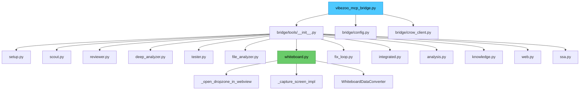

# VibeZoo MCP 브릿지 통합 설계 문서

> **버전**: 1.0  
> **작성일**: 2026-06-01  
> **대상**: `vibezoo_mcp_bridge.py` (v1) + `vibezoo_mcp_bridge_v2.py` (v2) → 단일 통합 브릿지

---

## 1. 현황 분석

### 1.1 파일 구조 비교

| 항목 | v1 (`vibezoo_mcp_bridge.py`) | v2 (`vibezoo_mcp_bridge_v2.py`) |
|------|------------------------------|----------------------------------|
| 총 라인 수 | 131줄 | 4049줄 |
| 아키텍처 패턴 | Thin entry point + 모듈화 패키지 | 단일 파일 Monolith |
| 도구 등록 방식 | `bridge/tools/__init__.py` → `register_all_tools(mcp)` | `@mcp.tool` 데코레이터 직접 |
| 유틸리티 | `bridge/utils.py` (모듈화) | 파일 인라인 (중복) |
| 상수 | `bridge/config.py` (중앙 관리) | 파일 인라인 (중복) |
| 도구 모듈 수 | 13개 (`bridge/tools/*.py`) | 1개 (모놀리식) |
| `open_dropzone` 도구 | ❌ 없음 | ✅ 있음 (line 4006, 등록 실패) |
| `open_image_dropzone` 도구 | ❌ 없음 | ✅ 있음 (line 3980, 등록 실패) |
| Tree-sitter 초기화 | ❌ 없음 (regex only) | ✅ 있음 |
| 서버 실행 상태 | ✅ 정상 동작 | ⚠️ 실행은 되지만 도구 목록 비어있음 |

### 1.2 v2 실패 원인 분석

v2 브릿지의 근본 문제는 **모놀리식 구조의 Python 모듈 로딩 실패**로 추정됩니다.

```
FastMCP 도구 등록 실패 메커니즘:

1. `mcp = FastMCP(name="vibezoo")` (line 55)
2. 4000줄에 걸친 유틸리티, 상수, 도구 구현...
3. 각 `@mcp.tool` 데코레이터가 함수를 mcp 인스턴스에 등록
4. `mcp.run(transport="sse", ...)` (line 4048, `if __name__ == "__main__":` 내부)

문제: Python 모듈이 import 될 때 1~3 단계가 실행되지만,
4049줄의 대규모 파일에서 발생하는 잠재적 문제:
  - module-level 예외(ImportError, SyntaxError 등)가 일부 @mcp.tool 데코레이터
    평가를 방해할 수 있음
  - 전역 상태 초기화 순서 문제
  - 트리-시터 초기화 중 예외가 후속 도구 등록을 방해할 가능성

실제 증상:
  - `/health`  엔드포인트는 정상 응답 (custom_route는 정상)
  - `/sse` 연결 성공
  - 하지만 도구 목록(tools/list)이 비어있거나 `open_dropzone` 누락
  - "Invalid request parameters" 오류 발생 (FastMCP가 도구를 인식하지 못함)
```

### 1.3 v1이 동작하는 이유

```python
# v1 — 모듈화된 접근법
from bridge.tools import register_all_tools

mcp = FastMCP(name="vibezoo")
register_all_tools(mcp)  # 각 모듈의 register(mcp) 호출
```

- 각 도구 모듈이 독립적으로 임포트되므로 한 모듈의 실패가 다른 모듈에 영향 없음
- 131줄의 진입점이므로 모듈 로딩이 빠르고 예측 가능
- `bridge/tools/__init__.py`에서 지연 임포트로 순환 참조 방지

---

## 2. 통합 설계

### 2.1 핵심 원칙

1. **v1 구조를 기반으로 유지** — 이미 검증된 모듈형 아키텍처
2. **v2의 누락된 기능만 이식** — 새로운 기능 추가, 중복 제거
3. **방어적 등록** — 각 모듈의 `register()` 함수가 독립적으로 실패해도 서버 전체가 죽지 않음
4. **`mcp_settings.json` 호환성 유지** — 기존 설정 변경 없음

### 2.2 대상 아키텍처



### 2.3 변경 파일 목록

| 파일 | 변경 유형 | 설명 |
|------|-----------|------|
| `mcp-servers/vibezoo_mcp_bridge.py` | **수정** | v1 진입점 유지, 버전 업데이트, list_subagents 갱신 |
| `mcp-servers/bridge/config.py` | **수정** | `DZ_ACTION_FILE` 상수 추가 |
| `mcp-servers/bridge/tools/whiteboard.py` | **수정** | `open_dropzone`, `open_image_dropzone` 도구 등록 추가 |
| `mcp-servers/vibezoo_mcp_bridge_v2.py` | **보관** | 파일명 변경 또는 삭제 (참고용 백업) |

---

## 3. 상세 변경 사항

### 3.1 `bridge/config.py` — 상수 추가

```python
# 추가할 상수
DZ_ACTION_FILE = str(HOME_DIR / ".vibezoo-dropzone-action.json")
```

`WHITEBOARD_ACTION_FILE`과 유사하게 Extension이 감시하는 액션 파일입니다. 현재 `bridge/config.py`에는 없으므로 추가가 필요합니다.

### 3.2 `bridge/tools/whiteboard.py` — `open_dropzone` / `open_image_dropzone` 등록

현재 [`whiteboard.py`](mcp-servers/bridge/tools/whiteboard.py:855)의 `register()` 함수는 3개의 도구만 등록합니다:
- `capture_screen` (line 861)
- `draw_on_whiteboard` (line 877)
- `get_whiteboard_state` (line 914)

`register()` 함수 내부에 다음 2개 도구를 **추가**해야 합니다:

#### 3.2.1 `open_dropzone(message: str = "") -> str`

v2의 4006행 구현을 모듈화된 형태로 이식:

```python
@mcp.tool
def open_dropzone(message: str = "") -> str:
    """VibeZoo 드랍존을 엽니다. AI가 파일 업로드/분석이 필요할 때 호출합니다.
    
    동작 방식:
    1. VS Code Extension이 설치된 경우 → Webview 패널이 열립니다
    2. 일반 VS Code / 브라우저 환경 → 브라우저 기반 드롭존이 열립니다
    3. 업로드된 파일은 ~/.vibezoo-cache/에 저장됩니다
    """
    try:
        data = {"action": "open", "message": message, "timestamp": time.time()}
        _atomic_write_json(DZ_ACTION_FILE, data, indent=2)
        try_crow_ingest(
            f"Dropzone opened: {message[:100]}" if message else "Dropzone opened",
            register="context"
        )
        return (_markdown_header("Drop Zone", "📸")
                + f"Drop zone opened. {message}\n"
                + _markdown_footer())
    except Exception as e:
        return (_markdown_header("Drop Zone Error", "❌")
                + f"**Failed:** `{e}`\n"
                + _markdown_footer())
```

#### 3.2.2 `open_image_dropzone() -> str`

v2의 3980행 구현을 이식:

```python
@mcp.tool
def open_image_dropzone() -> str:
    """VS Code Webview에서 이미지 드래그앤드롭 업로드 드롭존을 엽니다.
    업로드된 이미지는 ~/.vibezoo-cache/dropped_image.png에 저장됩니다.
    이후 aggregate_spatial_pixels()로 분석할 수 있습니다.
    """
    try:
        data = {"action": "open", "message": "Image drop zone opened", "timestamp": time.time()}
        _atomic_write_json(DZ_ACTION_FILE, data, indent=2)
        try_crow_ingest("Image drop zone opened", register="context")
        return (_markdown_header("Image Drop Zone", "📸")
                + "Drop zone opened in VS Code Webview.\n\n"
                + "1. Drag & drop an image into the Webview\n"
                + "2. File will be saved to `~/.vibezoo-cache/dropped_image.png`\n"
                + "3. Then call `aggregate_spatial_pixels(image_path='...')` to analyze\n\n"
                + _markdown_footer())
    except Exception as e:
        return (_markdown_header("Drop Zone Error", "❌")
                + f"**Failed to open drop zone**: {e}\n"
                + _markdown_footer())
```

#### 필요 import 추가

[`whiteboard.py`](mcp-servers/bridge/tools/whiteboard.py:15)의 config import에 `DZ_ACTION_FILE` 추가:

```python
from bridge.config import (
    WHITEBOARD_FILE, WHITEBOARD_ACTION_FILE, UI_ACTION_FILE,
    UPLOADED_IMAGE_PATH, IMAGE_CACHE_DIR,
    DZ_ACTION_FILE,  # ← 추가
)
```

> **참고**: `_open_dropzone_in_webview()` (line 815) 내부 구현은 이미 존재하므로 재사용합니다.  
> `open_dropzone`과 `open_image_dropzone`은 이 함수와는 별개로 Extension에 action 파일을 통해 신호를 보내는 도구입니다.

### 3.3 `vibezoo_mcp_bridge.py` — 진입점 갱신

#### 3.3.1 `list_subagents` 응답 업데이트

현재 v1의 [`list_subagents`](mcp-servers/vibezoo_mcp_bridge.py:30) 응답에서 Whiteboard 에이전트의 tools 목록을 확장:

```python
# 변경 전 (v1 line 39)
{"name": "Whiteboard", "status": "ready", "tools": ["draw_on_whiteboard", "get_whiteboard_state", "capture_screen"]},

# 변경 후
{"name": "Whiteboard", "status": "ready", "tools": [
    "draw_on_whiteboard", "get_whiteboard_state", "capture_screen",
    "open_dropzone", "open_image_dropzone"
]},
```

#### 3.3.2 `/health` 응답에 Tree-sitter 상태 추가 (선택적)

현재 v1의 health check는 Crow 연결 상태만 반환합니다. v2처럼 Tree-sitter 상태를 포함하는 것이 진단에 유용하지만, 이는 필수 사항은 아닙니다.

```python
# 선택적 개선: health 응답에 tree_sitter 정보 추가
@mcp.custom_route("/health", methods=["GET"])
async def health_check(request: Request) -> JSONResponse:
    crow_ok = crow_health_check()
    return JSONResponse({
        "status": "ok",
        "crow": crow_ok,
        "timestamp": time.time(),
        "version": VERSION,
    })
```

Tree-sitter 초기화는 각 도구 모듈(`scout.py`, `deep_analyzer.py` 등)에서 `ast_engine.py`를 통해 필요 시점에 지연 초기화하므로, health check에서 별도로 관리할 필요는 없습니다.

#### 3.3.3 버전 번호

v1 현재 버전: `0.13.0` (config.py 기준) → 통합 후 `0.14.0`으로 버전업

---

## 4. 중복 코드 제거 방안

### 4.1 현재 중복 현황

v2 파일(4049줄)의 대부분은 `bridge/utils.py`, `bridge/config.py`, `bridge/tools/*.py` 에 이미 존재하는 코드의 복사본입니다:

| v2 섹션 | 중복된 모듈 | 라인 추정 |
|----------|-------------|-----------|
| 유틸리티 함수 (line 58~230) | `bridge/utils.py` | ~170줄 |
| Tree-sitter 초기화 (line 237~580) | `bridge/ast_engine.py` | ~340줄 |
| Scout 도구 (line 628~1700) | `bridge/tools/scout.py` | ~1070줄 |
| Reviewer 도구 | `bridge/tools/reviewer.py` | ~300줄 |
| DeepAnalyzer 도구 | `bridge/tools/deep_analyzer.py` | ~500줄 |
| Tester 도구 | `bridge/tools/tester.py` | ~40줄 |
| Whiteboard 도구 | `bridge/tools/whiteboard.py` | ~900줄 |
| FixLoop 도구 | `bridge/tools/fix_loop.py` | ~130줄 |
| Integrated 도구 | `bridge/tools/integrated.py` | ~100줄 |
| Analysis 도구 | `bridge/tools/analysis.py` | ~190줄 |
| Knowledge 도구 | `bridge/tools/knowledge.py` | ~110줄 |
| Web 도구 | `bridge/tools/web.py` | ~300줄 |
| SSA 도구 | `bridge/tools/ssa.py` | ~830줄 |
| **총 중복** | | **~4980줄** (v2가 더 짧은 이유: 일부 구현 생략) |

### 4.2 제거 전략

1. **v2 파일 전체를 `mcp-servers/_archive/vibezoo_mcp_bridge_v2.py.bak` 로 이동** — 참고용 보관
2. **v2의 고유 기능만 v1 구조로 이식** — `open_dropzone`, `open_image_dropzone` (약 60줄)
3. **나머지 3989줄은 이미 bridge/ 모듈에 존재하므로 폐기**

### 4.3 장기적 개선 제안 (별도 작업)

- `bridge/tools/whiteboard.py` (970줄) → WhiteboardDataConverter를 별도 모듈로 분리 (`bridge/whiteboard_converter.py`)
- `bridge/tools/ssa.py` (826줄) → 통계 함수를 `bridge/ssa_engine.py`로 분리
- `bridge/tools/scout.py` (708줄) → 검색 전략을 `bridge/search_strategies.py`로 분리

---

## 5. `mcp_settings.json` 호환성 검증

현재 [`mcp_settings.json`](C:/Users/k1yt/AppData/Roaming/Code/User/globalStorage/zoocodeorganization.zoo-code/settings/mcp_settings.json:19)의 vibezoo 설정:

```json
{
  "vibezoo": {
    "type": "sse",
    "url": "http://localhost:9027/sse",
    "alwaysAllow": [
      "search_codebase", "find_references", "summarize_architecture",
      "review_code", "analyze_call_graph", "map_dependencies",
      "extract_patterns", "reverse_engineer", "generate_tests",
      "analyze_coverage", "capture_screen", "draw_on_whiteboard",
      "get_whiteboard_state", "auto_fix_status", "retry_build",
      "check_intervention", "review_project", "find_bugs",
      "suggest_refactor", "generate_docs", "explain_code",
      "analyze_changes", "review_pr", "refactor_across_files",
      "recall_project", "learn_preference", "get_preferences",
      "fetch_page", "web_search", "aggregate_spatial_pixels",
      "vibezoo_setup", "open_image_dropzone", "open_dropzone"
    ],
    "disabled": false
  }
}
```

### 호환성 매트릭스

| `alwaysAllow` 도구명 | v1 등록 여부 | 통합 후 등록 여부 | 담당 모듈 |
|----------------------|-------------|-------------------|-----------|
| `search_codebase` | ✅ | ✅ | `scout.py` |
| `find_references` | ✅ | ✅ | `scout.py` |
| `summarize_architecture` | ✅ | ✅ | `scout.py` |
| `review_code` | ✅ | ✅ | `reviewer.py` |
| `analyze_call_graph` | ✅ | ✅ | `deep_analyzer.py` |
| `map_dependencies` | ✅ | ✅ | `deep_analyzer.py` |
| `extract_patterns` | ✅ | ✅ | `deep_analyzer.py` |
| `reverse_engineer` | ✅ | ✅ | `deep_analyzer.py` |
| `generate_tests` | ✅ | ✅ | `tester.py` |
| `analyze_coverage` | ✅ | ✅ | `tester.py` |
| `capture_screen` | ✅ | ✅ | `whiteboard.py` |
| `draw_on_whiteboard` | ✅ | ✅ | `whiteboard.py` |
| `get_whiteboard_state` | ✅ | ✅ | `whiteboard.py` |
| `auto_fix_status` | ✅ | ✅ | `fix_loop.py` |
| `retry_build` | ✅ | ✅ | `fix_loop.py` |
| `check_intervention` | ✅ | ✅ | `fix_loop.py` |
| `review_project` | ✅ | ✅ | `integrated.py` |
| `find_bugs` | ✅ | ✅ | `integrated.py` |
| `suggest_refactor` | ✅ | ✅ | `integrated.py` |
| `generate_docs` | ✅ | ✅ | `integrated.py` |
| `explain_code` | ✅ | ✅ | `analysis.py` |
| `analyze_changes` | ✅ | ✅ | `analysis.py` |
| `review_pr` | ✅ | ✅ | `analysis.py` |
| `refactor_across_files` | ✅ | ✅ | `analysis.py` |
| `recall_project` | ✅ | ✅ | `knowledge.py` |
| `learn_preference` | ✅ | ✅ | `knowledge.py` |
| `get_preferences` | ✅ | ✅ | `knowledge.py` |
| `fetch_page` | ✅ | ✅ | `web.py` |
| `web_search` | ✅ | ✅ | `web.py` |
| `aggregate_spatial_pixels` | ✅ | ✅ | `ssa.py` |
| `vibezoo_setup` | ✅ | ✅ | `setup.py` |
| **`open_image_dropzone`** | ❌ | ✅ **(신규)** | `whiteboard.py` |
| **`open_dropzone`** | ❌ | ✅ **(신규)** | `whiteboard.py` |

> **결론**: `mcp_settings.json` 변경 불필요. 통합 후 100% 호환됩니다.

---

## 6. 구현 순서

### Phase 1: 설정 및 상수 추가

1. [`bridge/config.py`](mcp-servers/bridge/config.py)에 `DZ_ACTION_FILE` 상수 추가 (1줄)
2. 버전 `0.13.0` → `0.14.0` 업데이트

### Phase 2: 도구 등록 추가

3. [`bridge/tools/whiteboard.py`](mcp-servers/bridge/tools/whiteboard.py) `register()` 함수에 `open_dropzone` 도구 추가
4. 동일 파일에 `open_image_dropzone` 도구 추가
5. config import에 `DZ_ACTION_FILE` 추가

### Phase 3: 진입점 갱신

6. [`vibezoo_mcp_bridge.py`](mcp-servers/vibezoo_mcp_bridge.py)의 `list_subagents` 응답에 Whiteboard tools 확장

### Phase 4: 정리

7. v2 파일을 `mcp-servers/_archive/vibezoo_mcp_bridge_v2.py.bak` 으로 이동
8. `mcp_settings.json` 의 vibezoo 서버가 통합 브릿지(`vibezoo_mcp_bridge.py`)를 가리키는지 확인

### Phase 5: 검증

9. 서버 시작 테스트: `python vibezoo_mcp_bridge.py --port 9027`
10. `curl http://localhost:9027/health` → 200 OK 확인
11. `curl -X POST http://localhost:9027/tools/list_subagents` → Whiteboard에 `open_dropzone` 포함 확인
12. SSE 연결 테스트 (Zoo Code에서 MCP 연결)
13. `open_dropzone` 도구 호출 테스트

---

## 7. 리스크 및 대응

| 리스크 | 영향 | 대응 |
|--------|------|------|
| `DZ_ACTION_FILE` 경로 충돌 | Extension이 파일을 감시하지 못함 | v2와 동일한 `~/.vibezoo-dropzone-action.json` 사용 |
| `open_dropzone`과 `capture_screen(source="dropzone")` 기능 중복 | 사용자 혼란 | 둘 다 유지; `capture_screen`은 dropzone을 포함한 3가지 소스 지원, `open_dropzone`은 전용 단순 인터페이스 |
| 모듈 import 순서 문제 | 도구 등록 누락 | `bridge/tools/__init__.py`의 지연 임포트 패턴 유지 |
| FastMCP 버전 불일치 | 데코레이터 동작 차이 | `fastmcp` 버전 명시적 확인 및 requirements.txt 관리 |

---

## 8. 검증 체크리스트

- [ ] `DZ_ACTION_FILE` 상수가 `bridge/config.py`에 정의됨
- [ ] `open_dropzone` 도구가 `whiteboard.py`의 `register()`에 등록됨
- [ ] `open_image_dropzone` 도구가 `whiteboard.py`의 `register()`에 등록됨
- [ ] `list_subagents` 응답에 `open_dropzone`, `open_image_dropzone` 포함
- [ ] `mcp_settings.json`의 모든 도구명이 서버에 등록됨
- [ ] `python vibezoo_mcp_bridge.py --port 9027` 정상 실행
- [ ] `/health` 엔드포인트 200 응답
- [ ] `/sse` 엔드포인트 연결 성공
- [ ] FastMCP 도구 목록(tools/list)에 30+ 도구 모두 표시됨
- [ ] `open_dropzone` 호출 시 `~/.vibezoo-dropzone-action.json` 파일 생성됨
- [ ] `open_image_dropzone` 호출 시 동일 파일 생성됨
- [ ] Crow Memory 연동 정상 (선택적)
- [ ] v2 파일 아카이브 완료

---

## 9. 부록: 파일별 소유권 및 책임

| 파일 | 오너 모듈 | 담당 도구 수 |
|------|-----------|-------------|
| `bridge/tools/setup.py` | Setup | 1 (`vibezoo_setup`) |
| `bridge/tools/scout.py` | Scout | 3 |
| `bridge/tools/reviewer.py` | Reviewer | 1 |
| `bridge/tools/deep_analyzer.py` | DeepAnalyzer | 4 |
| `bridge/tools/tester.py` | Tester | 2 |
| `bridge/tools/file_analyzer.py` | FileAnalyzer | 1 |
| `bridge/tools/whiteboard.py` | Whiteboard | **5** (3 기존 + 2 신규) |
| `bridge/tools/fix_loop.py` | FixLoop | 3 |
| `bridge/tools/integrated.py` | Integrated | 4 |
| `bridge/tools/analysis.py` | Analysis | 4 |
| `bridge/tools/knowledge.py` | Knowledge | 4 |
| `bridge/tools/web.py` | Web | 2 |
| `bridge/tools/ssa.py` | SSA | 1 |
| **총계** | | **35개 도구** |
