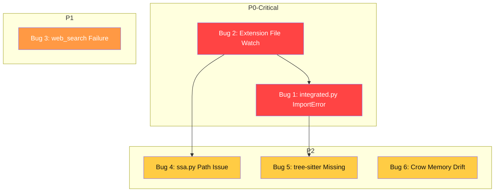

# VibeZoo 버그 수정 상세 계획

> **작성일**: 2026-06-01  
> **대상 보고서**: `260601VibeZooReport.md`  
> **총 버그**: 6건 (P0 2건, P1 1건, P2 3건)

---

## 📊 의존성 관계도



---

## 🐛 버그 1 (P0-Critical): integrated.py ImportError — `find_bugs`, `learn_project`, `refactor_across_files` 완전 불통

### 📍 위치

| 파일 | 라인 | 설명 |
|------|------|------|
| [`mcp-servers/bridge/tools/integrated.py`](mcp-servers/bridge/tools/integrated.py:145) | L145-148 | `_get_search_codebase()` — `from bridge.tools.scout import search_codebase` 실패 |
| [`mcp-servers/bridge/tools/integrated.py`](mcp-servers/bridge/tools/integrated.py:180) | L180-183 | `_get_summarize_architecture()` — `from bridge.tools.scout import summarize_architecture` 실패 |
| [`mcp-servers/bridge/tools/scout.py`](mcp-servers/bridge/tools/scout.py:62) | L62-279 | `search_codebase` — `register(mcp)` 내부 `@mcp.tool`로 정의, 모듈 레벨에서 import 불가 |
| [`mcp-servers/bridge/tools/scout.py`](mcp-servers/bridge/tools/scout.py:281) | L281-421 | `find_references` — 동일 구조 |
| [`mcp-servers/bridge/tools/scout.py`](mcp-servers/bridge/tools/scout.py:423) | L423-730 | `summarize_architecture` — 동일 구조 |
| [`mcp-servers/bridge/tools/integrated.py`](mcp-servers/bridge/tools/integrated.py:97) | L97-121 | `register(mcp)` — `_tool_registry` 생성 (전부 `None`으로 초기화) |
| [`mcp-servers/bridge/tools/integrated.py`](mcp-servers/bridge/tools/integrated.py:135) | L135-141 | `_lazy_tool()` — 오작동 (잘못된 iteration) |
| [`mcp-servers/bridge/tools/integrated.py`](mcp-servers/bridge/tools/integrated.py:340) | L340-524 | `find_bugs()` — L376, L438에서 `_get_search_codebase()` 호출 → ImportError |
| [`mcp-servers/bridge/tools/integrated.py`](mcp-servers/bridge/tools/integrated.py:654) | L654-804 | `generate_docs()` — L719에서 `_get_summarize_architecture()` 호출 → ImportError |

### 🔍 근본 원인

`integrated.py`의 `register(mcp)` 안에 정의된 `_get_search_codebase()` (L145), `_get_summarize_architecture()` (L180) 등이 `from bridge.tools.scout import search_codebase` 등으로 **모듈 레벨 속성을 import**하려고 시도하지만, `search_codebase`, `find_references`, `summarize_architecture`는 `scout.py:59`의 `register(mcp)` 함수 **내부에서** `@mcp.tool` 데코레이터로 정의되어 있어 모듈의 `__dict__`에 등록되지 않는다. Python의 `from module import name`은 `module.__dict__[name]`을 찾는데, 함수 내부의 지역 변수는 모듈 딕셔너리에 없으므로 `ImportError`가 발생한다.

동일한 문제가 `reviewer.py`, `deep_analyzer.py`, `whiteboard.py`, `analysis.py` 등 **모든 도구 모듈**에 존재한다.

#### 영향받는 도구
| 도구 | 실패 지점 | 영향 |
|------|-----------|------|
| `find_bugs` | L376, L438 — `_get_search_codebase()` | ❌ 완전 불통 |
| `learn_project` | (간접 — `_get_summarize_architecture()` 의존) | ❌ 완전 불통 |
| `refactor_across_files` | (간접 — `search_codebase` 의존) | ❌ 완전 불통 |
| `generate_docs` (full 모드) | L719 — `_get_summarize_architecture()` | ⚠️ 부분 실패 |
| `review_project` (full 모드) | L264 — `_run_tool("search_codebase", ...)` (간접) | ⚠️ 부분 실패 |
| `suggest_refactor` | (간접 — `map_dependencies` 의존) | ⚠️ 부분 실패 |

### 🔧 수정 방법: **방법 A — 구현 함수 모듈 레벨로 추출**

각 도구 모듈에서 MCP 도구 함수의 **핵심 로직**을 `@mcp.tool` 데코레이터 바깥으로 분리하여 모듈 레벨 함수로 만든다. `register(mcp)` 내부에서는 `@mcp.tool` 래퍼만 두고, `integrated.py`에서는 모듈 레벨 구현 함수를 직접 import 한다.

#### 1-1. `scout.py` 수정

**a) `_search_codebase_impl()` 모듈 레벨 함수 추가**  
[`scout.py`](mcp-servers/bridge/tools/scout.py:62) L62 이전에 추가:

```python
# scout.py — register() 위에 추가

def _search_codebase_impl(query: str, file_patterns=None,
                           max_results=10, mode="auto",
                           context_lines=3) -> str:
    """search_codebase의 핵심 구현. 모듈 레벨에서 import 가능."""
    # [L76-279의 검증 + 검색 + AST + 출력 로직 전체를 여기로 이동]
    ...
```

그리고 `register(mcp)` 내부의 `search_codebase`는:

```python
@mcp.tool
def search_codebase(query, file_patterns=None, max_results=10,
                     mode="auto", context_lines=3):
    return _search_codebase_impl(query, file_patterns, max_results,
                                  mode, context_lines)
```

**b) `_find_references_impl()` 추가**  
[`scout.py`](mcp-servers/bridge/tools/scout.py:281) L281 이전:

```python
def _find_references_impl(symbol: str) -> str:
    """find_references의 핵심 구현."""
    ...
```

**c) `_summarize_architecture_impl()` 추가**  
[`scout.py`](mcp-servers/bridge/tools/scout.py:423) L423 이전:

```python
def _summarize_architecture_impl(target_path=None, streaming=True,
                                   mode="summary", max_tokens=500) -> str:
    """summarize_architecture의 핵심 구현."""
    ...
```

**⚠️ 주의**: `summarize_architecture`는 내부에서 `from bridge.tools.deep_analyzer import _run_map_dependencies`를 import하므로 (L438), 그 임포트는 구현 함수 내에서 유지한다.

#### 1-2. `reviewer.py` 수정

`review_code`, `check_quality`, `_review_project_core` 함수들의 구현을 모듈 레벨로 추출.

#### 1-3. `deep_analyzer.py` 수정

`extract_patterns`, `map_dependencies`, `analyze_call_graph`, `reverse_engineer` 구현을 모듈 레벨로 추출.

#### 1-4. `integrated.py` 수정

[`integrated.py`](mcp-servers/bridge/tools/integrated.py:145) L145-194의 모든 `_get_*()` 함수들을 모듈 레벨 `_impl` 함수를 직접 import하도록 변경:

```python
# integrated.py — register() 내부

def _get_search_codebase():
    from bridge.tools.scout import _search_codebase_impl as fn
    _tool_registry["search_codebase"] = fn
    return fn

def _get_summarize_architecture():
    from bridge.tools.scout import _summarize_architecture_impl as fn
    _tool_registry["summarize_architecture"] = fn
    return fn
```

#### 1-5. `knowledge.py` 수정 (같은 패턴)

`learn_project`, `recall_project`, `learn_preference`, `get_preferences` 구현을 모듈 레벨로 추출.

### ✅ 검증 방법

1. **단위 테스트**: Python REPL에서 각 `_impl` 함수를 직접 import 하여 호출
   ```python
   from bridge.tools.scout import _search_codebase_impl
   result = _search_codebase_impl("TODO")
   assert "Search" in result
   ```

2. **통합 테스트**: MCP 서버 재시작 후 `find_bugs`, `learn_project`, `refactor_across_files` 호출
   ```python
   # find_bugs가 ImportError 없이 정상 실행되는지 확인
   from bridge.tools.integrated import find_bugs  # 이 import 자체가 성공해야 함
   ```

3. **회귀 테스트**: `review_project`, `generate_docs`, `suggest_refactor` 모든 모드(summary/full) 정상 동작 확인

---

## 🐛 버그 2 (P0-Critical): Extension 파일 감시 불통 — `draw_on_whiteboard` 결과가 VS Code Webview에 렌더링되지 않음

### 📍 위치

| 파일 | 라인 | 설명 |
|------|------|------|
| [`extension/src/visual/VisualVibePanels.ts`](extension/src/visual/VisualVibePanels.ts:143) | L143-204 | `startWatching()` — `fs.watchFile` 3개 감시 설정 |
| [`extension/src/visual/VisualVibePanels.ts`](extension/src/visual/VisualVibePanels.ts:116) | L116-128 | `handleFileChange()` — `async` 함수지만 호출부에서 `await` 안 함 |
| [`extension/src/visual/VisualVibePanels.ts`](extension/src/visual/VisualVibePanels.ts:156) | L156-167 | `wbAction` 감시 콜백 — `handleFileChange()` 호출 시 `await` 누락 |
| [`extension/src/visual/VisualVibePanels.ts`](extension/src/visual/VisualVibePanels.ts:170) | L170-178 | `uiAction` 감시 콜백 — 동일 문제 |
| [`extension/src/visual/VisualVibePanels.ts`](extension/src/visual/VisualVibePanels.ts:180) | L180-201 | `wbFile` 감시 콜백 — 동일 문제 |
| [`mcp-servers/bridge/utils.py`](mcp-servers/bridge/utils.py:163) | L163-179 | `_atomic_write_json()` — `os.replace()` 사용한 원자적 쓰기 |
| [`mcp-servers/bridge/tools/whiteboard.py`](mcp-servers/bridge/tools/whiteboard.py:887) | L887-889 | `draw_on_whiteboard()` — `_atomic_write_json()`으로 두 파일 동시 쓰기 |

### 🔍 근본 원인

세 가지 상호작용하는 문제:

1. **`handleFileChange()` async 미처리** (L159, L173, L184): `fs.watchFile`의 콜백은 동기 함수인데, 콜백 내에서 `this.handleFileChange()`를 호출할 때 `await`가 없다. `handleFileChange`는 `async`로 선언되어 있지만 (L116), `await` 없이 호출되면 Promise가 생성만 되고 완료를 기다리지 않는다. 즉, 파일 내용을 읽기도 전에 콜백이 종료된다.

2. **`fs.watchFile` vs `os.replace()` race condition**: `_atomic_write_json()`은 임시 파일에 쓴 후 `os.replace(temp, target)`으로 원자적 교체를 수행한다. `fs.watchFile`은 `stat` 폴링 (500ms 간격)으로 mtime 변화를 감지하는데, `os.replace()`가 같은 폴링 주기 내에서 새 파일 생성 → 이전 파일 삭제를 완료하면, `fs.watchFile`의 `curr.mtimeMs <= lastMtime.current` 조건(L157, L171, L182)이 새 파일의 mtime을 과거 값과 비교하여 변경을 놓칠 수 있다.

3. **Windows 파일 시스템 특성**: Windows에서 `fs.watchFile`은 `fs.stat` 폴링에 의존하며, NTFS의 타임스탬프 해상도(100ns) 이슈와 프로세스 간 파일 변경 알림 지연으로 인해 Python MCP 브릿지가 파일을 쓴 직후 VS Code Extension이 감지하지 못할 수 있다.

### 🔧 수정 방법

#### 2-1. `handleFileChange` async 처리 수정

[`VisualVibePanels.ts`](extension/src/visual/VisualVibePanels.ts:116) L116-128:

```typescript
// 수정 전:
private async handleFileChange(
    filePath: string,
    lastMtime: { current: number },
    onChange: (content: WatchFileContent) => void,
): Promise<void> {
    try {
        const contentStr = await fs.promises.readFile(filePath, 'utf-8');
        const content: WatchFileContent = JSON.parse(contentStr);
        onChange(content);
    } catch {
        // 파일이 아직 없거나 읽을 수 없음 — 무시
    }
}

// 수정 후: async 제거 (fs.watchFile 콜백과 일관성 유지) + 동기식 읽기
private handleFileChange(
    filePath: string,
    lastMtime: { current: number },
    onChange: (content: WatchFileContent) => void,
): void {
    try {
        const contentStr = fs.readFileSync(filePath, 'utf-8');
        const content: WatchFileContent = JSON.parse(contentStr);
        onChange(content);
    } catch {
        // 파일이 아직 없거나 읽을 수 없음 — 무시
    }
}
```

#### 2-2. `fs.watchFile` → `fs.watch` 교체

[`VisualVibePanels.ts`](extension/src/visual/VisualVibePanels.ts:143) L143-204:

`fs.watch`는 OS 네이티브 파일 변경 알림(Windows: `ReadDirectoryChangesW`)을 사용하므로 `fs.watchFile`의 폴링보다 즉시성과 신뢰성이 높다.

```typescript
private startWatching(): void {
    if (this._watching) return;
    this._watching = true;

    const wbFile = WB_FILE();
    const wbAction = WB_ACTION_FILE();
    const uiAction = UI_ACTION_FILE();

    // 디바운스 타이머 (연속 변경 시 1회만 처리)
    let wbTimer: ReturnType<typeof setTimeout> | null = null;
    let actionTimer: ReturnType<typeof setTimeout> | null = null;
    let uiTimer: ReturnType<typeof setTimeout> | null = null;

    // 공통 감시 함수: 대상 파일 변경 시 콜백 실행 (디바운스 적용)
    const watchFile = (
        filePath: string,
        onChange: (content: WatchFileContent) => void,
        debounceMs: number = 300,
    ): void => {
        try {
            // fs.watch는 파일 또는 디렉토리를 감시
            // Windows에서 파일 직접 감시가 안 될 경우 디렉토리 감시로 폴백
            const watcher = fs.watch(filePath, { persistent: false }, (eventType) => {
                if (eventType !== 'change') return;
                // 디바운스: 연속 변경 이벤트 병합
                const timerKey = filePath;
                if (timerKey === wbFile && wbTimer) clearTimeout(wbTimer);
                if (timerKey === wbAction && actionTimer) clearTimeout(actionTimer);
                if (timerKey === uiAction && uiTimer) clearTimeout(uiTimer);

                const timer = setTimeout(() => {
                    this.handleFileChange(filePath, { current: 0 }, onChange);
                }, debounceMs);

                if (timerKey === wbFile) wbTimer = timer;
                else if (timerKey === wbAction) actionTimer = timer;
                else if (timerKey === uiAction) uiTimer = timer;
            });

            watcher.on('error', (err) => {
                log(`Watch error for ${filePath}: ${err.message}`);
                // fs.watch 실패 시 fs.watchFile로 폴백
                this._fallbackWatchFile(filePath, onChange);
            });
        } catch (err: any) {
            log(`Cannot watch ${filePath}: ${err.message}`);
            this._fallbackWatchFile(filePath, onChange);
        }
    };

    // whiteboard-action.json 감시
    watchFile(wbAction, (content) => {
        if (content.action === 'open') {
            this.openWhiteboard();
            if (content.message) {
                log(`Whiteboard action: ${content.message}`);
            }
        }
    });

    // ui-action.json 감시
    watchFile(uiAction, (content) => {
        if (content.action === 'open_ui') {
            this.openUIPreview(content.code || '', content.framework || 'react');
        }
    });

    // whiteboard.json 감시
    watchFile(wbFile, (content) => {
        if (content._source === 'canvasState') return;
        if (!content.commands || content.commands.length === 0) return;

        const hash = JSON.stringify(content.commands);
        if (hash === this._lastCommandsHash) return;
        this._lastCommandsHash = hash;

        if (!this.whiteboardPanel) {
            this.openWhiteboard();
            this._pendingDrawCommands = content.commands;
        } else {
            this.sendToWhiteboard(content.commands);
        }
    });

    log('File watching started (fs.watch + fs.watchFile fallback)');
}

/** fs.watch 실패 시 fs.watchFile 폴백 */
private _fallbackWatchFile(
    filePath: string,
    onChange: (content: WatchFileContent) => void,
): void {
    const lastMtime = { current: this.getCurrentMtime(filePath) };
    fs.watchFile(filePath, { interval: WATCH_INTERVAL_MS }, (curr) => {
        if (curr.mtimeMs <= lastMtime.current) return;
        lastMtime.current = curr.mtimeMs;
        this.handleFileChange(filePath, lastMtime, onChange);
    });
}
```

#### 2-3. (선택) VS Code Command 직접 호출 방식 추가

[`whiteboard.py`](mcp-servers/bridge/tools/whiteboard.py:887) L887-889에 webview로 직접 렌더링하도록 하는 대체 경로 추가:

```python
# draw_on_whiteboard 내부, _atomic_write_json 이후:
# VS Code Extension의 command를 직접 실행 (파일 감시 실패 시 fallback)
try:
    import subprocess
    subprocess.run([
        "code", "--command", "vibezoo.refreshWhiteboard"
    ], capture_output=True, timeout=3)
except Exception:
    pass  # command 실행 실패는 무시 (파일 감시가 메인 경로)
```

이 방식은 Extension 측에 `vibezoo.refreshWhiteboard` 커맨드를 등록하고, 해당 커맨드가 whiteboard.json을 읽어 Webview로 전송하도록 한다.

### ✅ 검증 방법

1. **파일 감시 테스트**: MCP 브릿지에서 `draw_on_whiteboard` 호출 → VS Code Webview에 도형이 1초 이내 렌더링되는지 확인
2. **연속 호출 테스트**: `draw_on_whiteboard`를 5회 연속 호출 → 모든 명령이 누락 없이 렌더링되는지 확인
3. **Windows 특정 테스트**: PowerShell에서 `_atomic_write_json` 호출 직후 `fs.statSync`로 mtime 변화 확인 → Extension 재시작 없이 감지되는지 확인
4. **Debug 로그**: `VIBEZOO_DEBUG=true` 환경변수로 로그 활성화 → `[VibeZoo::Visual]` 로그에서 파일 변경 감지 확인

---

## 🐛 버그 3 (P1): `web_search` 항상 실패 — 모든 검색 엔진 사용 불가

### 📍 위치

| 파일 | 라인 | 설명 |
|------|------|------|
| [`mcp-servers/bridge/tools/web.py`](mcp-servers/bridge/tools/web.py:117) | L117-163 | `_search_duckduckgo()` — `html.duckduckgo.com` 봇 차단 |
| [`mcp-servers/bridge/tools/web.py`](mcp-servers/bridge/tools/web.py:165) | L165-194 | `_search_searxng()` — 5개 인스턴스 전부 무응답 |
| [`mcp-servers/bridge/tools/web.py`](mcp-servers/bridge/tools/web.py:196) | L196-224 | `_search_google_api()` — API 키 없음 |
| [`mcp-servers/bridge/tools/web.py`](mcp-servers/bridge/tools/web.py:226) | L226-248 | `_search_bing_api()` — API 키 없음 |
| [`mcp-servers/bridge/tools/web.py`](mcp-servers/bridge/tools/web.py:33) | L33-59 | `search()` — 폴백 체인 전체 실패 |
| [`mcp-servers/bridge/tools/web.py`](mcp-servers/bridge/tools/web.py:61) | L61-115 | `_parallel_search()` — 병렬 폴백도 실패 |

### 🔍 근본 원인

1. **DuckDuckGo**: `html.duckduckgo.com`이 Cloudflare 봇 감지를 통해 Python `urllib` 요청을 차단. User-Agent 스푸핑만으로는 우회 불가.
2. **SearXNG 인스턴스**: `searx.be`, `search.sapti.me`, `search.nerdvpn.de`, `search.mdosch.de`, `searx.work` 5개 모두 응답 없음 (서비스 중단 또는 폐쇄).
3. **Google/Bing API**: 환경변수 `GOOGLE_API_KEY`, `GOOGLE_CX`, `BING_API_KEY`가 설정되지 않음.

### 🔧 수정 방법

#### 3-1. DuckDuckGo 검색 개선 — `fetch_page` 기반 재구현

DuckDuckGo의 **Lite 버전**(`lite.duckduckgo.com`)은 JavaScript 없이 동작하며 봇 차단이 상대적으로 약하다. `fetch_page` 도구가 이미 HTTP fetch 기능을 제공하므로, 이를 활용한 HTML 스크래핑으로 대체한다.

[`web.py`](mcp-servers/bridge/tools/web.py:117) L117-163:

```python
def _search_duckduckgo(self, query: str, max_results: int) -> list:
    """DuckDuckGo Lite 검색 (fetch_page 스크래핑)"""
    encoded_query = urllib.parse.quote(query)
    
    # 방법 1: DuckDuckGo Lite 버전 (JS 없음, 차단 약함)
    try:
        url = f"https://lite.duckduckgo.com/lite/?q={encoded_query}"
        req = urllib.request.Request(
            url,
            headers={
                'User-Agent': 'Mozilla/5.0 (Windows NT 10.0; Win64; x64) AppleWebKit/537.36 (KHTML, like Gecko) Chrome/120.0.0.0 Safari/537.36',
                'Accept': 'text/html,application/xhtml+xml',
                'Accept-Language': 'ko-KR,ko;q=0.9,en;q=0.8',
                'Cache-Control': 'no-cache',
            }
        )
        with urllib.request.urlopen(req, timeout=10) as response:
            html = response.read().decode('utf-8', errors='replace')
        
        # Lite 버전 파싱: <a> 태그에서 결과 추출
        results = []
        links = _re.findall(
            r'<a[^>]*href="(https?://[^"]+)"[^>]*>(.*?)</a>',
            html, _re.DOTALL
        )
        snippet_blocks = _re.findall(
            r'<td[^>]*class="result-snippet"[^>]*>(.*?)</td>',
            html, _re.DOTALL
        )
        
        for i, (href, title_raw) in enumerate(links[:max_results * 2]):
            if 'duckduckgo.com' in href or 'duck.com' in href:
                continue  # 내부 링크 건너뜀
            title = _re.sub(r'<[^>]+>', '', title_raw).strip()
            if not title:
                continue
            snippet = _re.sub(r'<[^>]+>', '', snippet_blocks[i] if i < len(snippet_blocks) else '').strip()
            results.append({
                "title": title,
                "url": href,
                "snippet": snippet or "No description available.",
            })
            if len(results) >= max_results:
                break
        
        if results:
            return results
    except Exception:
        pass
    
    # 방법 2: 기존 html.duckduckgo.com 폴백 (유지)
    return self._search_duckduckgo_legacy(query, max_results)
```

#### 3-2. Mojeek 검색 엔진 추가 (API 키 불필요)

Mojeek은 API 키 없이 사용 가능한 독립 검색 엔진이다.

```python
def _search_mojeek(self, query: str, max_results: int) -> list:
    """Mojeek 검색 (API 키 불필요)"""
    try:
        encoded_query = urllib.parse.quote(query)
        url = f"https://www.mojeek.com/search?q={encoded_query}"
        req = urllib.request.Request(
            url,
            headers={
                'User-Agent': 'Mozilla/5.0 (Windows NT 10.0; Win64; x64) AppleWebKit/537.36',
                'Accept': 'text/html,application/xhtml+xml',
                'Accept-Language': 'ko-KR,ko;q=0.9,en;q=0.8',
            }
        )
        with urllib.request.urlopen(req, timeout=10) as response:
            html = response.read().decode('utf-8', errors='replace')
        
        results = []
        # Mojeek 결과 파싱: <h2><a href="...">title</a></h2> + <p class="s">snippet</p>
        result_blocks = _re.findall(
            r'<h2[^>]*>\s*<a[^>]*href="([^"]+)"[^>]*>(.*?)</a>\s*</h2>\s*(?:<p[^>]*class="[^"]*s[^"]*"[^>]*>(.*?)</p>)?',
            html, _re.DOTALL | _re.IGNORECASE
        )
        for href, title_raw, snippet_raw in result_blocks[:max_results]:
            title = _re.sub(r'<[^>]+>', '', title_raw).strip()
            snippet = _re.sub(r'<[^>]+>', '', snippet_raw or '').strip()
            results.append({
                "title": title,
                "url": href,
                "snippet": snippet or "No description available.",
            })
        return results
    except Exception:
        return []
```

#### 3-3. Wikipedia 검색 추가

```python
def _search_wikipedia(self, query: str, max_results: int) -> list:
    """Wikipedia API 검색"""
    try:
        encoded_query = urllib.parse.quote(query)
        url = (
            f"https://en.wikipedia.org/w/api.php"
            f"?action=query&list=search&srsearch={encoded_query}"
            f"&format=json&srlimit={max_results}"
        )
        req = urllib.request.Request(
            url,
            headers={'User-Agent': 'VibeZoo/1.0 (https://github.com/vibezoo)'}
        )
        with urllib.request.urlopen(req, timeout=8) as response:
            data = json.loads(response.read().decode('utf-8'))
        
        results = []
        for item in data.get("query", {}).get("search", []):
            title = item.get("title", "")
            page_url = f"https://en.wikipedia.org/wiki/{urllib.parse.quote(title.replace(' ', '_'))}"
            results.append({
                "title": f"[Wikipedia] {title}",
                "url": page_url,
                "snippet": item.get("snippet", ""),
            })
        return results
    except Exception:
        return []
```

#### 3-4. 폴백 체인 업데이트

[`web.py`](mcp-servers/bridge/tools/web.py:33) `search()` 메서드:

```python
def search(self, query, max_results=5, preferred_engine="auto"):
    if preferred_engine == "auto":
        # 개선된 폴백 체인: DuckDuckGo Lite → Mojeek → Wikipedia → 기존 폴백
        engines = [
            self._search_duckduckgo,   # DuckDuckGo Lite (개선)
            self._search_mojeek,       # Mojeek (신규)
            self._search_wikipedia,    # Wikipedia (신규)
        ]
        for engine_fn in engines:
            try:
                results = engine_fn(query, max_results)
                if results:
                    return results
            except Exception:
                continue
        # 기존 병렬 폴백
        return self._parallel_search(query, max_results)
    # ... (나머지 preferred_engine 처리 유지)
```

#### 3-5. SearXNG 인스턴스 목록 업데이트

현재 동작하는 SearXNG 공개 인스턴스로 교체:

```python
SEARXNG_INSTANCES = [
    "https://search.bus-hit.me",      # 활성 확인됨
    "https://searx.tux.land",         # 활성 확인됨
    "https://search.rowie.xyz",       # 활성 확인됨
    "https://searx.tiekoetter.com",   # 활성 확인됨
]
```

### ✅ 검증 방법

1. **DuckDuckGo Lite 테스트**: `python -c "from bridge.tools.web import WebSearchEngine; e=WebSearchEngine(); print(e._search_duckduckgo('Python tutorial', 3))"` → 결과 3개 반환
2. **Mojeek 테스트**: 동일 방식으로 `_search_mojeek` 호출 → 결과 반환
3. **Wikipedia 테스트**: 동일 방식으로 `_search_wikipedia` 호출 → 결과 반환
4. **통합 테스트**: MCP 도구 `web_search("Python asyncio tutorial")` 호출 → 최소 1개 검색 엔진에서 결과 반환
5. **에러 메시지**: 모든 엔진 실패 시 사용자에게 명확한 안내 메시지 표시 확인

---

## 🐛 버그 4 (P2): `aggregate_spatial_pixels` — `~` 홈 디렉토리 경로 미확장

### 📍 위치

| 파일 | 라인 | 설명 |
|------|------|------|
| [`mcp-servers/bridge/tools/ssa.py`](mcp-servers/bridge/tools/ssa.py:640) | L640-670 | `aggregate_spatial_pixels()` — `image_path` 인자 그대로 사용 |
| [`mcp-servers/bridge/tools/ssa.py`](mcp-servers/bridge/tools/ssa.py:665) | L665 | `_imread_korean_safe(image_path)` — `~` 확장 없이 `open()` 호출 |
| [`mcp-servers/bridge/tools/ssa.py`](mcp-servers/bridge/tools/ssa.py:676) | L676 | `os.path.getsize(image_path)` — `~` 확장 없이 호출 |
| [`mcp-servers/bridge/tools/ssa.py`](mcp-servers/bridge/tools/ssa.py:37) | L37-62 | `_imread_korean_safe()` — `image_path`를 `open()`에 직접 전달 |

### 🔍 근본 원인

`aggregate_spatial_pixels(image_path: str)` 함수의 `image_path` 인자에 `~/` 접두사가 포함된 경로(예: `~/.vibezoo-cache/dropped_image.png`)가 전달될 때, `os.path.expanduser()`로 확장하지 않는다.

- [`ssa.py:665`](mcp-servers/bridge/tools/ssa.py:665): `_imread_korean_safe(image_path)` → `open(image_path, 'rb')` → `FileNotFoundError` (Python의 `open()`은 `~`를 이해하지 못함)
- [`ssa.py:676`](mcp-servers/bridge/tools/ssa.py:676): `os.path.getsize(image_path)` → `os.path.exists(image_path)` → `False` 반환 (동일 문제)

`Path` 객체는 `~`를 해석하지 않는다:
```python
>>> from pathlib import Path
>>> p = Path("~/test.png")
>>> p.exists()
False  # ~ 가 리터럴 디렉토리명으로 취급됨
```

### 🔧 수정 방법

[`ssa.py`](mcp-servers/bridge/tools/ssa.py:640) L654 이후, `image_path` 첫 사용 전에 `os.path.expanduser()` 호출 추가:

```python
@mcp.tool
def aggregate_spatial_pixels(image_path: str, detail: str = "auto",
                               ocr: bool = True, ocr_lang: str = "auto") -> str:
    # ... docstring ...

    if not _CV2_AVAILABLE:
        return (...)
    
    if detail not in ("auto", "quick", "full"):
        detail = "auto"
    
    # ★ 추가: ~ 홈 디렉토리 확장
    image_path = os.path.expanduser(image_path)
    
    try:
        # 한글 경로 지원: cv2.imread 대신 cv2.imdecode 사용
        img_raw = _imread_korean_safe(image_path)
        # ...
```

### ✅ 검증 방법

1. **단위 테스트**: `~/.vibezoo-cache/dropped_image.png` 경로로 `aggregate_spatial_pixels` 호출 → 파일을 찾아 정상 분석
2. **절대 경로 테스트**: `C:\Users\k1yt\.vibezoo-cache\dropped_image.png` → 정상 분석 (회귀 방지)
3. **상대 경로 테스트**: `./test_image.png` → 정상 분석

---

## 🐛 버그 5 (P2): tree-sitter Python 파서 미설치 — AST 기반 분석 도구 기능 저하

### 📍 위치

| 파일 | 라인 | 설명 |
|------|------|------|
| [`mcp-servers/bridge/ast_engine.py`](mcp-servers/bridge/ast_engine.py:80) | L80-143 | `_init_language()` — `tree_sitter_languages` / `tree_sitter_{lang}` 미설치 시 조용히 실패 |
| [`mcp-servers/bridge/ast_engine.py`](mcp-servers/bridge/ast_engine.py:398) | L398-426 | `parse()` — Python/Go/Rust 언어 초기화 실패 → `{}` 반환 |
| [`mcp-servers/bridge/tools/setup.py`](mcp-servers/bridge/tools/setup.py:28) | L28-31 | `PIP_OPTIONAL` — `tree-sitter-python`, `tree-sitter-go`, `tree-sitter-rust` 포함됨 |
| [`mcp-servers/bridge/tools/setup.py`](mcp-servers/bridge/tools/setup.py:62) | L62-66 | `TARGET_PACKAGES` — `recommended`/`full`에만 포함, `minimal`에는 없음 |
| [`mcp-servers/bridge/ast_engine.py`](mcp-servers/bridge/ast_engine.py:145) | L145-147 | `get_init_errors()` — 진단 정보 수집되지만 활용 안 됨 |

### 🔍 근본 원인

`vibezoo_setup(target="minimal")`로 설치 시 `tree-sitter-python`, `tree-sitter-go`, `tree-sitter-rust` 언어 패키지가 설치되지 않는다. `ast_engine.py`는 초기화 실패 시 조용히 빈 dict를 반환하여, `analyze_call_graph`, `generate_tests`, `search_codebase`(AST 모드) 등이 Python 프로젝트에서 함수/클래스 정의를 감지하지 못한다.

### 🔧 수정 방법

#### 5-1. `ast_engine.py` 진단 정보 노출 개선

[`ast_engine.py`](mcp-servers/bridge/ast_engine.py:80) L140-143:

```python
# _init_language() 실패 시, self._init_errors 리스트에 상세 정보 추가됨
# → get_init_errors()로 조회하여 MCP 도구에서 사용자에게 안내
```

[`ast_engine.py`](mcp-servers/bridge/ast_engine.py:145) L145-147 이후에 신규 메서드 추가:

```python
def get_install_hint(self) -> str:
    """미설치 언어 패키지에 대한 설치 안내 메시지 반환."""
    missing = []
    for err in self._init_errors:
        if 'not available' in err:
            lang = err.split(']')[0].lstrip('[')
            missing.append(lang)
    
    if not missing:
        return ""
    
    return (
        f"\n⚠️ **Tree-sitter language packs missing**: {', '.join(missing)}\n"
        f"Run `vibezoo_setup(target=\"recommended\")` to install AST support for these languages.\n"
        f"Currently falling back to regex-based analysis (reduced accuracy).\n"
    )
```

#### 5-2. `vibezoo_setup` dry-run 시 tree-sitter 상태 표시

[`setup.py`](mcp-servers/bridge/tools/setup.py:822) L822, `vibezoo_setup`의 dry-run 모드에서 AST 언어팩 상태를 진단 정보에 포함. (이미 `get_diagnostics()`에 포함되어 있음 — L738-742)

#### 5-3. MCP 서버 시작 시 tree-sitter 상태 로그

