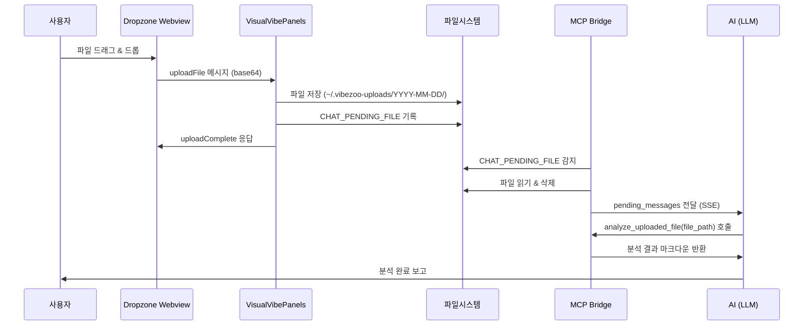
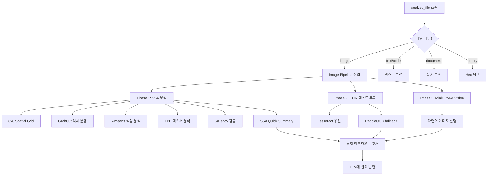
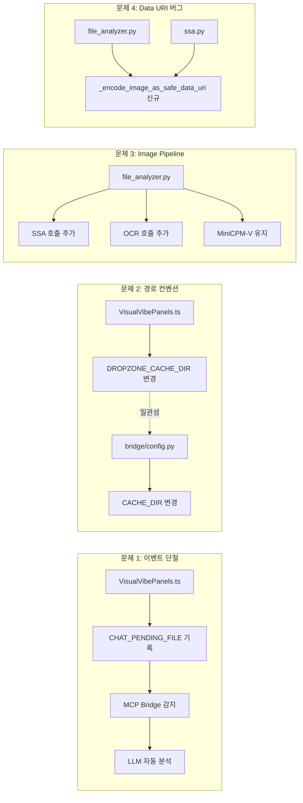

# VibeZoo Dropzone 및 분석 파이프라인 수정 설계 문서

**작성일자:** 2026년 6월 1일  
**기반 리포트:** [`feedbacks/260601reportfromgemini.md`](../feedbacks/260601reportfromgemini.md)  
**대상 모드:** Code 모드 구현 → Debug 모드 검증

---

## 📌 개요

Gemini 리포트가 진단한 4가지 문제를 해결하기 위한 상세 설계 문서이다. 각 문제별로 **현행 코드**, **문제 원인**, **변경 설계**, **예상 동작**을 명시한다.

---

## 문제 1: 프론트엔드-백엔드 이벤트 단절 (Critical)

### 1.1 현행 코드

[`extension/src/visual/VisualVibePanels.ts`](../extension/src/visual/VisualVibePanels.ts:421) — [`handleDropzoneUpload()`](../extension/src/visual/VisualVibePanels.ts:421):

```typescript
private handleDropzoneUpload(fileName: string, dataBase64: string, mimeType: string): void {
  // ... 파일 저장 로직 ...
  console.log(`[VibeZoo] Dropzone upload saved: ${destPath} (${buffer.length} bytes)`);

  this.dropzonePanel?.webview.postMessage({
    type: 'uploadComplete',
    path: destPath,
    size: buffer.length,
    fileName: safeName,
  });
  // ★ 종료: AI로의 이벤트 전파 없음
}
```

### 1.2 문제 원인

파일 저장 후 Webview에 `uploadComplete` 메시지를 보내는 것으로 트랜잭션이 종료된다. AI(LLM)는 파일이 업로드되었는지 알 방법이 전혀 없다.

### 1.3 기존 인프라 확인

프로젝트에는 이미 **Chat Pending 메커니즘**이 존재한다:

| 구성요소 | 위치 |
|----------|------|
| `CHAT_PENDING_FILE` 상수 | [`bridge/config.py:22`](../mcp-servers/bridge/config.py:22) → `~/.vibezoo-chat-pending.json` |
| Pending 메시지 읽기 | [`vibezoo_mcp_bridge_v2.py:2661`](../mcp-servers/vibezoo_mcp_bridge_v2.py:2661) → `pending.get("messages", [])` |
| Auto-Fix 루프 처리 | [`bridge/tools/fix_loop.py:331`](../mcp-servers/bridge/tools/fix_loop.py:331) → 동일 패턴 |

Bridge는 `~/.vibezoo-chat-pending.json` 파일을 주기적으로 확인하여 `messages` 배열을 읽고, 파일을 삭제한 후 `pending_messages`로 LLM에 전달한다.

### 1.4 변경 설계

#### 파일: [`extension/src/visual/VisualVibePanels.ts`](../extension/src/visual/VisualVibePanels.ts)

**변경 1:** `handleDropzoneUpload()` 함수 내, 파일 저장 완료 직후 `CHAT_PENDING_FILE`에 프롬프트를 기록하는 로직 추가.

```typescript
// ★ 추가: 상수 정의 (기존 상수 영역, 약 28행 부근)
const CHAT_PENDING_FILE = () => path.join(os.homedir(), '.vibezoo-chat-pending.json');
```

```typescript
// ★ 변경: handleDropzoneUpload() 함수 (421행~463행)
// 기존 console.log(...) 와 webview.postMessage 사이에 다음 로직 삽입:

// [신규] AI 세션에 파일 분석 프롬프트 주입
try {
  const pendingMsg = {
    messages: [{
      role: 'system',
      content: `[System] User dropped a file at: ${destPath}\n` +
               `File name: ${safeName}\n` +
               `MIME type: ${mimeType}\n` +
               `Size: ${buffer.length} bytes\n` +
               `Please analyze this file using the analyze_uploaded_file tool with file_path="${destPath}".`
    }]
  };
  fs.writeFileSync(CHAT_PENDING_FILE(), JSON.stringify(pendingMsg, null, 2), 'utf-8');
  log(`Chat pending prompt written for: ${destPath}`);
} catch (e: any) {
  log(`Failed to write chat pending: ${e.message}`);
}
```

**변경 2:** `handleCaptureScreenshot()` 함수(281행~320행)에도 동일한 패턴 적용. 스크린샷 캡처 완료 후 자동 분석 프롬프트 주입.

### 1.5 예상 동작



---

## 문제 2: 저장 경로 및 네이밍 컨벤션 불일치 (Low)

### 2.1 현행 코드

[`extension/src/visual/VisualVibePanels.ts:28-29`](../extension/src/visual/VisualVibePanels.ts:28):

```typescript
const DROPZONE_CACHE_DIR = () => path.join(os.homedir(), '.vibezoo-cache');
const UPLOADED_IMAGE_PATH = () => path.join(DROPZONE_CACHE_DIR(), 'dropped_image.png');
```

### 2.2 목표 구조

```
~/.vibezoo-uploads/
├── 2026-06-01/
│   ├── upload_1717234567890.png
│   └── upload_1717234567891.pdf
├── 2026-06-02/
│   └── upload_1717320967890.jpg
└── ...
```

### 2.3 변경 설계

#### 파일: [`extension/src/visual/VisualVibePanels.ts`](../extension/src/visual/VisualVibePanels.ts:28)

**변경 1:** 상수 재정의:

```typescript
// ★ 변경 전
const DROPZONE_CACHE_DIR = () => path.join(os.homedir(), '.vibezoo-cache');
const UPLOADED_IMAGE_PATH = () => path.join(DROPZONE_CACHE_DIR(), 'dropped_image.png');

// ★ 변경 후
const getDateString = (): string => {
  const d = new Date();
  return `${d.getFullYear()}-${String(d.getMonth() + 1).padStart(2, '0')}-${String(d.getDate()).padStart(2, '0')}`;
};
const DROPZONE_CACHE_DIR = () => path.join(os.homedir(), '.vibezoo-uploads', getDateString());
const UPLOADED_IMAGE_PATH = () => path.join(DROPZONE_CACHE_DIR(), 'dropped_image.png');
```

**변경 2:** [`handleDropzoneUpload()`](../extension/src/visual/VisualVibePanels.ts:421) 내 `safeName` 생성 로직은 그대로 유지 (타임스탬프 기반이므로 충돌 방지). 디렉토리만 변경.

#### 파일: [`mcp-servers/bridge/config.py`](../mcp-servers/bridge/config.py:29-30)

**변경 3:** Python 측 상수도 일치시킴:

```python
# ★ 변경 전
CACHE_DIR = str(HOME_DIR / ".vibezoo-cache")
IMAGE_CACHE_DIR = str(HOME_DIR / ".vibezoo-cache")

# ★ 변경 후
from datetime import date
_DATE_STR = date.today().isoformat()  # "2026-06-01"
CACHE_DIR = str(HOME_DIR / ".vibezoo-uploads" / _DATE_STR)
IMAGE_CACHE_DIR = str(HOME_DIR / ".vibezoo-uploads" / _DATE_STR)
```

### 2.4 예상 동작

- 오늘 날짜가 `2026-06-01`이면 파일은 `~/.vibezoo-uploads/2026-06-01/upload_1717234567890.png`에 저장된다.
- 날짜별 디렉토리 구조로 캐시 정리 및 파일 관리가 용이해진다.
- TypeScript(`VisualVibePanels.ts`)와 Python(`config.py`) 양측에서 동일한 규칙을 사용하므로 일관성이 유지된다.

---

## 문제 3: Image Pipeline 구성요소 누락 (High)

### 3.1 현행 코드

[`mcp-servers/bridge/tools/file_analyzer.py:86-108`](../mcp-servers/bridge/tools/file_analyzer.py:86):

```python
# For images: include data URI for vision
if info['type'] == 'image':
    # ... data URI 생성 ...
    # Try MiniCPM-V vision
    try:
        from bridge.vision.minicpm import describe_image, is_available
        if is_available():
            desc = describe_image(path)
            if desc:
                lines.append("### 🤖 Vision Analysis")
                lines.append(desc)
    except Exception:
        pass
# ★ SSA, OCR 호출 없음
```

### 3.2 누락된 구성요소

| 구성요소 | 모듈 위치 | 상태 |
|----------|----------|------|
| **SSA 분석기** | [`bridge/tools/ssa.py`](../mcp-servers/bridge/tools/ssa.py) — [`_analyze_image()`](../mcp-servers/bridge/tools/ssa.py:101) | ✅ 이미 구현됨 |
| **OCR 엔진** | [`bridge/ocr_engine.py`](../mcp-servers/bridge/ocr_engine.py) — [`OcrEngine.ocr()`](../mcp-servers/bridge/ocr_engine.py:176) | ✅ 이미 구현됨 |
| **MiniCPM-V Vision** | [`bridge/vision/minicpm.py`](../mcp-servers/bridge/vision/minicpm.py) — [`describe_image()`](../mcp-servers/bridge/vision/minicpm.py:67) | ✅ 이미 구현됨 |

셋 모두 이미 프로젝트 내에 구현되어 있으나, [`file_analyzer.py`](../mcp-servers/bridge/tools/file_analyzer.py)의 [`analyze_file()`](../mcp-servers/bridge/tools/file_analyzer.py:60) 라우터에서 통합 호출되지 않고 있다.

### 3.3 변경 설계

#### 파일: [`mcp-servers/bridge/tools/file_analyzer.py`](../mcp-servers/bridge/tools/file_analyzer.py)

**변경:** 이미지 타입 분기(86행~108행)를 완전히 재작성.

```python
# For images: 통합 Image Pipeline 실행
if info['type'] == 'image':
    lines.append("---")
    lines.append("## 🔬 Image Analysis Pipeline")
    lines.append("")

    # ── Phase 1: SSA (Statistical Spatial Aggregator) ──
    ssa_report = ""
    try:
        from bridge.tools.ssa import _analyze_image, _imread_korean_safe, _summarize_ssa_results
        import cv2, numpy as np
        img_raw = _imread_korean_safe(path)
        if img_raw is not None:
            orig_h, orig_w = img_raw.shape[:2]
            # SSA 분석용 리사이즈 (640px 너비 기준)
            target_w = 640
            target_h = int(orig_h * (target_w / orig_w))
            img_resized = cv2.resize(img_raw, (target_w, target_h))
            ssa_report = _analyze_image(img_resized, detail="full", orig_w=orig_w, orig_h=orig_h)
            # SSA 요약 추가
            ssa_summary = _summarize_ssa_results(ssa_report)
            if ssa_summary:
                lines.append(ssa_summary)
            lines.append(ssa_report)
            lines.append("")
        else:
            lines.append("### 📊 SSA: Cannot read image for spatial analysis")
            lines.append("")
    except ImportError:
        lines.append("### 📊 SSA: OpenCV not available")
        lines.append("")
    except Exception as e:
        lines.append(f"### 📊 SSA: Analysis failed ({e})")
        lines.append("")

    # ── Phase 2: OCR 텍스트 추출 ──
    try:
        from bridge.ocr_engine import OcrEngine
        ocr_engine = OcrEngine()
        if ocr_engine.is_available():
            ocr_result = ocr_engine.ocr(path, lang="auto", detail="quick")
            ocr_md = OcrEngine.ocr_to_markdown(ocr_result)
            lines.append(ocr_md)
            lines.append("")
        else:
            lines.append("### 📝 OCR: Not available (install Tesseract or PaddleOCR)")
            lines.append("")
    except ImportError:
        lines.append("### 📝 OCR: Module not loaded")
        lines.append("")
    except Exception as e:
        lines.append(f"### 📝 OCR: Failed ({e})")
        lines.append("")

    # ── Phase 3: MiniCPM-V Vision (기존 로직 유지, 통합 결과 하단 배치) ──
    try:
        from bridge.vision.minicpm import describe_image, is_available
        if is_available():
            desc = describe_image(path)
            if desc:
                lines.append("### 🤖 Vision Analysis (MiniCPM-V)")
                lines.append(desc)
                lines.append("")
    except Exception:
        pass
```

### 3.4 예상 동작



### 3.5 통합 보고서 예시

```markdown
## 📄 File Analysis: screenshot_2026.png
*245.3KB image file analyzed*

- **Type:** image (.png)
- **Size:** 245.3 KB (0.24 MB)
- ...

---
## 🔬 Image Analysis Pipeline

### SSA Quick Summary
📐 1920×1080 (2.1MP) · 🎨 주색상=Blue(42%) · 📦 전경객체=35% · 👀 주목영역=center-center(18%) · 🧩 질감=Moderately textured · 📊 공간균일성=Moderately varied

### SYSTEM_VISION_REPORT_V3: screenshot_2026.png
- Original Resolution: 1920x1080 (2.1MP)
- Analysis Scaled: 640x360
... (SSA 상세 분석) ...

### 📝 OCR Text Extraction (tesseract)
- **Words**: 45
- **Lines**: 12
- **Language**: kor+eng
- **Avg Confidence**: 87%
... (OCR 결과) ...

### 🤖 Vision Analysis (MiniCPM-V)
이 이미지는 파이썬 코드 편집기 화면으로, 상단에 메뉴바가 있고...
```

---

## 문제 4: Data URI 강제 절삭 버그 (Critical)

### 4.1 현행 코드

**버그 위치 1:** [`mcp-servers/bridge/tools/file_analyzer.py:92`](../mcp-servers/bridge/tools/file_analyzer.py:92)

```python
img_b64 = base64.b64encode(f.read()).decode()
ext = info['ext'].lstrip('.') or 'png'
if ext == 'jpg': ext = 'jpeg'
data_uri = f"data:image/{ext};base64,{img_b64[:200000]}"  # ★ 버그!
lines.append(f"")
```

**버그 위치 2:** [`mcp-servers/bridge/tools/ssa.py:757`](../mcp-servers/bridge/tools/ssa.py:757)

```python
_img_b64 = base64.b64encode(open(image_path, 'rb').read()).decode()
_img_ext = os.path.splitext(image_path)[1].lower().lstrip('.') or 'png'
if _img_ext == 'jpg': _img_ext = 'jpeg'
_img_data_uri = f"data:image/{_img_ext};base64,{_img_b64[:200000]}"  # ★ 동일 버그!
report = f"\n\n" + report
```

### 4.2 문제 원인

Base64 문자열을 단순히 `[:200000]`로 문자열 슬라이싱하면:
- 유효한 Base64 인코딩이 깨진다 (패딩 문자 `=`가 잘리거나, 4자 경계가 깨짐)
- 마크다운 렌더러가 이미지를 디코딩할 수 없게 된다
- 이미지가 완전히 손상되어 표시되지 않는다

### 4.3 변경 설계

Pillow(PIL) 라이브러리를 사용해 **이미지 자체를 먼저 리사이징**한 후, 전체 Base64 인코딩을 수행한다.

#### 파일: [`mcp-servers/bridge/tools/file_analyzer.py`](../mcp-servers/bridge/tools/file_analyzer.py)

**신규 헬퍼 함수 추가** (파일 상단, `_get_file_info` 근처):

```python
def _encode_image_as_safe_data_uri(image_path: str, max_dim: int = 1024, quality: int = 85) -> str:
    """이미지를 안전한 Data URI로 인코딩.
    
    Pillow로 이미지를 로드하여 max_dim 이하로 리사이징한 후,
    JPEG으로 압축(품질 85)하고 전체 Base64 인코딩을 수행한다.
    문자열 슬라이싱을 사용하지 않으므로 이미지 손상이 발생하지 않는다.
    
    Args:
        image_path: 이미지 파일 경로
        max_dim: 최대 해상도 (가로/세로 중 큰 쪽 기준, 기본 1024px)
        quality: JPEG 압축 품질 (1-100, 기본 85)
    
    Returns:
        "data:image/jpeg;base64,..." 형식의 Data URI, 실패 시 빈 문자열
    """
    try:
        from PIL import Image
        import io
        
        img = Image.open(image_path)
        original_mode = img.mode
        
        # RGBA → RGB 변환 (JPEG은 알파채널 미지원)
        if img.mode in ('RGBA', 'P', 'LA'):
            rgb_img = Image.new('RGB', img.size, (255, 255, 255))
            if img.mode == 'P':
                img = img.convert('RGBA')
            rgb_img.paste(img, mask=img.split()[-1] if img.mode == 'RGBA' else None)
            img = rgb_img
        elif img.mode != 'RGB':
            img = img.convert('RGB')
        
        # 리사이징 (max_dim 이하로, 비율 유지)
        w, h = img.size
        largest = max(w, h)
        if largest > max_dim:
            scale = max_dim / largest
            new_w = int(w * scale)
            new_h = int(h * scale)
            # PIL 10+ 호환: ANTIALIAS → LANCZOS
            try:
                img = img.resize((new_w, new_h), Image.LANCZOS)
            except AttributeError:
                img = img.resize((new_w, new_h), Image.Resampling.LANCZOS)
        
        # JPEG 압축 → Base64
        buffer = io.BytesIO()
        img.save(buffer, format='JPEG', quality=quality, optimize=True)
        img_b64 = base64.b64encode(buffer.getvalue()).decode('utf-8')
        
        return f"data:image/jpeg;base64,{img_b64}"
    except ImportError:
        # Pillow 미설치 시: 원본 이미지를 4자 정렬로 안전하게 자르기 (fallback)
        try:
            with open(image_path, "rb") as f:
                img_b64 = base64.b64encode(f.read()).decode('utf-8')
            # Base64 문자열을 4의 배수로 안전하게 자름
            safe_len = (200000 // 4) * 4
            ext = os.path.splitext(image_path)[1].lower().lstrip('.') or 'png'
            if ext == 'jpg': ext = 'jpeg'
            return f"data:image/{ext};base64,{img_b64[:safe_len]}"
        except Exception:
            return ""
    except Exception:
        return ""
```

**변경: [`analyze_file()`](../mcp-servers/bridge/tools/file_analyzer.py:86) 내 이미지 Data URI 생성 부분:**

```python
# ★ 변경 전 (86~96행)
if info['type'] == 'image':
    try:
        with open(path, "rb") as f:
            img_b64 = base64.b64encode(f.read()).decode()
        ext = info['ext'].lstrip('.') or 'png'
        if ext == 'jpg': ext = 'jpeg'
        data_uri = f"data:image/{ext};base64,{img_b64[:200000]}"
        lines.append(f"")
        lines.append("")
    except Exception:
        pass

# ★ 변경 후
if info['type'] == 'image':
    # 안전한 Data URI 생성 (Pillow 리사이징)
    safe_uri = _encode_image_as_safe_data_uri(path, max_dim=1024, quality=85)
    if safe_uri:
        lines.append(f"")
        lines.append("")
    # 이후 Image Pipeline (SSA + OCR + Vision) 실행...
```

#### 파일: [`mcp-servers/bridge/tools/ssa.py`](../mcp-servers/bridge/tools/ssa.py:753)

**변경:** 동일한 `_encode_image_as_safe_data_uri()` 헬퍼를 import하여 사용하도록 수정.

```python
# ★ 변경 전 (753~760행)
try:
    _img_b64 = base64.b64encode(open(image_path, 'rb').read()).decode()
    _img_ext = os.path.splitext(image_path)[1].lower().lstrip('.') or 'png'
    if _img_ext == 'jpg': _img_ext = 'jpeg'
    _img_data_uri = f"data:image/{_img_ext};base64,{_img_b64[:200000]}"
    report = f"\n\n" + report
except Exception:
    pass

# ★ 변경 후
try:
    from bridge.tools.file_analyzer import _encode_image_as_safe_data_uri
    _img_data_uri = _encode_image_as_safe_data_uri(image_path, max_dim=1024, quality=85)
    if _img_data_uri:
        report = f"\n\n" + report
except Exception:
    pass  # 이미지 포함 실패시 조용히 스킵
```

> **참고:** 순환 import 방지를 위해 `_encode_image_as_safe_data_uri()`는 `file_analyzer.py`에 정의하고, `ssa.py`에서는 함수 import만 지연 수행한다.

### 4.4 예상 동작

| 케이스 | 변경 전 | 변경 후 |
|--------|---------|---------|
| 100KB PNG | 정상 (200,000자 이내) | 정상 (리사이징 후 50KB JPEG) |
| 5MB PNG (4000×3000) | ❌ Base64 200,000자로 잘려 이미지 깨짐 | ✅ 1024×768 JPEG로 리사이징 → 전체 Base64 인코딩 |
| 10MB TIFF | ❌ 이미지 깨짐 | ✅ JPEG 변환 + 리사이징 |
| Pillow 미설치 | - | ⚠️ Fallback: 4자 경계 안전 슬라이싱 |

---

## 🔄 변경 영향도 매트릭스



---

## 📋 파일별 변경 요약

| 파일 | 변경 내용 | 문제 |
|------|----------|------|
| [`extension/src/visual/VisualVibePanels.ts`](../extension/src/visual/VisualVibePanels.ts) | `CHAT_PENDING_FILE` 상수 추가, `handleDropzoneUpload()`에 프롬프트 주입 로직, `DROPZONE_CACHE_DIR` 경로 변경, `handleCaptureScreenshot()`에도 프롬프트 주입 | #1, #2 |
| [`mcp-servers/bridge/config.py`](../mcp-servers/bridge/config.py) | `CACHE_DIR` / `IMAGE_CACHE_DIR` 경로 변경 | #2 |
| [`mcp-servers/bridge/tools/file_analyzer.py`](../mcp-servers/bridge/tools/file_analyzer.py) | `_encode_image_as_safe_data_uri()` 신규 함수, `analyze_file()` 이미지 분기 통합 파이프라인으로 재작성 | #3, #4 |
| [`mcp-servers/bridge/tools/ssa.py`](../mcp-servers/bridge/tools/ssa.py) | Data URI 생성 로직을 `_encode_image_as_safe_data_uri()` 호출로 교체 | #4 |

---

## ⚠️ 리스크 및 주의사항

1. **문제 1:** `CHAT_PENDING_FILE`은 Bridge에 의해 읽힌 후 **즉시 삭제**된다. 연속 업로드 시 경합이 발생할 수 있으므로, 짧은 지연(200ms) 후 쓰거나, 고유 파일명(예: `~/.vibezoo-chat-pending-{timestamp}.json`)을 사용하는 방식도 고려할 수 있다.

2. **문제 3:** SSA 분석은 OpenCV(`cv2`) 의존성이 있다. OpenCV 미설치 환경에서는 SSA 섹션이 "not available"로 표시되고 OCR + Vision만 실행된다.

3. **문제 3:** 세 가지 분석(SSA, OCR, Vision)은 순차 실행된다. MiniCPM-V는 로컬 GGUF 모델 로딩에 5~10초 소요될 수 있으므로, 필요시 병렬화(`concurrent.futures`)를 고려할 수 있다.

