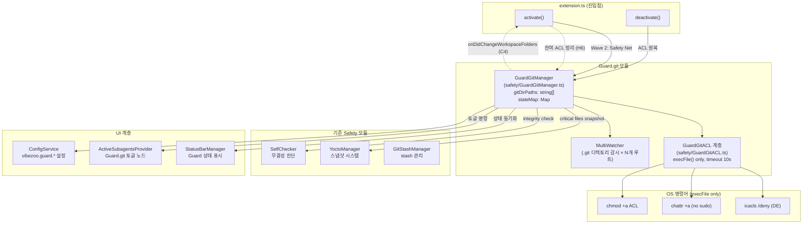
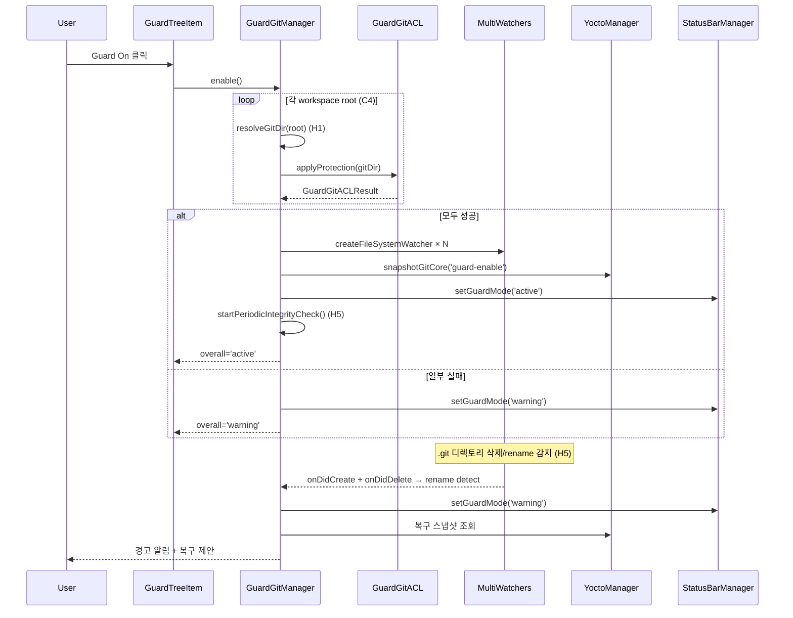
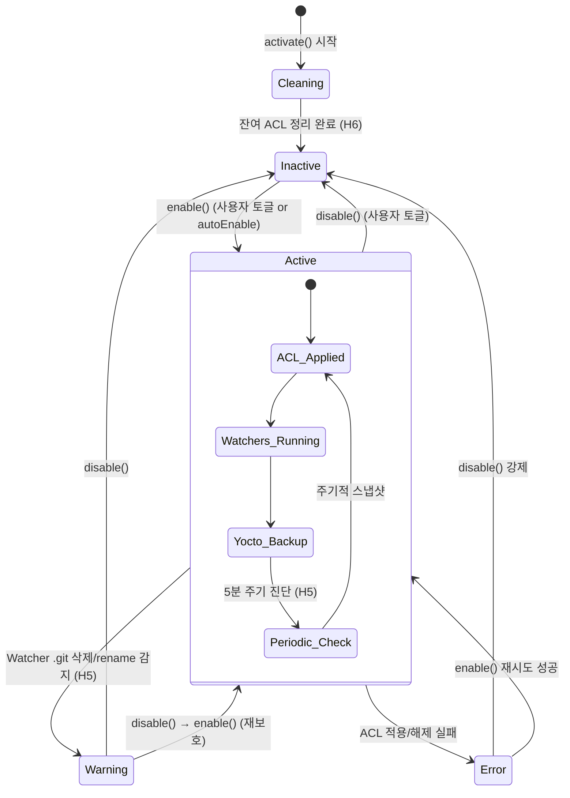

# Guard.git — 설계 계획서

> **버전**: 1.1.0 | **날짜**: 2026-06-05 | **대상**: VibeZoo v0.14.2+
>
> **v1.1.0**: Debug 피드백 루프백 — Critical 4건, High 6건 해결 방안 반영 (아래 ## 11 참조)

---

## 1. 개요

AI 에이전트가 실수로 `rm -rf *` / `rmdir /s /q` 등을 실행하여 프로젝트의 `.git` 폴더가 통째로 삭제되는 것을 방지하는 **Guard.git** 기능 설계.

### 1.1 핵심 요구사항

| # | 요구사항 | 우선순위 |
|---|---------|---------|
| R1 | `.git` 폴더 삭제를 OS 레벨에서 차단 (읽기/쓰기/편집 허용, 삭제만 금지) | P0 |
| R2 | VibeZoo 탭에서 Guard.git On/Off 토글 가능한 UI 제공 | P0 |
| R3 | 기존 Safety 모듈(GitStashManager, YoctoManager, SelfCheck)과 통합 | P1 |
| R4 | Windows (icacls) 및 cross-platform 대응 | P0 |
| R5 | Guard 활성화/비활성화 시 ACL 원복 처리 | P0 |
| R6 | **멀티 루트 워크스페이스 지원 (C4)** | P0 |
| R7 | **Shell injection 방지 (`execFile` 전환) (C1)** | P0 |

---

## 2. 아키텍처 개요



### 2.1 5-Layer 방어 체계

```
┌─────────────────────────────────────────────┐
│ Layer 5: TreeView UI 토글                    │  Vibezoo 사이드바
├─────────────────────────────────────────────┤
│ Layer 4: SelfCheck .git 무결성 진단          │  SelfChecker.checkGitGuardIntegrity()
│          (5분 주기 자동 진단 — H5 대응)       │
├─────────────────────────────────────────────┤
│ Layer 3: Yocto .git 핵심 파일 스냅샷         │  YoctoManager.snapshotGitCore()
├─────────────────────────────────────────────┤
│ Layer 2: MultiWatcher 존재 감시              │  vscode.workspace.createFileSystemWatcher
│          (rename 감지: create+delete — H5)   │
├─────────────────────────────────────────────┤
│ Layer 1: OS ACL 삭제 방지                    │  icacls / chattr / chmod +a
│          (execFile only, no shell — C1)      │
└─────────────────────────────────────────────┘
```

---

## 3. 모듈 상세 설계

### 3.1 [`GuardGitManager`](extension/src/safety/GuardGitManager.ts) — 핵심 오케스트레이터

```typescript
// Guard.git 상태
export type GuardGitState = 'active' | 'inactive' | 'error' | 'warning';

// Guard.git ACL 작업 결과
export interface GuardGitACLResult {
  success: boolean;
  error?: string;
  command?: string;       // 실행된 OS 명령어 (디버깅용)
  stdout?: string;
  stderr?: string;
}

// Guard.git 무결성 상태
export interface GuardGitIntegrity {
  exists: boolean;
  protected: boolean;     // ACL 적용 여부
  headRef: string | null; // HEAD 참조 값
  objectCount: number;    // objects/ 내 파일 수
  refCount: number;       // refs/ 내 파일 수
}
```

**클래스 시그니처 (C4: 멀티 루트 대응, H6: 잔여 ACL 정리):**

```typescript
export class GuardGitManager {
  // ── 상태 ──
  private stateMap: Map<string, GuardGitState> = new Map(); // path → state (C4)
  private gitDirPaths: string[] = [];   // C4: 배열로 변경 (曾: string | null)
  private acl: IGuardGitACL;
  private watchers: Map<string, vscode.FileSystemWatcher> = new Map(); // C4
  private yocto: YoctoManager | null = null;
  private statusBar: StatusBarManager | null = null;
  private selfCheckInterval: NodeJS.Timeout | null = null;  // H5
  private disposables: vscode.Disposable[] = [];

  constructor();

  // ── 생명주기 ──
  activate(context: vscode.ExtensionContext, yocto: YoctoManager): Promise<void>;
  dispose(): Promise<void>; // ACL 원복 + watchers 해제

  // ── Guard 토글 ──
  enable(): Promise<GuardGitACLResult>;
  disable(): Promise<GuardGitACLResult>;
  isEnabled(): boolean;      // any gitDirPath가 active인지
  getState(path: string): GuardGitState;  // C4: 경로별 상태 조회

  // ── 무결성 ──
  checkIntegrity(): Promise<GuardGitIntegrity[]>;
  startPeriodicIntegrityCheck(intervalMs: number): void;  // H5: 주기 진단
  stopPeriodicIntegrityCheck(): void;

  // ── Yocto 연동 ──
  createGitSnapshot(trigger: 'guard-enable' | 'guard-periodic' | 'guard-pre-danger'): Promise<void>;

  // ── 상태바 연동 ──
  bindStatusBar(statusBar: StatusBarManager): void;

  // ── 이벤트 ──
  onChange(cb: (stateSummary: { overall: GuardGitState; paths: Map<string, GuardGitState> }) => void): void;

  // ── 휴리스틱: 자동 활성화 판단 ──
  shouldAutoEnable(): boolean;

  // ── H1: Git Worktree 탐지 ──
  /** .git이 파일인지 디렉토리인지 확인 후 실제 git dir 경로 반환 */
  private resolveGitDir(workspaceRoot: string): string | null;

  // ── H6: 잔여 ACL 정리 ──
  /** activate() 시 호출: 기존 .git에 남아있는 Guard ACL 제거 */
  private async cleanupResidualACL(): Promise<void>;
}
```

**핵심 로직 흐름:**



**`enable()` / `disable()` 상세 시퀀스:**

| 단계 | 액션 | 실패 처리 |
|------|------|----------|
| `enable()` | 1. `cleanupResidualACL()` → 잔여 ACL 제거 (H6)<br>2. 모든 workspace root에 대해:<br> a. `resolveGitDir(root)` → .git 실제 경로 확인 (H1)<br> b. `checkProtection()` → 이미 적용됐으면 skip<br> c. `applyProtection()` → ACL 적용<br>3. 각 gitDir에 대해 `startWatcher()` → 감시 시작 (C4)<br>4. `createGitSnapshot('guard-enable')` → 스냅샷<br>5. `startPeriodicIntegrityCheck()` → 5분 주기 진단 (H5)<br>6. `statusBar.setGuardMode('active')` → UI 갱신<br>7. `fire onChanged` → TreeView 갱신 | 2c 실패: 해당 경로 state='error', 다른 경로 계속 진행<br>4 실패: 로그 경고, 계속 진행 |
| `disable()` | 1. 모든 watcher `stopWatcher()` → 감시 중지<br>2. 모든 gitDir에 대해 `removeProtection()` → ACL 원복<br>3. `stopPeriodicIntegrityCheck()` → 주기 진단 중지<br>4. `statusBar.setGuardMode('safe')` → UI 갱신<br>5. `fire onChanged` → TreeView 갱신 | 2 실패: state='error', 사용자에게 수동 제거 안내 |
| `deactivate()` | 1. 모든 watcher 중지<br>2. `removeProtection()` → ACL 원복 보장<br>3. 주기 진단 중지<br>4. 정리 | 2 실패: 로그 경고 (확장 종료 시 필수 원복) |

---

### 3.2 [`GuardGitACL`](extension/src/safety/GuardGitACL.ts) — OS ACL 추상화 계층

**C1 핵심 변경: `exec()` → `execFile()`, 경로 검증, 타임아웃**

```typescript
export interface IGuardGitACL {
  /** .git 디렉토리에 삭제 방지 ACL 적용 */
  applyProtection(gitDir: string): Promise<GuardGitACLResult>;

  /** .git 디렉토리에서 ACL 제거 (원상복구) */
  removeProtection(gitDir: string): Promise<GuardGitACLResult>;

  /** 현재 ACL 상태 확인 */
  checkProtection(gitDir: string): Promise<boolean>;

  /** 이 OS에서 지원되는 방식의 이름 */
  readonly method: string;

  /** 사전 점검: 필요한 도구가 설치되어 있고, FS가 ACL을 지원하는지 (H4) */
  isAvailable(gitDir: string): Promise<boolean>;
}
```

#### 공통 유틸리티: 경로 검증 (C1)

```typescript
// GuardGitACL.ts — 모든 플랫폼 구현체에서 공통 사용
const SAFE_PATH_REGEX = /^[a-zA-Z0-9_\-\\:. \/@]+$/;

function validatePath(gitDir: string): void {
  if (!SAFE_PATH_REGEX.test(gitDir)) {
    throw new Error(`Guard.git: 안전하지 않은 경로 문자 포함 — "${gitDir}"`);
  }
  // 경로 길이 제한 (Windows MAX_PATH ≈ 260)
  if (gitDir.length > 250) {
    throw new Error(`Guard.git: 경로가 너무 깁니다 (${gitDir.length}자)`);
  }
}

// execFile 래퍼 (C1, C2: 타임아웃 통합)
function execFileSafe(
  command: string,
  args: string[],
  timeoutMs: number = 10000
): Promise<{ stdout: string; stderr: string }> {
  return new Promise((resolve, reject) => {
    const child = child_process.execFile(command, args, {
      timeout: timeoutMs,       // C1/C2: 10초 타임아웃
      windowsHide: true,        // C1: 윈도우에서 콘솔 창 숨김
      shell: false,             // C1: 셸 경유 금지 (주입 방지)
    }, (error, stdout, stderr) => {
      if (error) {
        // kill signal 또는 timeout → 구체적 에러 전파
        reject(error);
      } else {
        resolve({ stdout, stderr });
      }
    });
  });
}
```

#### Windows 구현: [`WindowsGuardGitACL`](extension/src/safety/GuardGitACL.ts)

```
전략: icacls deny Delete (DE)
━━━━━━━━━━━━━━━━━━━━━━━━━━━━━━━━━━━━━━━━━━━━━━━━━

적용:
  execFile('icacls', [gitDir, '/deny', '*S-1-1-0:(DE)'], { timeout: 10000 })
  → S-1-1-0 = Everyone (SID 기반으로 로케일 독립)

해제:
  execFile('icacls', [gitDir, '/remove:d', '*S-1-1-0'], { timeout: 10000 })

확인:
  execFile('icacls', [gitDir], { timeout: 5000 }) → stdout.includes('DENY')
```

| 속성 | 값 |
|------|-----|
| DE | Delete — 폴더 자체 삭제 방지 |
| DC | Delete Child — 자식 삭제 방지 (**미적용**: git GC 등 허용) |

**설계 의사결정**: DC(Delete Child)는 **적용하지 않는다.** `.git/objects/`, `.git/refs/` 내 파일 삭제가 필요한 정상 git 작업(`git gc`, `git prune`, `git repack`, `git checkout`)을 방해하지 않기 위함. 대신 Yocto 스냅샷 + FileSystemWatcher + 주기적 SelfCheck(H5)로 다층 방어.

```typescript
class WindowsGuardGitACL implements IGuardGitACL {
  readonly method = 'icacls (DE deny)';

  async isAvailable(gitDir: string): Promise<boolean> {
    // C1: 경로 검증
    validatePath(gitDir);
    // H4: NTFS 여부 간접 확인 (icacls는 NTFS에서만 동작)
    try {
      await execFileSafe('icacls', [gitDir], 3000);
      return true;
    } catch {
      // FAT32/exFAT 등 → ACL 미지원
      console.warn('[Guard.git] icacls 실패 — FS가 ACL을 지원하지 않을 수 있음');
      return false;
    }
  }

  async applyProtection(gitDir: string): Promise<GuardGitACLResult> {
    validatePath(gitDir);  // C1
    try {
      const result = await execFileSafe('icacls', [
        gitDir, '/deny', '*S-1-1-0:(DE)'
      ]);
      return { success: true, command: `icacls ${gitDir} /deny *S-1-1-0:(DE)`, stdout: result.stdout, stderr: result.stderr };
    } catch (err: any) {
      return { success: false, error: err.message };
    }
  }

  async removeProtection(gitDir: string): Promise<GuardGitACLResult> {
    validatePath(gitDir);  // C1
    try {
      const result = await execFileSafe('icacls', [
        gitDir, '/remove:d', '*S-1-1-0'
      ]);
      return { success: true, command: `icacls ${gitDir} /remove:d *S-1-1-0`, stdout: result.stdout, stderr: result.stderr };
    } catch (err: any) {
      return { success: false, error: err.message };
    }
  }

  async checkProtection(gitDir: string): Promise<boolean> {
    try {
      const { stdout } = await execFileSafe('icacls', [gitDir], 5000);
      return stdout.includes('DENY');
    } catch {
      return false;
    }
  }
}
```

#### Linux 구현: [`LinuxGuardGitACL`](extension/src/safety/GuardGitACL.ts)

**C2/C3 핵심 변경: `sudo` 절대 사용 금지, `setfacl` fallback 완전 제거**

```
전략: chattr +a (append-only) — sudo 없이 시도, 실패 시 즉시 Watcher+Yocto
━━━━━━━━━━━━━━━━━━━━━━━━━━━━━━━━━━━━━━━━━━━━━━━━━

C2: 절대 sudo를 사용하지 않음.
    - 사용자가 디렉토리 소유자면 sudo 없이 chattr 가능 → 시도
    - 실패 시 즉시 fallback: Watcher + Yocto only 모드
    - execFile() timeout 10초로 무한 행 방지

C3: setfacl fallback 제거.
    - setfacl로는 디렉토리 삭제를 방지할 수 없음 (부모 디렉토리 권한이 결정)
    - r-x는 git 동작을 막음 (파일 생성/쓰기 차단)
    - Linux fallback은 Watcher + Yocto only로 일원화

적용:
  execFile('chattr', ['+a', gitDir], { timeout: 10000 })

해제:
  execFile('chattr', ['-a', gitDir], { timeout: 10000 })

확인:
  execFile('lsattr', [gitDir], { timeout: 5000 }) → stdout.includes('a')
```

**H2: `chattr +a` 과잉 보호 문서화**

| `chattr +a` 효과 | git 작업 영향 |
|---|---|
| 디렉토리 내 **파일 추가** 허용 | ✅ git add, commit, checkout 정상 |
| 디렉토리 내 **파일 수정** 허용 | ✅ git reflog, index 갱신 정상 |
| 디렉토리 내 **파일 삭제 방지** | ❌ `git gc`, `git prune`, `git repack` 실패 가능 |
| 디렉토리 **자체 삭제 방지** | ✅ 핵심 목표 달성 |

→ Linux에서는 `chattr +a`를 **optional** 기능으로 격하하고, 1차 방어는 Watcher + Yocto에 의존한다. 사용자가 `vibezoo.guard.linuxUseChattr` 설정으로 명시적 활성화 가능. 기본값은 `false` (Watcher+Yocto only).

```typescript
class LinuxGuardGitACL implements IGuardGitACL {
  readonly method = 'chattr +a';

  async isAvailable(gitDir: string): Promise<boolean> {
    validatePath(gitDir);  // C1
    // C2: chattr이 사용 가능한지 확인 (sudo 없이)
    try {
      // H4: FS 타입 확인 (ext4, btrfs, xfs만 chattr 지원)
      const { stdout } = await execFileSafe('stat', ['-f', '-c', '%T', gitDir], 3000);
      const fsType = stdout.trim();
      const supportedFS = ['ext2/ext3', 'ext4', 'btrfs', 'xfs', 'tmpfs'];  // tmpfs도 가능
      if (!supportedFS.some(fs => fsType.includes(fs))) {
        console.log(`[Guard.git] FS 타입 '${fsType}'는 chattr 미지원 → Watcher+Yocto fallback`);
        return false;
      }
      // chattr 실행 가능 여부 확인 (sudo 없이)
      await execFileSafe('chattr', ['-R', '--help'], 3000);
      // 소유권 확인
      try {
        await execFileSafe('chattr', ['+a', gitDir], 3000);
        // 성공 시 바로 해제 (pre-flight check)
        await execFileSafe('chattr', ['-a', gitDir], 3000);
        return true;
      } catch {
        console.log('[Guard.git] chattr 권한 없음 → Watcher+Yocto fallback');
        return false;
      }
    } catch {
      return false;
    }
  }

  async applyProtection(gitDir: string): Promise<GuardGitACLResult> {
    validatePath(gitDir);  // C1
    try {
      // C2: sudo 없이 chattr 시도
      const result = await execFileSafe('chattr', ['+a', gitDir]);
      return { success: true, command: `chattr +a ${gitDir}`, stdout: result.stdout, stderr: result.stderr };
    } catch (err: any) {
      // C2: 실패 시 즉시 fallback — Watcher + Yocto only
      return { success: false, error: `chattr 실패 (Watcher+Yocto fallback): ${err.message}` };
    }
  }

  async removeProtection(gitDir: string): Promise<GuardGitACLResult> {
    validatePath(gitDir);  // C1
    try {
      const result = await execFileSafe('chattr', ['-a', gitDir]);
      return { success: true, command: `chattr -a ${gitDir}`, stdout: result.stdout, stderr: result.stderr };
    } catch (err: any) {
      return { success: false, error: err.message };
    }
  }

  async checkProtection(gitDir: string): Promise<boolean> {
    try {
      const { stdout } = await execFileSafe('lsattr', [gitDir], 5000);
      // lsattr 출력: "----a-------- ./git" → 'a' 속성이 있으면 보호 중
      return /^[^ ]*a[^ ]* /.test(stdout);
    } catch {
      return false;
    }
  }
}
```

#### macOS 구현: [`MacOSGuardGitACL`](extension/src/safety/GuardGitACL.ts)

```
전략: chmod +a ACL
━━━━━━━━━━━━━━━━━━━━━━━━━━━━━━━━━━━━━━━━━━━━━━━━━

적용:
  execFile('chmod', ['+a', 'everyone deny delete', gitDir], { timeout: 10000 })

해제:
  execFile('chmod', ['-a', 'everyone deny delete', gitDir], { timeout: 10000 })

확인:
  execFile('ls', ['-le', gitDir], { timeout: 5000 }) → stdout.includes('deny delete')
```

**Fallback**: `chflags uchg` → 삭제는 방지하나 내부 쓰기도 막힘 → 경고 후 Yocto 의존.

#### Factory 함수

```typescript
export function createGuardGitACL(): IGuardGitACL {
  const platform = process.platform;
  switch (platform) {
    case 'win32':  return new WindowsGuardGitACL();
    case 'linux':  return new LinuxGuardGitACL();
    case 'darwin': return new MacOSGuardGitACL();
    default:       return new NoopGuardGitACL(); // unsupported
  }
}
```

---

### 3.3 FileSystemWatcher — Layer 2 (C4: 멀티 루트, H5: rename 감지)

[`GuardGitManager`](extension/src/safety/GuardGitManager.ts) 내부에서 관리:

```typescript
// C4: Map<string, FileSystemWatcher> — 각 .git 경로당 독립 watcher
private watchers: Map<string, vscode.FileSystemWatcher> = new Map();

private startWatcher(gitDirPath: string): void {
  const parentDir = path.dirname(gitDirPath);
  const pattern = new vscode.RelativePattern(parentDir, '.git');

  const watcher = vscode.workspace.createFileSystemWatcher(pattern, false, false, false);

  watcher.onDidDelete((uri) => {
    // H5: rename 감지를 위해 일정 시간 내 create와 쌍으로 확인
    this.pendingDeletions.set(gitDirPath, Date.now());
    setTimeout(() => {
      if (this.pendingDeletions.has(gitDirPath)) {
        // timeout 내에 create가 없었음 → 진짜 삭제
        this.handleGitDeletion(gitDirPath);
        this.pendingDeletions.delete(gitDirPath);
      }
    }, 2000); // 2초 내 create 없으면 진짜 삭제로 판단
  });

  // H5: rename 감지 — create + delete 조합
  watcher.onDidCreate((uri) => {
    const pendingTime = this.pendingDeletions.get(gitDirPath);
    if (pendingTime && (Date.now() - pendingTime) < 2000) {
      // 2초 내 delete → create: rename으로 판단
      console.warn(`[Guard.git] ⚠️ .git 디렉토리 rename 감지! (ACL bypass 가능)`);
      this.pendingDeletions.delete(gitDirPath);
      this.stateMap.set(gitDirPath, 'warning');
      this.statusBar?.setGuardMode('warning');
      this.notifyListeners();
      NotificationThrottle.showWarning(
        '⚠️ .git 폴더가 이름 변경되었습니다! (ACL bypass 가능) Yocto에서 복구하시겠습니까?',
        '복구하기', '무시'
      ).then(choice => {
        if (choice === '복구하기') {
          vscode.commands.executeCommand('vibezoo.instantRewind');
        }
      });
    }
  });

  this.watchers.set(gitDirPath, watcher);
}

// pending deletions — rename 감지를 위한 임시 상태 (H5)
private pendingDeletions: Map<string, number> = new Map();

private handleGitDeletion(gitDirPath: string): void {
  console.error(`[Guard.git] ⚠️ .git 디렉토리 삭제 감지! (${gitDirPath})`);
  this.stateMap.set(gitDirPath, 'warning');
  this.statusBar?.setGuardMode('warning');
  this.notifyListeners();
  NotificationThrottle.showWarning(
    '⚠️ .git 폴더가 삭제되었습니다! Guard.git이 방어를 시도했지만 우회되었을 수 있습니다. Yocto에서 복구하시겠습니까?',
    '복구하기', '무시'
  ).then(choice => {
    if (choice === '복구하기') {
      vscode.commands.executeCommand('vibezoo.instantRewind');
    }
  });
}

private stopWatcher(gitDirPath: string): void {
  const watcher = this.watchers.get(gitDirPath);
  if (watcher) {
    watcher.dispose();
    this.watchers.delete(gitDirPath);
  }
}

private stopAllWatchers(): void {
  for (const [path, watcher] of this.watchers) {
    watcher.dispose();
  }
  this.watchers.clear();
}
```

**C4: 워크스페이스 폴더 변경 이벤트 대응**

```typescript
// GuardGitManager.activate() 내
this.disposables.push(
  vscode.workspace.onDidChangeWorkspaceFolders((e) => {
    // 추가된 폴더: .git 찾아서 ACL 적용
    for (const added of e.added) {
      const gitDir = this.resolveGitDir(added.uri.fsPath);
      if (gitDir) {
        this.gitDirPaths.push(gitDir);
        this.stateMap.set(gitDir, 'inactive');
        if (this.isEnabled()) {
          this.acl.applyProtection(gitDir).then(() => {
            this.startWatcher(gitDir);
            this.stateMap.set(gitDir, 'active');
          }).catch(err => {
            console.warn(`[Guard.git] 새 워크스페이스 ACL 적용 실패:`, err);
            this.stateMap.set(gitDir, 'error');
          });
        }
      }
    }
    // 제거된 폴더: ACL 원복 + watcher 해제
    for (const removed of e.removed) {
      const toRemove = this.gitDirPaths.filter(p => p.startsWith(removed.uri.fsPath));
      for (const p of toRemove) {
        this.acl.removeProtection(p).catch(() => {});
        this.stopWatcher(p);
        this.gitDirPaths = this.gitDirPaths.filter(x => x !== p);
        this.stateMap.delete(p);
      }
    }
  })
);
```

---

### 3.4 기존 Safety 모듈과의 통합

#### 3.4.1 YoctoManager 연동

[`YoctoManager`](extension/src/safety/YoctoManager.ts)에 `.git` 핵심 파일 전용 스냅샷 메서드 추가:

```typescript
// YoctoManager에 추가할 메서드
/**
 * Guard.git 전용: .git 디렉토리의 핵심 파일들만 스냅샷
 *
 * 대상 파일:
 *   .git/HEAD          — 현재 브랜치 참조
 *   .git/config        — 저장소 설정
 *   .git/refs/heads/*  — 로컬 브랜치 refs
 *   .git/refs/remotes/*— 리모트 refs
 *   .git/refs/stash    — stash ref (있을 경우)
 *   .git/index         — 스테이징 영역 (있을 경우)
 *
 * H3: trigger 타입은 내부적으로 createSnapshot('auto')를 호출하고,
 *     metadata.guardTrigger 필드로 guard 전용 trigger 기록.
 */
async snapshotGitCore(metadata: { guardTrigger: 'guard-enable' | 'guard-periodic' | 'guard-pre-danger' }): Promise<YoctoSnapshot>

/**
 * Guard 감지: .git 내 파일 목록을 해시 맵으로 비교하여 변경 감지
 */
async detectGitChanges(lastSnapshot: YoctoSnapshot): Promise<{
  added: string[];
  removed: string[];
  modified: string[];
}>
```

**H3: YoctoSnapshot.trigger 타입 확장** — [`types/index.ts`](extension/src/types/index.ts)의 `YoctoSnapshot.trigger` union에 Guard 전용 리터럴을 추가하지 않고, `snapshotGitCore()` 내부에서 `createSnapshot('auto')`를 호출하고 `metadata.guardTrigger` 필드를 별도 관리한다. 이 방식은 기존 union 타입을 오염시키지 않으면서 Guard 전용 트리거 정보를 보존한다.

스냅샷 저장 경로: `~/.zoo-code/yocto/{sessionId}/guard-git-{timestamp}/`

#### 3.4.2 SelfCheck 통합

[`SelfCheck.ts`](extension/src/safety/SelfCheck.ts)의 `SelfChecker` 클래스에 `.git` 무결성 진단 항목 추가:

```typescript
// SelfChecker.runAll()의 Promise.allSettled 배열에 추가
this.checkGitGuardIntegrity(),

// 새 메서드
async checkGitGuardIntegrity(): Promise<SelfCheckItem> {
  const base: SelfCheckItem = {
    name: 'Git Guard Integrity',
    status: 'passed',
    message: '.git 디렉토리 보호 상태 정상',
  };

  const guardManager = getGuardGitManager(); // 싱글톤 접근

  if (!guardManager) {
    base.status = 'warning';
    base.message = 'Guard.git이 초기화되지 않음';
    return base;
  }

  const integrities = await guardManager.checkIntegrity();

  // C4: 멀티 루트 — 모든 경로 검사
  const failedPaths = integrities.filter(i => !i.exists);
  const unprotectedPaths = integrities.filter(i => i.exists && !i.protected && guardManager.isEnabled());

  if (failedPaths.length > 0) {
    base.status = 'failed';
    base.message = `${failedPaths.length}개 .git 디렉토리가 존재하지 않음`;
    base.autoRecoverable = true;
    return base;
  }

  if (unprotectedPaths.length > 0) {
    base.status = 'warning';
    base.message = 'Guard가 활성화되어 있으나 ACL이 적용되지 않은 .git 경로 있음';
    base.autoRecoverable = true;
    return base;
  }

  base.detail = integrities.map(i =>
    `${i.headRef} (objects:${i.objectCount}, refs:${i.refCount})`
  ).join('; ');
  return base;
}
```

#### 3.4.3 GitStashManager 관계

[`GitStashManager`](extension/src/safety/GitStashManager.ts)는 YOLO 모드 진입/퇴장 시 git stash를 다룬다. Guard.git과의 직접적인 통합은 불필요하나, Guard가 활성화된 상태에서 `git stash pop` 시 `.git` 내부에 refs/stash가 생성되므로 정상 동작을 방해하지 않아야 한다 — DC 미적용 결정과 일치.

---

### 3.5 Configuration 설계

[`package.json`](extension/package.json) `contributes.configuration.properties`에 추가:

```jsonc
{
  "vibezoo.guard.enabled": {
    "type": "boolean",
    "default": true,
    "description": "%vibezoo.guard.enabled.description%"
    // "Guard.git: AI 에이전트의 실수로 .git 폴더가 삭제되는 것을 방지합니다."
  },
  "vibezoo.guard.autoEnable": {
    "type": "boolean",
    "default": true,
    "description": "%vibezoo.guard.autoEnable.description%"
    // "Guard.git: YOLO 모드 진입 시 자동으로 Guard를 활성화합니다."
  },
  "vibezoo.guard.yoctoBackupEnabled": {
    "type": "boolean",
    "default": true,
    "description": "%vibezoo.guard.yoctoBackupEnabled.description%"
    // "Guard.git: .git 핵심 파일을 yocto에 주기적으로 스냅샷합니다."
  },
  "vibezoo.guard.yoctoBackupIntervalMin": {
    "type": "number",
    "default": 30,
    "minimum": 5,
    "maximum": 1440,
    "description": "%vibezoo.guard.yoctoBackupIntervalMin.description%"
    // "Guard.git: .git 스냅샷 간격 (분)"
  },
  "vibezoo.guard.integrityCheckIntervalMin": {
    "type": "number",
    "default": 5,
    "minimum": 1,
    "maximum": 60,
    "description": "%vibezoo.guard.integrityCheckIntervalMin.description%"
    // "Guard.git: .git 무결성 자동 진단 간격 (분) — H5 대응"
  },
  "vibezoo.guard.linuxUseChattr": {
    "type": "boolean",
    "default": false,
    "description": "%vibezoo.guard.linuxUseChattr.description%"
    // "Guard.git: Linux에서 chattr +a 사용 (내부 파일 삭제도 방지 → git gc 실패 가능) — H2 대응"
  }
}
```

[`ConfigService`](extension/src/config/ConfigService.ts)에 추가:

```typescript
public static getGuardEnabled(): boolean {
  return vscode.workspace.getConfiguration('vibezoo').get('guard.enabled', true);
}

public static getGuardAutoEnable(): boolean {
  return vscode.workspace.getConfiguration('vibezoo').get('guard.autoEnable', true);
}

public static getGuardYoctoBackupEnabled(): boolean {
  return vscode.workspace.getConfiguration('vibezoo').get('guard.yoctoBackupEnabled', true);
}

public static getGuardYoctoBackupIntervalMin(): number {
  return vscode.workspace.getConfiguration('vibezoo').get('guard.yoctoBackupIntervalMin', 30);
}

public static getGuardIntegrityCheckIntervalMin(): number {
  return vscode.workspace.getConfiguration('vibezoo').get('guard.integrityCheckIntervalMin', 5);
}

public static getGuardLinuxUseChattr(): boolean {
  return vscode.workspace.getConfiguration('vibezoo').get('guard.linuxUseChattr', false);
}
```

---

### 3.6 UI 설계

#### 3.6.1 TreeView: Guard.git 토글 노드

[`ActiveSubagentsProvider`](extension/src/ui/TreeViewProviders.ts)에 Guard.git 특수 노드 추가 (기존 `_bridge`, `_cim` 패턴을 따름):

```typescript
// ActiveSubagentsProvider에 추가할 메서드
setGuardGitStatus(state: GuardGitState): void {
  const nodeId = '_guard_git';
  if (state === 'inactive') {
    this.nodes.delete(nodeId);
  } else {
    const statusIcons: Record<GuardGitState, string> = {
      active: '$(shield)',
      inactive: '',
      warning: '$(warning)',
      error: '$(error)',
    };
    // C4: tooltip에 보호 중인 경로 수 표시
    const guardManager = getGuardGitManager();
    const pathCount = guardManager?.getProtectedPathCount() ?? 1;
    this.nodes.set(nodeId, {
      id: nodeId,
      name: 'Guard.git',
      status: state === 'active' ? 'running' : state === 'warning' ? 'error' : 'idle',
      currentTask: state === 'active' ? `.git Protected (${pathCount} roots)`
        : state === 'warning' ? '⚠️ .git Compromised'
        : 'Unknown',
      port: 0,
      startTime: Date.now(),
    });
  }
  this._onDidChangeTreeData.fire(undefined);
}
```

TreeItem 렌더링 (기존 `_bridge`, `_cim` 패턴으로 `SubagentTreeItem` 생성자에 추가):

```typescript
// SubagentTreeItem constructor 내
if (node.id === '_guard_git') {
  const stateLabel = node.status === 'running' ? 'Active'
    : node.status === 'error' ? 'Warning'
    : 'Inactive';
  const statusIcon = node.status === 'running' ? '$(shield)' : '$(warning)';
  this.label = `${statusIcon} Guard.git`;
  this.description = node.currentTask;
  this.tooltip = new vscode.MarkdownString(
    `**Guard.git**\n\nStatus: ${stateLabel}\n.git directory: Protected\n\nClick to toggle Guard.git on/off.`
  );
  this.contextValue = 'guardGit';
  this.command = {
    command: 'vibezoo.toggleGuardGit',
    title: 'Toggle Guard.git',
  };
  return;
}
```

#### 3.6.2 StatusBar 연동

[`StatusBarManager`](extension/src/ui/StatusBarManager.ts)는 이미 [`GuardMode`](extension/src/ui/StatusBarManager.ts:96) 타입과 [`setGuardMode()`](extension/src/ui/StatusBarManager.ts:206) 메서드, [`_composeText()`](extension/src/ui/StatusBarManager.ts:143) / [`_composeTooltip()`](extension/src/ui/StatusBarManager.ts:123) 내 Guard 표시 로직이 구현되어 있음. Guard.git과의 연동은 기존 인프라에 상태값만 전달하면 된다:

```typescript
// StatusBarManager._composeText() 내 기존 로직 활용
// this._guardMode가 'active' → '$(zap) VibeZoo Guard' 표시
// this._guardMode가 'warning' → '$(warning) VibeZoo' 표시
```

#### 3.6.3 Command Palette

[`package.json`](extension/package.json)에 `vibezoo.toggleGuardGit` 명령어 등록:

```jsonc
{
  "command": "vibezoo.toggleGuardGit",
  "title": "%vibezoo.toggleGuardGit.title%"
  // "VibeZoo: Toggle Guard.git Protection"
}
```

기존 `vibezoo.toggleFileGuard`(66-68)는 제거하고 `vibezoo.toggleGuardGit`으로 대체.

---

### 3.7 Guard 활성화/비활성화 라이프사이클 (H6: 잔여 ACL 정리 추가)



**H1: Worktree 탐지 로직**

```typescript
/**
 * .git이 실제 디렉토리인지, worktree 참조 파일인지 확인
 *
 * Worktree 환경:
 *   $ cat .git
 *   gitdir: /path/to/main/.git/worktrees/feature-branch
 *
 * 일반 환경:
 *   .git/ — 디렉토리
 */
private resolveGitDir(workspaceRoot: string): string | null {
  const dotGitPath = path.join(workspaceRoot, '.git');

  try {
    const stat = fs.statSync(dotGitPath);

    if (stat.isDirectory()) {
      return dotGitPath;  // 일반 git 저장소
    }

    if (stat.isFile()) {
      // worktree: .git 파일 내용 파싱
      const content = fs.readFileSync(dotGitPath, 'utf-8').trim();
      const match = content.match(/^gitdir:\s*(.+)$/);
      if (match) {
        const actualGitDir = match[1].trim();
        // 상대 경로일 경우 workspaceRoot 기준 절대 경로로 변환
        const resolved = path.isAbsolute(actualGitDir)
          ? actualGitDir
          : path.resolve(workspaceRoot, actualGitDir);
        if (fs.existsSync(resolved) && fs.statSync(resolved).isDirectory()) {
          console.log(`[Guard.git] Worktree 감지: ${dotGitPath} → ${resolved}`);
          return resolved;
        }
      }
    }
  } catch {
    // .git 없음
  }

  return null;
}
```

---

## 4. Types 확장

[`types/index.ts`](extension/src/types/index.ts)에 추가:

```typescript
// ── Guard.git (v0.14.3) ──────────────────────────────────

export type GuardGitState = 'active' | 'inactive' | 'error' | 'warning';

export interface GuardGitACLResult {
  success: boolean;
  error?: string;
  command?: string;
  stdout?: string;
  stderr?: string;
}

export interface GuardGitIntegrity {
  exists: boolean;
  protected: boolean;
  headRef: string | null;
  objectCount: number;
  refCount: number;
}

// H3: YoctoSnapshot.trigger union에 Guard trigger를 직접 추가하지 않고,
// snapshotGitCore() 내부에서 metadata.guardTrigger 별도 관리.
// → 기존 union 타입('manual'|'auto'|'yolo-enter'|'pre-edit') 유지
```

---

## 5. extension.ts 통합 포인트 (C4 멀티 루트, H6 잔여 ACL 정리 반영)

[`extension.ts`](extension/src/extension.ts)에서 수정할 지점:

```typescript
// ── Import 추가 ──
import { GuardGitManager } from './safety/GuardGitManager';

// ── 변수 선언 추가 ──
let guardGit: GuardGitManager;

// ── activate() 내 Wave 2: Safety Net 섹션에 추가 ──
// (line 131~139, yocto/gitStash 생성 직후)
if (ConfigService.getGuardEnabled()) {
  guardGit = new GuardGitManager();
  guardGit.bindStatusBar(statusBar);

  // H6: activate() 시작 시 잔여 ACL 감지 → 정리
  // GuardGitManager.activate() 내에서 cleanupResidualACL() 호출
  await guardGit.activate(context, yocto);

  // TreeView에 Guard 노드 등록
  guardGit.onChange((summary) => {
    subagentsProvider.setGuardGitStatus(summary.overall);
  });

  // autoEnable: YOLO 진입 시 자동 활성화
  if (ConfigService.getGuardAutoEnable()) {
    guardGit.enable().catch(err =>
      console.warn('[Guard.git] 자동 활성화 실패:', err)
    );
  }
}

// ── Command 등록 ──
context.subscriptions.push(
  vscode.commands.registerCommand('vibezoo.toggleGuardGit', async () => {
    if (!guardGit) {
      vscode.window.showWarningMessage('Guard.git이 초기화되지 않았습니다.');
      return;
    }
    if (guardGit.isEnabled()) {
      const result = await guardGit.disable();
      if (result.success) {
        vscode.window.showInformationMessage('🛡️ Guard.git: 보호가 해제되었습니다.');
      } else {
        vscode.window.showErrorMessage(`Guard.git 해제 실패: ${result.error}`);
      }
    } else {
      const result = await guardGit.enable();
      if (result.success) {
        vscode.window.showInformationMessage('🛡️ Guard.git: .git 폴더가 보호됩니다.');
      } else {
        vscode.window.showErrorMessage(`Guard.git 활성화 실패: ${result.error}`);
      }
    }
  })
);

// ── deactivate()에 ACL 원복 추가 ──
export function deactivate(): void {
  // ...existing code...
  guardGit?.disable().catch(err =>
    console.warn('[Guard.git] deactivate 원복 실패:', err)
  );
}
```

---

## 6. OS별 ACL 대응 매트릭스 (C1/C2/C3 반영)

| OS | 메커니즘 | 적용 명령어 | 해제 명령어 | exec 방식 | 제한사항 |
|----|---------|------------|-----------|----------|---------|
| **Windows** | `icacls` deny DE | `execFile('icacls', ['.git', '/deny', '*S-1-1-0:(DE)'])` | `execFile('icacls', ['.git', '/remove:d', '*S-1-1-0'])` | `execFile` | NTFS만 지원 |
| **Linux** | `chattr +a` (optional) | `execFile('chattr', ['+a', '.git'])` | `execFile('chattr', ['-a', '.git'])` | `execFile` | ext4/btrfs/xfs 지원; sudo 금지; 기본 비활성 (H2) |
| **macOS** | `chmod +a` ACL | `execFile('chmod', ['+a', 'everyone deny delete', '.git'])` | `execFile('chmod', ['-a', 'everyone deny delete', '.git'])` | `execFile` | APFS/HFS+ 지원 |

**Fallback 계층 (C2/C3 반영):**

| OS | 1차 시도 | Fallback | 최종 Fallback |
|----|---------|----------|-------------|
| Windows | `icacls` | — (Windows 표준) | Watcher + Yocto only |
| Linux | **Watcher + Yocto** (기본) | `chattr +a` (`linuxUseChattr: true` 시) | Watcher + Yocto only |
| macOS | `chmod +a` | `chflags uchg` (쓰기도 막힘 - 경고) | Watcher + Yocto only |
| 기타 | — | — | Watcher + Yocto only |

> **C3**: Linux `setfacl` fallback 제거. `setfacl -m u:$(whoami):r-x`는 디렉토리 삭제를 방지하지 못하며, `r-x`는 git 동작을 방해한다.

---

## 7. 파일 목록 (신규/수정)

### 7.1 신규 파일

| 파일 | 설명 |
|------|------|
| [`extension/src/safety/GuardGitManager.ts`](extension/src/safety/GuardGitManager.ts) | Guard.git 핵심 오케스트레이터 (멀티 루트, worktree, 잔여 ACL 정리) |
| [`extension/src/safety/GuardGitACL.ts`](extension/src/safety/GuardGitACL.ts) | OS ACL 추상화 계층 (execFile only, 경로 검증, FS 타입 확인) |

### 7.2 수정 파일

| 파일 | 변경 내용 |
|------|---------|
| [`extension/src/extension.ts`](extension/src/extension.ts) | GuardGitManager 생성 및 명령어 등록, deactivate 원복, H6 잔여 ACL 정리 호출 |
| [`extension/src/safety/YoctoManager.ts`](extension/src/safety/YoctoManager.ts) | `snapshotGitCore()`, `detectGitChanges()` 메서드 추가; H3 trigger는 metadata로 관리 |
| [`extension/src/safety/SelfCheck.ts`](extension/src/safety/SelfCheck.ts) | `checkGitGuardIntegrity()` 진단 항목 추가, 멀티 루트 대응 |
| [`extension/src/ui/TreeViewProviders.ts`](extension/src/ui/TreeViewProviders.ts) | `setGuardGitStatus()` 메서드, Guard 노드 TreeItem 추가, 멀티 루트 카운트 |
| [`extension/src/config/ConfigService.ts`](extension/src/config/ConfigService.ts) | Guard 관련 설정 메서드 추가 (`linuxUseChattr`, `integrityCheckIntervalMin`) |
| [`extension/src/types/index.ts`](extension/src/types/index.ts) | GuardGitState, GuardGitACLResult, GuardGitIntegrity 타입 추가 |
| [`extension/package.json`](extension/package.json) | toggleGuardGit 명령어, guard.* 설정 속성 추가, toggleFileGuard 제거 |
| [`extension/l10n/bundle.l10n.json`](extension/l10n/bundle.l10n.json) | Guard 관련 영문 로컬라이제이션 추가 |
| [`extension/l10n/bundle.l10n.ko.json`](extension/l10n/bundle.l10n.ko.json) | Guard 관련 한글 로컬라이제이션 추가 |

---

## 8. 예외 시나리오 (H5 rename 대응, C2/C3 Linux fallback 반영)

| 시나리오 | 감지 | 대응 |
|---------|------|------|
| `rm -rf *` | ACL이 `.git` 자체 삭제 차단 → 내용물은 삭제됨 | Watcher가 변경 감지 → Yocto 스냅샷으로 복구 제안 |
| `rmdir /s /q .git` | ACL이 폴더 삭제 차단 → `Access Denied` | OS 오류 발생, AI 에이전트에게 실패 피드백 |
| `del /f /s /q .git\*` | 내용물 삭제됨 (의도적 허용) | Watcher 감지 → Yocto 복구 |
| `.git` 폴더 rename (H5) | Watcher: 2초 내 `onDidDelete` + `onDidCreate` 감지 | rename bypass 경고 → SelfCheck로도 주기적 확인 |
| `move .git .git_backup` (H5) | Watcher rename 감지 + SelfCheck 5분 간격 진단 | 경고 알림 + Yocto 복구 제안 |
| 다른 프로세스가 ACL 제거 | 주기적 `checkProtection()` 호출 (5분 간격) (H5) | 상태 변경 감지 → 재적용 시도 |
| git GC/prune/repack 수행 | 정상 동작 (DC 미적용으로 내용 삭제 허용)<br>⚠️ Linux `chattr +a` 사용 시 실패 가능 (H2) | 간섭 없음 (Windows/macOS); Linux에서는 기본 비활성 |
| 확장 deactivate 시 ACL 원복 실패 | 로그 경고 | 사용자에게 수동 복구 명령어 안내 |
| Extension crash → ACL 잔류 (H6) | `activate()` 시작 시 잔여 ACL 감지 | 자동 정리 후 정상 활성화 |
| Linux `chattr` TTY 필요 (C2) | `execFile` + timeout 10초 → 자동 실패 | 즉시 Watcher+Yocto only fallback |
| FAT32/exFAT/NFS FS (H4) | `isAvailable()`에서 FS 타입 확인 | ACL 미지원 → Watcher+Yocto only fallback |
| Git Worktree (H1) | `resolveGitDir()`에서 `.git` 파일 감지 | 실제 git dir 경로 추적 → ACL 적용 |

---

## 9. 구현 우선순위

| 순서 | 작업 | 의존성 |
|------|------|--------|
| 1 | [`GuardGitACL.ts`](extension/src/safety/GuardGitACL.ts) — OS ACL 계층 구현 (execFile, 경로 검증, FS 확인) | 없음 |
| 2 | [`types/index.ts`](extension/src/types/index.ts) — 타입 정의 추가 | 없음 |
| 3 | [`GuardGitManager.ts`](extension/src/safety/GuardGitManager.ts) — 핵심 오케스트레이터 (멀티 루트, worktree, 잔여 ACL) | 1, 2 |
| 4 | [`ConfigService.ts`](extension/src/config/ConfigService.ts) — 설정 메서드 (linuxUseChattr 등) | 없음 |
| 5 | [`YoctoManager.ts`](extension/src/safety/YoctoManager.ts) — `snapshotGitCore()` (H3 metadata 방식) | 2 |
| 6 | [`SelfCheck.ts`](extension/src/safety/SelfCheck.ts) — `checkGitGuardIntegrity()` (멀티 루트) | 2, 3 |
| 7 | [`TreeViewProviders.ts`](extension/src/ui/TreeViewProviders.ts) — Guard 노드 | 2 |
| 8 | [`extension.ts`](extension/src/extension.ts) — 통합 (H6 잔여 ACL 정리 호출) | 3, 4, 5, 6, 7 |
| 9 | [`package.json`](extension/package.json) — 명령어/설정 등록 | 없음 |
| 10 | [`l10n/`](extension/l10n/) — 로컬라이제이션 | 없음 |

---

## 10. 기술적 의사결정 기록

| 결정 | 근거 |
|------|------|
| DC(Delete Child) 미적용 | `git gc`, `git prune`, `git repack` 등 정상 git 작업이 `.git` 내부 파일 삭제를 필요로 함. 내용 삭제 방어는 Yocto 스냅샷으로 대체. |
| `chattr +a` (append-only) — Linux에서 **기본 비활성화** (H2) | `+a`는 디렉토리 내 파일 삭제도 방지하여 `git gc`/`prune`/`repack` 실패. Linux 1차 방어는 Watcher+Yocto로, `chattr`은 optional. |
| Windows Everyone SID(`*S-1-1-0`) 사용 | `icacls`의 `Everyone` 문자열은 OS 로케일에 따라 번역됨 (예: 독일어 "Jeder"). SID 기반으로 로케일 독립적 처리. |
| 별도 TreeView 대신 ActiveSubagentsProvider에 노드 추가 | 기존 `_bridge`, `_cim` 패턴과 일관성 유지. 신규 TreeView 생성보다 구현 비용이 낮고 UX 통일. |
| StatusBarManager 기존 GuardMode 인프라 재사용 | 이미 [`GuardMode`](extension/src/ui/StatusBarManager.ts:96) 타입, [`setGuardMode()`](extension/src/ui/StatusBarManager.ts:206), `_composeText()`/`_composeTooltip()` Guard 표시 로직이 구현 완료되어 있음. |
| **`child_process.execFile()`로 전환 (C1)** | `exec()`는 셸을 경유하므로 경로에 `&`, `|`, `;` 등 메타문자 주입 가능. `execFile()`은 셸 없이 직접 실행하므로 안전. |
| **`sudo` 절대 사용 금지 (C2)** | VS Code Extension에는 TTY가 없어 `sudo chattr`은 무한 대기. 사용자 소유 디렉토리면 `sudo` 없이 가능. 실패 시 즉시 Watcher+Yocto fallback. |
| **`setfacl` fallback 제거 (C3)** | Linux에서 디렉토리 삭제는 부모 디렉토리 권한에 의존. `setfacl -m u:$(whoami):r-x`는 삭제 방지 불가 + git 동작 방해. |
| **`gitDirPaths: string[]` 배열화 (C4)** | 멀티 루트 워크스페이스에서 모든 `.git` 경로에 ACL 적용. `onDidChangeWorkspaceFolders`로 동적 대응. |
| **경로 검증 정규식 `^[a-zA-Z0-9_\-\\:. /@]+$` (C1)** | 모든 OS 명령어 인자에 대해 허용 문자만 통과. 경로 길이 250자 제한. |
| **모든 OS 명령어에 타임아웃 10초 (C1/C2)** | `execFile()`의 `timeout` 옵션으로 행(hang) 방지. |
| **H5: Rename 감지 (2초 delete+create window)** | `onDidDelete` 후 2초 내 `onDidCreate`가 같은 경로에 발생하면 rename으로 판단. |
| **H5: SelfCheck 5분 주기 진단** | `startPeriodicIntegrityCheck()`로 ACL bypass 여부를 주기적으로 확인. |
| **H6: `activate()` 시 잔여 ACL 정리** | Extension crash 후 재시작 시 `.git`에 남아있는 Guard ACL을 먼저 제거 후 정상 활성화. |
| **H3: trigger 타입 — metadata 방식** | `YoctoSnapshot.trigger` union에 새 리터럴을 추가하지 않고, `snapshotGitCore()` 내부에서 `createSnapshot('auto')` 호출 + `metadata.guardTrigger` 별도 관리. |
| **H4: `isAvailable()`에 FS 타입 확인 추가** | Windows: `icacls` pre-flight check. Linux: `stat -f -c %T`로 ext4/btrfs/xfs 확인. 미지원 FS → Watcher+Yocto only. |

---

## 11. Debug 피드백 루프백 — 변경 이력 (v1.0.0 → v1.1.0)

### Critical 문제 해결 내역

| ID | 문제 | 변경 사항 | 영향 범위 |
|----|------|---------|----------|
| **C1** | 셸 명령어 주입 | `exec()` → `execFile()`, 인자 배열 전달, 경로 검증 정규식, 10초 타임아웃 | [`GuardGitACL.ts`](extension/src/safety/GuardGitACL.ts) — 모든 플랫폼 구현체 |
| **C2** | Linux `sudo chattr` 무한 행 | `sudo` 사용 금지, `chattr`은 사용자 권한으로만 시도, 실패 시 즉시 Watcher+Yocto fallback, 10초 타임아웃 | [`LinuxGuardGitACL`](extension/src/safety/GuardGitACL.ts), Linux fallback 계층 |
| **C3** | Linux `setfacl` fallback 설계 결함 | `setfacl` fallback 완전 제거, Linux fallback은 Watcher+Yocto only로 일원화 | Linux fallback 계층, OS 매트릭스 |
| **C4** | 멀티 루트 워크스페이스 미지원 | `gitDirPath: string | null` → `gitDirPaths: string[]`, `Map<string, GuardGitState>`, `onDidChangeWorkspaceFolders` 구독 | [`GuardGitManager`](extension/src/safety/GuardGitManager.ts), [`extension.ts`](extension/src/extension.ts) |

### High 문제 해결 내역

| ID | 문제 | 변경 사항 | 영향 범위 |
|----|------|---------|----------|
| **H1** | Git Worktree 미대응 | `resolveGitDir()`: `.git` 파일 감지 → `gitdir:` 파싱 → 실제 git dir 경로 추적 | [`GuardGitManager`](extension/src/safety/GuardGitManager.ts) |
| **H2** | `chattr +a` 과잉 보호 | Linux `chattr` 기본 비활성화 (`linuxUseChattr: false`), Watcher+Yocto가 1차 방어, 문서화 추가 | Configuration, Linux fallback |
| **H3** | `YoctoSnapshot.trigger` 불일치 | `snapshotGitCore()` 내부에서 `createSnapshot('auto')` 호출 + `metadata.guardTrigger` 별도 관리 | [`YoctoManager`](extension/src/safety/YoctoManager.ts) |
| **H4** | FS 타입 미확인 | `isAvailable()`에 FS 타입 확인 로직 추가 (Windows: icacls pre-flight, Linux: `stat -f`) | [`GuardGitACL.ts`](extension/src/safety/GuardGitACL.ts) |
| **H5** | ACL bypass via rename | Watcher: 2초 delete+create window로 rename 감지, SelfCheck 5분 주기 진단 (`integrityCheckIntervalMin`) | Watcher 로직, SelfCheck, Configuration |
| **H6** | Deactivate 시 ACL 잔여 리스크 | `activate()` 시작 시 `cleanupResidualACL()` 호출로 잔여 ACL 감지 → 자동 정리 | [`GuardGitManager.activate()`](extension/src/safety/GuardGitManager.ts) |

### 변경된 인터페이스 요약

| 인터페이스 | 변경 전 | 변경 후 |
|-----------|---------|---------|
| `GuardGitManager.gitDirPath` | `string \| null` | `gitDirPaths: string[]` |
| `GuardGitManager.state` | `GuardGitState` | `stateMap: Map<string, GuardGitState>` |
| `GuardGitManager.watcher` | `FileSystemWatcher \| null` | `watchers: Map<string, FileSystemWatcher>` |
| `GuardGitManager.checkIntegrity()` | `Promise<GuardGitIntegrity>` | `Promise<GuardGitIntegrity[]>` |
| `GuardGitManager.onChange(cb)` | `(state: GuardGitState) => void` | `(summary: { overall: GuardGitState; paths: Map<string, GuardGitState> }) => void` |
| `IGuardGitACL.isAvailable()` | `(): Promise<boolean>` | `(gitDir: string): Promise<boolean>` |
| `YoctoSnapshot.trigger` | `'manual'\|'auto'\|'yolo-enter'\|'pre-edit'` | **변경 없음** (metadata 방식) |
| `ConfigService` | 4개 메서드 | 6개 메서드 (`linuxUseChattr`, `integrityCheckIntervalMin` 추가) |
| `package.json` 설정 | 4개 속성 | 6개 속성 (`linuxUseChattr`, `integrityCheckIntervalMin` 추가) |

---

## 부록 A: `icacls` deny 실험 결과 (참고)

```
C:\project> icacls .git /deny *S-1-1-0:(DE)
processed file: .git

C:\project> rmdir /s /q .git
.git - Access is denied.

C:\project> del /f /s /q .git\*
(내용물 삭제 - 정상 동작)

C:\project> icacls .git /remove:d *S-1-1-0
processed file: .git
```

---

## 부록 B: `execFile` vs `exec` 비교 (C1 참고)

| 특성 | `exec()` | `execFile()` |
|------|---------|-------------|
| 셸 경유 | ✅ (cmd.exe / bash) | ❌ (직접 실행) |
| 인자 전달 | 문자열 보간 (`icacls ${path} ...`) | 배열 (`['icacls', path, ...]`) |
| 메타문자 취약 | `&`, `|`, `;`, `` ` `` 등 주입 가능 | 없음 (인자가 프로그램에 직접 전달) |
| 타임아웃 | `timeout` 옵션 (비권장) | `timeout` 옵션 (권장) |
| 콘솔 창 | Windows에서 표시됨 | `windowsHide: true` 가능 |
