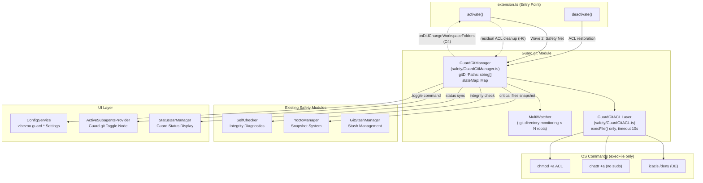
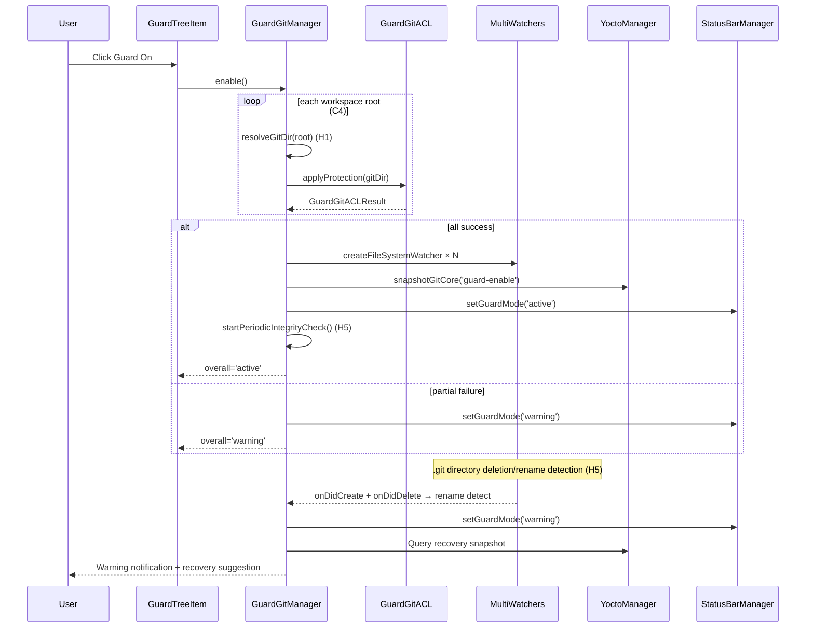
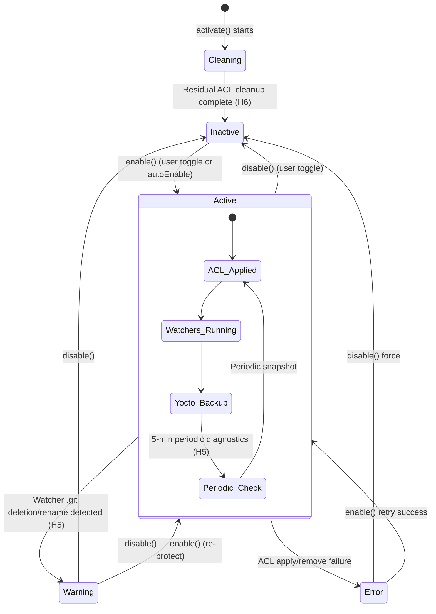

# Guard.git — Design Plan

> **Version**: 1.1.0 | **Date**: 2026-06-05 | **Target**: VibeZoo v0.14.2+
>
> **v1.1.0**: Debug feedback loopback — Critical 4, High 6 resolution plans reflected (see ## 11 below)

---

## 1. Overview

Design of **Guard.git** feature that prevents AI agents from accidentally running `rm -rf *` / `rmdir /s /q` etc. and completely deleting the project's `.git` folder.

### 1.1 Key Requirements

| # | Requirement | Priority |
|---|-----------|---------|
| R1 | Block `.git` folder deletion at OS level (allow read/write/edit, only block delete) | P0 |
| R2 | Provide UI to toggle Guard.git On/Off in VibeZoo tab | P0 |
| R3 | Integration with existing Safety modules (GitStashManager, YoctoManager, SelfCheck) | P1 |
| R4 | Windows (icacls) and cross-platform support | P0 |
| R5 | ACL restoration on Guard enable/disable | P0 |
| R6 | **Multi-root workspace support (C4)** | P0 |
| R7 | **Shell injection prevention (`execFile` migration) (C1)** | P0 |

---

## 2. Architecture Overview



### 2.1 5-Layer Defense System

```
┌─────────────────────────────────────────────┐
│ Layer 5: TreeView UI Toggle                  │  VibeZoo sidebar
├─────────────────────────────────────────────┤
│ Layer 4: SelfCheck .git Integrity Diagnostics│  SelfChecker.checkGitGuardIntegrity()
│          (5-min periodic auto-diagnosis — H5)│
├─────────────────────────────────────────────┤
│ Layer 3: Yocto .git Core File Snapshot       │  YoctoManager.snapshotGitCore()
├─────────────────────────────────────────────┤
│ Layer 2: MultiWatcher Presence Monitoring    │  vscode.workspace.createFileSystemWatcher
│          (rename detection: create+delete — H5)│
├─────────────────────────────────────────────┤
│ Layer 1: OS ACL Deletion Prevention          │  icacls / chattr / chmod +a
│          (execFile only, no shell — C1)      │
└─────────────────────────────────────────────┘
```

---

## 3. Module Detailed Design

### 3.1 [`GuardGitManager`](extension/src/safety/GuardGitManager.ts) — Core Orchestrator

```typescript
// Guard.git state
export type GuardGitState = 'active' | 'inactive' | 'error' | 'warning';

// Guard.git ACL operation result
export interface GuardGitACLResult {
  success: boolean;
  error?: string;
  command?: string;       // Executed OS command (for debugging)
  stdout?: string;
  stderr?: string;
}

// Guard.git integrity status
export interface GuardGitIntegrity {
  exists: boolean;
  protected: boolean;     // ACL application status
  headRef: string | null; // HEAD reference value
  objectCount: number;    // Number of files in objects/
  refCount: number;       // Number of files in refs/
}
```

**Class signature (C4: multi-root support, H6: residual ACL cleanup):**

```typescript
export class GuardGitManager {
  // ── State ──
  private stateMap: Map<string, GuardGitState> = new Map(); // path → state (C4)
  private gitDirPaths: string[] = [];   // C4: changed to array (formerly: string | null)
  private acl: IGuardGitACL;
  private watchers: Map<string, vscode.FileSystemWatcher> = new Map(); // C4
  private yocto: YoctoManager | null = null;
  private statusBar: StatusBarManager | null = null;
  private selfCheckInterval: NodeJS.Timeout | null = null;  // H5
  private disposables: vscode.Disposable[] = [];

  constructor();

  // ── Lifecycle ──
  activate(context: vscode.ExtensionContext, yocto: YoctoManager): Promise<void>;
  dispose(): Promise<void>; // ACL restoration + watchers release

  // ── Guard Toggle ──
  enable(): Promise<GuardGitACLResult>;
  disable(): Promise<GuardGitACLResult>;
  isEnabled(): boolean;      // Whether any gitDirPath is active
  getState(path: string): GuardGitState;  // C4: per-path state query

  // ── Integrity ──
  checkIntegrity(): Promise<GuardGitIntegrity[]>;
  startPeriodicIntegrityCheck(intervalMs: number): void;  // H5: periodic diagnostics
  stopPeriodicIntegrityCheck(): void;

  // ── Yocto Integration ──
  createGitSnapshot(trigger: 'guard-enable' | 'guard-periodic' | 'guard-pre-danger'): Promise<void>;

  // ── StatusBar Integration ──
  bindStatusBar(statusBar: StatusBarManager): void;

  // ── Events ──
  onChange(cb: (stateSummary: { overall: GuardGitState; paths: Map<string, GuardGitState> }) => void): void;

  // ── Heuristic: Auto-activation Decision ──
  shouldAutoEnable(): boolean;

  // ── H1: Git Worktree Detection ──
  /** Checks if .git is a file or directory and returns actual git dir path */
  private resolveGitDir(workspaceRoot: string): string | null;

  // ── H6: Residual ACL Cleanup ──
  /** Called on activate(): removes remaining Guard ACL on existing .git */
  private async cleanupResidualACL(): Promise<void>;
}
```

**Core Logic Flow:**



**`enable()` / `disable()` Detailed Sequence:**

| Step | Action | Failure Handling |
|------|--------|-----------------|
| `enable()` | 1. `cleanupResidualACL()` → remove residual ACL (H6)<br>2. For each workspace root:<br>&emsp;a. `resolveGitDir(root)` → check actual .git path (H1)<br>&emsp;b. `checkProtection()` → skip if already applied<br>&emsp;c. `applyProtection()` → apply ACL<br>3. For each gitDir, `startWatcher()` → start monitoring (C4)<br>4. `createGitSnapshot('guard-enable')` → snapshot<br>5. `startPeriodicIntegrityCheck()` → 5-min periodic diagnostics (H5)<br>6. `statusBar.setGuardMode('active')` → UI update<br>7. `fire onChanged` → TreeView update | 2c failure: path state='error', continue other paths<br>4 failure: log warning, continue |
| `disable()` | 1. All watchers `stopWatcher()` → stop monitoring<br>2. For each gitDir, `removeProtection()` → restore ACL<br>3. `stopPeriodicIntegrityCheck()` → stop periodic diagnostics<br>4. `statusBar.setGuardMode('safe')` → UI update<br>5. `fire onChanged` → TreeView update | 2 failure: state='error', guide user manual removal |
| `deactivate()` | 1. Stop all watchers<br>2. `removeProtection()` → guarantee ACL restoration<br>3. Stop periodic diagnostics<br>4. Cleanup | 2 failure: log warning (mandatory restoration on extension exit) |

---

### 3.2 [`GuardGitACL`](extension/src/safety/GuardGitACL.ts) — OS ACL Abstraction Layer

**C1 Core Change: `exec()` → `execFile()`, path validation, timeout**

```typescript
export interface IGuardGitACL {
  /** Apply delete prevention ACL to .git directory */
  applyProtection(gitDir: string): Promise<GuardGitACLResult>;

  /** Remove ACL from .git directory (restore) */
  removeProtection(gitDir: string): Promise<GuardGitACLResult>;

  /** Check current ACL status */
  checkProtection(gitDir: string): Promise<boolean>;

  /** Name of the method supported on this OS */
  readonly method: string;

  /** Pre-check: required tools installed and FS supports ACL (H4) */
  isAvailable(gitDir: string): Promise<boolean>;
}
```

#### Common Utility: Path Validation (C1)

```typescript
// GuardGitACL.ts — common use across all platform implementations
const SAFE_PATH_REGEX = /^[a-zA-Z0-9_\-\\:. \/@]+$/;

function validatePath(gitDir: string): void {
  if (!SAFE_PATH_REGEX.test(gitDir)) {
    throw new Error(`Guard.git: Unsafe path characters — "${gitDir}"`);
  }
  // Path length limit (Windows MAX_PATH ≈ 260)
  if (gitDir.length > 250) {
    throw new Error(`Guard.git: Path too long (${gitDir.length} characters)`);
  }
}

// execFile wrapper (C1, C2: integrated timeout)
function execFileSafe(
  command: string,
  args: string[],
  timeoutMs: number = 10000
): Promise<{ stdout: string; stderr: string }> {
  return new Promise((resolve, reject) => {
    const child = child_process.execFile(command, args, {
      timeout: timeoutMs,       // C1/C2: 10-second timeout
      windowsHide: true,        // C1: hide console window on Windows
      shell: false,             // C1: no shell (injection prevention)
    }, (error, stdout, stderr) => {
      if (error) {
        // kill signal or timeout → propagate specific error
        reject(error);
      } else {
        resolve({ stdout, stderr });
      }
    });
  });
}
```

#### Windows Implementation: [`WindowsGuardGitACL`](extension/src/safety/GuardGitACL.ts)

```
Strategy: icacls deny Delete (DE)
━━━━━━━━━━━━━━━━━━━━━━━━━━━━━━━━━━━━━━━━━━━━━━━━━

Apply:
  execFile('icacls', [gitDir, '/deny', '*S-1-1-0:(DE)'], { timeout: 10000 })
  → S-1-1-0 = Everyone (SID-based, locale independent)

Remove:
  execFile('icacls', [gitDir, '/remove:d', '*S-1-1-0'], { timeout: 10000 })

Verify:
  execFile('icacls', [gitDir], { timeout: 5000 }) → stdout.includes('DENY')
```

| Property | Value |
|----------|-------|
| DE | Delete — prevents folder deletion itself |
| DC | Delete Child — **not applied**: allows git GC etc. |

**Design Decision**: DC(Delete Child) is **not applied** to avoid interfering with normal git operations (`git gc`, `git prune`, `git repack`, `git checkout`) that need to delete files inside `.git/objects/`, `.git/refs/`. Multi-layer defense is instead provided by Yocto snapshot + FileSystemWatcher + periodic SelfCheck (H5).

```typescript
class WindowsGuardGitACL implements IGuardGitACL {
  readonly method = 'icacls (DE deny)';

  async isAvailable(gitDir: string): Promise<boolean> {
    // C1: path validation
    validatePath(gitDir);
    // H4: indirect NTFS check (icacls works only on NTFS)
    try {
      await execFileSafe('icacls', [gitDir], 3000);
      return true;
    } catch {
      // FAT32/exFAT etc. → ACL not supported
      console.warn('[Guard.git] icacls failed — FS may not support ACL');
      return false;
    }
  }

  async applyProtection(gitDir: string): Promise<GuardGitACLResult> {
    validatePath(gitDir);  // C1
    try {
      const result = await execFileSafe('icacls', [
        gitDir, '/deny', '*S-1-1-0:(DE)'
      ]);
      return { success: true, command: `icacls ${gitDir} /deny *S-1-1-0:(DE)`, stdout: result.stdout, stderr: result.stderr };
    } catch (err: any) {
      return { success: false, error: err.message };
    }
  }

  async removeProtection(gitDir: string): Promise<GuardGitACLResult> {
    validatePath(gitDir);  // C1
    try {
      const result = await execFileSafe('icacls', [
        gitDir, '/remove:d', '*S-1-1-0'
      ]);
      return { success: true, command: `icacls ${gitDir} /remove:d *S-1-1-0`, stdout: result.stdout, stderr: result.stderr };
    } catch (err: any) {
      return { success: false, error: err.message };
    }
  }

  async checkProtection(gitDir: string): Promise<boolean> {
    try {
      const { stdout } = await execFileSafe('icacls', [gitDir], 5000);
      return stdout.includes('DENY');
    } catch {
      return false;
    }
  }
}
```

#### Linux Implementation: [`LinuxGuardGitACL`](extension/src/safety/GuardGitACL.ts)

**C2/C3 Core Change: `sudo` absolutely prohibited, `setfacl` fallback completely removed**

```
Strategy: chattr +a (append-only) — attempt without sudo, fallback to Watcher+Yocto on failure
━━━━━━━━━━━━━━━━━━━━━━━━━━━━━━━━━━━━━━━━━━━━━━━━━

C2: Never use sudo.
    - If user owns the directory, chattr may work without sudo → attempt
    - On failure, immediate fallback: Watcher + Yocto only mode
    - execFile() timeout 10s prevents hang

C3: Remove setfacl fallback.
    - setfacl cannot prevent directory deletion (parent directory permissions decide)
    - r-x blocks git operations (file creation/write blocked)
    - Linux fallback unified to Watcher + Yocto only

Apply:
  execFile('chattr', ['+a', gitDir], { timeout: 10000 })

Remove:
  execFile('chattr', ['-a', gitDir], { timeout: 10000 })

Verify:
  execFile('lsattr', [gitDir], { timeout: 5000 }) → stdout.includes('a')
```

**H2: `chattr +a` Over-protection Documentation**

| `chattr +a` Effect | Git Operation Impact |
|---|---|
| Allows **file addition** in directory | ✅ git add, commit, checkout normal |
| Allows **file modification** in directory | ✅ git reflog, index update normal |
| **Prevents file deletion** in directory | ❌ `git gc`, `git prune`, `git repack` may fail |
| **Prevents directory deletion** itself | ✅ Core goal achieved |

→ On Linux, `chattr +a` is downgraded to **optional** feature, primary defense relies on Watcher + Yocto. User can explicitly enable via `vibezoo.guard.linuxUseChattr` setting. Default is `false` (Watcher+Yocto only).

```typescript
class LinuxGuardGitACL implements IGuardGitACL {
  readonly method = 'chattr +a';

  async isAvailable(gitDir: string): Promise<boolean> {
    validatePath(gitDir);  // C1
    // C2: check if chattr is available (without sudo)
    try {
      // H4: check FS type (ext4, btrfs, xfs only support chattr)
      const { stdout } = await execFileSafe('stat', ['-f', '-c', '%T', gitDir], 3000);
      const fsType = stdout.trim();
      const supportedFS = ['ext2/ext3', 'ext4', 'btrfs', 'xfs', 'tmpfs'];
      if (!supportedFS.some(fs => fsType.includes(fs))) {
        console.log(`[Guard.git] FS type '${fsType}' doesn't support chattr → Watcher+Yocto fallback`);
        return false;
      }
      // Check if chattr is executable (without sudo)
      await execFileSafe('chattr', ['-R', '--help'], 3000);
      // Check ownership
      try {
        await execFileSafe('chattr', ['+a', gitDir], 3000);
        // Immediately remove on success (pre-flight check)
        await execFileSafe('chattr', ['-a', gitDir], 3000);
        return true;
      } catch {
        console.log('[Guard.git] No chattr permission → Watcher+Yocto fallback');
        return false;
      }
    } catch {
      return false;
    }
  }

  async applyProtection(gitDir: string): Promise<GuardGitACLResult> {
    validatePath(gitDir);  // C1
    try {
      // C2: attempt chattr without sudo
      const result = await execFileSafe('chattr', ['+a', gitDir]);
      return { success: true, command: `chattr +a ${gitDir}`, stdout: result.stdout, stderr: result.stderr };
    } catch (err: any) {
      // C2: immediate fallback on failure — Watcher + Yocto only
      return { success: false, error: `chattr failed (Watcher+Yocto fallback): ${err.message}` };
    }
  }

  async removeProtection(gitDir: string): Promise<GuardGitACLResult> {
    validatePath(gitDir);  // C1
    try {
      const result = await execFileSafe('chattr', ['-a', gitDir]);
      return { success: true, command: `chattr -a ${gitDir}`, stdout: result.stdout, stderr: result.stderr };
    } catch (err: any) {
      return { success: false, error: err.message };
    }
  }

  async checkProtection(gitDir: string): Promise<boolean> {
    try {
      const { stdout } = await execFileSafe('lsattr', [gitDir], 5000);
      // lsattr output: "----a-------- ./git" → 'a' attribute indicates protection
      return /^[^ ]*a[^ ]* /.test(stdout);
    } catch {
      return false;
    }
  }
}
```

#### macOS Implementation: [`MacOSGuardGitACL`](extension/src/safety/GuardGitACL.ts)

```
Strategy: chmod +a ACL
━━━━━━━━━━━━━━━━━━━━━━━━━━━━━━━━━━━━━━━━━━━━━━━━━

Apply:
  execFile('chmod', ['+a', 'everyone deny delete', gitDir], { timeout: 10000 })

Remove:
  execFile('chmod', ['-a', 'everyone deny delete', gitDir], { timeout: 10000 })

Verify:
  execFile('ls', ['-le', gitDir], { timeout: 5000 }) → stdout.includes('deny delete')
```

**Fallback**: `chflags uchg` → prevents deletion but also blocks internal writes → warning then depend on Yocto.

#### Factory Function

```typescript
export function createGuardGitACL(): IGuardGitACL {
  const platform = process.platform;
  switch (platform) {
    case 'win32':  return new WindowsGuardGitACL();
    case 'linux':  return new LinuxGuardGitACL();
    case 'darwin': return new MacOSGuardGitACL();
    default:       return new NoopGuardGitACL(); // unsupported
  }
}
```

---

### 3.3 FileSystemWatcher — Layer 2 (C4: multi-root, H5: rename detection)

Managed inside [`GuardGitManager`](extension/src/safety/GuardGitManager.ts):

```typescript
// C4: Map<string, FileSystemWatcher> — independent watcher per .git path
private watchers: Map<string, vscode.FileSystemWatcher> = new Map();

private startWatcher(gitDirPath: string): void {
  const parentDir = path.dirname(gitDirPath);
  const pattern = new vscode.RelativePattern(parentDir, '.git');

  const watcher = vscode.workspace.createFileSystemWatcher(pattern, false, false, false);

  watcher.onDidDelete((uri) => {
    // H5: check paired with create within time window for rename detection
    this.pendingDeletions.set(gitDirPath, Date.now());
    setTimeout(() => {
      if (this.pendingDeletions.has(gitDirPath)) {
        // No create within timeout → real deletion
        this.handleGitDeletion(gitDirPath);
        this.pendingDeletions.delete(gitDirPath);
      }
    }, 2000); // 2-second window
  });

  // H5: rename detection — create + delete combination
  watcher.onDidCreate((uri) => {
    const pendingTime = this.pendingDeletions.get(gitDirPath);
    if (pendingTime && (Date.now() - pendingTime) < 2000) {
      // delete → create within 2s: considered rename
      console.warn(`[Guard.git] ⚠️ .git directory rename detected! (ACL bypass possible)`);
      this.pendingDeletions.delete(gitDirPath);
      this.stateMap.set(gitDirPath, 'warning');
      this.statusBar?.setGuardMode('warning');
      this.notifyListeners();
      NotificationThrottle.showWarning(
        '⚠️ .git folder has been renamed! (ACL bypass possible) Restore from Yocto?',
        'Restore', 'Ignore'
      ).then(choice => {
        if (choice === 'Restore') {
          vscode.commands.executeCommand('vibezoo.instantRewind');
        }
      });
    }
  });

  this.watchers.set(gitDirPath, watcher);
}

// pending deletions — temporary state for rename detection (H5)
private pendingDeletions: Map<string, number> = new Map();

private handleGitDeletion(gitDirPath: string): void {
  console.error(`[Guard.git] ⚠️ .git directory deletion detected! (${gitDirPath})`);
  this.stateMap.set(gitDirPath, 'warning');
  this.statusBar?.setGuardMode('warning');
  this.notifyListeners();
  NotificationThrottle.showWarning(
    '⚠️ .git folder has been deleted! Guard.git attempted defense but may have been bypassed. Restore from Yocto?',
    'Restore', 'Ignore'
  ).then(choice => {
    if (choice === 'Restore') {
      vscode.commands.executeCommand('vibezoo.instantRewind');
    }
  });
}

private stopWatcher(gitDirPath: string): void {
  const watcher = this.watchers.get(gitDirPath);
  if (watcher) {
    watcher.dispose();
    this.watchers.delete(gitDirPath);
  }
}

private stopAllWatchers(): void {
  for (const [path, watcher] of this.watchers) {
    watcher.dispose();
  }
  this.watchers.clear();
}
```

**C4: Workspace folder change event handling**

```typescript
// Inside GuardGitManager.activate()
this.disposables.push(
  vscode.workspace.onDidChangeWorkspaceFolders((e) => {
    // Added folders: find .git and apply ACL
    for (const added of e.added) {
      const gitDir = this.resolveGitDir(added.uri.fsPath);
      if (gitDir) {
        this.gitDirPaths.push(gitDir);
        this.stateMap.set(gitDir, 'inactive');
        if (this.isEnabled()) {
          this.acl.applyProtection(gitDir).then(() => {
            this.startWatcher(gitDir);
            this.stateMap.set(gitDir, 'active');
          }).catch(err => {
            console.warn(`[Guard.git] New workspace ACL apply failed:`, err);
            this.stateMap.set(gitDir, 'error');
          });
        }
      }
    }
    // Removed folders: restore ACL + release watcher
    for (const removed of e.removed) {
      const toRemove = this.gitDirPaths.filter(p => p.startsWith(removed.uri.fsPath));
      for (const p of toRemove) {
        this.acl.removeProtection(p).catch(() => {});
        this.stopWatcher(p);
        this.gitDirPaths = this.gitDirPaths.filter(x => x !== p);
        this.stateMap.delete(p);
      }
    }
  })
);
```

---

### 3.4 Integration with Existing Safety Modules

#### 3.4.1 YoctoManager Integration

Add `.git` core file dedicated snapshot method to [`YoctoManager`](extension/src/safety/YoctoManager.ts):

```typescript
// Method to add to YoctoManager
/**
 * Guard.git dedicated: snapshot only core files of .git directory
 *
 * Target files:
 *   .git/HEAD          — current branch reference
 *   .git/config        — repository settings
 *   .git/refs/heads/*  — local branch refs
 *   .git/refs/remotes/*— remote refs
 *   .git/refs/stash    — stash ref (if present)
 *   .git/index         — staging area (if present)
 *
 * H3: trigger type internally calls createSnapshot('auto'),
 *     records guard-specific trigger via metadata.guardTrigger field.
 */
async snapshotGitCore(metadata: { guardTrigger: 'guard-enable' | 'guard-periodic' | 'guard-pre-danger' }): Promise<YoctoSnapshot>

/**
 * Guard detection: compare file list hash map within .git to detect changes
 */
async detectGitChanges(lastSnapshot: YoctoSnapshot): Promise<{
  added: string[];
  removed: string[];
  modified: string[];
}>
```

**H3: YoctoSnapshot.trigger type extension** — Instead of adding Guard-specific literal to the `YoctoSnapshot.trigger` union in [`types/index.ts`](extension/src/types/index.ts), `snapshotGitCore()` internally calls `createSnapshot('auto')` and manages `metadata.guardTrigger` field separately. This preserves Guard-specific trigger information without polluting the existing union type.

Snapshot storage path: `~/.zoo-code/yocto/{sessionId}/guard-git-{timestamp}/`

#### 3.4.2 SelfCheck Integration

Add `.git` integrity diagnostic item to `SelfChecker` class in [`SelfCheck.ts`](extension/src/safety/SelfCheck.ts):

```typescript
// Add to SelfChecker.runAll()'s Promise.allSettled array
this.checkGitGuardIntegrity(),

// New method
async checkGitGuardIntegrity(): Promise<SelfCheckItem> {
  const base: SelfCheckItem = {
    name: 'Git Guard Integrity',
    status: 'passed',
    message: '.git directory protection status normal',
  };

  const guardManager = getGuardGitManager(); // singleton access

  if (!guardManager) {
    base.status = 'warning';
    base.message = 'Guard.git not initialized';
    return base;
  }

  const integrities = await guardManager.checkIntegrity();

  // C4: multi-root — check all paths
  const failedPaths = integrities.filter(i => !i.exists);
  const unprotectedPaths = integrities.filter(i => i.exists && !i.protected && guardManager.isEnabled());

  if (failedPaths.length > 0) {
    base.status = 'failed';
    base.message = `${failedPaths.length} .git director(ies) not found`;
    base.autoRecoverable = true;
    return base;
  }

  if (unprotectedPaths.length > 0) {
    base.status = 'warning';
    base.message = 'Guard is enabled but some .git paths have no ACL applied';
    base.autoRecoverable = true;
    return base;
  }

  base.detail = integrities.map(i =>
    `${i.headRef} (objects:${i.objectCount}, refs:${i.refCount})`
  ).join('; ');
  return base;
}
```

#### 3.4.3 GitStashManager Relationship

[`GitStashManager`](extension/src/safety/GitStashManager.ts) handles git stash on YOLO mode entry/exit. Direct integration with Guard.git is unnecessary, but when Guard is active, `git stash pop` creates refs/stash inside `.git` — must not interfere with normal operation, consistent with the DC not applied decision.

---

### 3.5 Configuration Design

Add to [`package.json`](extension/package.json) `contributes.configuration.properties`:

```jsonc
{
  "vibezoo.guard.enabled": {
    "type": "boolean",
    "default": true,
    "description": "%vibezoo.guard.enabled.description%"
    // "Guard.git: Prevents .git folder from being deleted by AI agent mistakes."
  },
  "vibezoo.guard.autoEnable": {
    "type": "boolean",
    "default": true,
    "description": "%vibezoo.guard.autoEnable.description%"
    // "Guard.git: Auto-activate Guard on YOLO mode entry."
  },
  "vibezoo.guard.yoctoBackupEnabled": {
    "type": "boolean",
    "default": true,
    "description": "%vibezoo.guard.yoctoBackupEnabled.description%"
    // "Guard.git: Periodically snapshot .git core files to yocto."
  },
  "vibezoo.guard.yoctoBackupIntervalMin": {
    "type": "number",
    "default": 30,
    "minimum": 5,
    "maximum": 1440,
    "description": "%vibezoo.guard.yoctoBackupIntervalMin.description%"
    // "Guard.git: .git snapshot interval (minutes)"
  },
  "vibezoo.guard.integrityCheckIntervalMin": {
    "type": "number",
    "default": 5,
    "minimum": 1,
    "maximum": 60,
    "description": "%vibezoo.guard.integrityCheckIntervalMin.description%"
    // "Guard.git: .git integrity auto-diagnostic interval (minutes) — H5 response"
  },
  "vibezoo.guard.linuxUseChattr": {
    "type": "boolean",
    "default": false,
    "description": "%vibezoo.guard.linuxUseChattr.description%"
    // "Guard.git: Use chattr +a on Linux (also prevents internal file deletion → may break git gc) — H2 response"
  }
}
```

Add to [`ConfigService`](extension/src/config/ConfigService.ts):

```typescript
public static getGuardEnabled(): boolean {
  return vscode.workspace.getConfiguration('vibezoo').get('guard.enabled', true);
}

public static getGuardAutoEnable(): boolean {
  return vscode.workspace.getConfiguration('vibezoo').get('guard.autoEnable', true);
}

public static getGuardYoctoBackupEnabled(): boolean {
  return vscode.workspace.getConfiguration('vibezoo').get('guard.yoctoBackupEnabled', true);
}

public static getGuardYoctoBackupIntervalMin(): number {
  return vscode.workspace.getConfiguration('vibezoo').get('guard.yoctoBackupIntervalMin', 30);
}

public static getGuardIntegrityCheckIntervalMin(): number {
  return vscode.workspace.getConfiguration('vibezoo').get('guard.integrityCheckIntervalMin', 5);
}

public static getGuardLinuxUseChattr(): boolean {
  return vscode.workspace.getConfiguration('vibezoo').get('guard.linuxUseChattr', false);
}
```

---

### 3.6 UI Design

#### 3.6.1 TreeView: Guard.git Toggle Node

Add Guard.git special node to [`ActiveSubagentsProvider`](extension/src/ui/TreeViewProviders.ts) (following existing `_bridge`, `_cim` pattern):

```typescript
// Method to add to ActiveSubagentsProvider
setGuardGitStatus(state: GuardGitState): void {
  const nodeId = '_guard_git';
  if (state === 'inactive') {
    this.nodes.delete(nodeId);
  } else {
    const statusIcons: Record<GuardGitState, string> = {
      active: '$(shield)',
      inactive: '',
      warning: '$(warning)',
      error: '$(error)',
    };
    // C4: show protected path count in tooltip
    const guardManager = getGuardGitManager();
    const pathCount = guardManager?.getProtectedPathCount() ?? 1;
    this.nodes.set(nodeId, {
      id: nodeId,
      name: 'Guard.git',
      status: state === 'active' ? 'running' : state === 'warning' ? 'error' : 'idle',
      currentTask: state === 'active' ? `.git Protected (${pathCount} roots)`
        : state === 'warning' ? '⚠️ .git Compromised'
        : 'Unknown',
      port: 0,
      startTime: Date.now(),
    });
  }
  this._onDidChangeTreeData.fire(undefined);
}
```

TreeItem rendering (added to `SubagentTreeItem` constructor following existing `_bridge`, `_cim` pattern):

```typescript
// Inside SubagentTreeItem constructor
if (node.id === '_guard_git') {
  const stateLabel = node.status === 'running' ? 'Active'
    : node.status === 'error' ? 'Warning'
    : 'Inactive';
  const statusIcon = node.status === 'running' ? '$(shield)' : '$(warning)';
  this.label = `${statusIcon} Guard.git`;
  this.description = node.currentTask;
  this.tooltip = new vscode.MarkdownString(
    `**Guard.git**\n\nStatus: ${stateLabel}\n.git directory: Protected\n\nClick to toggle Guard.git on/off.`
  );
  this.contextValue = 'guardGit';
  this.command = {
    command: 'vibezoo.toggleGuardGit',
    title: 'Toggle Guard.git',
  };
  return;
}
```

#### 3.6.2 StatusBar Integration

[`StatusBarManager`](extension/src/ui/StatusBarManager.ts) already has [`GuardMode`](extension/src/ui/StatusBarManager.ts:96) type, [`setGuardMode()`](extension/src/ui/StatusBarManager.ts:206) method, and Guard display logic in [`_composeText()`](extension/src/ui/StatusBarManager.ts:143) / [`_composeTooltip()`](extension/src/ui/StatusBarManager.ts:123). Guard.git integration only needs to pass status values to the existing infrastructure:

```typescript
// Using existing logic in StatusBarManager._composeText()
// this._guardMode 'active' → '$(zap) VibeZoo Guard' display
// this._guardMode 'warning' → '$(warning) VibeZoo' display
```

#### 3.6.3 Command Palette

Register `vibezoo.toggleGuardGit` command in [`package.json`](extension/package.json):

```jsonc
{
  "command": "vibezoo.toggleGuardGit",
  "title": "%vibezoo.toggleGuardGit.title%"
  // "VibeZoo: Toggle Guard.git Protection"
}
```

Remove existing `vibezoo.toggleFileGuard` (66-68) and replace with `vibezoo.toggleGuardGit`.

---

### 3.7 Guard Activation/Deactivation Lifecycle (H6: Residual ACL Cleanup Added)



**H1: Worktree Detection Logic**

```typescript
/**
 * Check if .git is an actual directory or worktree reference file
 *
 * Worktree environment:
 *   $ cat .git
 *   gitdir: /path/to/main/.git/worktrees/feature-branch
 *
 * Normal environment:
 *   .git/ — directory
 */
private resolveGitDir(workspaceRoot: string): string | null {
  const dotGitPath = path.join(workspaceRoot, '.git');

  try {
    const stat = fs.statSync(dotGitPath);

    if (stat.isDirectory()) {
      return dotGitPath;  // Normal git repository
    }

    if (stat.isFile()) {
      // worktree: parse .git file content
      const content = fs.readFileSync(dotGitPath, 'utf-8').trim();
      const match = content.match(/^gitdir:\s*(.+)$/);
      if (match) {
        const actualGitDir = match[1].trim();
        // Convert relative path to absolute based on workspaceRoot
        const resolved = path.isAbsolute(actualGitDir)
          ? actualGitDir
          : path.resolve(workspaceRoot, actualGitDir);
        if (fs.existsSync(resolved) && fs.statSync(resolved).isDirectory()) {
          console.log(`[Guard.git] Worktree detected: ${dotGitPath} → ${resolved}`);
          return resolved;
        }
      }
    }
  } catch {
    // .git not found
  }

  return null;
}
```

---

## 4. Types Extension

Add to [`types/index.ts`](extension/src/types/index.ts):

```typescript
// ── Guard.git (v0.14.3) ──────────────────────────────────

export type GuardGitState = 'active' | 'inactive' | 'error' | 'warning';

export interface GuardGitACLResult {
  success: boolean;
  error?: string;
  command?: string;
  stdout?: string;
  stderr?: string;
}

export interface GuardGitIntegrity {
  exists: boolean;
  protected: boolean;
  headRef: string | null;
  objectCount: number;
  refCount: number;
}

// H3: Don't directly add Guard trigger to YoctoSnapshot.trigger union,
// instead manage metadata.guardTrigger separately inside snapshotGitCore().
// → Keep existing union type ('manual'|'auto'|'yolo-enter'|'pre-edit')
```

---

## 5. extension.ts Integration Points (C4 Multi-root, H6 Residual ACL Cleanup Reflected)

Points to modify in [`extension.ts`](extension/src/extension.ts):

```typescript
// ── Add Import ──
import { GuardGitManager } from './safety/GuardGitManager';

// ── Add Variable Declaration ──
let guardGit: GuardGitManager;

// ── Add to activate() Wave 2: Safety Net section ──
// (line 131~139, after yocto/gitStash creation)
if (ConfigService.getGuardEnabled()) {
  guardGit = new GuardGitManager();
  guardGit.bindStatusBar(statusBar);

  // H6: Detect residual ACL on activate() start → cleanup
  // GuardGitManager.activate() calls cleanupResidualACL() internally
  await guardGit.activate(context, yocto);

  // Register Guard node in TreeView
  guardGit.onChange((summary) => {
    subagentsProvider.setGuardGitStatus(summary.overall);
  });

  // autoEnable: auto-activate on YOLO entry
  if (ConfigService.getGuardAutoEnable()) {
    guardGit.enable().catch(err =>
      console.warn('[Guard.git] Auto-activation failed:', err)
    );
  }
}

// ── Command Registration ──
context.subscriptions.push(
  vscode.commands.registerCommand('vibezoo.toggleGuardGit', async () => {
    if (!guardGit) {
      vscode.window.showWarningMessage('Guard.git not initialized.');
      return;
    }
    if (guardGit.isEnabled()) {
      const result = await guardGit.disable();
      if (result.success) {
        vscode.window.showInformationMessage('🛡️ Guard.git: Protection disabled.');
      } else {
        vscode.window.showErrorMessage(`Guard.git disable failed: ${result.error}`);
      }
    } else {
      const result = await guardGit.enable();
      if (result.success) {
        vscode.window.showInformationMessage('🛡️ Guard.git: .git folder is protected.');
      } else {
        vscode.window.showErrorMessage(`Guard.git enable failed: ${result.error}`);
      }
    }
  })
);

// ── Add ACL restoration to deactivate() ──
export function deactivate(): void {
  // ...existing code...
  guardGit?.disable().catch(err =>
    console.warn('[Guard.git] deactivate restoration failed:', err)
  );
}
```

---

## 6. OS-specific ACL Response Matrix (C1/C2/C3 Reflected)

| OS | Mechanism | Apply Command | Remove Command | exec Method | Limitations |
|----|-----------|--------------|---------------|-------------|-------------|
| **Windows** | `icacls` deny DE | `execFile('icacls', ['.git', '/deny', '*S-1-1-0:(DE)'])` | `execFile('icacls', ['.git', '/remove:d', '*S-1-1-0'])` | `execFile` | NTFS only |
| **Linux** | `chattr +a` (optional) | `execFile('chattr', ['+a', '.git'])` | `execFile('chattr', ['-a', '.git'])` | `execFile` | ext4/btrfs/xfs; no sudo; disabled by default (H2) |
| **macOS** | `chmod +a` ACL | `execFile('chmod', ['+a', 'everyone deny delete', '.git'])` | `execFile('chmod', ['-a', 'everyone deny delete', '.git'])` | `execFile` | APFS/HFS+ support |

**Fallback Hierarchy (C2/C3 Reflected):**

| OS | Primary Attempt | Fallback | Final Fallback |
|----|----------------|----------|----------------|
| Windows | `icacls` | — (Windows standard) | Watcher + Yocto only |
| Linux | **Watcher + Yocto** (default) | `chattr +a` (when `linuxUseChattr: true`) | Watcher + Yocto only |
| macOS | `chmod +a` | `chflags uchg` (also blocks writes - warning) | Watcher + Yocto only |
| Other | — | — | Watcher + Yocto only |

> **C3**: Removed Linux `setfacl` fallback. `setfacl -m u:$(whoami):r-x` cannot prevent directory deletion, and `r-x` interferes with git operations.

---

## 7. File List (New/Modified)

### 7.1 New Files

| File | Description |
|------|-------------|
| [`extension/src/safety/GuardGitManager.ts`](extension/src/safety/GuardGitManager.ts) | Guard.git core orchestrator (multi-root, worktree, residual ACL cleanup) |
| [`extension/src/safety/GuardGitACL.ts`](extension/src/safety/GuardGitACL.ts) | OS ACL abstraction layer (execFile only, path validation, FS type check) |

### 7.2 Modified Files

| File | Changes |
|------|---------|
| [`extension/src/extension.ts`](extension/src/extension.ts) | GuardGitManager creation and command registration, deactivate restoration, H6 residual ACL cleanup call |
| [`extension/src/safety/YoctoManager.ts`](extension/src/safety/YoctoManager.ts) | Add `snapshotGitCore()`, `detectGitChanges()` methods; H3 trigger managed via metadata |
| [`extension/src/safety/SelfCheck.ts`](extension/src/safety/SelfCheck.ts) | Add `checkGitGuardIntegrity()` diagnostic item, multi-root support |
| [`extension/src/ui/TreeViewProviders.ts`](extension/src/ui/TreeViewProviders.ts) | `setGuardGitStatus()` method, Guard node TreeItem, multi-root count |
| [`extension/src/config/ConfigService.ts`](extension/src/config/ConfigService.ts) | Add Guard-related configuration methods (`linuxUseChattr`, `integrityCheckIntervalMin`) |
| [`extension/src/types/index.ts`](extension/src/types/index.ts) | Add GuardGitState, GuardGitACLResult, GuardGitIntegrity types |
| [`extension/package.json`](extension/package.json) | Add toggleGuardGit command, guard.* settings properties, remove toggleFileGuard |
| [`extension/l10n/bundle.l10n.json`](extension/l10n/bundle.l10n.json) | Add Guard-related English localization |
| [`extension/l10n/bundle.l10n.ko.json`](extension/l10n/bundle.l10n.ko.json) | Add Guard-related Korean localization |

---

## 8. Exception Scenarios (H5 Rename Response, C2/C3 Linux Fallback Reflected)

| Scenario | Detection | Response |
|----------|-----------|----------|
| `rm -rf *` | ACL blocks `.git` deletion itself → contents deleted | Watcher detects change → suggest Yocto snapshot restore |
| `rmdir /s /q .git` | ACL blocks folder deletion → `Access Denied` | OS error occurs, feedback to AI agent |
| `del /f /s /q .git\*` | Contents deleted (intentionally allowed) | Watcher detects → Yocto restore |
| `.git` folder rename (H5) | Watcher: `onDidDelete` + `onDidCreate` within 2s | Rename bypass warning + SelfCheck periodic verification |
| `move .git .git_backup` (H5) | Watcher rename detection + SelfCheck 5-min interval | Warning notification + Yocto restore suggestion |
| Another process removes ACL | Periodic `checkProtection()` call (5-min interval) (H5) | State change detected → re-apply attempt |
| git GC/prune/repack execution | Normal operation (DC not applied allows content deletion)<br>⚠️ May fail on Linux with `chattr +a` (H2) | No interference (Windows/macOS); disabled by default on Linux |
| Extension deactivate ACL restoration failure | Log warning | Guide user with manual restore command |
| Extension crash → ACL residual (H6) | Residual ACL detection on `activate()` start | Auto cleanup then normal activation |
| Linux `chattr` TTY required (C2) | `execFile` + timeout 10s → auto failure | Immediate Watcher+Yocto only fallback |
| FAT32/exFAT/NFS FS (H4) | FS type check in `isAvailable()` | ACL not supported → Watcher+Yocto only fallback |
| Git Worktree (H1) | `.git` file detection in `resolveGitDir()` | Track actual git dir path → apply ACL |

---

## 9. Implementation Priority

| Order | Task | Dependency |
|-------|------|------------|
| 1 | [`GuardGitACL.ts`](extension/src/safety/GuardGitACL.ts) — OS ACL layer implementation (execFile, path validation, FS check) | None |
| 2 | [`types/index.ts`](extension/src/types/index.ts) — Add type definitions | None |
| 3 | [`GuardGitManager.ts`](extension/src/safety/GuardGitManager.ts) — Core orchestrator (multi-root, worktree, residual ACL) | 1, 2 |
| 4 | [`ConfigService.ts`](extension/src/config/ConfigService.ts) — Configuration methods (linuxUseChattr etc.) | None |
| 5 | [`YoctoManager.ts`](extension/src/safety/YoctoManager.ts) — `snapshotGitCore()` (H3 metadata method) | 2 |
| 6 | [`SelfCheck.ts`](extension/src/safety/SelfCheck.ts) — `checkGitGuardIntegrity()` (multi-root) | 2, 3 |
| 7 | [`TreeViewProviders.ts`](extension/src/ui/TreeViewProviders.ts) — Guard node | 2 |
| 8 | [`extension.ts`](extension/src/extension.ts) — Integration (H6 residual ACL cleanup call) | 3, 4, 5, 6, 7 |
| 9 | [`package.json`](extension/package.json) — Command/settings registration | None |
| 10 | [`l10n/`](extension/l10n/) — Localization | None |

---

## 10. Technical Decision Records

| Decision | Rationale |
|----------|-----------|
| DC(Delete Child) not applied | Normal git operations (`git gc`, `git prune`, `git repack`) need to delete files inside `.git`. Content deletion defense replaced by Yocto snapshot. |
| `chattr +a` (append-only) — **disabled by default** on Linux (H2) | `+a` also prevents file deletion in directory, breaking `git gc`/`prune`/`repack`. Linux primary defense is Watcher+Yocto, `chattr` is optional. |
| Windows Everyone SID(`*S-1-1-0`) used | `icacls`'s `Everyone` string is translated based on OS locale (e.g., German "Jeder"). SID-based for locale-independent processing. |
| Node added to ActiveSubagentsProvider instead of separate TreeView | Maintains consistency with existing `_bridge`, `_cim` pattern. Lower implementation cost than creating new TreeView, UX unified. |
| Reuse existing StatusBarManager GuardMode infrastructure | [`GuardMode`](extension/src/ui/StatusBarManager.ts:96) type, [`setGuardMode()`](extension/src/ui/StatusBarManager.ts:206), `_composeText()`/`_composeTooltip()` Guard display logic already implemented. |
| **Migrate to `child_process.execFile()` (C1)** | `exec()` goes through shell, allowing meta-character injection (`&`, `|`, `;`) in paths. `execFile()` runs directly without shell, safe. |
| **`sudo` absolutely prohibited (C2)** | VS Code Extension has no TTY, `sudo chattr` hangs indefinitely. If user owns the directory, possible without `sudo`. Immediate Watcher+Yocto fallback on failure. |
| **Remove `setfacl` fallback (C3)** | On Linux, directory deletion depends on parent directory permissions. `setfacl -m u:$(whoami):r-x` cannot prevent deletion + interferes with git operations. |
| **`gitDirPaths: string[]` array (C4)** | Apply ACL to all `.git` paths in multi-root workspace. Dynamic response via `onDidChangeWorkspaceFolders`. |
| **Path validation regex `^[a-zA-Z0-9_\-\\:. /@]+$` (C1)** | Only allow permitted characters for all OS command arguments. Path length 250 character limit. |
| **10-second timeout on all OS commands (C1/C2)** | `execFile()` `timeout` option prevents hang. |
| **H5: Rename detection (2s delete+create window)** | `onDidCreate` on same path within 2s after `onDidDelete` considered rename. |
| **H5: SelfCheck 5-min periodic diagnostics** | `startPeriodicIntegrityCheck()` periodically checks for ACL bypass. |
| **H6: Residual ACL cleanup on `activate()`** | On Extension crash restart, remove any remaining Guard ACL on `.git` before normal activation. |
| **H3: trigger type — metadata method** | Don't add new literal to `YoctoSnapshot.trigger` union; `snapshotGitCore()` internally calls `createSnapshot('auto')` + manages `metadata.guardTrigger` separately. |
| **H4: FS type check added to `isAvailable()`** | Windows: `icacls` pre-flight check. Linux: `stat -f -c %T` check for ext4/btrfs/xfs. Unsupported FS → Watcher+Yocto only. |

---

## 11. Debug Feedback Loopback — Change History (v1.0.0 → v1.1.0)

### Critical Problem Resolution

| ID | Problem | Changes | Impact |
|----|---------|---------|--------|
| **C1** | Shell command injection | `exec()` → `execFile()`, argument array passing, path validation regex, 10-second timeout | [`GuardGitACL.ts`](extension/src/safety/GuardGitACL.ts) — all platform implementations |
| **C2** | Linux `sudo chattr` infinite hang | `sudo` prohibited, `chattr` attempted with user permissions only, immediate Watcher+Yocto fallback on failure, 10-second timeout | [`LinuxGuardGitACL`](extension/src/safety/GuardGitACL.ts), Linux fallback hierarchy |
| **C3** | Linux `setfacl` fallback design flaw | Complete removal of `setfacl` fallback, Linux fallback unified to Watcher+Yocto only | Linux fallback hierarchy, OS matrix |
| **C4** | Multi-root workspace not supported | `gitDirPath: string | null` → `gitDirPaths: string[]`, `Map<string, GuardGitState>`, subscribe `onDidChangeWorkspaceFolders` | [`GuardGitManager`](extension/src/safety/GuardGitManager.ts), [`extension.ts`](extension/src/extension.ts) |

### High Problem Resolution

| ID | Problem | Changes | Impact |
|----|---------|---------|--------|
| **H1** | Git Worktree not handled | `resolveGitDir()`: detect `.git` file → parse `gitdir:` → track actual git dir path | [`GuardGitManager`](extension/src/safety/GuardGitManager.ts) |
| **H2** | `chattr +a` over-protection | Linux `chattr` disabled by default (`linuxUseChattr: false`), Watcher+Yocto as primary defense, documentation added | Configuration, Linux fallback |
| **H3** | `YoctoSnapshot.trigger` inconsistency | `snapshotGitCore()` internally calls `createSnapshot('auto')` + manages `metadata.guardTrigger` separately | [`YoctoManager`](extension/src/safety/YoctoManager.ts) |
| **H4** | FS type not checked | Added FS type check logic to `isAvailable()` (Windows: icacls pre-flight, Linux: `stat -f`) | [`GuardGitACL.ts`](extension/src/safety/GuardGitACL.ts) |
| **H5** | ACL bypass via rename | Watcher: 2s delete+create window for rename detection, SelfCheck 5-min periodic diagnostics (`integrityCheckIntervalMin`) | Watcher logic, SelfCheck, Configuration |
| **H6** | Residual ACL risk on deactivate | `cleanupResidualACL()` call on `activate()` start to detect and auto-clean residual ACL | [`GuardGitManager.activate()`](extension/src/safety/GuardGitManager.ts) |

### Changed Interfaces Summary

| Interface | Before | After |
|-----------|--------|-------|
| `GuardGitManager.gitDirPath` | `string \| null` | `gitDirPaths: string[]` |
| `GuardGitManager.state` | `GuardGitState` | `stateMap: Map<string, GuardGitState>` |
| `GuardGitManager.watcher` | `FileSystemWatcher \| null` | `watchers: Map<string, FileSystemWatcher>` |
| `GuardGitManager.checkIntegrity()` | `Promise<GuardGitIntegrity>` | `Promise<GuardGitIntegrity[]>` |
| `GuardGitManager.onChange(cb)` | `(state: GuardGitState) => void` | `(summary: { overall: GuardGitState; paths: Map<string, GuardGitState> }) => void` |
| `IGuardGitACL.isAvailable()` | `(): Promise<boolean>` | `(gitDir: string): Promise<boolean>` |
| `YoctoSnapshot.trigger` | `'manual'\|'auto'\|'yolo-enter'\|'pre-edit'` | **No change** (metadata method) |
| `ConfigService` | 4 methods | 6 methods (added `linuxUseChattr`, `integrityCheckIntervalMin`) |
| `package.json` settings | 4 properties | 6 properties (added `linuxUseChattr`, `integrityCheckIntervalMin`) |

---

## Appendix A: `icacls` deny Experiment Results (Reference)

```
C:\project> icacls .git /deny *S-1-1-0:(DE)
processed file: .git

C:\project> rmdir /s /q .git
.git - Access is denied.

C:\project> del /f /s /q .git\*
(Contents deleted - normal operation)

C:\project> icacls .git /remove:d *S-1-1-0
processed file: .git
```

---

## Appendix B: `execFile` vs `exec` Comparison (C1 Reference)

| Feature | `exec()` | `execFile()` |
|---------|----------|--------------|
| Shell passthrough | ✅ (cmd.exe / bash) | ❌ (direct execution) |
| Argument passing | String interpolation (`icacls ${path} ...`) | Array (`['icacls', path, ...]`) |
| Meta-character vulnerability | `&`, `|`, `;`, `` ` `` injectable | None (arguments passed directly to program) |
| Timeout | `timeout` option (not recommended) | `timeout` option (recommended) |
| Console window | Displayed on Windows | `windowsHide: true` possible |
