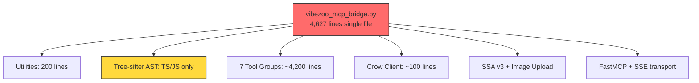
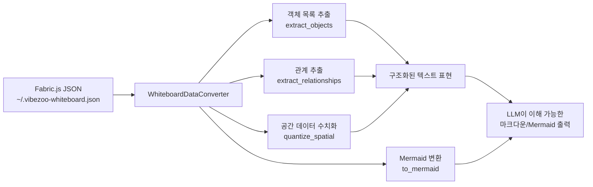

# VibeZoo MCP Bridge 대규모 리팩토링 — 아키텍처 설계서

> **작성일**: 2026-05-31
> **대상**: [`mcp-servers/vibezoo_mcp_bridge.py`](../mcp-servers/vibezoo_mcp_bridge.py) (v0.12.0, 4,627 lines, 35 tools)
> **참조**: [평가 보고서](../260531VibeZooReport.md) · [기존 SOTA 계획](mcp-tool-sota-upgrade.md) · [아키텍처 문서](../fromscratch/Architecture.md)
> **설계 원칙**: 하위 호환성 유지 · Python 표준 라이브러리 우선 · Windows 호환성 · 모듈화

---

## 목차

1. [현행 아키텍처 진단](#1-현행-아키텍처-진단)
2. [목표 아키텍처 — 모듈 구조](#2-목표-아키텍처--모듈-구조)
3. [핵심 인프라 개선 설계](#3-핵심-인프라-개선-설계)
4. [도구 그룹별 개선 설계](#4-도구-그룹별-개선-설계)
5. [Whiteboard 이미지→데이터 변환 파이프라인](#5-whiteboard-이미지데이터-변환-파이프라인)
6. [폐기/통합 대상 도구 처리](#6-폐기통합-대상-도구-처리)
7. [구현 우선순위 (Phase 1~4)](#7-구현-우선순위-phase-14)
8. [위험 요소 및 대응 방안](#8-위험-요소-및-대응-방안)
9. [부록: 전체 도구 시그니처 레지스트리](#9-부록-전체-도구-시그니처-레지스트리)

---

## 1. 현행 아키텍처 진단

### 1.1 현재 상태



| 문제 | 영향 | 심각도 |
|:---|:---|:---:|
| 단일 파일 4,627줄 | 코드 탐색/수정/리뷰 난해 | 🔴 |
| `rglob` 기반 파일 검색 | 1000개+ 파일에서 수 초 소요 | 🔴 |
| Tree-sitter TS/JS만 지원 | Python/Go/Rust 프로젝트 무용지물 | 🔴 |
| 도구 간 결과 공유 없음 | `review_project`가 4개 도구를 순차 호출하며 각각 중복 스캔 | 🟡 |
| 오류 시 무조건 빈 결과/예외 | 부분 결과라도 반환해야 하는 상황 대응 불가 | 🟡 |
| DuckDuckGo 단일 검색 엔진 | 차단 시 웹 검색 완전 불가 | 🟡 |
| Whiteboard → LLM 변환 부재 | Deepseek가 화이트보드 그림을 이해하지 못함 | 🟡 |

### 1.2 현재 35개 도구 분류

| 그룹 | 도구 | 개수 |
|:---|:---|:---:|
| **Scout** | `search_codebase`, `find_references`, `summarize_architecture` | 3 |
| **Reviewer** | `review_code`, `check_quality` | 2 |
| **DeepAnalyzer** | `analyze_call_graph`, `map_dependencies`, `extract_patterns`, `reverse_engineer` | 4 |
| **Tester** | `generate_tests`, `analyze_coverage` | 2 |
| **Whiteboard** | `draw_on_whiteboard`, `get_whiteboard_state`, `open_whiteboard`, `capture_screen`, `open_ui_preview` | 5 |
| **Fix Loop** | `auto_fix_status`, `retry_build`, `check_intervention` | 3 |
| **Integrated** | `review_project`, `find_bugs`, `suggest_refactor`, `generate_docs` | 4 |
| **Analysis** | `explain_code`, `analyze_changes`, `review_pr`, `refactor_across_files` | 4 |
| **Knowledge** | `learn_project`, `recall_project`, `learn_preference`, `get_preferences` | 4 |
| **Web** | `fetch_page`, `web_search` | 2 |
| **SSA** | `aggregate_spatial_pixels`, `open_image_dropzone` | 2 |
| **합계** | | **35** |

---

## 2. 목표 아키텍처 — 모듈 구조

### 2.1 디렉토리 레이아웃

```
mcp-servers/
├── vibezoo_mcp_bridge.py          # 진입점 (50줄 이하) — FastMCP app 생성 + 모든 도구 등록
├── vibezoo_mcp_bridge_v2.py       # 기존 파일 (참조용, 변경 없음)
│
└── bridge/                         # 핵심 패키지
    ├── __init__.py                 # 공개 API export
    │
    ├── config.py                   # 상수, 경로, 버전, 환경변수
    │
    ├── utils.py                    # 범용 유틸리티
    │   ├── _get_timestamp()
    │   ├── _markdown_header()
    │   ├── _markdown_footer()
    │   ├── _validate_file_path()
    │   ├── _validate_string()
    │   ├── _validate_int()
    │   ├── _read_file_content()
    │   ├── _truncate()
    │   ├── _atomic_write_json()
    │   ├── _normalize_path()
    │   ├── _npx_cmd()
    │   ├── _bm25_score()
    │   ├── _fuzzy_match()
    │   ├── _auto_detect_query_type()
    │   └── _detect_secrets()
    │
    ├── file_cache.py               # 3계층 파일 시스템 캐시
    │   └── class FileCache:
    │       ├── L1: 메모리 LRU (파일 내용 + AST 결과)
    │       ├── L2: 디스크 카탈로그 (~/.vibezoo-cache/catalog.json)
    │       ├── L3: mtime 기반 무효화
    │       ├── _iter_project_files()
    │       ├── get_files()
    │       ├── invalidate()
    │       └── stats()
    │
    ├── search_engine.py            # 외부 검색 엔진 연동
    │   └── class SearchEngine:
    │       ├── ripgrep_available() → bool
    │       ├── git_grep_available() → bool
    │       ├── search(query, files, max_results) → list
    │       ├── search_fast(query, max_results) → list  # 점진적: 10개 빠르게
    │       └── _fallback_to_walk() → list  # rglob 폴백
    │
    ├── ast_engine.py               # 멀티랭귀지 AST 파서
    │   └── class AstEngine:
    │       ├── LANGUAGES: dict[ext, lang_name]
    │       ├── parse(file_path) → ASTNode
    │       ├── extract_functions(content, lang) → list
    │       ├── extract_classes(content, lang) → list
    │       ├── extract_imports(content, lang) → list
    │       ├── extract_calls(content, lang) → list
    │       ├── extract_references(symbol, content, lang) → list
    │       └── is_available() → bool
    │
    ├── result_ranker.py            # BM25 + 시그니처 하이브리드 랭킹
    │   └── class ResultRanker:
    │       ├── rank(query, results) → list
    │       ├── _bm25_similarity()
    │       ├── _exact_match_bonus()
    │       └── _location_boost()
    │
    ├── crow_client.py              # Crow Memory HTTP 클라이언트
    │   ├── try_crow_ingest(content, register, **kwargs)
    │   ├── try_crow_recall(query, register, limit) → list
    │   ├── crow_health_check() → bool
    │   └── class CrowClient (비동기 지원)
    │
    └── tools/                       # 도구 구현체
        ├── __init__.py              # register_all_tools(mcp)
        │
        ├── _base.py                 # 도구 기본 클래스 + 공통 데코레이터
        │   └── class BaseTool:
        │       ├── validate()
        │       ├── partial_result()  # 점진적 스트리밍 지원
        │       └── report_error()
        │
        ├── scout.py                 # 3 tools
        │   ├── search_codebase(query, file_patterns?, max_results?, mode?, context_lines?)
        │   ├── find_references(symbol, file_pattern?)
        │   └── summarize_architecture(target_path?)
        │
        ├── reviewer.py              # 1 tool (check_quality 통합됨)
        │   └── review_code(file_path, severity?)
        │
        ├── deep_analyzer.py         # 4 tools
        │   ├── analyze_call_graph(file_path?, depth?, include_external?)
        │   ├── map_dependencies(target_path?)
        │   ├── extract_patterns(target_path?, min_occurrences?)
        │   └── reverse_engineer(target_path?, output_format?)
        │
        ├── tester.py                # 2 tools
        │   ├── generate_tests(source_path, framework?)
        │   └── analyze_coverage(target_path?)
        │
        ├── whiteboard.py            # 5 tools + 이미지→데이터 변환
        │   ├── draw_on_whiteboard(commands)
        │   ├── get_whiteboard_state()
        │   ├── open_whiteboard(message?)
        │   ├── capture_screen()
        │   ├── open_ui_preview(code?, framework?)
        │   └── class WhiteboardDataConverter:  # 신규
        │       ├── fabric_json_to_text(fabric_json) → str
        │       ├── extract_objects(json) → list[dict]
        │       ├── extract_relationships(json) → list[dict]
        │       └── to_mermaid(json) → str
        │
        ├── fix_loop.py              # 3 tools
        │   ├── auto_fix_status()
        │   ├── retry_build(build_command?)
        │   └── check_intervention()
        │
        ├── integrated.py            # 4 tools
        │   ├── review_project(target_path)
        │   ├── find_bugs(target_path)
        │   ├── suggest_refactor(target_path)
        │   └── generate_docs(target_path, output_format?)
        │
        ├── analysis.py              # 4 tools
        │   ├── explain_code(file_path, line_number)
        │   ├── analyze_changes()
        │   ├── review_pr(base_branch?, head_branch?)
        │   └── refactor_across_files(pattern, new_pattern, file_patterns?)
        │
        ├── knowledge.py             # 4 tools
        │   ├── learn_project(target_path?)
        │   ├── recall_project(target_path?)
        │   ├── learn_preference(rule, category?)
        │   └── get_preferences(category?)
        │
        ├── web.py                   # 2 tools + fallback 체인
        │   ├── fetch_page(url, max_length?)
        │   ├── web_search(query, max_results?, engine?)
        │   └── class WebSearchEngine:
        │       ├── search(query, max_results) → list
        │       ├── _search_duckduckgo()
        │       ├── _search_google_fallback()
        │       ├── _search_bing_fallback()
        │       └── _rank_fallback_order()  # 지수 백오프
        │
        └── ssa.py                   # 2 tools
            ├── aggregate_spatial_pixels(image_path, detail?)
            └── open_image_dropzone()  # 폐기 → capture_screen에 흡수
```

### 2.2 진입점: `vibezoo_mcp_bridge.py` (신규)

```python
# VibeZoo MCP Bridge — 통합 MCP 서버 (v0.13.0)
# 모듈화된 구조, 진입점 50줄 이하
import argparse
from fastmcp import FastMCP
from bridge.config import VERSION, CROW_URL
from bridge.tools import register_all_tools

mcp = FastMCP(name="vibezoo")
register_all_tools(mcp)

if __name__ == "__main__":
    parser = argparse.ArgumentParser(description="VibeZoo MCP Bridge Server")
    parser.add_argument("--port", type=int, default=9027, help="SSE server port")
    args = parser.parse_args()

    print(f"\U0001f680 VibeZoo MCP Bridge v{VERSION} starting on port {args.port}...")
    print(f"   Crow Memory: {CROW_URL}")
    mcp.run(transport="sse", host="127.0.0.1", port=args.port)
```

### 2.3 도구 등록: `bridge/tools/__init__.py`

```python
"""모든 MCP 도구를 FastMCP 인스턴스에 등록"""
def register_all_tools(mcp):
    from bridge.tools.scout import register as reg_scout
    from bridge.tools.reviewer import register as reg_reviewer
    from bridge.tools.deep_analyzer import register as reg_deep
    from bridge.tools.tester import register as reg_tester
    from bridge.tools.whiteboard import register as reg_wb
    from bridge.tools.fix_loop import register as reg_fix
    from bridge.tools.integrated import register as reg_integrated
    from bridge.tools.analysis import register as reg_analysis
    from bridge.tools.knowledge import register as reg_knowledge
    from bridge.tools.web import register as reg_web
    from bridge.tools.ssa import register as reg_ssa

    for reg in [reg_scout, reg_reviewer, reg_deep, reg_tester,
                 reg_wb, reg_fix, reg_integrated, reg_analysis,
                 reg_knowledge, reg_web, reg_ssa]:
        reg(mcp)
```

각 `tools/*.py`의 `register(mcp)` 함수는 `@mcp.tool` 데코레이터로 도구를 등록한다. 기존 도구 시그니처를 100% 유지한다.

---

## 3. 핵심 인프라 개선 설계

### 3.1 검색 엔진 인덱싱 — `SearchEngine` 클래스

> **목표**: `search_codebase`의 O(n×m) 문자열 비교 → ripgrep/git grep 기반 0.1초 검색

```python
# bridge/search_engine.py

class SearchEngine:
    """
    외부 검색 엔진 연동 — 우선순위:
    1. ripgrep (rg) — Rust 기반, 가장 빠름
    2. git grep — Git 저장소에서만 동작, Git 인덱스 활용
    3. _fallback_to_walk() — 기존 os.walk + line 매칭 (regex 폴백)
    """

    def __init__(self, root: Path):
        self._root = root
        self._rg_available: Optional[bool] = None
        self._git_available: Optional[bool] = None

    def ripgrep_available(self) -> bool:
        if self._rg_available is None:
            try:
                subprocess.run(["rg", "--version"], capture_output=True, timeout=2)
                self._rg_available = True
            except Exception:
                self._rg_available = False
        return self._rg_available

    def search(self, query: str, file_patterns: Optional[str] = None,
               max_results: int = 10, mode: str = "auto",
               context_lines: int = 3) -> list[dict]:
        """
        통합 검색 — ripgrep 우선, git grep 차선, walk 폴백.
        각 결과: {file, line, column, content, context_before, context_after, score}
        """
        if self.ripgrep_available():
            return self._search_ripgrep(query, file_patterns, max_results, context_lines)
        elif self._is_git_repo() and self._git_grep_available():
            return self._search_git_grep(query, file_patterns, max_results)
        else:
            return self._fallback_to_walk(query, file_patterns, max_results)

    def search_fast(self, query: str, max_results: int = 10) -> list[dict]:
        """점진적 검색 — 먼저 10개 결과를 빠르게 반환"""
        return self.search(query, max_results=max_results, context_lines=0)

    def _search_ripgrep(self, query, file_patterns, max_results, context_lines) -> list[dict]:
        """ripgrep 호출 + 결과 파싱"""
        cmd = ["rg", "--no-heading", "--line-number", "--color", "never",
               "--max-count", str(max_results)]
        if context_lines:
            cmd.extend(["-C", str(context_lines)])
        if file_patterns:
            for pat in file_patterns.split(","):
                cmd.extend(["-g", pat.strip()])
        cmd.append(query)
        # ... 실행 및 파싱

    def _fallback_to_walk(self, query, file_patterns, max_results) -> list[dict]:
        """기존 _iter_project_files + line 매칭 로직 (하위 호환성 보장)"""
        # 기존 코드 그대로 유지
```

**변경 포인트**:
- [`search_codebase`](mcp-servers/vibezoo_mcp_bridge.py:693) 내부에서 `_iter_project_files` → `SearchEngine.search()` 호출로 교체
- 도구 시그니처에 `mode` 파라미터 추가: `"auto" | "exact" | "fuzzy" | "ast" | "semantic"` (기본값 `"auto"` → 하위 호환)
- `max_results` 상한 200→500

### 3.2 AST 엔진 확장 — `AstEngine` 클래스

> **목표**: TS/JS → Python/Go/Rust tree-sitter 지원 추가

```python
# bridge/ast_engine.py

class AstEngine:
    """
    멀티랭귀지 tree-sitter AST 파서.
    tree-sitter 미설치 시 regex 폴백 (기존 동작 유지).
    """

    LANGUAGES = {
        '.ts':   'typescript',
        '.tsx':  'typescript',
        '.js':   'javascript',
        '.jsx':  'javascript',
        '.py':   'python',
        '.go':   'go',
        '.rs':   'rust',
    }

    # 각 언어별 AST 노드 타입 매핑
    NODE_TYPES = {
        'typescript': {
            'function': ['function_declaration', 'method_definition', 'arrow_function'],
            'class':    ['class_declaration'],
            'interface':['interface_declaration', 'type_alias_declaration'],
            'import':   ['import_statement', 'import_specifier'],
            'call':     ['call_expression'],
        },
        'python': {
            'function': ['function_definition'],
            'class':    ['class_definition'],
            'import':   ['import_statement', 'import_from_statement'],
            'call':     ['call'],
        },
        'go': {
            'function': ['function_declaration', 'method_declaration'],
            'struct':   ['type_declaration'],
            'import':   ['import_declaration'],
            'call':     ['call_expression'],
        },
        'rust': {
            'function': ['function_item'],
            'struct':   ['struct_item'],
            'enum':     ['enum_item'],
            'import':   ['use_declaration'],
            'call':     ['call_expression'],
        },
    }

    def __init__(self):
        self._parsers: dict[str, object] = {}  # 언어별 Parser 인스턴스
        self._initialized: set[str] = set()
        self._thread_lock = threading.Lock()

    def is_available(self, lang: str = None) -> bool:
        """특정 언어(또는 전체) AST 지원 여부"""
        ...

    def parse(self, content: str, file_ext: str) -> ASTNode:
        """파일 전체 파싱 → AST 루트 노드"""
        ...

    def extract_functions(self, content: str, file_ext: str) -> list[dict]:
        """함수/메서드 정의 추출 — 모든 지원 언어"""
        ...

    def extract_classes(self, content: str, file_ext: str) -> list[dict]:
        """클래스/구조체/인터페이스 정의 추출"""
        ...

    def extract_imports(self, content: str, file_ext: str) -> list[dict]:
        """import/use 문 추출 — 언어별 AST 우선, regex 폴백"""
        ...

    def extract_calls(self, content: str, file_ext: str) -> list[dict]:
        """함수 호출 노드 추출"""
        ...

    def _init_language(self, lang_name: str) -> bool:
        """특정 언어의 tree-sitter 파서 지연 초기화"""
        # tree-sitter-languages → tree-sitter-{lang} 순서로 import 시도
        ...
```

**변경 포인트**:
- 기존 `_init_tree_sitter()`, `_parse_with_tree_sitter()`, `_extract_ast_calls()`, `_extract_ast_imports()` → `AstEngine`으로 통합
- `search_codebase`의 AST 검색: TS/JS만 → 4개 언어 확장
- `review_code`의 Python 검사: 3개 항목 → 구조적 분석
- `analyze_call_graph`의 호출 추출: TS/JS만 → 4개 언어

### 3.3 파일 시스템 캐시 — `FileCache` 클래스

> **목표**: 중복 파일 스캔 방지, mtime 기반 무효화

```python
# bridge/file_cache.py

class FileCache:
    """
    3계층 파일 시스템 캐시
    L1: 메모리 LRU (파일 내용 + AST 결과, max 50 files)
    L2: 디스크 카탈로그 (~/.vibezoo-cache/catalog.json)
    L3: mtime 기반 자동 무효화
    """

    def __init__(self, max_l1_size: int = 50, ttl: int = 30):
        self._l1: OrderedDict[str, CacheEntry] = OrderedDict()
        self._l2_path = Path.home() / ".vibezoo-cache" / "catalog.json"
        self._ttl = ttl

    def get_files(self, root: Path, extensions: set[str],
                  exclude_dirs: set[str]) -> list[Path]:
        """파일 목록 조회 (캐시 우선, mtime 변경 시 재스캔)"""
        ...

    def get_content(self, file_path: Path) -> Optional[str]:
        """파일 내용 조회 (L1 캐시 우선)"""
        ...

    def get_ast(self, file_path: Path) -> Optional[ASTNode]:
        """파일 AST 조회 (L1 캐시, mtime 검증)"""
        ...

    def invalidate(self, file_path: Path = None):
        """특정 파일(또는 전체) 캐시 무효화"""
        ...

    def stats(self) -> dict:
        """캐시 히트율, 크기 등 통계"""
        ...
```

### 3.4 결과 랭커 — `ResultRanker` 클래스

```python
# bridge/result_ranker.py

class ResultRanker:
    """BM25 + 시그니처 + 위치 기반 하이브리드 랭킹"""

    def rank(self, query: str, results: list[dict]) -> list[dict]:
        """
        각 결과에 score 부여 후 정렬:
        - BM25 유사도 (0.4)
        - 정확 매칭 보너스 (0.3)
        - 위치 가중치: 정의부 > 사용부 (0.2)
        - 주변 컨텍스트 밀도 (0.1)
        """
        for r in results:
            score = 0.0
            score += self._bm25_similarity(query, r['content']) * 0.4
            score += self._exact_match_bonus(query, r['content']) * 0.3
            score += self._location_boost(r.get('type', '')) * 0.2
            score += self._context_density(r) * 0.1
            r['score'] = round(score, 4)
        return sorted(results, key=lambda r: r.get('score', 0), reverse=True)
```

---

## 4. 도구 그룹별 개선 설계

### 4.1 Scout 그룹 (3 tools)

#### `search_codebase(query, file_patterns=None, max_results=10, mode="auto", context_lines=3)`

| 항목 | 현재 | 변경 후 |
|:---|:---|:---|
| 검색 엔진 | `rglob` + `line.lower()` | `SearchEngine.search()` (ripgrep→git grep→walk) |
| AST 지원 | TS/JS only | Python/Go/Rust 추가 |
| 결과 제한 | max 200 | max 500 |
| 신규 파라미터 | 없음 | `mode` ("auto"\|"exact"\|"fuzzy"\|"ast"\|"semantic"), `context_lines` |
| 점진적 검색 | 없음 | `search_fast()` — 먼저 10개, 필요시 추가 |
| 하위 호환 | — | `mode` 기본값 "auto", `context_lines` 기본값 3 (기존 시그니처 그대로 호출 가능) |

#### `find_references(symbol, file_pattern=None)`

| 항목 | 현재 | 변경 후 |
|:---|:---|:---|
| 구현 방식 | `search_codebase` 래퍼 | AST 기반 심볼 바인딩 추적 |
| 언어 지원 | TS/JS regex | 4개 언어 AST + regex 폴백 |
| 결과 그룹화 | 없음 | 정의/참조(호출/할당/타입참조) 그룹화 |
| 호출 체인 | 없음 | 상위 3레벨 호출자 표시 |

#### `summarize_architecture(target_path=None)`

| 항목 | 현재 | 변경 후 |
|:---|:---|:---|
| 레이어 분류 | path-based heuristic | import 그래프 기반 실제 레이어 분류 |
| 비동기화 | `map_dependencies` 동기 호출 | 1차 요약 먼저 반환, 의존성 분석은 비동기 (점진적) |
| 캐시 무효화 | 없음 | `FileCache` mtime 기반 |
| 시각화 | 없음 | Mermaid 다이어그램 자동 생성 (`draw_on_whiteboard` 연동) |

### 4.2 Reviewer 그룹 (2→1 tool)

#### `review_code(file_path, severity="all")` (통합됨)

| 항목 | 현재 | 변경 후 |
|:---|:---|:---|
| 검사 항목 | 7개만 체크 | 15+ 코드 스멜 패턴 |
| 복잡도 | 미체크 | Cyclomatic complexity, 중첩 깊이, 함수 길이, 파라미터 개수 |
| 언어 지원 | TS/JS 7개, Python 3개, Go/Rust 0개 | 4개 언어 구조적 분석 |
| 심각도 | 없음 | severity="all"\|"error"\|"warning"\|"info" 필터 |
| 신규 검사 | 없음 | 매직 넘버, 미사용 변수, null 체인, O(n²) 감지, 보안 패턴, ESLint/Pylint 연동 |
| 수정 제안 | 없음 | 구체적 수정 제안 (예: "Optional Chaining으로 변경") |

#### `check_quality(target_path=None)` → **`review_project`에 흡수, 도구 폐기**

- `review_project`가 이미 `check_quality` + `review_code` + `extract_patterns` + `search_codebase` 통합
- 단독 도구로서 가치 낮음. `review_project`의 `--quick` 모드로 대체
- **하위 호환**: `check_quality` 함수는 유지하되 내부적으로 `review_project(target_path, mode="quick")` 호출로 위임

### 4.3 DeepAnalyzer 그룹 (4 tools)

#### `analyze_call_graph(file_path=None, depth=3, include_external=False)`

| 항목 | 현재 | 변경 후 |
|:---|:---|:---|
| 언어 지원 | TS/JS only | 4개 언어 AST |
| 메서드 호출 | 추적 불가 | `obj.method()` 패턴 추적 |
| 깊이 제한 | depth 3 (최상위만) | 재귀적으로 depth 적용 |
| Fan-in/out | 없음 | Fan-in, Fan-out, 허브/리프 노드 식별 |
| 순환 호출 | 감지 못함 | Tarjan SCC 알고리즘으로 정확한 순환 감지 |
| 데드 코드 | 없음 | 호출되지 않는 함수 식별 |
| 신규 파라미터 | 없음 | `include_external` (외부 라이브러리 호출 포함 여부) |

#### `map_dependencies(target_path=None)`

| 항목 | 현재 | 변경 후 |
|:---|:---|:---|
| 언어 지원 | TS/JS AST, 나머지 regex | 4개 언어 AST |
| 순환 참조 | iterative DFS (위장된 Tarjan) | 실제 Tarjan SCC 알고리즘 |
| 패키지 매니저 | 없음 | `package.json`, `go.mod`, `requirements.txt`, `Cargo.toml` 분석 |
| 허브 모듈 | 없음 | 가장 많이 참조되는 모듈 자동 식별 |
| 영향도 분석 | 없음 | "이 파일을 수정하면 영향받는 파일" 목록 |
| 시각화 | 없음 | Mermaid 의존성 그래프 화이트보드 연동 |

#### `extract_patterns(target_path=None, min_occurrences=3)`

| 항목 | 현재 | 변경 후 |
|:---|:---|:---|
| 분석 방식 | 키워드 카운팅 (`content.count("async ")`) | AST 서브트리 매칭 |
| 감지 패턴 | 10여개 | 30+ 구조적 패턴 + 안티패턴 |
| 안티패턴 | 없음 | 콜백 지옥, God Class, Long Method, Shotgun Surgery |
| 출력 형식 | 단순 카운트 리스트 | 예시 코드 + 위치 정보 함께 제시 |

#### `reverse_engineer(target_path=None, output_format="markdown")`

| 항목 | 현재 | 변경 후 |
|:---|:---|:---|
| API 라우트 | regex (Express only) | AST 기반 (Express, FastAPI, Flask, Gin, Next.js App Router) |
| 데이터 모델 | TS 타입만 | TypeORM, Prisma, Mongoose, Pydantic 데코레이터 분석 |
| JSDoc/TSDoc | 추출 안 함 | 설명, param, response 추출 |
| OpenAPI | 기본만 | 실제 request/response body, validation 포함 |
| 신뢰도 | 없음 | 각 엔드포인트에 신뢰도 표시 (추정 vs 확정) |

### 4.4 Tester 그룹 (2 tools)

#### `generate_tests(source_path, framework="auto")`

| 항목 | 현재 | 변경 후 |
|:---|:---|:---|
| 생성 품질 | 빈 템플릿 (`def test_(): pass`) | 파라미터 타입 기반 경계값 테스트 케이스 |
| 엣지 케이스 | 없음 | null, undefined, 빈 배열, 경계값 자동 생성 |
| Mock/Stub | 없음 | jest.mock, unittest.mock 기본 템플릿 |
| 언어 지원 | TS/JS, Python | 4개 언어 |
| 프레임워크 | 수동 지정 | `"auto"` — 프로젝트 설정 파일 자동 감지 |

#### `analyze_coverage(target_path=None)`

| 항목 | 현재 | 변경 후 |
|:---|:---|:---|
| 실행 방식 | vitest/pytest --cov (실패 시 빈 결과) | 설정 파일 자동 감지 + 미설치 시 대체 분석 |
| 대체 분석 | 없음 | 파일 존재 여부 기반 테스트/소스 매핑 |
| 누락 감지 | 없음 | 테스트 없는 중요 함수 식별 |
| 실패 원인 | "No coverage data found" | 구체적 원인 출력 (미설치, 설정 파일 없음 등) |

### 4.5 Whiteboard 그룹 (5 tools + 신규 변환 파이프라인)

#### `draw_on_whiteboard(commands)`

| 항목 | 현재 | 변경 후 |
|:---|:---|:---|
| 명령 형식 | Fabric.js JSON 직접 작성 | 자연어 → JSON 변환 (LLM 협력) + 템플릿 라이브러리 |
| 템플릿 | 없음 | flowchart, ERD, box-and-line, sequence diagram 템플릿 |
| Mermaid 변환 | 없음 | Mermaid 텍스트 → Fabric.js JSON 변환기 추가 |

#### `get_whiteboard_state()` → **Whiteboard 데이터 변환 통합**

| 항목 | 현재 | 변경 후 |
|:---|:---|:---|
| 반환 내용 | JSON 원문 | 구조화된 텍스트 표현 + 관계 분석 + 수치 데이터 |
| 신규 | 없음 | `WhiteboardDataConverter` 적용 결과 포함 |

#### `capture_screen()`

| 항목 | 현재 | 변경 후 |
|:---|:---|:---|
| Windows 대응 | mss/PIL 없으면 실패 | PowerShell `[System.Windows.Forms]` 폴백 |
| 화이트보드 표시 | 하지 않음 | 캡처 이미지를 화이트보드에 실제로 표시 |
| 이미지 드롭존 | 별도 도구 | `capture_screen`에 이미지 업로드 통합 |

#### `open_ui_preview(code="", framework="react")`

| 항목 | 현재 | 변경 후 |
|:---|:---|:---|
| 에러 피드백 | 없음 | Webview에 에러 메시지 표시 |
| 외부 리소스 | 로딩 안 됨 | 외부 CSS/JS URL 임포트 지원 |
| 프레임워크 | React only | Tailwind CSS CDN 기본 포함 |

### 4.6 Fix Loop 그룹 (3 tools)

#### `auto_fix_status()`

| 항목 | 현재 | 변경 후 |
|:---|:---|:---|
| 상태 머신 | Bridge 6개 vs Extension 8개 (불일치) | 8개 상태로 통일 |
| 과거 패턴 | 메타데이터만 | 구체적 diff/solution 코드 포함 |
| 통신 방식 | JSON 파일 (race condition) | MCP 직접 메시지로 통신 |

#### `retry_build(build_command=None)`

| 항목 | 현재 | 변경 후 |
|:---|:---|:---|
| 빌드 명령어 | `npm run build` 하드코딩 | 프로젝트 타입별 자동 감지 |
| 신규 파라미터 | 없음 | `build_command` (지정 시 우선, 없으면 자동 감지) |
| 에러 추출 | 전체 로그 | 에러 부분만 지능적 추출 (LLM 파싱 최적화) |

### 4.7 Integrated 그룹 (4 tools)

#### `review_project(target_path)`

| 항목 | 현재 | 변경 후 |
|:---|:---|:---|
| 실행 방식 | 4개 도구 순차 동기 호출 | 점진적 스트리밍 (search → review → quality → patterns 순으로 부분 결과) |
| 결과 길이 | LLM 컨텍스트 초과 | 중요도/심각도 자동 정렬, "Quick Wins" 섹션 추출 |
| `check_quality` 통합 | 별도 호출 | `review_project` 내부에서 통합 실행 |

#### `find_bugs(target_path)`

| 항목 | 현재 | 변경 후 |
|:---|:---|:---|
| 탐지 범위 | console.log, debugger, any | ESLint 규칙 + tsc strict + 안티패턴 DB 매칭 |
| Crow 연동 | 키워드만 검색 | 현재 코드와 과거 버그 패턴 비교 |
| 실제 버그 | 감지 불가 | "사용되지 않는 변수", "항상 참인 조건" 등 명확한 버그부터 |

### 4.8 Analysis 그룹 (4 tools)

#### `explain_code(file_path, line_number)`

| 항목 | 현재 | 변경 후 |
|:---|:---|:---|
| 설명 깊이 | AST 컨텍스트만 | LLM 기반 의미 분석 (도구: 데이터 수집, LLM: 의미 해석) |
| 언어 지원 | TS/JS AST, 나머지 regex | 4개 언어 AST |
| 관련 정보 | 없음 | 관련 테스트 코드, git blame 정보 추가 |

### 4.9 Web 그룹 (2 tools + fallback 체인)

#### `web_search(query, max_results=5, engine="auto")`

```python
# bridge/tools/web.py

class WebSearchEngine:
    """다중 검색 엔진 폴백 체인 — DuckDuckGo → Google → Bing"""

    ENGINES = ["duckduckgo", "google", "bing"]

    def search(self, query: str, max_results: int = 5,
               preferred_engine: str = "auto") -> list[dict]:
        """
        검색 엔진 폴백 체인:
        1. DuckDuckGo HTML (기본, 차단 적음)
        2. Google (DuckDuckGo 실패/차단 시)
        3. Bing (Google 실패 시)

        각 엔진 실패 시 지수 백오프 (1s, 2s, 4s) 후 다음 엔진 시도.
        """
        engines = self._rank_fallback_order(preferred_engine)
        for engine_name in engines:
            try:
                results = self._search_with(engine_name, query, max_results)
                if results:
                    return results
            except Exception:
                continue
        return []  # 모든 엔진 실패

    def _search_duckduckgo(self, query, max_results) -> list[dict]:
        """기존 DuckDuckGo HTML 엔드포인트 로직"""
        ...

    def _search_google_fallback(self, query, max_results) -> list[dict]:
        """Google Custom Search API (API 키 필요 시 경고) 또는 HTML 스크래핑"""
        ...

    def _search_bing_fallback(self, query, max_results) -> list[dict]:
        """Bing Web Search API 폴백"""
        ...

    def _rank_fallback_order(self, preferred: str) -> list[str]:
        """지수 백오프 순서로 엔진 정렬"""
        ...
```

| 항목 | 현재 | 변경 후 |
|:---|:---|:---|
| 검색 엔진 | DuckDuckGo 단일 | DuckDuckGo → Google → Bing 폴백 체인 |
| 신규 파라미터 | 없음 | `engine` ("auto"\|"duckduckgo"\|"google"\|"bing") |
| 차단 대응 | 에러 반환 | 지수 백오프 + 대체 엔진 자동 전환 |
| 결과 품질 | 5개 제한 | 10개까지 확장, 신뢰도 추정 (공식문서 vs 블로그) |

---

## 5. Whiteboard 이미지→데이터 변환 파이프라인

> **핵심 문제**: Deepseek는 이미지를 직접 볼 수 없음. 화이트보드에 그린 그림을 LLM이 이해할 수 있는 텍스트 표현으로 변환해야 함.

### 5.1 파이프라인 개요



### 5.2 `WhiteboardDataConverter` 클래스

```python
# bridge/tools/whiteboard.py

class WhiteboardDataConverter:
    """
    Fabric.js JSON → LLM-readable 텍스트 변환기.

    변환 대상:
    - 도형(rect, circle, ellipse, triangle): 위치, 크기, 색상, 텍스트 레이블
    - 선(line, arrow): 시작점, 끝점, 방향, 연결된 객체
    - 텍스트(text, i-text): 내용, 폰트 크기, 스타일, 위치
    - 그룹(group): 포함된 객체 목록, 그룹 레이블
    - 이미지(image): src, 위치, 크기
    """

    def fabric_json_to_text(self, fabric_json: dict) -> str:
        """
        Fabric.js JSON → 구조화된 마크다운 텍스트.

        출력 예시:
        ## Whiteboard Contents (3 objects, 2 relationships)

        ### Objects
        | # | Type | Label | Position | Size | Color |
        |---|------|-------|----------|------|-------|
        | 1 | rect | UserService | (100, 50) | 200×100 | #4ec9ff |
        | 2 | rect | Database | (100, 250) | 200×100 | #6acb6a |
        | 3 | arrow | — | (200,150)→(200,250) | — | #fff |

        ### Relationships
        - UserService ──depends on──▶ Database

        ### Spatial Layout
        - Row 1 (top): [UserService]
        - Row 2 (bottom): [Database]
        - Connection: vertical, top→bottom
        """
        objects = self.extract_objects(fabric_json)
        relationships = self.extract_relationships(fabric_json, objects)
        spatial = self.quantize_spatial(objects)

        return self._format_report(objects, relationships, spatial)

    def extract_objects(self, fabric_json: dict) -> list[dict]:
        """
        모든 객체 추출 → 표준화된 dict 목록.

        각 객체:
        {
            'id': int,
            'type': 'rect'|'circle'|'text'|'line'|'arrow'|'group'|'image',
            'label': str (텍스트 객체의 내용 또는 그룹 내 첫 텍스트),
            'x': float, 'y': float,        # 좌상단 좌표
            'cx': float, 'cy': float,       # 중심 좌표
            'width': float, 'height': float,
            'color': str,                    # HEX 색상
            'opacity': float,
            'z_index': int,                  # 레이어 순서
            'children': list[dict] | None,   # 그룹인 경우
        }
        """
        objects = []
        for obj in fabric_json.get('objects', []):
            obj_type = obj.get('type', 'unknown')
            entry = {
                'id': len(objects),
                'type': obj_type,
                'x': obj.get('left', 0),
                'y': obj.get('top', 0),
                'width': obj.get('width', 0) * (obj.get('scaleX', 1)),
                'height': obj.get('height', 0) * (obj.get('scaleY', 1)),
                'color': obj.get('fill', obj.get('stroke', '#000000')),
                'opacity': obj.get('opacity', 1.0),
                'label': '',
                'children': None,
            }

            # 중심 좌표 계산
            entry['cx'] = entry['x'] + entry['width'] / 2
            entry['cy'] = entry['y'] + entry['height'] / 2

            # 레이블 추출
            if obj_type in ('text', 'i-text'):
                entry['label'] = obj.get('text', '')
            elif obj_type == 'group' and 'objects' in obj:
                entry['children'] = self.extract_objects({'objects': obj['objects']})
                # 그룹 레이블 = 첫 번째 텍스트 객체
                for child in entry['children']:
                    if child['type'] in ('text', 'i-text'):
                        entry['label'] = child['label']
                        break

            objects.append(entry)

        return objects

    def extract_relationships(self, fabric_json: dict,
                               objects: list[dict]) -> list[dict]:
        """
        객체 간 관계 추출.

        탐지 방법:
        1. 연결선(line/arrow)의 시작점/끝점이 객체와 가까운지 확인
        2. 포함 관계 (group 내 객체)
        3. 근접 관계 (일정 거리 이내 객체들)
        4. 정렬 관계 (수평/수직 정렬)

        각 관계:
        {
            'from_id': int,
            'to_id': int,
            'from_label': str,
            'to_label': str,
            'type': 'connection'|'containment'|'proximity'|'alignment',
            'direction': '→'|'←'|'↔'|'↓'|'↑',
        }
        """
        relationships = []
        threshold = 20  # 픽셀 거리 임계값

        for obj in objects:
            # 1. 연결선 분석
            if obj['type'] in ('line', 'arrow'):
                x1, y1 = obj.get('x1', obj['x']), obj.get('y1', obj['y'])
                x2, y2 = obj.get('x2', obj['x'] + obj['width']), obj.get('y2', obj['y'] + obj['height'])

                from_obj = self._find_nearest_object(x1, y1, objects, threshold, exclude=obj['id'])
                to_obj = self._find_nearest_object(x2, y2, objects, threshold, exclude=obj['id'])

                if from_obj and to_obj:
                    relationships.append({
                        'from_id': from_obj['id'],
                        'to_id': to_obj['id'],
                        'from_label': from_obj['label'],
                        'to_label': to_obj['label'],
                        'type': 'connection',
                        'direction': '→',
                    })

            # 2. 포함 관계
            if obj['type'] == 'group' and obj['children']:
                for child in obj['children']:
                    if child['type'] not in ('line', 'arrow'):
                        relationships.append({
                            'from_id': obj['id'],
                            'to_id': child['id'],
                            'from_label': obj['label'],
                            'to_label': child['label'],
                            'type': 'containment',
                            'direction': 'contains',
                        })

        return relationships

    def quantize_spatial(self, objects: list[dict]) -> dict:
        """
        공간 데이터 이산화 — LLM이 이해할 수 있는 수치 표현.

        - 좌표 → 그리드 위치 (top/middle/bottom × left/center/right)
        - 크기 → 상대적 표현 (small/medium/large)
        - 색상 → 색상명 (Red, Blue, Green, ...)
        - 거리 → 근접도 (adjacent/near/distant)
        """
        if not objects:
            return {}

        # 전체 영역 계산
        all_x = [o['cx'] for o in objects if o['type'] not in ('line', 'arrow')]
        all_y = [o['cy'] for o in objects if o['type'] not in ('line', 'arrow')]
        if not all_x:
            return {}

        min_x, max_x = min(all_x), max(all_x)
        min_y, max_y = min(all_y), max(all_y)
        range_x = max_x - min_x or 1
        range_y = max_y - min_y or 1

        grid_positions = []
        for obj in objects:
            if obj['type'] in ('line', 'arrow'):
                continue

            # 수평 위치
            rx = (obj['cx'] - min_x) / range_x
            if rx < 0.33: hpos = "left"
            elif rx < 0.67: hpos = "center"
            else: hpos = "right"

            # 수직 위치
            ry = (obj['cy'] - min_y) / range_y
            if ry < 0.33: vpos = "top"
            elif ry < 0.67: vpos = "middle"
            else: vpos = "bottom"

            # 크기
            area = obj['width'] * obj['height']
            if area < 5000: size = "small"
            elif area < 20000: size = "medium"
            else: size = "large"

            grid_positions.append({
                'id': obj['id'],
                'label': obj['label'],
                'grid': f"({vpos}-{hpos})",
                'size': size,
                'color': self._color_name(obj['color']),
            })

        return {
            'grid_positions': grid_positions,
            'total_area': f"{int(range_x)}×{int(range_y)}",
            'object_count': len(grid_positions),
        }

    def to_mermaid(self, fabric_json: dict) -> str:
        """
        Fabric.js JSON → Mermaid 다이어그램 텍스트.

        자동 감지:
        - 주로 사각형 + 연결선 → flowchart LR/TD
        - 계층 구조 (그룹 포함) → graph TD
        - 순환 구조 → graph LR
        """
        objects = self.extract_objects(fabric_json)
        relationships = self.extract_relationships(fabric_json, objects)

        # 다이어그램 타입 추론
        has_cycles = self._detect_cycles(relationships)
        has_hierarchy = any(r['type'] == 'containment' for r in relationships)
        direction = "LR" if has_cycles else "TD"

        lines = [f"```mermaid", f"graph {direction}"]

        # 노드 정의
        for obj in objects:
            if obj['type'] in ('rect', 'circle'):
                node_id = f"n{obj['id']}"
                label = obj['label'] or f"Object{obj['id']}"
                shape = '[' if obj['type'] == 'rect' else '(('
                shape_end = ']' if obj['type'] == 'rect' else '))'
                lines.append(f"    {node_id}{shape}{label}{shape_end}")

        # 엣지 정의
        for rel in relationships:
            if rel['type'] == 'connection':
                from_id = f"n{rel['from_id']}"
                to_id = f"n{rel['to_id']}"
                label = rel.get('label', '')
                if label:
                    lines.append(f"    {from_id} -->|{label}| {to_id}")
                else:
                    lines.append(f"    {from_id} --> {to_id}")

        lines.append("```")
        return "\n".join(lines)

    # ── 내부 헬퍼 ──

    def _find_nearest_object(self, x, y, objects, threshold, exclude):
        """주어진 좌표에서 가장 가까운 객체 찾기"""
        ...

    def _color_name(self, hex_color: str) -> str:
        """HEX 색상 → 색상명"""
        ...

    def _detect_cycles(self, relationships: list[dict]) -> bool:
        """관계 그래프에 순환 존재 여부"""
        ...

    def _format_report(self, objects, relationships, spatial) -> str:
        """마크다운 보고서 포맷팅"""
        ...
```

### 5.3 `get_whiteboard_state()` 확장

```python
# bridge/tools/whiteboard.py

@mcp.tool
def get_whiteboard_state() -> str:
    """
    현재 화이트보드 상태를 LLM이 이해할 수 있는 형태로 반환.

    Returns:
        - 구조화된 객체 목록 (유형, 위치, 크기, 색상, 텍스트)
        - 객체 간 관계 (연결선, 포함 관계)
        - 공간 레이아웃 분석 (행/열 정렬, 그룹화)
        - Mermaid 다이어그램 변환 결과 (가능한 경우)
        - 원본 JSON (디버깅용)
    """
    # 1. JSON 파일 읽기
    # 2. WhiteboardDataConverter로 변환
    # 3. 구조화된 텍스트 + Mermaid + 원본 JSON 반환
```

---

## 6. 폐기/통합 대상 도구 처리

| 도구 | 처리 | 근거 | 하위 호환 조치 |
|:---|:---|:---|:---|
| `check_quality` | `review_project`에 흡수 | [`review_project`](mcp-servers/vibezoo_mcp_bridge.py:2802)가 이미 상위집합. 단독 가치 낮음 | 함수는 유지, 내부에서 `review_project(mode="quick")` 호출 |
| `extract_patterns` | `review_code` + `map_dependencies`에 분산 흡수 | 단순 키워드 카운팅은 독립 도구로서 가치 낮음 | 함수 유지, 내부 로직을 AST 기반으로 업그레이드 후 다른 도구에서 호출 |
| `open_image_dropzone` | `capture_screen`에 통합 | 외부 브라우저 열기는 "VS Code Lock-In" 위배 | 함수 유지, 내부에서 Webview 드롭존으로 리디렉션 |

**폐기하지 않는 이유**: MCP 도구 목록에서 사라지면 기존 LLM 워크플로우가 깨질 수 있음. 대신 내부 구현을 업그레이드된 도구로 위임하는 **어댑터 패턴** 적용.

---

## 7. 구현 우선순위 (Phase 1~4)

### Phase 1 — 핵심 인프라 (최우선)

| # | 작업 | 파일 | 영향 도구 |
|:---:|:---|:---|:---|
| 1.1 | 모듈 디렉토리 구조 생성 | `bridge/` 전체 | 전체 |
| 1.2 | `config.py` — 상수/경로 분리 | `bridge/config.py` | 전체 |
| 1.3 | `utils.py` — 유틸리티 함수 이전 | `bridge/utils.py` | 전체 |
| 1.4 | `FileCache` — 3계층 캐시 구현 | `bridge/file_cache.py` | `search_codebase`, `summarize_architecture`, `review_project` 등 |
| 1.5 | `SearchEngine` — ripgrep/git grep 연동 | `bridge/search_engine.py` | `search_codebase` |
| 1.6 | `AstEngine` — 멀티랭귀지 AST (Python/Go/Rust) | `bridge/ast_engine.py` | 전체 AST 사용 도구 |
| 1.7 | `search_codebase` 업그레이드 (ripgrep + AST 확장) | `bridge/tools/scout.py` | `search_codebase`, `find_references` |
| 1.8 | 새 진입점 `vibezoo_mcp_bridge.py` 작성 | `mcp-servers/vibezoo_mcp_bridge.py` | 전체 |

### Phase 2 — 도구 업그레이드 (핵심 가치)

| # | 작업 | 파일 | 영향 도구 |
|:---:|:---|:---|:---|
| 2.1 | `review_code` 업그레이드 (15+ 패턴, 심각도) | `bridge/tools/reviewer.py` | `review_code`, `check_quality` (어댑터) |
| 2.2 | `analyze_call_graph` 업그레이드 (4개 언어, Fan-in/out, 순환 감지) | `bridge/tools/deep_analyzer.py` | `analyze_call_graph` |
| 2.3 | `map_dependencies` 업그레이드 (Tarjan SCC, 패키지 매니저) | `bridge/tools/deep_analyzer.py` | `map_dependencies` |
| 2.4 | `explain_code` LLM-도구 체인 (데이터 수집 + LLM 의미 분석) | `bridge/tools/analysis.py` | `explain_code` |
| 2.5 | `WebSearchEngine` 폴백 체인 (DDG→Google→Bing) | `bridge/tools/web.py` | `web_search` |
| 2.6 | `WhiteboardDataConverter` 구현 (Fabric.js→텍스트/Mermaid) | `bridge/tools/whiteboard.py` | `get_whiteboard_state`, `draw_on_whiteboard` |
| 2.7 | 점진적 스트리밍 인프라 (`partial_result()`) | `bridge/tools/_base.py` | `review_project`, `summarize_architecture`, `generate_docs` |

### Phase 3 — 완성도 (심화)

| # | 작업 | 파일 | 영향 도구 |
|:---:|:---|:---|:---|
| 3.1 | `reverse_engineer` 업그레이드 (AST 라우트, OpenAPI 정밀도) | `bridge/tools/deep_analyzer.py` | `reverse_engineer` |
| 3.2 | `extract_patterns` AST 서브트리 매칭으로 재구현 | `bridge/tools/deep_analyzer.py` | `extract_patterns`, `find_bugs` |
| 3.3 | `generate_tests` LLM-도구 체인 (실제 테스트 로직) | `bridge/tools/tester.py` | `generate_tests` |
| 3.4 | `review_project` 점진적 스트리밍 적용 | `bridge/tools/integrated.py` | `review_project` |
| 3.5 | `suggest_refactor` 구체적 액션 아이템 생성 | `bridge/tools/integrated.py` | `suggest_refactor` |
| 3.6 | `find_references` AST 바인딩 추적 | `bridge/tools/scout.py` | `find_references` |

### Phase 4 — 청소 및 안정화

| # | 작업 | 파일 | 영향 도구 |
|:---:|:---|:---|:---|
| 4.1 | `check_quality` → `review_project` 어댑터 | `bridge/tools/reviewer.py` | `check_quality` |
| 4.2 | `open_image_dropzone` → `capture_screen` 통합 | `bridge/tools/ssa.py` | `open_image_dropzone` |
| 4.3 | `extract_patterns` → 분산 흡수 | `bridge/tools/deep_analyzer.py` | `extract_patterns` |
| 4.4 | 전체 도구 하위 호환성 테스트 | 전체 | 전체 |
| 4.5 | `analyze_coverage`, `analyze_changes`, `review_pr`, `refactor_across_files` 잔여 업그레이드 | 해당 모듈 | 나머지 4개 |
| 4.6 | Crow Client 비동기화 + 재시도 로직 | `bridge/crow_client.py` | Crow 연동 전체 |
| 4.7 | 기존 `vibezoo_mcp_bridge.py` → `vibezoo_mcp_bridge_v2.py` 로 백업 | — | — |

---

## 8. 위험 요소 및 대응 방안

| # | 위험 | 영향 | 확률 | 대응 방안 |
|:---:|:---|:---|:---:|:---|
| R1 | **모듈 분할로 인한 임포트 순환 참조** | 전체 시스템 기동 불가 | 중 | `bridge/__init__.py`에서 지연 임포트(lazy import) 사용. 각 `tools/*.py`는 `config`, `utils`, `ast_engine` 등 인프라 모듈만 의존 |
| R2 | **기존 LLM 워크플로우 중단** (도구 시그니처 변경) | 사용자 경험 저하 | 저 | 모든 도구 시그니처 100% 불변. 신규 파라미터는 기본값 설정으로 하위 호환 보장 |
| R3 | **tree-sitter 설치 실패** (특정 언어) | AST 기능 무력화 | 중 | 각 언어별 `is_available()` 체크 → 미지원 시 regex 폴백 + 경고 메시지. `AstEngine`이 graceful degradation |
| R4 | **ripgrep 미설치 환경** | 검색 속도 개선 무효 | 중 | `SearchEngine`이 자동 감지 → git grep → walk 폴백. 기존 동작 100% 유지 |
| R5 | **Windows 경로/인코딩 이슈** | 파일 접근 실패 | 중 | 모든 경로 처리에 `Path` 객체 사용, `_normalize_path()` 적용. 한글 경로 테스트 필수 |
| R6 | **SSE transport에서 모듈 import 충돌** | 서버 기동 실패 | 저 | `vibezoo_mcp_bridge.py` 진입점을 최대한 단순화 (50줄 이하) |
| R7 | **Whiteboard JSON 스키마 변경** (Fabric.js 버전) | 변환 파이프라인 오작동 | 저 | `WhiteboardDataConverter`가 JSON 버전 감지 → 버전별 매핑 적용 |
| R8 | **DuckDuckGo 외 검색 엔진 API 키 필요** | Google/Bing 폴백 불가 | 중 | API 키 없을 때 경고 후 DuckDuckGo만 사용. 환경변수 `VIBEZOO_GOOGLE_API_KEY`, `VIBEZOO_BING_API_KEY` 지원 |

### 8.1 롤백 전략

- 모든 변경은 **새 파일**로 추가. 기존 `vibezoo_mcp_bridge.py`는 `vibezoo_mcp_bridge_v2.py`로 백업
- 새 진입점은 `vibezoo_mcp_bridge.py` 이름 그대로 사용 (Extension이 이 이름으로 spawn)
- 문제 발생 시: `vibezoo_mcp_bridge_v2.py` → `vibezoo_mcp_bridge.py` 덮어쓰기로 즉시 롤백 가능
- Phase 1 종료 시점에 전체 회귀 테스트

---

## 9. 부록: 전체 도구 시그니처 레지스트리

### Scout (3 tools)

| 도구 | 시그니처 | 변경 여부 |
|:---|:---|:---:|
| `search_codebase` | `(query: str, file_patterns: Optional[str] = None, max_results: int = 10, mode: str = "auto", context_lines: int = 3) -> str` | 파라미터 추가 (하위 호환) |
| `find_references` | `(symbol: str, file_pattern: Optional[str] = None) -> str` | 파라미터 추가 |
| `summarize_architecture` | `(target_path: Optional[str] = None) -> str` | 불변 |

### Reviewer (1 tool + 1 어댑터)

| 도구 | 시그니처 | 변경 여부 |
|:---|:---|:---:|
| `review_code` | `(file_path: str, severity: str = "all") -> str` | 파라미터 추가 |
| `check_quality` | `(target_path: Optional[str] = None) -> str` | 내부 위임 (어댑터) |

### DeepAnalyzer (4 tools)

| 도구 | 시그니처 | 변경 여부 |
|:---|:---|:---:|
| `analyze_call_graph` | `(file_path: Optional[str] = None, depth: int = 3, include_external: bool = False) -> str` | 파라미터 추가 |
| `map_dependencies` | `(target_path: Optional[str] = None) -> str` | 불변 |
| `extract_patterns` | `(target_path: Optional[str] = None, min_occurrences: int = 3) -> str` | 불변 (내부 재구현) |
| `reverse_engineer` | `(target_path: Optional[str] = None, output_format: str = "markdown") -> str` | 불변 (내부 업그레이드) |

### Tester (2 tools)

| 도구 | 시그니처 | 변경 여부 |
|:---|:---|:---:|
| `generate_tests` | `(source_path: str, framework: Optional[str] = None) -> str` | 불변 (내부 업그레이드) |
| `analyze_coverage` | `(target_path: Optional[str] = None) -> str` | 불변 (내부 업그레이드) |

### Whiteboard (5 tools + 변환기)

| 도구 | 시그니처 | 변경 여부 |
|:---|:---|:---:|
| `draw_on_whiteboard` | `(commands: str) -> str` | 불변 |
| `get_whiteboard_state` | `() -> str` | 불변 (출력 내용 확장) |
| `open_whiteboard` | `(message: str = "") -> str` | 불변 |
| `capture_screen` | `() -> str` | 불변 (내부 통합) |
| `open_ui_preview` | `(code: str = "", framework: str = "react") -> str` | 불변 |

### Fix Loop (3 tools)

| 도구 | 시그니처 | 변경 여부 |
|:---|:---|:---:|
| `auto_fix_status` | `() -> str` | 불변 |
| `retry_build` | `(build_command: Optional[str] = None) -> str` | 파라미터 추가 |
| `check_intervention` | `() -> str` | 불변 |

### Integrated (4 tools)

| 도구 | 시그니처 | 변경 여부 |
|:---|:---|:---:|
| `review_project` | `(target_path: str) -> str` | 불변 |
| `find_bugs` | `(target_path: str) -> str` | 불변 (내부 업그레이드) |
| `suggest_refactor` | `(target_path: str) -> str` | 불변 (내부 업그레이드) |
| `generate_docs` | `(target_path: str, output_format: str = "markdown") -> str` | 불변 |

### Analysis (4 tools)

| 도구 | 시그니처 | 변경 여부 |
|:---|:---|:---:|
| `explain_code` | `(file_path: str, line_number: int) -> str` | 불변 |
| `analyze_changes` | `() -> str` | 불변 |
| `review_pr` | `(base_branch: str = "main", head_branch: str = "") -> str` | 불변 |
| `refactor_across_files` | `(pattern: str, new_pattern: str, file_patterns: Optional[str] = None) -> str` | 불변 |

### Knowledge (4 tools)

| 도구 | 시그니처 | 변경 여부 |
|:---|:---|:---:|
| `learn_project` | `(target_path: Optional[str] = None) -> str` | 불변 |
| `recall_project` | `(target_path: Optional[str] = None) -> str` | 불변 |
| `learn_preference` | `(rule: str, category: str = "coding_style") -> str` | 불변 |
| `get_preferences` | `(category: Optional[str] = None) -> str` | 불변 |

### Web (2 tools)

| 도구 | 시그니처 | 변경 여부 |
|:---|:---|:---:|
| `fetch_page` | `(url: str, max_length: int = 50000) -> str` | 불변 |
| `web_search` | `(query: str, max_results: int = 5, engine: str = "auto") -> str` | 파라미터 추가 |

### SSA (2 tools)

| 도구 | 시그니처 | 변경 여부 |
|:---|:---|:---:|
| `aggregate_spatial_pixels` | `(image_path: str, detail: str = "auto") -> str` | 불변 |
| `open_image_dropzone` | `() -> str` | 내부 위임 (어댑터) |

---

> **결론**: 이 설계는 4,627줄 단일 파일을 15개 모듈로 분할하고, 7개 핵심 인프라를 신설하며, 35개 도구 중 3개를 통합/폐기하고, Whiteboard→텍스트 변환 파이프라인을 신설합니다. 모든 변경은 하위 호환성을 유지하며 Phase 1~4로 점진적 적용됩니다.
