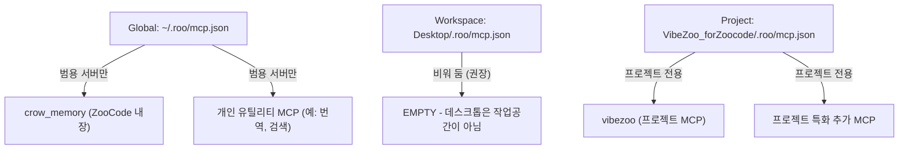
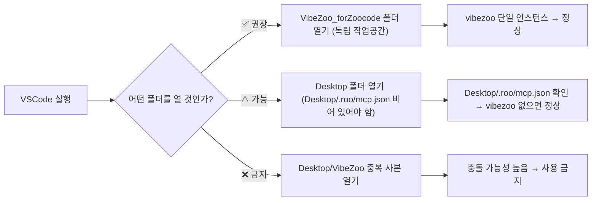

# VibeZoo MCP 설정 근본적 재설계 문서

> **작성일**: 2026-05-28  
> **최종 수정일**: 2026-05-28  
> **버전**: v1.1  
> **상태**: 설계 완료 (일부 구현 완료)  
> **관련 디버그 이슈**: MCP 서버 `vibezoo` 중복 등록 → AI 모델 API 연동 실패  

---

## 목차

1. [MCP 설정 계층 구조 원칙](#1-mcp-설정-계층-구조-원칙)
2. [Desktop ↔ 프로젝트 관계 재정의](#2-desktop--프로젝트-관계-재정의)
3. [유효성 검증 및 방어책](#3-유효성-검증-및-방어책)
4. [권장 디렉토리 구조](#4-권장-디렉토리-구조)
5. [이행 계획 (구현 우선순위)](#5-이행-계획-구현-우선순위)
6. [`local.vibezoo` 확장 `autoConfigureMCP()` 문제 및 수정](#6-localvibezoo-확장-autoconfiguremcp-문제-및-수정)

---

## 1. MCP 설정 계층 구조 원칙

### 1.1 ZooCode의 MCP 병합 메커니즘 (현재 동작)

ZooCode는 다음 우선순위로 MCP 설정을 **계층 병합**한다:

```
글로벌 (~/.roo/mcp.json)          ← 최상위 (모든 작업공간에 적용)
  └─ 작업공간 (<workspace>/.roo/mcp.json)  ← 중간 (작업공간 범위)
       └─ 프로젝트 (<project>/.roo/mcp.json)  ← 최하위 (프로젝트 범위)
```

- **덮어쓰기 병합(Override Merge)**: 하위 레벨에서 동일한 `mcpServers` 키가 정의되면 상위 값을 덮어씀
- **누적 병합(Accumulative Merge)**: 서로 다른 서버 이름은 누적됨
- **문제점**: 동일한 서버 이름이 **서로 다른 레벨에 존재할 때**, 의도치 않은 덮어쓰기 또는 중복 연결 발생 가능

### 1.2 계층별 MCP 서버 배치 원칙



#### 글로벌 레벨 (`~/.roo/mcp.json`)

**원칙: 모든 프로젝트에서 공통으로 사용하는 범용 MCP 서버만 정의한다.**

| 포함할 것 | 포함하지 말 것 |
|:---|:---|
| `crow_memory` (ZooCode 내장, 자동 등록) | `vibezoo` (프로젝트 특화) |
| 개인 생산성 도구 MCP (번역, 검색, 메모 등) | 특정 언어/프레임워크 전용 분석 도구 |
| 시스템 유틸리티 MCP (파일 관리, 터미널 등) | 특정 프로젝트에서만 의미 있는 MCP |

**근거**: 글로벌 레벨은 ZooCode가 열리는 **모든** 작업공간에 적용된다. 프로젝트 특화 MCP 서버를 글로벌에 두면, 전혀 관련 없는 프로젝트에서도 불필요한 연결 시도가 발생하고, 해당 MCP 서버가 실행 중이지 않을 경우 연결 오류가 발생한다.

**현재 상태**: 글로벌 ZooCode 설정(`mcp_settings.json`)에는 `crow_memory`만 존재하고 `vibezoo`는 제거됨. ✅

#### 작업공간 레벨 (`<workspace>/.roo/mcp.json`)

**원칙: 작업공간 전체에 적용되어야 하는 MCP 서버만 정의한다. 특정 하위 프로젝트 전용 MCP는 여기에 두지 않는다.**

| 포함할 것 | 포함하지 말 것 |
|:---|:---|
| 모노레포 전역 도구 (모든 패키지 공통) | 특정 하위 프로젝트의 MCP |
| 작업공간 수준의 CI/CD 연동 도구 | `vibezoo` (하위 프로젝트 전용) |
| **대부분의 경우 비워 두는 것이 안전** | |

**근거**: 작업공간 레벨은 그 하위의 모든 프로젝트에 상속된다. Desktop을 작업공간 루트로 열면 Desktop/.roo/mcp.json이 모든 하위 프로젝트에 적용된다. Desktop에는 여러 프로젝트가 있을 수 있고, 각각 다른 MCP 서버가 필요할 수 있으므로, 작업공간 레벨에 특정 프로젝트의 MCP를 두는 것은 **구조적 오류**다.

**현재 상태**: [`Desktop\.roo\mcp.json`](C:/Users/k1yt/Desktop/.roo/mcp.json)은 `{"mcpServers": {}}`로 유지 중. ✅

#### 프로젝트 레벨 (`<project>/.roo/mcp.json`)

**원칙: 해당 프로젝트에서만 필요한 MCP 서버를 정의한다. 이것이 MCP 서버 정의의 주된 위치다.**

| 포함할 것 | 포함하지 말 것 |
|:---|:---|
| `vibezoo` (VibeZoo 프로젝트 전용) | 글로벌하게 이미 정의된 서버 (중복 방지) |
| 프로젝트별 도구 (예: 특정 DB MCP) | |
| 프로젝트 전용 AI 모드 설정 | |

**근거**: 프로젝트 레벨이 가장 구체적인 범위다. MCP 서버는 대부분 특정 프로젝트의 필요에 의해 도입되므로, 프로젝트 레벨에 정의하는 것이 자연스럽고 안전하다.

**현재 상태**: [`VibeZoo_forZoocode\.roo\mcp.json`](C:/Users/k1yt/OneDrive/문서/각종자료/공부자료들/파이썬_Python/VibeZoo_forZoocode/.roo/mcp.json)은 `{"mcpServers": {}}`로 초기화됨 (글로벌 설정에만 vibezoo 등록). ✅

### 1.3 중복 정의 금지 원칙

**핵심 규칙: 동일한 MCP 서버 이름(`mcpServers` 키)은 하나의 계층 레벨에만 존재해야 한다.**

```
✅ 올바른 구성:
  Global:     { "mcpServers": { "translator": {...} } }
  Workspace:  { "mcpServers": {} }
  Project:    { "mcpServers": { "vibezoo": {...} } }
  → 서로 다른 서버 이름, 충돌 없음

❌ 잘못된 구성 (이슈의 원인):
  Workspace:  { "mcpServers": { "vibezoo": {...} } }  ← ①
  Project:    { "mcpServers": { "vibezoo": {...} } }  ← ②
  → 동일 서버 이름 충돌 → SSE 연결 2개 → 도구 중복 → API 실패
```

**충돌 시 ZooCode의 이상적 처리 방안** (향후 ZooCode 개선 제안):
1. **경고 출력**: 동일한 MCP 서버 이름이 여러 레벨에서 감지되면 사용자에게 알림
2. **우선순위 적용**: 하위 레벨(프로젝트) 정의가 상위 레벨(작업공간)을 덮어쓰도록 명시적 병합
3. **충돌 로그**: `ZooCode: MCP` 출력 채널에 충돌 정보 기록

### 1.4 시나리오별 올바른 구성

#### 시나리오 A: VibeZoo_forZoocode를 독립 작업공간으로 열기 (권장)

```
작업공간 루트: VibeZoo_forZoocode/
├── .roo/
│   └── mcp.json  ← vibezoo 정의 (프로젝트 레벨 = 작업공간 레벨)
├── .zoo/
│   └── config.json
└── ...

로드되는 MCP 설정: VibeZoo_forZoocode/.roo/mcp.json 만 로드됨
→ vibezoo 1개 인스턴스 → 정상 동작 ✅
```

#### 시나리오 B: Desktop을 작업공간으로 열고 VibeZoo_forZoocode를 하위 폴더로 열기 (비권장)

```
작업공간 루트: Desktop/
├── .roo/
│   └── mcp.json  ← EMPTY (또는 범용 서버만)
├── VibeZoo_forZoocode/
│   └── .roo/
│       └── mcp.json  ← vibezoo 정의 (프로젝트 레벨)
└── ...

로드되는 MCP 설정: Desktop/.roo/mcp.json + VibeZoo_forZoocode/.roo/mcp.json
→ Desktop/.roo/mcp.json이 비어 있으면 vibezoo 1개만 로드 → 정상 동작 ✅
→ Desktop/.roo/mcp.json에 vibezoo가 있으면 충돌 → 실패 ❌
```

---

## 2. Desktop ↔ 프로젝트 관계 재정의

### 2.1 Desktop의 역할 정의

**Desktop은 "작업공간"이 아니라 "파일 보관소"다.**

| 관점 | Desktop을 작업공간으로 쓰는 것 | VibeZoo_forZoocode를 작업공간으로 쓰는 것 |
|:---|:---|:---|
| **MCP 로드 범위** | Desktop + 모든 하위 프로젝트의 MCP 누적 로드 | VibeZoo_forZoocode의 MCP만 로드 |
| **충돌 위험** | 높음 (여러 프로젝트의 MCP가 섞임) | 낮음 (단일 프로젝트) |
| **VSCode 성능** | 불필요한 파일 감시 범위 과다 | 최적 범위 |
| **의미적 명확성** | "Desktop"은 작업공간이 아님 | "VibeZoo_forZoocode"는 명확한 프로젝트 |

**권장**: VSCode에서 **항상 프로젝트 루트를 작업공간으로 열 것**. Desktop을 작업공간으로 열지 않는다.

### 2.2 VibeZoo_forZoocode를 여는 올바른 방법

```
✅ 올바른 방법 (권장):
   VSCode → File → Open Folder → VibeZoo_forZoocode 폴더 선택
   → 작업공간 루트 = VibeZoo_forZoocode
   → .roo/mcp.json 만 로드됨
   → vibezoo 단일 인스턴스

❌ 잘못된 방법 (문제 발생):
   VSCode → File → Open Folder → Desktop 폴더 선택
   → 작업공간 루트 = Desktop
   → Desktop/.roo/mcp.json + VibeZoo_forZoocode/.roo/mcp.json 로드
   → Desktop에 vibezoo 정의가 있으면 충돌
```

### 2.3 `Desktop\VibeZoo\` 중복 사본 처리

**현황**: [`Desktop\VibeZoo\`](C:/Users/k1yt/Desktop/VibeZoo/)는 [`VibeZoo_forZoocode\`](C:/Users/k1yt/OneDrive/문서/각종자료/공부자료들/파이썬_Python/VibeZoo_forZoocode/)의 **일부 파일만 복사된 중복 사본**이다. 다음과 같은 차이가 있다:

| 파일/디렉토리 | Desktop\VibeZoo\ | VibeZoo_forZoocode\ |
|:---|:---|:---|
| `.roo/mcp.json` | vibezoo 있음 (문제) | vibezoo 있음 (정상) |
| `.zoo/` | modes만 있음 | config.json + modes |
| `extension/` | 컴파일된 out + src | 컴파일된 out + src |
| `templates/` | **없음** | 있음 |
| `fromscratch/` | **없음** | 있음 |
| `plans/` | **없음** | 있음 |
| `mcp-servers/` | **없음** | 있음 |
| `README.md` | **없음** | 있음 |

**중복 사본의 추정 생성 원인**:
1. Extension 개발 중 빌드 산출물(`out/`)을 Desktop으로 복사하여 테스트
2. VSIX 패키징 후 Desktop에서 설치 테스트
3. 백업 목적으로 일부 파일만 복사

**처리 방안**:

| 우선순위 | 조치 | 설명 |
|:---:|:---|:---|
| **1** | `Desktop\VibeZoo\` 폴더 **삭제** 또는 **아카이브** | 혼동의 근원을 제거 |
| **2** | 만약 보존이 필요하다면 `Desktop\VibeZoo\`의 `.roo\mcp.json`에서 `vibezoo` 제거 | 임시 충돌 방지 |
| **3** | `Desktop\VibeZoo\`를 열지 않도록 `.vscode/` 설정 추가 | 실수로 열더라도 안전하게 |

**장기적 해결책**: VibeZoo_forZoocode는 OneDrive에, Desktop은 임시 작업 공간으로 분리하고, **프로젝트 사본을 만들 때는 `.roo/mcp.json`과 `.zoo/config.json`을 반드시 정리하는 스크립트**를 제공한다.

### 2.4 권장 워크플로우



---

## 3. 유효성 검증 및 방어책

### 3.1 `defaultMode` 값 검증

**문제**: [`.zoo/config.json`](C:/Users/k1yt/OneDrive/문서/각종자료/공부자료들/파이썬_Python/VibeZoo_forZoocode/.zoo/config.json:3)에서 `"defaultMode": "code_plus_crow"` (유효하지 않은 모드명)가 설정되었을 때, ZooCode는 **침묵하며 실패**했다. 올바른 값은 `"code-crow"`다.

**현재 ZooCode에서 지원하는 유효한 모드명**:

| 모드명 (slug) | 표시 이름 |
|:---|:---|
| `code` | 💻 Code |
| `architect` | 🏗️ Architect |
| `ask` | ❓ Ask |
| `debug` | 🪲 Debug |
| `orchestrator` | 🪃 Orchestrator |
| `code-crow` | Code + Crow Memory |

**방어책 설계**:

```
1. ZooCode 로드 시 config.json 파싱
2. defaultMode 값이 유효한 모드명 목록에 있는지 확인
3. 유효하지 않은 경우:
   a. 사용자에게 경고 알림 표시
      "⚠️ .zoo/config.json의 defaultMode 'code_plus_crow'는 유효하지 않습니다.
       기본값 'code'로 폴백합니다. 유효한 값: code, architect, ask, debug, orchestrator, code-crow"
   b. 로그에 경고 기록
   c. 기본 모드('code')로 폴백
4. 유효한 경우 정상 진행
```

**근거**: 침묵 실패는 디버깅을 극도로 어렵게 만든다. 사용자에게 명시적으로 알려야 근본 원인을 빠르게 파악할 수 있다.

### 3.2 MCP 서버 이름 충돌 감지

**현재 동작**: ZooCode는 동일한 MCP 서버 이름이 여러 레벨에 존재할 때 **아무 경고 없이** 모든 연결을 시도한다.

**이상적 동작 설계**:

```
MCP 설정 로드 프로세스:
1. 글로벌, 작업공간, 프로젝트 mcp.json을 순차적으로 로드
2. 병합 시 mcpServers 키 충돌 감지:
   a. 동일 서버 이름이 상위 레벨과 하위 레벨 모두에 존재
   b. ZooCode 출력 채널에 경고 기록:
      "⚠️ MCP 서버 'vibezoo'가 여러 레벨에 정의되었습니다:
       - 작업공간: Desktop/.roo/mcp.json
       - 프로젝트: VibeZoo_forZoocode/.roo/mcp.json
       프로젝트 레벨 정의로 덮어씁니다."
   c. 사용자에게 정보 알림 (최초 1회)
   d. 중복 연결 시도 방지 (프로젝트 레벨만 연결)
```

**구현 난이도**: 이 변경은 ZooCode 확장 자체의 수정이 필요하므로, VibeZoo 측에서 직접 구현할 수 없다. **ZooCode 팀에 기능 제안**으로 전달한다.

**VibeZoo 측에서 할 수 있는 방어책**:

1. **프로젝트 초기화 스크립트**: `vibezoo init` 명령어로 `.roo/mcp.json`을 생성할 때, 기존 상위 레벨에 동일한 `vibezoo` 정의가 있는지 확인하고 경고
2. **상태 확인 명령어**: `VibeZoo: Verify Foundation` 실행 시 MCP 중복 여부를 진단 항목에 포함
3. **문서화**: README에 "Desktop을 작업공간으로 열지 마세요" 경고 추가

### 3.3 템플릿 무결성 방어

**현재 템플릿 파일**:

| 템플릿 | 용도 | 현재 상태 |
|:---|:---|:---|
| [`templates/zoo-config.json`](C:/Users/k1yt/OneDrive/문서/각종자료/공부자료들/파이썬_Python/VibeZoo_forZoocode/templates/zoo-config.json) | `.zoo/config.json` 생성용 | `defaultMode: "code-crow"` ✅ (수정 완료) |
| [`templates/vscode-settings.json`](C:/Users/k1yt/OneDrive/문서/각종자료/공부자료들/파이썬_Python/VibeZoo_forZoocode/templates/vscode-settings.json) | `.vscode/settings.json` 생성용 | 정상 |
| [`templates/yoloignore`](C:/Users/k1yt/OneDrive/문서/각종자료/공부자료들/파이썬_Python/VibeZoo_forZoocode/templates/yoloignore) | `.yoloignore` 생성용 | 정상 |
| `templates/.roo/mcp.json` | **없음** (누락!) | 추가 필요 |

**문제점과 방어책**:

1. **템플릿 누락**: `templates/`에 `.roo/mcp.json` 템플릿이 없다. 템플릿은 완전해야 한다.
   - **방어책**: `templates/.roo/mcp.json`을 추가하여 v0.13.0에 포함
   - 내용: `vibezoo` 서버 정의 + `alwaysAllow` 목록 포함

2. **템플릿과 실제 설정 간 불일치**: 템플릿이 업데이트되어도 실제 `.zoo/config.json`이나 `.roo/mcp.json`이 자동으로 업데이트되지 않는다.
   - **방어책**: `VibeZoo: Verify Foundation` 명령어에 템플릿-실제 설정 비교 진단 추가
   - 마이그레이션 필요한 항목이 있으면 사용자에게 알림

3. **템플릿 자체의 유효성**: 템플릿에 잘못된 값이 들어가지 않도록 보장할 방법이 없다.
   - **방어책**: CI/CD 파이프라인에 JSON 스키마 검증 추가
   - `templates/zoo-config.json`에 대해 [JSON Schema](https://json-schema.org) 정의 및 검증

### 3.4 `alwaysAllow` 도구명 검증

[`VibeZoo_forZoocode\.roo\mcp.json`](C:/Users/k1yt/OneDrive/문서/각종자료/공부자료들/파이썬_Python/VibeZoo_forZoocode/.roo/mcp.json:6-10)의 `alwaysAllow` 배열에는 MCP 서버에 실제로 존재하는 도구명만 포함되어야 한다. 잘못된 도구명이 포함되면 ZooCode가 해당 도구 호출을 시도할 때 실패한다.

**방어책**: `vibezoo_mcp_bridge.py`에 등록된 실제 도구명 목록을 추출하여 `alwaysAllow` 배열과 비교 검증하는 유틸리티 함수를 추가한다.

---

## 4. 권장 디렉토리 구조

### 4.1 현재 구조 vs 개선된 구조

```
현재 구조 (부분적)                          개선된 구조 (제안)
─────────────────────────                   ─────────────────────
VibeZoo_forZoocode/                         VibeZoo_forZoocode/
├── .roo/                                   ├── .roo/
│   ├── mcp.json          ← vibezoo 정의    │   ├── mcp.json              ← vibezoo 정의
│   └── rules-orchestrator/                 │   ├── mcp.schema.json       ← [신규] MCP 설정 스키마
│       └── rules.md (빈 파일)               │   ├── rules-orchestrator/
├── .zoo/                                   │   │   └── rules.md
│   ├── config.json       ← 프로젝트 설정    │   └── .gitignore            ← [신규] MCP 설정 보호
│   └── modes/                              ├── .zoo/
│       └── vibezoo.yaml  ← 커스텀 모드     │   ├── config.json           ← 프로젝트 설정
├── .vscode/                                │   ├── config.schema.json    ← [신규] 설정 스키마
│   └── settings.json                       │   ├── modes/
├── .yoloignore                             │   │   └── vibezoo.yaml
├── templates/                              │   └── .gitignore            ← [신규]
│   ├── zoo-config.json                     ├── .vscode/
│   ├── vscode-settings.json                │   └── settings.json
│   └── yoloignore                          ├── .yoloignore
├── extension/                              ├── templates/
├── mcp-servers/                            │   ├── .roo/                 ← [신규] 디렉토리 구조화
├── fromscratch/                            │   │   └── mcp.json
├── plans/                                  │   ├── .zoo/                 ← [신규] 디렉토리 구조화
└── README.md                               │   │   └── config.json
                                            │   ├── .vscode/
                                            │   │   └── settings.json
                                            │   └── .yoloignore
                                            ├── extension/
                                            ├── mcp-servers/
                                            ├── fromscratch/
                                            ├── plans/
                                            └── README.md
```

### 4.2 디렉토리별 역할과 소유권

| 디렉토리 | 소유권 | 역할 | 수정 주체 |
|:---|:---|:---|:---|
| `.roo/` | **ZooCode / Roo-Code** | MCP 서버 연결, AI 규칙, 시스템 프롬프트 | 사용자 + AI |
| `.zoo/` | **ZooCode** | 프로젝트 설정, 커스텀 모드, Yocto 백업 | 사용자 + AI |
| `.vscode/` | **VS Code** | 편집기 설정, 확장 설정 | 사용자 |
| `templates/` | **VibeZoo** | 새 프로젝트 초기화용 템플릿 | VibeZoo 개발자 |
| `extension/` | **VibeZoo** | VS Code 확장 소스 및 빌드 산출물 | VibeZoo 개발자 |
| `mcp-servers/` | **VibeZoo** | Python MCP 브릿지 서버 | VibeZoo 개발자 |
| `plans/` | **VibeZoo** | 설계 문서 | VibeZoo 개발자 + AI |

### 4.3 `templates/`와 실제 설정 간 관계

**원칙: `templates/`는 신규 프로젝트 초기화의 **청사진**이다. 이미 존재하는 프로젝트의 `.roo/`, `.zoo/` 설정을 덮어쓰지 않는다.**

```
templates/                     →  새 프로젝트 생성 시 복사됨
  ├── .roo/mcp.json            →  <new-project>/.roo/mcp.json
  ├── .zoo/config.json         →  <new-project>/.zoo/config.json
  ├── .vscode/settings.json    →  <new-project>/.vscode/settings.json
  └── .yoloignore              →  <new-project>/.yoloignore
```

**템플릿 무결성 유지 방안**:

1. **템플릿은 실제 설정의 미러가 되어야 한다**: 템플릿의 `zoo-config.json`과 실제 `.zoo/config.json`의 구조가 일치해야 한다. 단, `project.name`과 같은 사용자별 값은 플레이스홀더(`""`)로 둔다.

2. **마이그레이션 도구 제공**: `vibezoo update-templates` 명령어로 템플릿과 실제 설정을 비교하고, 필요한 업데이트를 제안한다.

3. **CI/CD 검증**: GitHub Actions 또는 로컬 pre-commit 훅으로 템플릿과 실제 설정의 스키마 일치를 검증한다.

### 4.4 글로벌 설정과의 관계

**`~/.roo/mcp.json`은 VibeZoo 프로젝트의 관심사가 아니다.** 이 파일은 사용자의 개인 설정이며, VibeZoo가 이를 생성하거나 수정해서는 안 된다.

다만, VibeZoo의 `Verify Foundation` 명령어에서 글로벌 MCP 설정에 `vibezoo`가 등록되어 있는지 확인하고, 만약 있다면 "글로벌에 vibezoo가 등록되어 있습니다. 프로젝트 레벨로 이동하는 것을 권장합니다"라고 안내할 수 있다.

---

## 5. 이행 계획 (구현 우선순위)

### 우선순위 1: 즉시 조치 (충돌 제거) — 대부분 완료됨

| # | 작업 항목 | 상태 | 담당 |
|:---:|:---|:---:|:---|
| 1.1 | [`Desktop\.roo\mcp.json`](C:/Users/k1yt/Desktop/.roo/mcp.json)에서 `vibezoo` 제거 | ✅ 완료 | 사용자 |
| 1.2 | [`Desktop\VibeZoo\`](C:/Users/k1yt/Desktop/VibeZoo/) 중복 사본 삭제 또는 `.roo/mcp.json` 정리 | ⬜ 진행 필요 | 사용자 |
| 1.3 | [`VibeZoo_forZoocode\.zoo\config.json`](C:/Users/k1yt/OneDrive/문서/각종자료/공부자료들/파이썬_Python/VibeZoo_forZoocode/.zoo/config.json) `defaultMode` → `"code-crow"` 수정 | ✅ 완료 | 사용자 |
| 1.4 | [`templates\zoo-config.json`](C:/Users/k1yt/OneDrive/문서/각종자료/공부자료들/파이썬_Python/VibeZoo_forZoocode/templates/zoo-config.json) `defaultMode` → `"code-crow"` 수정 | ✅ 완료 | 사용자 |

### 우선순위 2: 방어 메커니즘 (VibeZoo v0.13.0)

| # | 작업 항목 | 설명 |
|:---:|:---|:---|
| 2.1 | `templates/.roo/mcp.json` 생성 | 템플릿 완전성 확보. 현재 이 파일이 누락되어 있음 |
| 2.2 | `templates/.zoo/config.json` 생성 | `templates/zoo-config.json`을 `.zoo/config.json`으로 이동 (디렉토리 구조 일치) |
| 2.3 | `templates/.vscode/settings.json` 생성 | `templates/vscode-settings.json`을 이동 |
| 2.4 | `templates/.yoloignore` 생성 | `templates/yoloignore`를 이동 |
| 2.5 | `VibeZoo: Verify Foundation` 진단 강화 | MCP 중복 감지, defaultMode 유효성, 템플릿-실제 설정 비교 항목 추가 |
| 2.6 | README에 "작업공간 열기 가이드" 추가 | Desktop을 열지 말고 프로젝트 루트를 열라는 경고 |

### 우선순위 3: 구조 개선 (VibeZoo v0.13.0+)

| # | 작업 항목 | 설명 |
|:---:|:---|:---|
| 3.1 | `templates/` 디렉토리 구조화 | `.roo/`, `.zoo/`, `.vscode/` 하위 디렉토리로 구성 |
| 3.2 | JSON Schema 정의 | `.zoo/config.schema.json`, `.roo/mcp.schema.json` 작성 |
| 3.3 | `vibezoo init` 명령어 구현 | 새 프로젝트 초기화 시 MCP 충돌 검사 포함 |
| 3.4 | `vibezoo doctor` 명령어 구현 | 설정 진단: MCP 중복, defaultMode, alwaysAllow 검증 |
| 3.5 | CI/CD 스키마 검증 | GitHub Actions에 템플릿 및 설정 파일 유효성 검사 추가 |
| 3.6 | 설정 마이그레이션 도구 | `vibezoo update-config` — 이전 버전 설정을 최신 템플릿에 맞게 업데이트 |

### 우선순위 4: ZooCode 개선 제안 (외부 의존)

| # | 작업 항목 | 설명 |
|:---:|:---|:---|
| 4.1 | MCP 중복 감지 및 경고 | ZooCode에 동일 MCP 서버명 다중 등록 감지 기능 제안 |
| 4.2 | `defaultMode` 유효성 검증 | ZooCode에 잘못된 defaultMode 값에 대한 폴백 및 경고 기능 제안 |
| 4.3 | MCP 설정 충돌 해결 전략 | 상위-하위 레벨 간 우선순위 문서화 및 구현 제안 |

### 우선순위 5: 문서화 및 교육

| # | 작업 항목 | 설명 |
|:---:|:---|:---|
| 5.1 | 본 설계 문서를 `plans/mcp-config-redesign.md`로 보존 | 향후 참조 및 온보딩 자료 |
| 5.2 | `fromscratch/Architecture.md`에 MCP 계층 구조 섹션 추가 | 아키텍처 문서에 반영 |
| 5.3 | `README.md`에 "올바른 프로젝트 열기" 섹션 추가 | 신규 사용자용 가이드 |

### 우선순위 6: `local.vibezoo` 확장 `autoConfigureMCP()` 핫픽스 (완료)

| # | 작업 항목 | 설명 | 상태 |
|:---:|:---|:---|:---:|
| 6.1 | `autoConfigureMCP()` 빈 객체 존중 로직 수정 | `mcpServers` 키가 존재하면(빈 객체 포함) 건드리지 않음 | ✅ 완료 |
| 6.2 | `ensureTemplates()` 내 중복 `autoConfigureMCP()` 호출 제거 | `spawnBridge()`에서만 호출되도록 단일화 | ✅ 완료 |
| 6.3 | 모든 프로젝트 `.roo/mcp.json` 초기화 | `{"mcpServers": {}}`로 통일 | ✅ 완료 |
| 6.4 | 글로벌 `mcp_settings.json`에서 `vibezoo` 제거 | `crow_memory`만 유지 | ✅ 완료 |
| 6.5 | 설계 문서 업데이트 | 본 문서 v1.1 | ✅ 완료 |

---

## 6. `local.vibezoo` 확장 `autoConfigureMCP()` 문제 및 수정

### 6.1 배경

VS Code 시작 시마다 [`local.vibezoo` 확장](C:\Users\k1yt\.vscode\extensions\local.vibezoo-0.12.0)의 [`autoConfigureMCP()`](C:\Users\k1yt\.vscode\extensions\local.vibezoo-0.12.0\out\extension.js:580-618) 함수가 **모든 작업공간의 `.roo/mcp.json`에 vibezoo를 강제로 주입**하는 것이 근본 원인이었다.

### 6.2 문제점

원래 코드의 로직:

```javascript
const existingServers = existing.mcpServers || {};
// 이미 vibezoo가 등록되어 있으면 덮어쓰지 않음
if (!existingServers.vibezoo) {
    // → vibezoo 키가 없으면 무조건 추가 (빈 객체여도 추가해버림)
    fs.mkdirSync(zooMCPDir, { recursive: true });
    const merged = {
        mcpServers: { ...existingServers, ...mcpConfig.mcpServers },
    };
    fs.writeFileSync(zooMCPPath, JSON.stringify(merged, null, 2), 'utf-8');
}
```

다음과 같은 문제가 있었다:

1. **`mcpServers`가 `{}`(빈 객체)여도 "vibezoo 키가 없음"으로 간주하고 무조건 추가**
   - 사용자가 의도적으로 `{"mcpServers": {}}`로 비워도, `existingServers.vibezoo`가 `undefined`이므로 조건이 `true`가 되어 vibezoo를 추가해버림

2. **`ensureTemplates()`와 `spawnBridge()` 두 곳에서 중복 호출**
   - [`ensureTemplates()`](C:\Users\k1yt\.vscode\extensions\local.vibezoo-0.12.0\out\extension.js:632-662) 내부(line 651)와 [`spawnBridge().then()`](C:\Users\k1yt\.vscode\extensions\local.vibezoo-0.12.0\out\extension.js:140-143) 내부(line 143)에서 각각 `autoConfigureMCP()` 호출 → 불필요한 중복 실행

3. **`folders[0]`만 처리 → 첫 번째 작업공간만 설정**
   - 다중 루트 작업공간 사용 시 나머지 폴더는 설정되지 않음

### 6.3 수정 내역

#### 수정 A: `autoConfigureMCP()` — `mcpServers` 키 존재 여부로 분기

```javascript
const existingServers = existing.mcpServers;
// [Fix] mcpServers 키가 아예 없을 때만 최초 설정 (vibezoo 추가)
// - mcpServers가 {} (빈 객체)면 사용자가 의도적으로 비운 것 → 건드리지 않음
// - mcpServers에 다른 서버만 있고 vibezoo가 없어도 → 사용자 의도 존중
if (existingServers === undefined) {
    fs.mkdirSync(zooMCPDir, { recursive: true });
    const merged = { mcpServers: { ...mcpConfig.mcpServers } };
    fs.writeFileSync(zooMCPPath, JSON.stringify(merged, null, 2), 'utf-8');
    console.log(`[VibeZoo] Zoo Code MCP 최초 설정 완료: ${zooMCPPath}`);
} else {
    console.log('[VibeZoo] MCP 설정이 이미 존재합니다. 건드리지 않습니다.');
}
```

변경 사항:
- `existing.mcpServers || {}` → `existing.mcpServers` (빈 객체 폴백 제거)
- `undefined` 체크로 `mcpServers` 키 자체가 없을 때만 vibezoo 추가
- `mcpServers: { ...existingServers, ...mcpConfig.mcpServers }` → `mcpServers: { ...mcpConfig.mcpServers }` (최초 설정이므로 기존 서버 병합 불필요)

#### 수정 B: `ensureTemplates()` 내 중복 호출 제거

`ensureTemplates()` 함수에서 `autoConfigureMCP()` 호출 라인을 제거함. 이제 `spawnBridge().then()` 내부에서만 호출된다.

#### 수정 C: 모든 워크스페이스 폴더 순회 (선택 사항, 생략 가능)

`folders[0]`만 처리하는 구조는 그대로 유지함. (복잡도 대비 실익 적음)

### 6.4 교훈 및 원칙

1. **MCP 서버는 글로벌에만 등록하고, 프로젝트 `.roo/mcp.json`은 빈 상태로 유지해야 한다.**
   - 글로벌 설정: `C:\Users\k1yt\AppData\Roaming\Code\User\globalStorage\zoocodeorganization.zoo-code\settings\mcp_settings.json`
   - 프로젝트 설정: 각 프로젝트의 `.roo/mcp.json`

2. **확장 코드는 사용자의 명시적 설정을 존중해야 한다.**
   - 빈 객체 `{}`는 "의도적으로 비움"으로 간주
   - `mcpServers` 키가 존재하면(값이 무엇이든) 사용자가 이미 설정을 고려했음

3. **중복 호출 방지**: 동일한 설정 함수는 한 곳에서만 호출되어야 함

4. **핫픽스 한계**: 이 수정은 `out/extension.js` (컴파일된 JS)에 직접 적용되었으므로, 확장 업데이트 시 덮어쓰여질 수 있음. 근본적인 해결을 위해 VibeZoo 확장 저장소의 소스 코드에도 동일한 수정이 반영되어야 함.

---

## 부록 A: MCP 설정 파일별 현재 상태 요약

| # | 파일 경로 | 레벨 | `vibezoo` 존재 | 상태 |
|:---:|:---|:---|:---:|:---|
| ① | `C:\Users\k1yt\Desktop\.roo\mcp.json` | 작업공간 | 없음 (`{}`) | ✅ 정상 (의도적으로 비움) |
| ② | `VibeZoo_forZoocode\.roo\mcp.json` | 프로젝트 | 없음 (`{}`) | ✅ 정상 (글로벌에만 등록) |
| ③ | `C:\Users\k1yt\Desktop\VibeZoo\.roo\mcp.json` | 사본 프로젝트 | 있음 | ⚠️ 중복 사본, 삭제 권장 |
| ④ | 글로벌 `mcp_settings.json` | 글로벌(ZooCode) | 없음 (제거 완료) | ✅ 정상 (`crow_memory`만 유지) |

---

## 부록 B: `defaultMode` 유효값 참조표

| Slug | 표시 이름 | 설명 |
|:---|:---|:---|
| `code` | 💻 Code | 코드 작성 및 수정 |
| `architect` | 🏗️ Architect | 설계 및 계획 |
| `ask` | ❓ Ask | 질문 및 설명 |
| `debug` | 🪲 Debug | 디버깅 및 문제 해결 |
| `orchestrator` | 🪃 Orchestrator | 복합 작업 조율 |
| `code-crow` | Code + Crow Memory | Crow Memory 통합 코드 모드 |

**잘못된 값 예시**: `code_plus_crow` (언더스코어 사용), `Code-Crow` (대문자), `crow` (불완전)

## 부록 C: 체크리스트 — 새 프로젝트 설정 시 확인 사항

- [ ] 작업공간 루트가 Desktop이 아닌 프로젝트 루트인가?
- [ ] `.roo/mcp.json`에 정의된 MCP 서버가 상위 레벨에 중복되지 않는가?
- [ ] `.zoo/config.json`의 `defaultMode`가 유효한 값인가? (참조: 부록 B)
- [ ] `.zoo/config.json`과 `templates/zoo-config.json`이 구조적으로 일치하는가?
- [ ] `alwaysAllow`에 나열된 도구명이 실제 MCP 서버에 존재하는가?
- [ ] `VibeZoo: Verify Foundation`을 실행하여 모든 진단을 통과했는가?
