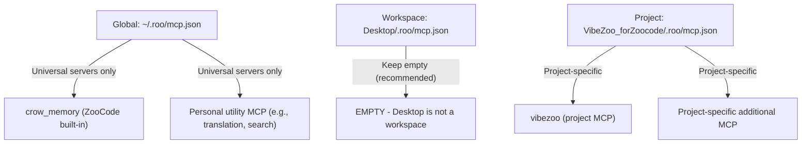
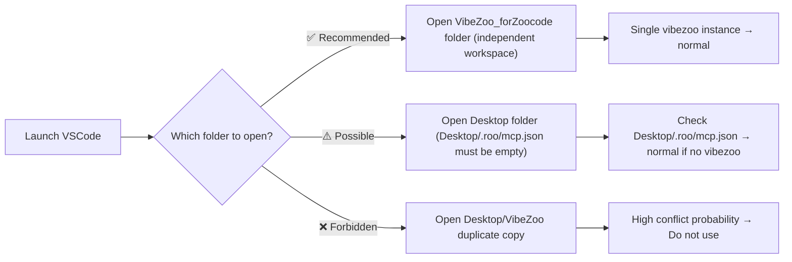

# VibeZoo MCP Configuration Fundamental Redesign Document

> **Written**: 2026-05-28  
> **Last Modified**: 2026-05-28  
> **Version**: v1.1  
> **Status**: Design Complete (Partially Implemented)  
> **Related Debug Issue**: MCP server `vibezoo` duplicate registration → AI model API integration failure  

---

## Table of Contents

1. [MCP Configuration Hierarchy Principles](#1-mcp-configuration-hierarchy-principles)
2. [Desktop ↔ Project Relationship Redefinition](#2-desktop--project-relationship-redefinition)
3. [Validation and Defenses](#3-validation-and-defenses)
4. [Recommended Directory Structure](#4-recommended-directory-structure)
5. [Implementation Plan (Priority)](#5-implementation-plan-priority)
6. [`local.vibezoo` Extension `autoConfigureMCP()` Issue and Fix](#6-localvibezoo-extension-autoconfiguremcp-issue-and-fix)

---

## 1. MCP Configuration Hierarchy Principles

### 1.1 ZooCode's MCP Merge Mechanism (Current Behavior)

ZooCode merges MCP settings hierarchically with the following priority:

```
Global (~/.roo/mcp.json)              ← Top level (applies to all workspaces)
  └─ Workspace (<workspace>/.roo/mcp.json)  ← Middle level (workspace scope)
       └─ Project (<project>/.roo/mcp.json)  ← Bottom level (project scope)
```

- **Override Merge**: If the same `mcpServers` key is defined at a lower level, it overrides the higher-level value
- **Accumulative Merge**: Different server names accumulate
- **Problem**: When the same server name exists at **different levels**, unintended override or duplicate connections can occur

### 1.2 MCP Server Placement Principles per Hierarchy



#### Global Level (`~/.roo/mcp.json`)

**Principle: Define only universal MCP servers shared across all projects.**

| Include | Do NOT Include |
|:---|:---|
| `crow_memory` (ZooCode built-in, auto-registered) | `vibezoo` (project-specific) |
| Personal productivity tool MCP (translation, search, notes, etc.) | Language/framework-specific analysis tools |
| System utility MCP (file management, terminal, etc.) | MCP meaningful only to specific projects |

**Rationale**: The global level applies to **every** workspace opened by ZooCode. Placing project-specific MCP servers globally causes unnecessary connection attempts in unrelated projects, and connection errors occur when those MCP servers are not running.

**Current Status**: Global ZooCode config (`mcp_settings.json`) contains only `crow_memory`; `vibezoo` has been removed. ✅

#### Workspace Level (`<workspace>/.roo/mcp.json`)

**Principle: Define only MCP servers that should apply to the entire workspace. Do NOT place project-specific MCP here.**

| Include | Do NOT Include |
|:---|:---|
| Monorepo-wide tools (common to all packages) | Specific sub-project MCP |
| Workspace-level CI/CD integration tools | `vibezoo` (sub-project specific) |
| **Most cases, leaving it empty is safe** | |

**Rationale**: The workspace level inherits to all sub-projects. If Desktop is opened as the workspace root, Desktop/.roo/mcp.json applies to all sub-projects. Desktop may contain multiple projects, each potentially requiring different MCP servers, so placing a specific project's MCP at the workspace level is a **structural error**.

**Current Status**: [`Desktop\.roo\mcp.json`](C:/Users/k1yt/Desktop/.roo/mcp.json) is kept as `{"mcpServers": {}}`. ✅

#### Project Level (`<project>/.roo/mcp.json`)

**Principle: Define MCP servers needed only for that specific project. This is the primary location for MCP server definitions.**

| Include | Do NOT Include |
|:---|:---|
| `vibezoo` (VibeZoo project-specific) | Servers already defined globally (prevent duplication) |
| Project-specific tools (e.g., specific DB MCP) | |
| Project-specific AI mode settings | |

**Rationale**: The project level is the most specific scope. Since MCP servers are mostly introduced for specific project needs, defining them at the project level is natural and safe.

**Current Status**: [`VibeZoo_forZoocode\.roo\mcp.json`](C:/Users/k1yt/OneDrive/문서/각종자료/공부자료들/파이썬_Python/VibeZoo_forZoocode/.roo/mcp.json) is initialized as `{"mcpServers": {}}` (vibezoo registered only in global config). ✅

### 1.3 Duplicate Definition Prohibition Principle

**Core Rule: The same MCP server name (`mcpServers` key) must exist at only one hierarchy level.**

```
✅ Correct Configuration:
  Global:     { "mcpServers": { "translator": {...} } }
  Workspace:  { "mcpServers": {} }
  Project:    { "mcpServers": { "vibezoo": {...} } }
  → Different server names, no conflict

❌ Incorrect Configuration (cause of issue):
  Workspace:  { "mcpServers": { "vibezoo": {...} } }  ← ①
  Project:    { "mcpServers": { "vibezoo": {...} } }  ← ②
  → Same server name conflict → 2 SSE connections → tool duplication → API failure
```

**ZooCode's Ideal Handling of Conflicts** (future ZooCode improvement suggestion):
1. **Warning**: Notify user when same MCP server name is detected at multiple levels
2. **Priority Application**: Explicitly merge so lower-level (project) definition overrides higher-level (workspace)
3. **Conflict Log**: Record conflict info in `ZooCode: MCP` output channel

### 1.4 Correct Configuration by Scenario

#### Scenario A: Open VibeZoo_forZoocode as Independent Workspace (Recommended)

```
Workspace Root: VibeZoo_forZoocode/
├── .roo/
│   └── mcp.json  ← vibezoo defined (project level = workspace level)
├── .zoo/
│   └── config.json
└── ...

Loaded MCP config: Only VibeZoo_forZoocode/.roo/mcp.json
→ 1 vibezoo instance → normal operation ✅
```

#### Scenario B: Open Desktop as Workspace with VibeZoo_forZoocode as Subfolder (Not Recommended)

```
Workspace Root: Desktop/
├── .roo/
│   └── mcp.json  ← EMPTY (or universal servers only)
├── VibeZoo_forZoocode/
│   └── .roo/
│       └── mcp.json  ← vibezoo defined (project level)
└── ...

Loaded MCP config: Desktop/.roo/mcp.json + VibeZoo_forZoocode/.roo/mcp.json
→ If Desktop/.roo/mcp.json is empty, only 1 vibezoo loaded → normal operation ✅
→ If Desktop/.roo/mcp.json has vibezoo, conflict → failure ❌
```

---

## 2. Desktop ↔ Project Relationship Redefinition

### 2.1 Desktop's Role Definition

**Desktop is a "file storage", not a "workspace".**

| Perspective | Using Desktop as workspace | Using VibeZoo_forZoocode as workspace |
|:---|:---|:---|
| **MCP Load Scope** | Accumulative load of Desktop + all sub-projects' MCP | Only VibeZoo_forZoocode MCP loaded |
| **Conflict Risk** | High (multiple project MCPs mixed) | Low (single project) |
| **VSCode Performance** | Excessive unnecessary file watch scope | Optimal scope |
| **Semantic Clarity** | "Desktop" is not a workspace | "VibeZoo_forZoocode" is a clear project |

**Recommendation**: **Always open the project root as the workspace in VSCode**. Do not open Desktop as a workspace.

### 2.2 Correct Way to Open VibeZoo_forZoocode

```
✅ Correct Method (Recommended):
   VSCode → File → Open Folder → Select VibeZoo_forZoocode folder
   → Workspace root = VibeZoo_forZoocode
   → Only .roo/mcp.json loaded
   → Single vibezoo instance

❌ Incorrect Method (Causes Issues):
   VSCode → File → Open Folder → Select Desktop folder
   → Workspace root = Desktop
   → Desktop/.roo/mcp.json + VibeZoo_forZoocode/.roo/mcp.json loaded
   → Conflict if Desktop has vibezoo definition
```

### 2.3 `Desktop\VibeZoo\` Duplicate Copy Handling

**Current Status**: [`Desktop\VibeZoo\`](C:/Users/k1yt/Desktop/VibeZoo/) is a **duplicate copy containing only some files** from [`VibeZoo_forZoocode\`](C:/Users/k1yt/OneDrive/문서/각종자료/공부자료들/파이썬_Python/VibeZoo_forZoocode/). Differences are as follows:

| File/Directory | Desktop\VibeZoo\ | VibeZoo_forZoocode\ |
|:---|:---|:---|
| `.roo/mcp.json` | vibezoo present (problem) | vibezoo present (normal) |
| `.zoo/` | modes only | config.json + modes |
| `extension/` | compiled out + src | compiled out + src |
| `templates/` | **Missing** | Present |
| `fromscratch/` | **Missing** | Present |
| `plans/` | **Missing** | Present |
| `mcp-servers/` | **Missing** | Present |
| `README.md` | **Missing** | Present |

**Presumed Origin of Duplicate Copy**:
1. Build output (`out/`) copied to Desktop for testing during extension development
2. Installation testing on Desktop after VSIX packaging
3. Partial copy for backup purposes

**Resolution Plan**:

| Priority | Action | Description |
|:---:|:---|:---|
| **1** | **Delete** or **archive** `Desktop\VibeZoo\` folder | Remove the source of confusion |
| **2** | If preservation is needed, remove `vibezoo` from `Desktop\VibeZoo\.roo\mcp.json` | Temporary conflict prevention |
| **3** | Add `.vscode/` config to prevent opening `Desktop\VibeZoo\` | Safe even if opened accidentally |

**Long-term Solution**: Keep VibeZoo_forZoocode in OneDrive, Desktop as temporary workspace, and **provide a script to clean `.roo/mcp.json` and `.zoo/config.json` when creating project copies**.

### 2.4 Recommended Workflow



---

## 3. Validation and Defenses

### 3.1 `defaultMode` Value Validation

**Problem**: When [`".zoo/config.json"`](C:/Users/k1yt/OneDrive/문서/각종자료/공부자료들/파이썬_Python/VibeZoo_forZoocode/.zoo/config.json:3) has `"defaultMode": "code_plus_crow"` (invalid mode name), ZooCode **silently fails**. The correct value is `"code-crow"`.

**Valid Mode Names Currently Supported by ZooCode**:

| Mode Name (slug) | Display Name |
|:---|:---|
| `code` | 💻 Code |
| `architect` | 🏗️ Architect |
| `ask` | ❓ Ask |
| `debug` | 🪲 Debug |
| `orchestrator` | 🪃 Orchestrator |
| `code-crow` | Code + Crow Memory |

**Defense Design**:

```
1. Parse config.json when ZooCode loads
2. Check if defaultMode value is in the valid mode name list
3. If invalid:
   a. Show warning notification to user
      "⚠️ defaultMode 'code_plus_crow' in .zoo/config.json is invalid.
       Falling back to default 'code'. Valid values: code, architect, ask, debug, orchestrator, code-crow"
   b. Log warning
   c. Fall back to default mode ('code')
4. If valid, proceed normally
```

**Rationale**: Silent failure makes debugging extremely difficult. Explicitly informing the user allows quick identification of root causes.

### 3.2 MCP Server Name Conflict Detection

**Current Behavior**: ZooCode tries **all connections without any warning** when the same MCP server name exists at multiple levels.

**Ideal Behavior Design**:

```
MCP config loading process:
1. Sequentially load global, workspace, project mcp.json
2. Detect mcpServers key conflicts during merge:
   a. Same server name exists at both higher and lower levels
   b. Log warning to ZooCode output channel:
      "⚠️ MCP server 'vibezoo' defined at multiple levels:
       - Workspace: Desktop/.roo/mcp.json
       - Project: VibeZoo_forZoocode/.roo/mcp.json
       Overriding with project level definition."
   c. Inform user (first time only)
   d. Prevent duplicate connection attempts (connect only project level)
```

**Implementation Difficulty**: This change requires modification of the ZooCode extension itself, so VibeZoo cannot directly implement it. **Suggest feature request to ZooCode team**.

**Defenses VibeZoo Can Implement**:

1. **Project initialization script**: When `vibezoo init` command creates `.roo/mcp.json`, check if same `vibezoo` definition exists at a higher level and warn
2. **Status check command**: Include MCP duplication check in `VibeZoo: Verify Foundation` diagnostics
3. **Documentation**: Add warning in README: "Do not open Desktop as workspace"

### 3.3 Template Integrity Defenses

**Current Template Files**:

| Template | Purpose | Current Status |
|:---|:---|:---|
| [`templates/zoo-config.json`](C:/Users/k1yt/OneDrive/문서/각종자료/공부자료들/파이썬_Python/VibeZoo_forZoocode/templates/zoo-config.json) | For `.zoo/config.json` creation | `defaultMode: "code-crow"` ✅ (fixed) |
| [`templates/vscode-settings.json`](C:/Users/k1yt/OneDrive/문서/각종자료/공부자료들/파이썬_Python/VibeZoo_forZoocode/templates/vscode-settings.json) | For `.vscode/settings.json` creation | Normal |
| [`templates/yoloignore`](C:/Users/k1yt/OneDrive/문서/각종자료/공부자료들/파이썬_Python/VibeZoo_forZoocode/templates/yoloignore) | For `.yoloignore` creation | Normal |
| `templates/.roo/mcp.json` | **Missing** (needs addition) | |

**Issues and Defenses**:

1. **Missing template**: `templates/` has no `.roo/mcp.json` template. Templates must be complete.
   - **Defense**: Add `templates/.roo/mcp.json` to v0.13.0
   - Content: Include `vibezoo` server definition + `alwaysAllow` list

2. **Template-actual config mismatch**: When templates are updated, actual `.zoo/config.json` or `.roo/mcp.json` are not automatically updated.
   - **Defense**: Add template-actual config comparison diagnostics to `VibeZoo: Verify Foundation`
   - Notify user if migration items exist

3. **Template self-validation**: No way to guarantee that templates don't contain invalid values.
   - **Defense**: Add JSON Schema validation to CI/CD pipeline
   - Define and validate [JSON Schema](https://json-schema.org) for `templates/zoo-config.json`

### 3.4 `alwaysAllow` Tool Name Validation

The `alwaysAllow` array in [`VibeZoo_forZoocode\.roo\mcp.json`](C:/Users/k1yt/OneDrive/문서/각종자료/공부자료들/파이썬_Python/VibeZoo_forZoocode/.roo/mcp.json:6-10) must only contain tool names that actually exist on the MCP server. If incorrect tool names are included, ZooCode's tool call attempts will fail.

**Defense**: Add a utility function to extract the actual tool names registered in `vibezoo_mcp_bridge.py` and compare them against the `alwaysAllow` array for validation.

---

## 4. Recommended Directory Structure

### 4.1 Current Structure vs Improved Structure

```
Current Structure (partial)                   Improved Structure (proposed)
─────────────────────────                   ─────────────────────
VibeZoo_forZoocode/                         VibeZoo_forZoocode/
├── .roo/                                   ├── .roo/
│   ├── mcp.json          ← vibezoo def     │   ├── mcp.json              ← vibezoo definition
│   └── rules-orchestrator/                 │   ├── mcp.schema.json       ← [New] MCP config schema
│       └── rules.md (empty)                 │   ├── rules-orchestrator/
├── .zoo/                                   │   │   └── rules.md
│   ├── config.json       ← project config  │   └── .gitignore            ← [New] Protect MCP config
│   └── modes/                              ├── .zoo/
│       └── vibezoo.yaml  ← custom mode     │   ├── config.json           ← Project config
├── .vscode/                                │   ├── config.schema.json    ← [New] Config schema
│   └── settings.json                       │   ├── modes/
├── .yoloignore                             │   │   └── vibezoo.yaml
├── templates/                              │   └── .gitignore            ← [New]
│   ├── zoo-config.json                     ├── .vscode/
│   ├── vscode-settings.json                │   └── settings.json
│   └── yoloignore                          ├── .yoloignore
├── extension/                              ├── templates/
├── mcp-servers/                            │   ├── .roo/                 ← [New] Structured directory
├── fromscratch/                            │   │   └── mcp.json
├── plans/                                  │   ├── .zoo/                 ← [New] Structured directory
└── README.md                               │   │   └── config.json
                                            │   ├── .vscode/
                                            │   │   └── settings.json
                                            │   └── .yoloignore
                                            ├── extension/
                                            ├── mcp-servers/
                                            ├── fromscratch/
                                            ├── plans/
                                            └── README.md
```

### 4.2 Directory Roles and Ownership

| Directory | Ownership | Role | Modified By |
|:---|:---|:---|:---|
| `.roo/` | **ZooCode / Roo-Code** | MCP server connections, AI rules, system prompts | User + AI |
| `.zoo/` | **ZooCode** | Project settings, custom modes, Yocto backup | User + AI |
| `.vscode/` | **VS Code** | Editor settings, extension settings | User |
| `templates/` | **VibeZoo** | Templates for new project initialization | VibeZoo developer |
| `extension/` | **VibeZoo** | VS Code extension source and build output | VibeZoo developer |
| `mcp-servers/` | **VibeZoo** | Python MCP bridge server | VibeZoo developer |
| `plans/` | **VibeZoo** | Design documents | VibeZoo developer + AI |

### 4.3 Relationship Between `templates/` and Actual Configs

**Principle: `templates/` is the **blueprint** for new project initialization. It does NOT overwrite existing project's `.roo/`, `.zoo/` settings.**

```
templates/                    →  Copied when creating new project
  ├── .roo/mcp.json           →  <new-project>/.roo/mcp.json
  ├── .zoo/config.json        →  <new-project>/.zoo/config.json
  ├── .vscode/settings.json   →  <new-project>/.vscode/settings.json
  └── .yoloignore              →  <new-project>/.yoloignore
```

**Template Integrity Maintenance**:

1. **Templates must mirror actual configs**: Template `zoo-config.json` and actual `.zoo/config.json` must have matching structure. User-specific values (like `project.name`) use placeholders (`""`).

2. **Migration tool**: `vibezoo update-templates` command compares templates with actual configs and suggests necessary updates.

3. **CI/CD validation**: Use GitHub Actions or local pre-commit hooks to validate schema matching between templates and actual configs.

### 4.4 Relationship with Global Settings

**`~/.roo/mcp.json` is not VibeZoo project's concern.** This file is the user's personal setting, and VibeZoo should not create or modify it.

However, VibeZoo's `Verify Foundation` command can check if `vibezoo` is registered in global MCP settings, and if so, suggest "vibezoo is registered globally. It is recommended to move it to the project level."

---

## 5. Implementation Plan (Priority)

### Priority 1: Immediate Actions (Conflict Removal) — Mostly Complete

| # | Task | Status | Owner |
|:---:|:---|:---:|:---|
| 1.1 | Remove `vibezoo` from [`Desktop\.roo\mcp.json`](C:/Users/k1yt/Desktop/.roo/mcp.json) | ✅ Complete | User |
| 1.2 | Delete [`Desktop\VibeZoo\`](C:/Users/k1yt/Desktop/VibeZoo/) duplicate copy or clean `.roo/mcp.json` | ⬜ Pending | User |
| 1.3 | Fix [`VibeZoo_forZoocode\.zoo\config.json`](C:/Users/k1yt/OneDrive/문서/각종자료/공부자료들/파이썬_Python/VibeZoo_forZoocode/.zoo/config.json) `defaultMode` → `"code-crow"` | ✅ Complete | User |
| 1.4 | Fix [`templates\zoo-config.json`](C:/Users/k1yt/OneDrive/문서/각종자료/공부자료들/파이썬_Python/VibeZoo_forZoocode/templates/zoo-config.json) `defaultMode` → `"code-crow"` | ✅ Complete | User |

### Priority 2: Defense Mechanisms (VibeZoo v0.13.0)

| # | Task | Description |
|:---:|:---|:---|
| 2.1 | Create `templates/.roo/mcp.json` | Ensure template completeness. Currently missing |
| 2.2 | Create `templates/.zoo/config.json` | Move `templates/zoo-config.json` to `.zoo/config.json` (match directory structure) |
| 2.3 | Create `templates/.vscode/settings.json` | Move `templates/vscode-settings.json` |
| 2.4 | Create `templates/.yoloignore` | Move `templates/yoloignore` |
| 2.5 | Enhance `VibeZoo: Verify Foundation` diagnostics | Add MCP conflict detection, defaultMode validation, template-actual config comparison |
| 2.6 | Add "Workspace Open Guide" to README | Warn against opening Desktop; recommend opening project root |

### Priority 3: Structure Improvements (VibeZoo v0.13.0+)

| # | Task | Description |
|:---:|:---|:---|
| 3.1 | Structure `templates/` directory | Organize into `.roo/`, `.zoo/`, `.vscode/` subdirectories |
| 3.2 | Define JSON Schema | Write `.zoo/config.schema.json`, `.roo/mcp.schema.json` |
| 3.3 | Implement `vibezoo init` command | Include MCP conflict check on new project initialization |
| 3.4 | Implement `vibezoo doctor` command | Config diagnostics: MCP duplication, defaultMode, alwaysAllow validation |
| 3.5 | CI/CD schema validation | Add template and config file validation to GitHub Actions |
| 3.6 | Config migration tool | `vibezoo update-config` — update older config versions to latest template |

### Priority 4: ZooCode Improvement Suggestions (External Dependency)

| # | Task | Description |
|:---:|:---|:---|
| 4.1 | MCP conflict detection and warning | Suggest ZooCode detect duplicate MCP server name registrations |
| 4.2 | `defaultMode` validation | Suggest ZooCode fallback and warning for invalid defaultMode value |
| 4.3 | MCP config conflict resolution strategy | Suggest documenting and implementing priority between upper-lower levels |

### Priority 5: Documentation and Training

| # | Task | Description |
|:---:|:---|:---|
| 5.1 | Preserve this design document as `plans/mcp-config-redesign.md` | Future reference and onboarding material |
| 5.2 | Add MCP hierarchy section to `fromscratch/Architecture.md` | Reflect in architecture document |
| 5.3 | Add "Correct Project Opening" section to `README.md` | Guide for new users |

### Priority 6: `local.vibezoo` Extension `autoConfigureMCP()` Hotfix (Complete)

| # | Task | Description | Status |
|:---:|:---|:---|:---:|
| 6.1 | Fix `autoConfigureMCP()` empty object respect logic | If `mcpServers` key exists (including empty object), do not touch | ✅ Complete |
| 6.2 | Remove duplicate `autoConfigureMCP()` call inside `ensureTemplates()` | Unified to call only from `spawnBridge()` | ✅ Complete |
| 6.3 | Initialize all project `.roo/mcp.json` | Unified to `{"mcpServers": {}}` | ✅ Complete |
| 6.4 | Remove `vibezoo` from global `mcp_settings.json` | Keep only `crow_memory` | ✅ Complete |
| 6.5 | Update design document | This document v1.1 | ✅ Complete |

---

## 6. `local.vibezoo` Extension `autoConfigureMCP()` Issue and Fix

### 6.1 Background

The root cause was that every time VS Code started, the [`local.vibezoo` extension](C:\Users\k1yt\.vscode\extensions\local.vibezoo-0.12.0)'s [`autoConfigureMCP()`](C:\Users\k1yt\.vscode\extensions\local.vibezoo-0.12.0\out\extension.js:580-618) function was **force-injecting vibezoo into all workspace `.roo/mcp.json` files**.

### 6.2 Problems

Original code logic:

```javascript
const existingServers = existing.mcpServers || {};
// If vibezoo is already registered, don't overwrite
if (!existingServers.vibezoo) {
    // → If vibezoo key doesn't exist, always add (even if empty object)
    fs.mkdirSync(zooMCPDir, { recursive: true });
    const merged = {
        mcpServers: { ...existingServers, ...mcpConfig.mcpServers },
    };
    fs.writeFileSync(zooMCPPath, JSON.stringify(merged, null, 2), 'utf-8');
}
```

The following problems existed:

1. **Even if `mcpServers` is `{}` (empty object), it treats as "vibezoo key missing" and always adds**
   - Even if user intentionally left `{"mcpServers": {}}`, `existingServers.vibezoo` is `undefined`, so condition becomes `true` and vibezoo gets added

2. **Duplicate calls in two places: `ensureTemplates()` and `spawnBridge()`**
   - `autoConfigureMCP()` called inside `ensureTemplates()` (line 651) and inside `spawnBridge().then()` (line 143) → unnecessary duplicate execution

3. **Only processes `folders[0]` → sets only first workspace**
   - Remaining folders are not configured when using multi-root workspace

### 6.3 Fix Details

#### Fix A: `autoConfigureMCP()` — Branch by `mcpServers` Key Existence

```javascript
const existingServers = existing.mcpServers;
// [Fix] Only set up initially (add vibezoo) when mcpServers key is completely absent
// - If mcpServers is {} (empty object), user intentionally emptied it → do not touch
// - If mcpServers has other servers but no vibezoo → respect user intent
if (existingServers === undefined) {
    fs.mkdirSync(zooMCPDir, { recursive: true });
    const merged = { mcpServers: { ...mcpConfig.mcpServers } };
    fs.writeFileSync(zooMCPPath, JSON.stringify(merged, null, 2), 'utf-8');
    console.log(`[VibeZoo] Zoo Code MCP initial setup complete: ${zooMCPPath}`);
} else {
    console.log('[VibeZoo] MCP config already exists. Not touching it.');
}
```

Changes:
- `existing.mcpServers || {}` → `existing.mcpServers` (removed empty object fallback)
- `undefined` check: only add vibezoo when `mcpServers` key itself is absent
- `mcpServers: { ...existingServers, ...mcpConfig.mcpServers }` → `mcpServers: { ...mcpConfig.mcpServers }` (merging existing servers unnecessary since it's initial setup)

#### Fix B: Remove Duplicate Call in `ensureTemplates()`

Removed the `autoConfigureMCP()` call line from the `ensureTemplates()` function. Now it is only called inside `spawnBridge().then()`.

#### Fix C: Iterate All Workspace Folders (Optional, Can Be Skipped)

Kept the `folders[0]` only processing structure as is. (Limited benefit compared to complexity)

### 6.4 Lessons and Principles

1. **MCP servers should be registered only in global config, and project `.roo/mcp.json` should remain empty.**
   - Global config: `C:\Users\k1yt\AppData\Roaming\Code\User\globalStorage\zoocodeorganization.zoo-code\settings\mcp_settings.json`
   - Project config: each project's `.roo/mcp.json`

2. **Extension code must respect user's explicit settings.**
   - Empty object `{}` is considered "intentionally emptied"
   - If `mcpServers` key exists (regardless of value), user has already considered configuration

3. **Prevent duplicate calls**: Same config function should only be called from one place

4. **Hotfix limitation**: This fix was applied directly to `out/extension.js` (compiled JS), so it may be overwritten on extension update. The same fix must be reflected in the VibeZoo extension repository's source code for a permanent solution.

---

## Appendix A: MCP Config File Current Status Summary

| # | File Path | Level | `vibezoo` Present | Status |
|:---:|:---|:---|:---:|:---|
| ① | `C:\Users\k1yt\Desktop\.roo\mcp.json` | Workspace | No (`{}`) | ✅ Normal (intentionally empty) |
| ② | `VibeZoo_forZoocode\.roo\mcp.json` | Project | No (`{}`) | ✅ Normal (registered only globally) |
| ③ | `C:\Users\k1yt\Desktop\VibeZoo\.roo\mcp.json` | Duplicate Project | Yes | ⚠️ Duplicate copy, deletion recommended |
| ④ | Global `mcp_settings.json` | Global (ZooCode) | No (removed) | ✅ Normal (`crow_memory` only) |

---

## Appendix B: `defaultMode` Valid Values Reference Table

| Slug | Display Name | Description |
|:---|:---|:---|
| `code` | 💻 Code | Code writing and modification |
| `architect` | 🏗️ Architect | Design and planning |
| `ask` | ❓ Ask | Questions and explanations |
| `debug` | 🪲 Debug | Debugging and problem solving |
| `orchestrator` | 🪃 Orchestrator | Complex task coordination |
| `code-crow` | Code + Crow Memory | Code mode with Crow Memory integration |

**Invalid Value Examples**: `code_plus_crow` (uses underscore), `Code-Crow` (uppercase), `crow` (incomplete)

## Appendix C: Checklist — Items to Verify When Setting Up New Project

- [ ] Is the workspace root the project root, not Desktop?
- [ ] Are MCP servers defined in `.roo/mcp.json` not duplicated at higher levels?
- [ ] Is `defaultMode` in `.zoo/config.json` a valid value? (See Appendix B)
- [ ] Does `.zoo/config.json` structurally match `templates/zoo-config.json`?
- [ ] Do tool names listed in `alwaysAllow` actually exist on the MCP server?
- [ ] Has `VibeZoo: Verify Foundation` been run and passed all diagnostics?
