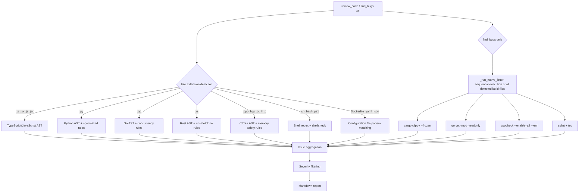
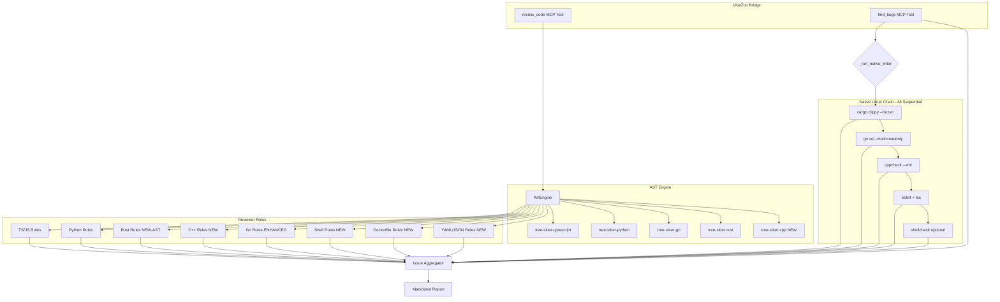

# VibeZoo Multi-language Analysis Engine Enhancement — Detailed Execution Plan (v1.1)

> **Target**: 5 files in `mcp-servers/bridge/` (config.py, utils.py, ast_engine.py, reviewer.py, integrated.py)  
> **Principle**: Minimal external dependencies, maximum performance, tree-sitter AST first / regex fallback  
> **Version Target**: `0.15.0`  
> **Debug Threat Analysis Reflected**: CRITICAL 6, HIGH 9, MEDIUM 8 integration of resolution plans

---

## 0. Bug Fixes (Debug Threat Analysis Feedback)

> This section summarizes resolution plans for 23 issues found in Debug mode threat analysis. Each item is reflected in specific code change specifications in sub-sections.

### 🔴 CRITICAL — Resolution Summary

| ID | Issue | Resolution | Section |
|----|-------|-----------|---------|
| C1 | `.c` file AST mapping error — `'c'` key missing in `NODE_TYPES` | Unified mapping `.c` → `'cpp'` (`tree-sitter-cpp` supports both C/C++) | §3.2 Change A |
| C2 | `_run_native_linter()` runs only single linter — each `if` block returns immediately with `return` | Remove all `return diagnostics`, collect results in cumulative list | §3.4 Change A |
| C3 | Dockerfile file collection impossible (Dead Path) — no extension, cannot pass `SOURCE_EXTS` filter | Add `include_names` parameter to `_iter_project_files()` (Method A) | §3.1 Change C, §3.5 |
| C4 | `_run_native_linter()` — `cargo clippy` executes `build.rs` → malicious project RCE risk | Add `--frozen` flag to `cargo`, `-mod=readonly` to `go vet`; validate `target_path` outside workspace | §3.4 Change A |
| C5 | `_truncate` import missing → `NameError` | Verify `from bridge.utils import ...` in `integrated.py` includes `_truncate` (already imported) | §3.4 Change A |
| C6 | Constants `CONFIG_FILES`, `GO_EXTS`, `RUST_EXTS`, `REVIEWABLE_EXTS`, `GENERIC_EXTS` unused (Orphaned) | Integrate `CONFIG_FILES` → `_iter_project_files()`, `CPP_EXTS`/`GENERIC_EXTS` → import in `reviewer.py`, `GO_EXTS`/`RUST_EXTS` → remove (duplicate), `REVIEWABLE_EXTS` → entry validation in `review_code()` | §3.1 Change B |

### 🟠 HIGH — Resolution Summary

| ID | Issue | Resolution | Section |
|----|-------|-----------|---------|
| H1 | C++ raw pointer regex inaccurate | Improved type keyword-based regex: `r'(?<!\w)(\w+\s*\*+\s+\w+\|(?:int\|char\|float\|double\|void\|bool\|long\|short\|unsigned\|signed)\s*\*+\s*\w+)'` | §3.3 Change A (R1) |
| H2 | C++ new/delete memory leak detection false positives | Use `code_only` with comments removed, exclude `std::make_unique`/`std::make_shared`/placement new, introduce threshold `> 3` | §3.3 Change A (R2) |
| H3 | C++ bracket access detection — cannot distinguish array declaration from access | Change regex to `\w+\s*\[[^\]]*\]\s*[=;]` (match only initialization/assignment context) | §3.3 Change A (R3) |
| H4 | Rust `as` cast detection — severe false positive in `use ... as` context | Limit regex to detect only numeric type casts: `r'\b(\w+)\s+as\s+(?!_)(u8\|u16\|u32\|u64\|i8\|i16\|i32\|i64\|f32\|f64\|usize\|isize)\b'` | §3.3 Change B (R5) |
| H5 | Go goroutine loop variable capture — regex multiline impossible | `re.DOTALL` flag + non-greedy regex: `r'for\s+\w+\s*:?=\s*range\s+.+?go\s+func\s*\('` | §3.3 Change C (G1) |
| H6 | Go unbuffered chan detection — multiline miss | Create `flat_content` by replacing newlines with spaces, then apply regex | §3.3 Change C (G3) |
| H7 | Shell variable quote detection inaccurate | Expanded pattern: `r'\$\{?\w+\}?\|\$[@*#?!0-9]\|\$\{[\w#%:-]+\}'` + use `shlex` | §3.3 Change D (S1) |
| H8 | YAML duplicate key detection — only checks top-level keys | Check duplicates with indentation-based composite key `f"{indent_level}:{key}"` | §3.3 Change D (Y1) |
| H9 | `_compute_cyclomatic_complexity` branch order conflict | Explicit order: `TS_JS_EXTS → .py → .rs → CPP_EXTS → else (Go + generic)`, Go branches first in `else` via `elif ext == '.go'` | §3.3 Change E |

### 🟡 MEDIUM — Resolution Summary

| ID | Issue | Resolution | Section |
|----|-------|-----------|---------|
| M1 | `get_install_hint()` language list incomplete | Extend to `['python', 'go', 'rust', 'typescript', 'javascript', 'cpp', 'c']` | §3.2 Change C |
| M2 | `SOURCE_EXTS` expansion side effect — TS-only metrics (`any_type_count`, `ts_ignore_count`) distorted | Conditionally handle TS-only metrics in `_review_project_core()` with `ext in TS_JS_EXTS` | §3.1 Change A (caution), §3.6 Change A |
| M3 | `cppcheck` XML parsing — attribute order dependency | Use `xml.etree.ElementTree` instead of regex | §3.4 Change A |
| M4 | Subprocess timeout insufficient | Increase to `cargo clippy: 120s`, `cppcheck: 120s`, `go vet: 60s` | §3.4 Change A |
| M5 | `REVIEWABLE_EXTS` unused | Early return in `review_code()` entry point if `ext not in REVIEWABLE_EXTS` | §3.3 (preamble), §3.1 Change B |
| M6 | Windows PATH guidance missing | Add message on `FileNotFoundError`: "Command not found in PATH: {tool}. Installation method: ..." | §3.4 Change A |
| M7 | if/elif chain order explicit documentation | Explicit order: `TS_JS → .py → .rs → CPP → Go → Shell → Dockerfile → YAML → JSON` | §3.3 (preamble) |
| M8 | Rust dead code in existing `else` block | After `.rs` moved to independent `elif`, remove Rust internal logic (unsafe, unwrap) from existing `else` block | §3.3 Change B |

---

## 1. Target Files & Responsibility Matrix

| File | Change Type | Primary Responsibility |
|------|-----------|-----------|
| [`mcp-servers/bridge/config.py`](mcp-servers/bridge/config.py:44) | Extension | SOURCE_EXTS expansion, new constant group addition, Orphaned constant cleanup (C6) |
| [`mcp-servers/bridge/utils.py`](mcp-servers/bridge/utils.py:86) | Extension | Add `include_names` parameter to `_iter_project_files()` (C3) |
| [`mcp-servers/bridge/ast_engine.py`](mcp-servers/bridge/ast_engine.py:22) | Extension | Add cpp/c to LANGUAGES/NODE_TYPES (C1 reflected), extend `_compute_cyclomatic_complexity` |
| [`mcp-servers/bridge/tools/reviewer.py`](mcp-servers/bridge/tools/reviewer.py:352) | Major Extension | C++/Rust AST integration, Go enhancement, general file support, regex improvements (H1~H8), chain order cleanup (H9, M7, M8) |
| [`mcp-servers/bridge/tools/integrated.py`](mcp-servers/bridge/tools/integrated.py:347) | New Function | Introduce `_run_native_linter()` (C2/C4/M3/M4/M6 reflected), `find_bugs()` integration, TS-only metrics conditional (M2) |

---

## 2. Architecture Overview

```
┌──────────────────────────────────────────────────────────┐
│                    find_bugs() / review_code()            │
├──────────────────────────────────────────────────────────┤
│  ┌──────────────┐  ┌──────────────┐  ┌───────────────┐   │
│  │ ast_engine   │  │ reviewer     │  │ integrated    │   │
│  │ (AST Parser) │  │ (Static      │  │ (_run_native_ │   │
│  │              │  │  Rules)      │  │  linter)      │   │
│  └──────┬───────┘  └──────┬───────┘  └───────┬───────┘   │
│         │                 │                   │           │
│  ┌──────▼─────────────────▼───────────────────▼───────┐   │
│  │              Language Detection (extension)          │   │
│  │  .ts/.js  .py  .go  .rs  .cpp/.h/.c  .sh  Docker  │   │
│  └────────────────────────────────────────────────────┘   │
│                           │                               │
│  ┌────────────────────────▼──────────────────────────┐    │
│  │          tree-sitter AST (primary) / regex (fallback) │
│  └────────────────────────────────────────────────────┘    │
│                           │                               │
│  ┌────────────────────────▼──────────────────────────┐    │
│  │     Integrated Diagnostic Report (issues + native   │    │
│  │     linter)                                        │    │
│  └────────────────────────────────────────────────────┘    │
└──────────────────────────────────────────────────────────┘
```

### Data Flow (Mermaid)



> **Key Changes**: `_run_native_linter()` now executes all linters sequentially (C2), applies `--frozen`/`-mod=readonly` security flags (C4). `review_code()` chain order: `TS_JS → .py → .rs → CPP → Go → Shell → Dockerfile → YAML → JSON` (M7).

---

## 3. File-by-File Detailed Change Specifications

### 3.1 [`mcp-servers/bridge/config.py`](mcp-servers/bridge/config.py)

#### Change A — SOURCE_EXTS Expansion (line 44)

```python
# Existing
SOURCE_EXTS = {".ts", ".tsx", ".js", ".jsx", ".py", ".go", ".rs"}

# New
SOURCE_EXTS = {
    ".ts", ".tsx", ".js", ".jsx", ".py", ".go", ".rs",
    # C/C++
    ".cpp", ".hpp", ".cc", ".h", ".c",
    # Shell
    ".sh", ".bash", ".ps1",
    # Configuration files
    ".yaml", ".yml", ".json",
}
```

> **M2 Caution**: `SOURCE_EXTS` expansion may cause TS-only metrics (`any_type_count`, `ts_ignore_count`) in `_review_project_core()` to be counted for C++/Shell files. → Handled by conditional processing in §3.6 Change A.

#### Change B — New Constant Group Addition (C6: Orphaned Constant Cleanup)

```python
# C/C++ extension group (→ imported by reviewer.py, ast_engine.py)
CPP_EXTS = {".cpp", ".hpp", ".cc", ".h", ".c"}

# Shell extension group
SHELL_EXTS = {".sh", ".bash", ".ps1"}

# Extensionless configuration file names (→ used in _iter_project_files() include_names parameter)
CONFIG_FILES = {"Dockerfile", "docker-compose.yml", "docker-compose.yaml"}

# Generic / non-AST files (only reviewer basic patterns applied) (→ imported by reviewer.py)
GENERIC_EXTS = {".sh", ".bash", ".ps1", ".yaml", ".yml", ".json"}

# All reviewable extensions (→ used for review_code() entry validation) (M5)
REVIEWABLE_EXTS = SOURCE_EXTS | GENERIC_EXTS
```

> **C6 Cleanup**:
> - `GO_EXTS` / `RUST_EXTS` → **Remove** (already included in `SOURCE_EXTS`, duplicate)
> - `CONFIG_FILES` → Linked with `_iter_project_files()` `include_names` parameter (Change C)
> - `CPP_EXTS` → Imported by `reviewer.py`, `ast_engine.py`
> - `GENERIC_EXTS` → Imported by `reviewer.py`
> - `REVIEWABLE_EXTS` → Early return at `review_code()` entry point if `ext not in REVIEWABLE_EXTS` (M5)

#### Change C — `CONFIG_FILES` Export Addition

Ensure `CONFIG_FILES` is exported at the bottom of `config.py` for import by `utils.py`. Add `CONFIG_FILES` to `utils.py`'s import statement:

```python
# utils.py
from bridge.config import SOURCE_EXTS, DEFAULT_EXCLUDE_DIRS, TS_JS_EXTS, CONFIG_FILES
```

---

### 3.2 [`mcp-servers/bridge/ast_engine.py`](mcp-servers/bridge/ast_engine.py)

#### Change A — Add C/C++ to LANGUAGES Mapping (lines 22~30) (C1 reflected)

```python
LANGUAGES = {
    # ... existing ...
    '.ts':   'typescript',
    '.tsx':  'typescript',
    '.js':   'javascript',
    '.jsx':  'javascript',
    '.py':   'python',
    '.go':   'go',
    '.rs':   'rust',
    # ── New: C/C++ ── (.c unified to 'cpp' — tree-sitter-cpp supports both C/C++)
    '.cpp':  'cpp',
    '.hpp':  'cpp',
    '.cc':   'cpp',
    '.h':    'cpp',
    '.c':    'cpp',        # C1 fix: 'c' → 'cpp' unified
}
```

> **C1 Resolution**: Map `.c` to `'cpp'` not `'c'`. `tree-sitter-cpp` supports both C and C++, so separate `tree-sitter-c` is unnecessary. `NODE_TYPES` also keeps only `'cpp'` without `'c'` key.

#### Change B — Add C++ Node Types to NODE_TYPES (lines 32~58)

```python
NODE_TYPES = {
    # ... existing typescript, python, go, rust ...
    'cpp': {
        'function': [
            'function_definition',        # Regular function
            'template_declaration',       # template<T> function
            'lambda_expression',          # Lambda
        ],
        'class': [
            'class_specifier',            # class X { ... }
            'struct_specifier',           # struct X { ... }
        ],
        'import': [
            'preproc_include',            # #include <...>
        ],
        'call': [
            'call_expression',
        ],
    },
}
```

> `'c'` key unnecessary — C1 unifies `.c` to `'cpp'` mapping.

#### Change C — Expand `get_install_hint()` Language List (M1 reflected)

Extend from existing `['python', 'go', 'rust', 'typescript', 'javascript']` to:

```python
['python', 'go', 'rust', 'typescript', 'javascript', 'cpp', 'c']
```

---

### 3.3 [`mcp-servers/bridge/tools/reviewer.py`](mcp-servers/bridge/tools/reviewer.py)

This file undergoes the largest change. Extend the `if/elif/else` chain of the current `review_code()` function.

#### if/elif Chain Order (M7 explicit, H9 reflected)

```
1. if ext in TS_JS_EXTS:       # TS/JS full AST analysis (no change)
2. elif ext == ".py":          # Python AST analysis (no change)
3. elif ext == ".rs":          # Rust full AST analysis (Change B — M8: remove Rust code from existing else block)
4. elif ext in CPP_EXTS:       # C/C++ AST analysis (Change A)
5. elif ext == ".go":          # Go AST + enhanced rules (Change C)
6. elif ext in GENERIC_EXTS:   # Shell/Dockerfile/YAML/JSON (Change D)
```

> **M5**: Early return at `review_code()` entry point if `ext not in REVIEWABLE_EXTS` to immediately reject unsupported languages.

#### Change A — C++-specific Analysis Block (`elif ext in CPP_EXTS:`) (H1, H2, H3 reflected)

Remove C++ handling from existing `else` block, new independent block:

```python
elif ext in (".cpp", ".hpp", ".cc", ".h", ".c"):
    ast = ast_engine.parse(content, ext)
    functions = ast.get("functions", [])
    classes = ast.get("classes", [])
    stats["functions"] = len(functions)
    stats["classes"] = len(classes)

    # Code with comments removed (H2: new/delete false positive prevention)
    code_only = re.sub(r'//[^\n]*|/\*[\s\S]*?\*/', '', content)

    # ── Function length check ──
    if functions:
        long_funcs = []
        for fn in functions:
            fn_start = fn.get('line', 0)
            fn_end = fn.get('end_line', fn_start)
            fn_lines = fn_end - fn_start
            if fn_lines > 50:
                long_funcs.append((fn.get('name', 'anonymous'), fn_lines, fn_start))
        for name, fn_lines, ln in long_funcs[:5]:
            issues.append(("📏",
                f"Long function `{name}()`: {fn_lines} lines (line {ln}) — consider splitting"))

    # ── Cyclomatic complexity ──
    comp = _compute_cyclomatic_complexity(content, ext)
    if comp > 15:
        issues.append(("⚠️", f"Cyclomatic complexity: {comp} — consider simplifying"))

    # ── Nesting depth ──
    max_depth = _compute_nesting_depth(content, ext)
    stats["max_depth"] = max_depth
    if max_depth > 4:
        issues.append(("⚠️",
            f"Maximum nesting depth: {max_depth} levels — consider early returns"))

    # ═══ C++-specific rules ═══

    # R1. Raw pointer vs smart pointer (H1: regex improved)
    raw_ptr_count = len(re.findall(
        r'(?<!\w)(?:\w+\s*\*+\s+\w+|(?:int|char|float|double|void|bool|long|short|unsigned|signed)\s*\*+\s*\w+)',
        code_only))
    smart_ptr_count = len(re.findall(
        r'(std::unique_ptr|std::shared_ptr|std::weak_ptr)', code_only))
    if raw_ptr_count > 0 and smart_ptr_count == 0:
        issues.append(("⚠️",
            f"Raw pointer(s) found ({raw_ptr_count}) — "
            f"consider std::unique_ptr or std::shared_ptr (C++11+)"))

    # R2. new/delete mismatch (H2: comment removal, placement new exclusion, threshold introduction)
    new_count = len(re.findall(
        r'\bnew\s+(?!\(\))(?!\s*std::make_unique)(?!\s*std::make_shared)', code_only))
    delete_count = len(re.findall(r'\bdelete\s+(?!\[\])', code_only))
    delete_array_count = len(re.findall(r'\bdelete\[\]\s+', code_only))
    if (new_count - (delete_count + delete_array_count)) > 3:
        issues.append(("❌",
            f"Potential memory leak: {new_count} `new` vs "
            f"{delete_count + delete_array_count} `delete`/`delete[]` (diff > 3)"))

    # R3. Bounds checking bypass (H3: initialization/assignment context only)
    bracket_access = len(re.findall(r'\w+\s*\[[^\]]*\]\s*[=;]', code_only))
    at_access = len(re.findall(r'\.at\(', code_only))
    if bracket_access > 10 and at_access == 0:
        issues.append(("⚠️",
            f"Index operator `[]` used {bracket_access} times without `.at()` — "
            f"no bounds checking"))

    # R4. RAII lock missing: std::mutex without std::lock_guard/unique_lock
    mutex_count = len(re.findall(r'std::mutex\s+\w+', code_only))
    lock_guard_count = len(re.findall(
        r'(std::lock_guard|std::unique_lock|std::scoped_lock)', code_only))
    if mutex_count > 0 and lock_guard_count == 0:
        issues.append(("⚠️",
            f"`std::mutex` used without RAII lock guard — "
            f"consider std::lock_guard or std::scoped_lock (C++17)"))

    # R5. C-style cast (in C++ projects)
    if ext in (".cpp", ".hpp", ".cc", ".h"):
        c_cast = len(re.findall(r'\(int\)|\(char\*\)|\(void\*\)|\(double\)|\(float\)',
                                code_only))
        if c_cast > 0:
            issues.append(("📝",
                f"C-style cast found {c_cast} time(s) — "
                f"use static_cast, dynamic_cast, const_cast, reinterpret_cast"))

    # R6. Recommend iostream instead of printf/scanf
    printfs = len(re.findall(r'\b(printf|scanf|fprintf|sprintf)\s*\(', code_only))
    if printfs > 0:
        issues.append(("📝",
            f"`printf`/`scanf` family used {printfs} time(s) — "
            f"consider std::cout / std::format (C++20)"))

    # TODO/debug
    todos = len(re.findall(r'(TODO|FIXME|HACK|XXX)', code_only))
    if todos > 0:
        issues.append(("📝", f"TODO/FIXME/HACK: {todos} marker(s)"))
```

#### Change B — Rust AST Full Analysis Block (`elif ext == ".rs"`) (H4, M8 reflected)

Replace existing regex-only Rust handling in `else` block. **M8**: Remove Rust internal logic (unsafe, unwrap) from existing `else` block's `if ext == ".rs":`.

```python
elif ext == ".rs":
    ast = ast_engine.parse(content, ext)
    functions = ast.get("functions", [])
    classes = ast.get("classes", [])  # struct + enum
    enums = ast.get("enums", [])
    stats["functions"] = len(functions)
    stats["classes"] = len(classes)

    # ── Function length check ──
    if functions:
        long_funcs = []
        for fn in functions:
            fn_start = fn.get('line', 0)
            fn_end = fn.get('end_line', fn_start)
            fn_lines = fn_end - fn_start
            if fn_lines > 50:
                long_funcs.append((fn.get('name', 'anonymous'), fn_lines, fn_start))
        for name, fn_lines, ln in long_funcs[:5]:
            issues.append(("📏",
                f"Long function `{name}()`: {fn_lines} lines (line {ln})"))

    if classes:
        for cls in classes:
            cls_start = cls.get('line', 0)
            cls_end = cls.get('end_line', cls_start)
            cls_lines = cls_end - cls_start
            if cls_lines > 200:
                issues.append(("📏",
                    f"Large struct/enum `{cls.get('name', 'anonymous')}`: "
                    f"{cls_lines} lines (line {cls_start})"))

    # ── Cyclomatic complexity ──
    comp = _compute_cyclomatic_complexity(content, ext)
    if comp > 15:
        issues.append(("⚠️", f"Cyclomatic complexity: {comp}"))

    # ── Nesting depth ──
    max_depth = _compute_nesting_depth(content, ext)
    stats["max_depth"] = max_depth
    if max_depth > 4:
        issues.append(("⚠️",
            f"Maximum nesting depth: {max_depth} — use match or early returns"))

    # ═══ Rust-specific rules ═══

    # R1. unsafe block complexity control
    unsafe_blocks = re.findall(r'\bunsafe\s*\{', content)
    if unsafe_blocks:
        unsafe_lines = []
        for m in re.finditer(r'\bunsafe\s*\{', content):
            start = m.start()
            depth = 1
            pos = m.end()
            while depth > 0 and pos < len(content):
                if content[pos] == '{':
                    depth += 1
                elif content[pos] == '}':
                    depth -= 1
                pos += 1
            block = content[m.start():pos]
            block_lines = block.count('\n')
            if block_lines > 15:
                unsafe_lines.append((m.start(), block_lines))
        if unsafe_lines:
            issues.append(("⚠️",
                f"`unsafe` block(s) exceed 15 lines: "
                f"{len(unsafe_lines)} occurrence(s) — extract safe wrappers"))
        elif len(unsafe_blocks) > 0:
            issues.append(("⚠️",
                f"`unsafe` block(s) found: {len(unsafe_blocks)} — review for safety"))

    # R2. Silenced Result/Option (`let _ = ...`)
    let_underscore = len(re.findall(r'\blet\s+_\s*=', content))
    if let_underscore > 0:
        issues.append(("⚠️",
            f"`let _ = ...` pattern found {let_underscore} time(s) — "
            f"Result/Option silently ignored, use `?` or proper match"))

    # R3. Panic trigger points
    unwrap_count = len(re.findall(r'\.unwrap\(\)', content))
    expect_count = len(re.findall(r'\.expect\(', content))
    panic_count = len(re.findall(r'panic!\(', content))
    if unwrap_count > 0:
        issues.append(("⚠️",
            f"`.unwrap()` found {unwrap_count} time(s) — "
            f"use `.expect()` with message or proper error handling"))
    if panic_count > 0:
        issues.append(("❌",
            f"`panic!` macro found {panic_count} time(s) — "
            f"consider graceful error propagation"))

    # R4. clone overuse detection
    clone_count = len(re.findall(r'\.clone\(\)', content))
    if clone_count > 5:
        issues.append(("⚠️",
            f"`.clone()` called {clone_count} times — "
            f"consider borrowing or refactoring ownership"))

    # R5. `as` type cast (H4: numeric type casts only, exclude use ... as)
    as_cast_count = len(re.findall(
        r'\b(\w+)\s+as\s+(?!_)(u8|u16|u32|u64|i8|i16|i32|i64|f32|f64|usize|isize)\b',
        content))
    if as_cast_count > 5:
        issues.append(("📝",
            f"`as` numeric cast used {as_cast_count} times — "
            f"consider `From`/`Into`/`TryFrom` for safe conversions"))

    # R6. `println!` debug logs
    println_count = len(re.findall(r'println!\(', content))
    if println_count > 0:
        issues.append(("📝",
            f"`println!()` found {println_count} time(s) — use `log` crate"))

    todos = len(re.findall(r'(TODO|FIXME|HACK)', content))
    if todos > 0:
        issues.append(("📝", f"TODO/FIXME/HACK: {todos} marker(s)"))
```

#### Change C — Go Analysis Rules Enhancement (`elif ext == ".go"`) (H5, H6 reflected)

Add **5 new rules** to the existing Go block (lines 490~544):

```python
# Within existing Go AST analysis block, after existing rules:

# ═══ Go enhancement rules (new) ═══

# G1. Goroutine loop variable capture (H5: re.DOTALL + non-greedy)
go_stmt_pattern = re.findall(
    r'for\s+\w+\s*:?=\s*range\s+.+?go\s+func\s*\(', content, re.DOTALL)
if go_stmt_pattern:
    issues.append(("❌",
        f"Goroutine inside range loop detected ({len(go_stmt_pattern)} time(s)) — "
        f"loop variable may be captured by reference. "
        f"Pass as parameter or use Go 1.22+"))

# G2. Missing recover() in defer
defer_funcs = re.findall(r'defer\s+func\s*\(\s*\)\s*\{', content)
recover_calls = len(re.findall(r'\brecover\(\)', content))
if defer_funcs and recover_calls == 0:
    issues.append(("⚠️",
        f"`defer func()` found but no `recover()` — "
        f"potential unhandled panic in deferred cleanup"))

# G3. Channel deadlock risk (H6: flat_content used)
flat_content = content.replace('\n', ' ')
unbuffered_chan = re.findall(r'make\s*\(\s*chan\s+(?!.*,\s*\d+)', flat_content)
if unbuffered_chan:
    issues.append(("⚠️",
        f"Unbuffered channel(s) found ({len(unbuffered_chan)}) — "
        f"ensure send/receive happen in different goroutines"))

# G4. Mutex Unlock missing (no defer mu.Unlock())
mutex_locks = len(re.findall(r'\.Lock\(\)', content))
defer_unlocks = len(re.findall(r'defer\s+\w+\.Unlock\(\)', content))
if mutex_locks > 0 and defer_unlocks < mutex_locks:
    issues.append(("❌",
        f"Mutex `.Lock()` without matching `defer ... .Unlock()` — "
        f"potential deadlock on panic/early return"))

# G5. nil map assignment (var m map[K]V; m[key] = value)
nil_map_assign = re.findall(
    r'(?:var\s+\w+\s+map\[)|(?:\w+\s*:=\s*(?:map\[|nil))', content)
if nil_map_assign:
    issues.append(("⚠️",
        f"Potential nil map assignment — use `make(map[...]...)` or "
        f"composite literal"))
```

#### Change D — General Source File Support (Shell, Dockerfile, YAML, JSON) (H7, H8 reflected)

Branching by file extension/name within `else` block:

```python
else:
    # ── Shell Script ──
    if ext in (".sh", ".bash"):
        # S1. Missing quote detection (H7: expanded pattern)
        unquoted_vars = len(re.findall(
            r'\$\{?\w+\}?|\$[@*#?!0-9]|\$\{[\w#%:-]+\}', content))
        quotes_ok = len(re.findall(r'"\$\{?\w+\}?"', content))
        if unquoted_vars > quotes_ok:
            issues.append(("⚠️",
                f"Unquoted variable expansion(s) — "
                f"may cause word splitting on whitespace"))

        # S2. Missing set -e / set -o pipefail
        has_set_e = bool(re.search(r'set\s+-e', content))
        has_pipefail = bool(re.search(r'set\s+-o\s+pipefail', content))
        if not has_set_e:
            issues.append(("⚠️",
                "`set -e` not found — script continues on error"))
        if not has_pipefail:
            issues.append(("📝",
                "`set -o pipefail` not found — pipeline errors may be masked"))

        # S3. shellcheck integration attempt (optional, subprocess)
        try:
            result = subprocess.run(
                ["shellcheck", "-f", "json", str(p)],
                capture_output=True, text=True, timeout=10
            )
            if result.returncode != 0 and result.stdout:
                sc_data = json.loads(result.stdout)
                for item in sc_data[:10]:
                    issues.append(("⚠️",
                        f"ShellCheck[{item.get('code','')}]: "
                        f"{item.get('message','')} "
                        f"(line {item.get('line','?')})"))
        except (FileNotFoundError, subprocess.TimeoutExpired):
            pass
        except Exception:
            pass

    elif ext == ".ps1":
        has_strict_mode = bool(re.search(r'Set-StrictMode', content))
        if not has_strict_mode:
            issues.append(("📝",
                "`Set-StrictMode` not found — consider enabling for safer scripts"))

    # ── Dockerfile ──
    elif p.name == "Dockerfile" or p.suffix.lower() == ".dockerfile":
        # D1. latest tag usage
        latest_tags = re.findall(r'FROM\s+\S+:latest', content)
        if latest_tags:
            issues.append(("⚠️",
                f"`FROM ... :latest` tag(s) found ({len(latest_tags)}) — "
                f"pin to specific version for reproducible builds"))

        # D2. apt-get cache not cleaned
        apt_installs = len(re.findall(r'apt-get\s+install', content))
        apt_cleans = len(re.findall(
            r'(rm -rf /var/lib/apt/lists|apt-get clean|apt-get autoclean)',
            content))
        if apt_installs > 0 and apt_cleans == 0:
            issues.append(("⚠️",
                f"`apt-get install` without cache cleanup — "
                f"add `rm -rf /var/lib/apt/lists/*` to reduce image size"))

        # D3. Root user usage
        if "USER" not in content:
            issues.append(("📝",
                "No `USER` directive — container runs as root"))

        # D4. ADD instead of COPY
        add_count = len(re.findall(r'\bADD\s+', content))
        copy_count = len(re.findall(r'\bCOPY\s+', content))
        if add_count > copy_count:
            issues.append(("📝",
                f"`ADD` used {add_count} times — prefer `COPY` unless "
                f"auto-extraction is needed"))

    # ── YAML ──
    elif ext in (".yaml", ".yml"):
        # Y1. Duplicate key detection (H8: indentation-based composite key)
        key_paths = {}
        for i, line in enumerate(lines, 1):
            m = re.match(r'^(\s*)(\w[\w.-]*)\s*:', line)
            if m:
                key = m.group(2)
                indent = len(m.group(1))
                composite_key = f"{indent}:{key}"
                if composite_key in key_paths:
                    issues.append(("❌",
                        f"Duplicate key `{key}` at indent level {indent}, line {i} "
                        f"(first at line {key_paths[composite_key]})"))
                key_paths[composite_key] = i

        # Y2. Hardcoded secrets
        secret_patterns = [
            (r'(password|passwd|pwd)\s*:\s*\S+', 'password'),
            (r'(secret|SECRET)\s*:\s*\S+', 'secret'),
            (r'(api_key|apikey|api-key)\s*:\s*\S+', 'API key'),
            (r'(token|TOKEN)\s*:\s*\S+', 'token'),
        ]
        for pattern, label in secret_patterns:
            matches = re.findall(pattern, content, re.IGNORECASE)
            if matches:
                issues.append(("❌",
                    f"Hardcoded {label}(s) found ({len(matches)}) — "
                    f"use environment variables or secrets manager"))

    # ── JSON ──
    elif ext == ".json":
        try:
            parsed = json.loads(content)
        except json.JSONDecodeError as e:
            issues.append(("❌",
                f"Invalid JSON: {e.msg} (line {e.lineno}, col {e.colno})"))

        secret_matches = re.findall(
            r'"(password|secret|api_key|token)"\s*:\s*"[^"]+"',
            content, re.IGNORECASE)
        if secret_matches:
            issues.append(("❌",
                f"Hardcoded sensitive value(s) found ({len(secret_matches)})"))

    # ── Common: nesting depth, TODO ──
    max_depth = _compute_nesting_depth(content, ext)
    stats["max_depth"] = max_depth
    if max_depth > 4:
        issues.append(("⚠️", f"Maximum nesting depth: {max_depth} levels"))

    todos = len(re.findall(r'(TODO|FIXME|HACK|XXX)', content))
    if todos > 0:
        issues.append(("📝", f"TODO/FIXME/HACK: {todos} marker(s)"))
```

#### Change E — `_compute_cyclomatic_complexity` Extension (H9 reflected)

Explicit branch order: `TS_JS_EXTS → .py → .rs → CPP_EXTS → else (Go + generic)`. Go branches first in `else` block via `elif ext == '.go'`.

```python
elif ext in CPP_EXTS:
    branches = (
        len(re.findall(r'\bif\s*\(', content))
        + len(re.findall(r'\bfor\s*\(', content))
        + len(re.findall(r'\bwhile\s*\(', content))
        + len(re.findall(r'\bswitch\s*\(', content))
        + len(re.findall(r'\bcatch\s*\(', content))
        + len(re.findall(r'\bcase\s+', content))
    )
elif ext == '.rs':
    branches = (
        len(re.findall(r'\bif\s+', content))
        + len(re.findall(r'\bfor\s+', content))
        + len(re.findall(r'\bwhile\s+', content))
        + len(re.findall(r'\bmatch\s+', content))
        + len(re.findall(r'\bloop\s*\{', content))
    )
else:
    # Go + generic branching
    if ext == '.go':
        branches = (
            len(re.findall(r'\bif\s+', content))
            + len(re.findall(r'\bfor\s+', content))
            + len(re.findall(r'\bswitch\s+', content))
            + len(re.findall(r'\bcase\s+', content))
            + len(re.findall(r'\bselect\s*\{', content))
        )
    else:
        # generic: basic branching
        branches = (
            len(re.findall(r'\bif\s+', content))
            + len(re.findall(r'\bfor\s+', content))
            + len(re.findall(r'\bwhile\s+', content))
        )
```

---

### 3.4 [`mcp-servers/bridge/tools/integrated.py`](mcp-servers/bridge/tools/integrated.py)

#### Change A — `_run_native_linter()` New Function (C2, C4, M3, M4, M6 reflected)

```python
def _run_native_linter(root: Path) -> dict:
    """Detects build files in the project root and sequentially runs all matching native linters.

    Detection order (all executed, results accumulated):
    1. Cargo.toml → cargo clippy --frozen
    2. go.mod → go vet -mod=readonly
    3. CMakeLists.txt / Makefile → cppcheck
    4. package.json → eslint + tsc (existing)

    Returns:
        {
            "language": str,           # primary language detected
            "tool": str,               # primary tool name
            "success": bool,
            "results": list[dict],     # C2 fix: accumulated linter results
            "raw_output": str (truncated),
        }
    """
    diagnostics = {
        "language": "unknown",
        "tool": "none",
        "success": False,
        "results": [],     # C2: remove return, accumulate all results
        "raw_output": "",
    }

    # ── 1. Rust: cargo clippy (C4: --frozen added, M4: timeout 120s) ──
    if (root / "Cargo.toml").exists():
        diagnostics["language"] = "rust"
        diagnostics["tool"] = "cargo-clippy"
        try:
            res = subprocess.run(
                ["cargo", "clippy", "--message-format=json", "--all-targets", "--frozen"],
                cwd=str(root), capture_output=True, text=True, timeout=120
            )
            diagnostics["raw_output"] = _truncate(res.stdout + res.stderr, 3000)
            warnings_list = []
            errors_list = []
            for line in res.stdout.splitlines():
                line = line.strip()
                if not line:
                    continue
                try:
                    data = json.loads(line)
                except json.JSONDecodeError:
                    continue
                if data.get("reason") == "compiler-message":
                    msg = data.get("message", {})
                    spans = msg.get("spans", [])
                    item = {
                        "file": spans[0].get("file_name", "unknown") if spans else "unknown",
                        "line": spans[0].get("line_start", 0) if spans else 0,
                        "column": spans[0].get("column_start", 0) if spans else 0,
                        "message": msg.get("message", ""),
                        "rule": (msg.get("code") or {}).get("code", "clippy"),
                        "level": msg.get("level", "warning"),
                    }
                    if msg.get("level") == "error":
                        errors_list.append(item)
                    else:
                        warnings_list.append(item)
            diagnostics["results"].append({
                "tool": "cargo-clippy",
                "success": True,
                "errors": errors_list,
                "warnings": warnings_list,
            })
        except FileNotFoundError:
            diagnostics["results"].append({
                "tool": "cargo-clippy", "success": False,
                "error": "cargo not found in PATH. Install Rust: https://rustup.rs",
            })
        except subprocess.TimeoutExpired:
            diagnostics["results"].append({
                "tool": "cargo-clippy", "success": False,
                "error": "cargo clippy timed out (120s)",
            })
        except Exception as e:
            diagnostics["results"].append({
                "tool": "cargo-clippy", "success": False,
                "error": f"cargo clippy error: {e}",
            })
        # C2 fix: remove return → continue to next linter

    # ── 2. Go: go vet (C4: -mod=readonly added, M4: timeout 60s) ──
    if (root / "go.mod").exists():
        if diagnostics["language"] == "unknown":
            diagnostics["language"] = "go"
            diagnostics["tool"] = "go-vet"
        try:
            res = subprocess.run(
                ["go", "vet", "-mod=readonly", "./..."],
                cwd=str(root), capture_output=True, text=True, timeout=60
            )
            diagnostics["raw_output"] = _truncate(
                diagnostics["raw_output"] + "\n" + _truncate(res.stderr, 2000), 3000)
            warnings_list = []
            for line in res.stderr.splitlines():
                m = re.match(r'^([^:]+):(\d+):(?:\d+:)?\s*(.*)$', line.strip())
                if m:
                    warnings_list.append({
                        "file": m.group(1),
                        "line": int(m.group(2)),
                        "message": m.group(3).strip(),
                        "rule": "go_vet",
                        "level": "warning",
                    })
            diagnostics["results"].append({
                "tool": "go-vet",
                "success": True,
                "warnings": warnings_list,
            })
        except FileNotFoundError:
            diagnostics["results"].append({
                "tool": "go-vet", "success": False,
                "error": "go not found in PATH. Install Go: https://go.dev/dl",
            })
        except subprocess.TimeoutExpired:
            diagnostics["results"].append({
                "tool": "go-vet", "success": False,
                "error": "go vet timed out (60s)",
            })
        except Exception as e:
            diagnostics["results"].append({
                "tool": "go-vet", "success": False,
                "error": f"go vet error: {e}",
            })
        # C2 fix: remove return

    # ── 3. C++: cppcheck (M3: xml.etree.ElementTree used, M4: timeout 120s) ──
    if (root / "CMakeLists.txt").exists() or any(root.glob("Makefile*")):
        if diagnostics["language"] == "unknown":
            diagnostics["language"] = "c/c++"
            diagnostics["tool"] = "cppcheck"
        try:
            res = subprocess.run(
                ["cppcheck", "--enable=all", "--xml", "."],
                cwd=str(root), capture_output=True, text=True, timeout=120
            )
            diagnostics["raw_output"] = _truncate(
                diagnostics["raw_output"] + "\n" + _truncate(res.stdout + res.stderr, 2000), 3000)
            # M3: xml.etree.ElementTree for attribute order-independent parsing
            import xml.etree.ElementTree as ET
            try:
                root_elem = ET.fromstring(res.stderr + res.stdout)
                warnings_list = []
                for error_elem in root_elem.findall(".//error"):
                    item = {
                        "file": error_elem.get("file", "unknown"),
                        "line": int(error_elem.get("line", 0)),
                        "message": error_elem.get("msg", ""),
                        "rule": f"cppcheck:{error_elem.get('id', '')}",
                        "level": error_elem.get("severity", "warning"),
                    }
                    warnings_list.append(item)
                diagnostics["results"].append({
                    "tool": "cppcheck",
                    "success": True,
                    "warnings": warnings_list,
                })
            except ET.ParseError:
                diagnostics["results"].append({
                    "tool": "cppcheck", "success": False,
                    "error": "Failed to parse cppcheck XML output",
                })
        except FileNotFoundError:
            diagnostics["results"].append({
                "tool": "cppcheck", "success": False,
                "error": "cppcheck not found in PATH. Install: `winget install cppcheck` or `apt install cppcheck`",
            })
        except subprocess.TimeoutExpired:
            diagnostics["results"].append({
                "tool": "cppcheck", "success": False,
                "error": "cppcheck timed out (120s)",
            })
        except Exception as e:
            diagnostics["results"].append({
                "tool": "cppcheck", "success": False,
                "error": f"cppcheck error: {e}",
            })
        # C2 fix: remove return

    # ── 4. TS/JS: eslint + tsc (existing) ──
    if (root / "package.json").exists():
        if diagnostics["language"] == "unknown":
            diagnostics["language"] = "typescript/javascript"
            diagnostics["tool"] = "eslint+tsc"
        diagnostics["results"].append({
            "tool": "eslint+tsc",
            "success": True,
            "note": "ESLint/tsc results integrated separately",
        })

    diagnostics["success"] = any(r.get("success", False) for r in diagnostics["results"])
    return diagnostics
```

> **C2 Resolution**: Remove all `return diagnostics` and accumulate results in `diagnostics["results"]` list.  
> **C4 Resolution**: Add `--frozen` flag to `cargo`, `-mod=readonly` flag to `go vet`.  
> **C5 Confirmed**: `_truncate` already included in `integrated.py` top-level `from bridge.utils import ...` (line 26).  
> **M3 Resolution**: Changed cppcheck XML parsing to `xml.etree.ElementTree` for attribute order independence.  
> **M4 Resolution**: Increased timeouts to `cargo clippy: 120s`, `cppcheck: 120s`, `go vet: 60s`.  
> **M6 Resolution**: Added installation guidance in `FileNotFoundError` messages (`winget install cppcheck`, `https://rustup.rs`, `https://go.dev/dl`).

#### Change B — Integrate `_run_native_linter` into `find_bugs()` Function (around line 400)

```python
# find_bugs() internal, summary mode:
root = Path(get_project_root(target_path))
native_diag = _run_native_linter(root)

# C2 reflected: iterate over all linter results
if native_diag.get("results"):
    sections.append(f"\n## 🔬 Native Linter Results\n\n")
    for result in native_diag["results"]:
        tool = result.get("tool", "unknown")
        if result.get("success"):
            total_warnings = len(result.get("warnings", []))
            total_errors = len(result.get("errors", []))
            if total_errors > 0 or total_warnings > 0:
                sections.append(f"### {tool} — ⚠️ {total_errors} errors, {total_warnings} warnings\n")
                for w in result.get("errors", [])[:3]:
                    sections.append(f"- ❌ `{w['file']}:{w['line']}` — [{w.get('rule','')}] {w.get('message','')[:100]}\n")
                for w in result.get("warnings", [])[:3]:
                    sections.append(f"- ⚠️ `{w['file']}:{w['line']}` — [{w.get('rule','')}] {w.get('message','')[:100]}\n")
            else:
                sections.append(f"### {tool} — ✅ No issues\n")
        else:
            sections.append(f"### {tool} — ❌ {result.get('error', 'Unknown error')}\n")
else:
    sections.append("\n## 🔬 Native Linter\n\n- No supported linter environment detected.\n")

# Existing ESLint/tsc only runs when package.json exists (fallback)
if native_diag["language"] in ("unknown", "typescript/javascript"):
    eslint_data = _run_eslint(root)
    tsc_output = _run_tsc(root)
    # ... existing ESLint/tsc output logic ...
```

---

### 3.5 [`mcp-servers/bridge/utils.py`](mcp-servers/bridge/utils.py) — `_iter_project_files()` Extension (C3)

#### Change A — Add `include_names` Parameter

```python
def _iter_project_files(root: Path, extensions: set = None, exclude_dirs: set = None,
                        max_depth: int = -1, include_names: set = None) -> list:
    """Performance-optimized project file iteration (os.walk, single pass).
    
    Args:
        include_names: Set of extensionless file names (e.g., {"Dockerfile", "Makefile"}). 
                       Matches as OR condition with extensions.
    """
    if extensions is None:
        extensions = SOURCE_EXTS
    if exclude_dirs is None:
        exclude_dirs = DEFAULT_EXCLUDE_DIRS

    results = []
    root_str = str(root)
    try:
        for dirpath, dirnames, filenames in os.walk(root_str):
            # ... existing exclude_dirs logic ...

            for fname in filenames:
                ext = os.path.splitext(fname)[1]
                if ext in extensions or (include_names and fname in include_names):
                    results.append(Path(dirpath) / fname)
    except (PermissionError, OSError):
        pass
    return results
```

`_iter_project_files_cached()` should also accept the `include_names` parameter and include it in the cache key.

#### Change B — Update Call Sites

Add `include_names=CONFIG_FILES` to `_iter_project_files_cached()` calls in `_review_project_core()` and `find_bugs()`:

```python
# integrated.py, reviewer.py call sites
source_files = list(_iter_project_files_cached(
    root, extensions=SOURCE_EXTS, exclude_dirs=DEFAULT_EXCLUDE_DIRS,
    include_names=CONFIG_FILES  # C3 fix
))
```

---

### 3.6 Additional Changes

#### Change A — Conditional Processing of TS-only Metrics in `_review_project_core()` (M2)

```python
# In _review_project_core() file iteration loop:
for p in source_files:
    ext = p.suffix.lower()
    content = _read_file_content(p)
    if not content:
        continue

    # ... common metrics ...

    # TS-only metrics: count only when ext in TS_JS_EXTS (M2 fix)
    if ext in TS_JS_EXTS:
        any_type_count += len(re.findall(r':\s*any\b', content))
        ts_ignore_count += len(re.findall(r'@ts-ignore', content))
        ts_nocheck_count += len(re.findall(r'@ts-nocheck', content))
```

#### Change B — `REVIEWABLE_EXTS` Validation at `review_code()` Entry Point (M5)

```python
# Add at the beginning of review_code() function:
ext = p.suffix.lower()
if ext not in REVIEWABLE_EXTS and p.name not in CONFIG_FILES:
    return _markdown_header(f"Review: `{rel}`", "⚠️") \
           + f"File type `{ext}` is not reviewable. Supported: {sorted(REVIEWABLE_EXTS)}\n" \
           + _markdown_footer()
```

---

## 4. Dependency and Installation Changes

### 4.1 Python Packages

| Package | Purpose | Installation Method |
|---------|---------|-------------------|
| `tree-sitter-cpp` | C/C++ AST parsing | `pip install tree-sitter-cpp` |

> `tree-sitter-cpp` covers both C++ and C. Separate `tree-sitter-c` unnecessary. (C1)

### 4.2 System Tools (optional, fallback allowed)

| Tool | Purpose | Installation Method |
|------|---------|-------------------|
| `cargo clippy` | Rust lint | Included in Rust toolchain (`https://rustup.rs`) |
| `go vet` | Go static analysis | Included in Go toolchain (`https://go.dev/dl`) |
| `cppcheck` | C++ static analysis | `winget install cppcheck` / `apt install cppcheck` |
| `shellcheck` | Shell script analysis | `winget install shellcheck` / `apt install shellcheck` |

> All system tools are **optional** — silently fallback when not installed, installation guidance included in `FileNotFoundError` handling (M6).

### 4.3 `setup.py` (vibezoo_setup) Update

Add `tree-sitter-cpp` to `recommended`/`full` targets in [`mcp-servers/bridge/tools/setup.py`](mcp-servers/bridge/tools/setup.py).

---

## 5. Execution Order (Implementation Task Sequence)

| Step | File | Task | Dependency |
|------|------|------|-----------|
| **P1** | `config.py` | SOURCE_EXTS expansion, new constant group addition (CPP_EXTS, GENERIC_EXTS, REVIEWABLE_EXTS), GO_EXTS/RUST_EXTS removal (C6) | None |
| **P2** | `utils.py` | Add `include_names` parameter to `_iter_project_files()` (C3) | P1 |
| **P3** | `ast_engine.py` | Add cpp to LANGUAGES/NODE_TYPES (.c → 'cpp'), update `get_install_hint()` (C1, M1) | P1 |
| **P4** | `reviewer.py` | Add C++ AST analysis block (Change A, including H1/H2/H3 regex improvements) | P2, P3 |
| **P5** | `reviewer.py` | Replace Rust AST analysis block (Change B, H4 regex improvement), remove Rust code from existing else block (M8) | — |
| **P6** | `reviewer.py` | Add Go enhancement rules (Change C, including H5/H6 regex improvements) | — |
| **P7** | `reviewer.py` | Add general file support block (Change D, including H7/H8 regex improvements) | P1 |
| **P8** | `reviewer.py` | Extend `_compute_cyclomatic_complexity` (Change E, H9 branch order cleanup) | P1 |
| **P9** | `reviewer.py` | Add REVIEWABLE_EXTS validation at `review_code()` entry point (M5), reorder if/elif chain (M7) | P1, P4~P8 |
| **P10** | `integrated.py` | Add `_run_native_linter()` function (C2 accumulation, C4 security, M3 XML, M4 timeout, M6 guidance) | P1 |
| **P11** | `integrated.py` | Integrate native linter into `find_bugs()`, conditional TS-only metrics in `_review_project_core()` (M2) | P10 |
| **P12** | `setup.py` | Add `tree-sitter-cpp` dependency | — |
| **P13** | Integration Test | Verify `review_code` / `find_bugs` with sample files for each language | P1~P12 |
| **P14** | Integration Test | Verify Dockerfile collection (C3), multi-linter accumulation (C2), `--frozen`/`-mod=readonly` (C4) | P1~P13 |

---

## 6. UX Considerations

### 6.1 Error Handling Principles

- tree-sitter language pack not installed → regex fallback + diagnostic message
- System linter (cargo, go, cppcheck, shellcheck) not installed → silently skip + installation guidance (M6)
- File parsing failure → return empty results, do not propagate exceptions
- `_run_native_linter()` executes all matching linters sequentially, continues if one fails (C2)

### 6.2 Security Considerations (C4)

- `cargo clippy` execution with `--frozen` flag mandatory → prevents `Cargo.lock` changes and `build.rs` execution
- `go vet` execution with `-mod=readonly` flag mandatory → prevents module download/changes
- `target_path` outside current workspace → validate before execution (consider future `safe_mode` parameter)

### 6.3 Performance Considerations

- L1/L2 cache in [`file_cache.py`](mcp-servers/bridge/file_cache.py) already applies to all file reads
- `_run_native_linter` is subprocess-based, timeout mandatory (`cargo clippy: 120s`, `cppcheck: 120s`, `go vet: 60s`) (M4)
- tree-sitter AST parsing takes ~10ms per file (reuses cached parser)
- `review_code()` targets single file, latency low
- `include_names` parameter is a simple string comparison in `os.walk` loop, performance impact negligible (C3)

### 6.4 Report Format

- Consistent markdown output across all languages (`## Issues`, `## Structure`, etc.)
- Severity icons: ❌(error), ⚠️(warning), 📝(info), 📏(metrics)
- Filterable by `severity` parameter (`all`, `error`, `warning`, `info`)

---

## 7. Mermaid Architecture Diagram



---

## 8. Summary

| Item | Current | Target |
|------|---------|--------|
| Supported Languages | TS/JS, Python, Go, Rust (regex only) | + C/C++ (AST), Rust (AST), Shell, Dockerfile, YAML, JSON |
| `ast_engine.py` LANGUAGES | 7 mappings | 12 mappings (+5, .c → 'cpp' unified) |
| `ast_engine.py` NODE_TYPES | 4 languages | 5 languages (+cpp) |
| `reviewer.py` Check Rules | ~15 | ~55 (+40) |
| `find_bugs` Linters | ESLint, tsc only | + cargo clippy, go vet, cppcheck, shellcheck (all sequential) |
| `_run_native_linter()` | Single linter | Multi-linter accumulation (C2) |
| Security | None | `--frozen`, `-mod=readonly` applied (C4) |
| Dockerfile Collection | Impossible | Collectable via `include_names` parameter (C3) |
| Orphaned Constants | 6 defined, unused | 2 removed, 4 integrated (C6) |
| External Dependencies | tree-sitter (5 language packs) | + tree-sitter-cpp (1) |
| System Tools (optional) | None | cargo, go, cppcheck, shellcheck |

---

> **Document Version**: 1.1 (Debug Threat Analysis Feedback Reflected) · **Written**: 2026-06-06 · **Target Version**: VibeZoo Bridge `0.15.0` · **23 Issues Resolution Plans Integrated**
