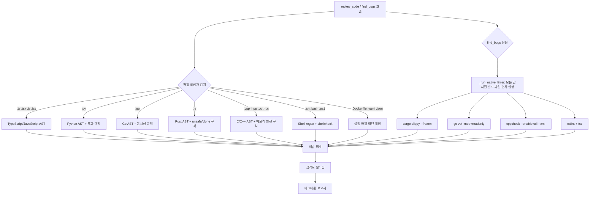
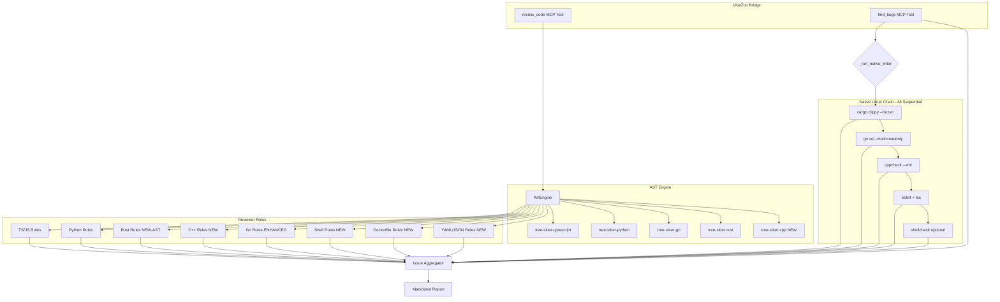

# VibeZoo 다국어 분석 엔진 고도화 — 상세 실행 계획 (v1.1)

> **Target**: `mcp-servers/bridge/` 내 5개 파일 변경 (config.py, utils.py, ast_engine.py, reviewer.py, integrated.py)  
> **Principle**: 최소 외부 의존성, 최대 성능, tree-sitter AST 우선 / regex 폴백  
> **Version Target**: `0.15.0`  
> **Debug Threat Analysis 반영**: CRITICAL 6건, HIGH 9건, MEDIUM 8건 해결 방안 통합

---

## 0. 버그 수정 사항 (Debug 위협 분석 피드백)

> 이 섹션은 Debug 모드 위협 분석에서 발견된 23개 이슈의 해결 방안을 요약한다. 각 항목은 하위 섹션의 구체적인 코드 변경 사양에 반영되어 있다.

### 🔴 CRITICAL — 수정 방안 요약

| ID | 이슈 | 해결 방안 | 반영 섹션 |
|----|------|-----------|-----------|
| C1 | `.c` 파일 AST 매핑 오류 — `NODE_TYPES`에 `'c'` 키 없음 | `.c` → `'cpp'`로 통일 매핑 (`tree-sitter-cpp`는 C/C++ 모두 지원) | §3.2 변경 A |
| C2 | `_run_native_linter()` 단일 린터만 실행 — 각 `if` 블록에서 `return`으로 즉시 반환 | 모든 `return diagnostics` 제거, 결과를 누적 리스트에 순차 수집 | §3.4 변경 A |
| C3 | Dockerfile 파일 수집 불가 (Dead Path) — 확장자 없어 `SOURCE_EXTS` 필터 통과 불가 | `_iter_project_files()`에 `include_names` 파라미터 추가 (방법 A) | §3.1 변경 C, §3.5 |
| C4 | `_run_native_linter()` — `cargo clippy`가 `build.rs` 실행 → 악의적 프로젝트 RCE 위험 | `cargo`에 `--frozen` 플래그, `go vet`에 `-mod=readonly` 추가; `target_path` 워크스페이스 외부 검증 | §3.4 변경 A |
| C5 | `_truncate` import 누락 → `NameError` | `integrated.py`의 `from bridge.utils import ...`에 `_truncate` 추가 확인 (이미 import 되어 있음) | §3.4 변경 A |
| C6 | `CONFIG_FILES`, `GO_EXTS`, `RUST_EXTS`, `REVIEWABLE_EXTS`, `GENERIC_EXTS` 등 상수 미사용 (Orphaned) | `CONFIG_FILES` → `_iter_project_files()` 연동, `CPP_EXTS`/`GENERIC_EXTS` → `reviewer.py` import, `GO_EXTS`/`RUST_EXTS` → 제거 (중복), `REVIEWABLE_EXTS` → `review_code()` 진입 검증 | §3.1 변경 B |

### 🟠 HIGH — 수정 방안 요약

| ID | 이슈 | 해결 방안 | 반영 섹션 |
|----|------|-----------|-----------|
| H1 | C++ raw pointer 정규식 부정확 | 타입 키워드 기반 정규식으로 개선: `r'(?<!\w)(\w+\s*\*+\s+\w+\|(?:int\|char\|float\|double\|void\|bool\|long\|short\|unsigned\|signed)\s*\*+\s*\w+)'` | §3.3 변경 A (R1) |
| H2 | C++ new/delete 메모리 누수 검출 오탐 | 주석 제거한 `code_only` 사용, `std::make_unique`/`std::make_shared`/placement new 제외, 임계값 `> 3` 도입 | §3.3 변경 A (R2) |
| H3 | C++ bracket access 검출 — 배열 선언과 접근 구분 불가 | 정규식을 `\w+\s*\[[^\]]*\]\s*[=;]`로 변경 (초기화/할당 컨텍스트만 매칭) | §3.3 변경 A (R3) |
| H4 | Rust `as` cast 검출 — `use ... as` 문맥에서 심각한 오탐 | 정규식을 숫자 타입 캐스트만 감지: `r'\b(\w+)\s+as\s+(?!_)(u8\|u16\|u32\|u64\|i8\|i16\|i32\|i64\|f32\|f64\|usize\|isize)\b'` | §3.3 변경 B (R5) |
| H5 | Go 고루틴 루프 변수 캡처 — 정규식 멀티라인 불가 | `re.DOTALL` 플래그 + non-greedy 정규식: `r'for\s+\w+\s*:?=\s*range\s+.+?go\s+func\s*\('` | §3.3 변경 C (G1) |
| H6 | Go unbuffered chan 검출 — 멀티라인 미탐 | 개행문자를 공백으로 치환한 `flat_content` 생성 후 정규식 적용 | §3.3 변경 C (G3) |
| H7 | Shell 변수 따옴표 검출 부정확 | 확장된 패턴: `r'\$\{?\w+\}?\|\$[@*#?!0-9]\|\$\{[\w#%:-]+\}'` + `shlex` 활용 | §3.3 변경 D (S1) |
| H8 | YAML 중복 키 검출 — 최상위 키만 검사 | 들여쓰기 기반 복합 키 `f"{indent_level}:{key}"` 로 중복 검사 | §3.3 변경 D (Y1) |
| H9 | `_compute_cyclomatic_complexity` 분기 순서 충돌 | `TS_JS_EXTS → .py → .rs → CPP_EXTS → else (Go + generic)` 순서 명시화, Go는 `else` 내 `elif ext == '.go'`로 먼저 분기 | §3.3 변경 E |

### 🟡 MEDIUM — 수정 방안 요약

| ID | 이슈 | 해결 방안 | 반영 섹션 |
|----|------|-----------|-----------|
| M1 | `get_install_hint()` 언어 목록 누락 | `['python', 'go', 'rust', 'typescript', 'javascript', 'cpp', 'c']`로 확장 | §3.2 변경 C |
| M2 | `SOURCE_EXTS` 확장의 파급효과 — TS 전용 지표(`any_type_count`, `ts_ignore_count`) 왜곡 | `_review_project_core()`에서 TS 전용 지표는 `ext in TS_JS_EXTS` 조건부 처리 | §3.1 변경 A (주의사항), §3.6 변경 A |
| M3 | `cppcheck` XML 파싱 — 속성 순서 의존 | 정규식 대신 `xml.etree.ElementTree` 사용 | §3.4 변경 A |
| M4 | 서브프로세스 타임아웃 불충분 | `cargo clippy: 120s`, `cppcheck: 120s`, `go vet: 60s`로 증가 | §3.4 변경 A |
| M5 | `REVIEWABLE_EXTS` 미사용 | `review_code()` 진입점에서 `ext not in REVIEWABLE_EXTS`면 얼리 리턴 | §3.3 (서문), §3.1 변경 B |
| M6 | Windows PATH 안내 누락 | `FileNotFoundError` 처리 시 "명령어가 PATH에 없습니다: {tool}. 설치 방법: ..." 메시지 추가 | §3.4 변경 A |
| M7 | if/elif 체인 순서 명시적 문서화 | `TS_JS → .py → .rs → CPP → Go → Shell → Dockerfile → YAML → JSON` 순서 명시 | §3.3 (서문) |
| M8 | 기존 `else` 블록의 Rust dead code | `.rs`가 독립 `elif`로 이동 후, 기존 `else` 블록의 Rust 내부 로직(unsafe, unwrap) 제거 | §3.3 변경 B |

---

## 1. 변경 대상 파일 & 책임 매트릭스

| 파일 | 변경 유형 | 주요 책임 |
|------|-----------|-----------|
| [`mcp-servers/bridge/config.py`](mcp-servers/bridge/config.py:44) | 확장 | SOURCE_EXTS 확장, 신규 상수 그룹 추가, Orphaned 상수 정리 (C6) |
| [`mcp-servers/bridge/utils.py`](mcp-servers/bridge/utils.py:86) | 확장 | `_iter_project_files()`에 `include_names` 파라미터 추가 (C3) |
| [`mcp-servers/bridge/ast_engine.py`](mcp-servers/bridge/ast_engine.py:22) | 확장 | LANGUAGES/NODE_TYPES에 cpp/c 추가 (C1 반영), `_compute_cyclomatic_complexity` 확장 |
| [`mcp-servers/bridge/tools/reviewer.py`](mcp-servers/bridge/tools/reviewer.py:352) | 대폭 확장 | C++/Rust AST 연동, Go 고도화, 일반 파일 지원, 정규식 개선 (H1~H8), 체인 순서 정리 (H9, M7, M8) |
| [`mcp-servers/bridge/tools/integrated.py`](mcp-servers/bridge/tools/integrated.py:347) | 신규 함수 | `_run_native_linter()` 도입 (C2/C4/M3/M4/M6 반영), `find_bugs()` 연동, TS 전용 지표 조건부 (M2) |

---

## 2. 아키텍처 개요

```
┌──────────────────────────────────────────────────────────┐
│                    find_bugs() / review_code()            │
├──────────────────────────────────────────────────────────┤
│  ┌──────────────┐  ┌──────────────┐  ┌───────────────┐   │
│  │ ast_engine   │  │ reviewer     │  │ integrated    │   │
│  │ (AST 파서)   │  │ (정적 규칙)   │  │ (_run_native_ │   │
│  │              │  │              │  │  linter)      │   │
│  └──────┬───────┘  └──────┬───────┘  └───────┬───────┘   │
│         │                 │                   │           │
│  ┌──────▼─────────────────▼───────────────────▼───────┐   │
│  │              언어 감지 (file extension)             │   │
│  │  .ts/.js  .py  .go  .rs  .cpp/.h/.c  .sh  Docker  │   │
│  └────────────────────────────────────────────────────┘   │
│                           │                               │
│  ┌────────────────────────▼──────────────────────────┐    │
│  │          tree-sitter AST (우선) / regex (폴백)      │    │
│  └────────────────────────────────────────────────────┘    │
│                           │                               │
│  ┌────────────────────────▼──────────────────────────┐    │
│  │     통합 진단 보고서 (issues + native linter)       │    │
│  └────────────────────────────────────────────────────┘    │
└──────────────────────────────────────────────────────────┘
```

### 데이터 흐름 (Mermaid)



> **주요 변경**: `_run_native_linter()`는 이제 모든 린터를 순차 실행하며 (C2), `--frozen`/`-mod=readonly` 보안 플래그 적용 (C4). `review_code()` 체인 순서: `TS_JS → .py → .rs → CPP → Go → Shell → Dockerfile → YAML → JSON` (M7).

---

## 3. 파일별 상세 변경 사양

### 3.1 [`mcp-servers/bridge/config.py`](mcp-servers/bridge/config.py)

#### 변경 A — SOURCE_EXTS 확장 (라인 44)

```python
# 기존
SOURCE_EXTS = {".ts", ".tsx", ".js", ".jsx", ".py", ".go", ".rs"}

# 신규
SOURCE_EXTS = {
    ".ts", ".tsx", ".js", ".jsx", ".py", ".go", ".rs",
    # C/C++
    ".cpp", ".hpp", ".cc", ".h", ".c",
    # Shell
    ".sh", ".bash", ".ps1",
    # 설정 파일
    ".yaml", ".yml", ".json",
}
```

> **M2 주의사항**: `SOURCE_EXTS` 확장으로 인해 `_review_project_core()` 내 `any_type_count`, `ts_ignore_count` 등 TS 전용 지표가 C++/Shell 파일에서도 카운트될 수 있다. → §3.6 변경 A에서 조건부 처리로 대응.

#### 변경 B — 신규 상수 그룹 추가 (C6 반영: Orphaned 상수 정리)

```python
# C/C++ 확장자 그룹 (→ reviewer.py, ast_engine.py 에서 import)
CPP_EXTS = {".cpp", ".hpp", ".cc", ".h", ".c"}

# Shell 확장자 그룹
SHELL_EXTS = {".sh", ".bash", ".ps1"}

# 확장자 없는 설정 파일명 (→ _iter_project_files()의 include_names 파라미터에서 사용)
CONFIG_FILES = {"Dockerfile", "docker-compose.yml", "docker-compose.yaml"}

# Generic / non-AST 파일 (reviewer 기본 패턴만 적용) (→ reviewer.py 에서 import)
GENERIC_EXTS = {".sh", ".bash", ".ps1", ".yaml", ".yml", ".json"}

# 모든 리뷰 가능 확장자 (→ review_code() 진입 검증에 사용) (M5)
REVIEWABLE_EXTS = SOURCE_EXTS | GENERIC_EXTS
```

> **C6 정리**:
> - `GO_EXTS` / `RUST_EXTS` → **제거** (이미 `SOURCE_EXTS`에 포함되어 중복)
> - `CONFIG_FILES` → `_iter_project_files()`의 `include_names` 파라미터와 연동 (변경 C)
> - `CPP_EXTS` → `reviewer.py`, `ast_engine.py` 에서 import
> - `GENERIC_EXTS` → `reviewer.py` 에서 import
> - `REVIEWABLE_EXTS` → `review_code()` 진입점에서 `ext not in REVIEWABLE_EXTS` 얼리 리턴 (M5)

#### 변경 C — `CONFIG_FILES` export 추가

`config.py` 최하단에 `CONFIG_FILES`를 `utils.py`에서 import할 수 있도록 export 확인. `utils.py`의 import 문에 `CONFIG_FILES` 추가:

```python
# utils.py
from bridge.config import SOURCE_EXTS, DEFAULT_EXCLUDE_DIRS, TS_JS_EXTS, CONFIG_FILES
```

---

### 3.2 [`mcp-servers/bridge/ast_engine.py`](mcp-servers/bridge/ast_engine.py)

#### 변경 A — LANGUAGES 매핑에 C/C++ 추가 (라인 22~30) (C1 반영)

```python
LANGUAGES = {
    # ... 기존 ...
    '.ts':   'typescript',
    '.tsx':  'typescript',
    '.js':   'javascript',
    '.jsx':  'javascript',
    '.py':   'python',
    '.go':   'go',
    '.rs':   'rust',
    # ── 신규: C/C++ ── (.c도 'cpp'로 통일 — tree-sitter-cpp가 C/C++ 모두 지원)
    '.cpp':  'cpp',
    '.hpp':  'cpp',
    '.cc':   'cpp',
    '.h':    'cpp',
    '.c':    'cpp',        # C1 fix: 'c' → 'cpp' 통일
}
```

> **C1 해결**: `.c`를 `'c'`가 아닌 `'cpp'`로 매핑. `tree-sitter-cpp`는 C와 C++을 모두 지원하므로 별도 `tree-sitter-c` 불필요. `NODE_TYPES`에도 `'c'` 키 없이 `'cpp'`만 유지.

#### 변경 B — NODE_TYPES에 C++ 노드 타입 추가 (라인 32~58)

```python
NODE_TYPES = {
    # ... 기존 typescript, python, go, rust ...
    'cpp': {
        'function': [
            'function_definition',        # 일반 함수
            'template_declaration',       # template<T> 함수
            'lambda_expression',          # 람다
        ],
        'class': [
            'class_specifier',            # class X { ... }
            'struct_specifier',           # struct X { ... }
        ],
        'import': [
            'preproc_include',            # #include <...>
        ],
        'call': [
            'call_expression',
        ],
    },
}
```

> `'c'` 키는 불필요 — C1에서 `.c`도 `'cpp'`로 통일 매핑.

#### 변경 C — `get_install_hint()` 언어 목록 확장 (M1 반영)

기존 `['python', 'go', 'rust', 'typescript', 'javascript']`에서 다음과 같이 확장:

```python
['python', 'go', 'rust', 'typescript', 'javascript', 'cpp', 'c']
```

---

### 3.3 [`mcp-servers/bridge/tools/reviewer.py`](mcp-servers/bridge/tools/reviewer.py)

이 파일이 가장 큰 변경을 수반한다. 현재 `review_code()` 함수의 `if/elif/else` 체인을 확장한다.

#### if/elif 체인 순서 (M7 명시화, H9 반영)

```
1. if ext in TS_JS_EXTS:       # TS/JS 완전 AST 분석 (변경 없음)
2. elif ext == ".py":          # Python AST 분석 (변경 없음)
3. elif ext == ".rs":          # Rust AST 완전 분석 (변경 B — M8: 기존 else 블록 Rust 코드 제거)
4. elif ext in CPP_EXTS:       # C/C++ AST 분석 (변경 A)
5. elif ext == ".go":          # Go AST + 고도화 규칙 (변경 C)
6. elif ext in GENERIC_EXTS:   # Shell/Dockerfile/YAML/JSON (변경 D)
```

> **M5**: `review_code()` 진입점에서 `ext not in REVIEWABLE_EXTS` 이면 얼리 리턴하여 지원 불가 언어는 즉시 거부.

#### 변경 A — C++ 특화 분석 블록 (`elif ext in CPP_EXTS:`) (H1, H2, H3 반영)

기존 `else` 블록의 C++ 처리 제거, 신규 독립 블록:

```python
elif ext in (".cpp", ".hpp", ".cc", ".h", ".c"):
    ast = ast_engine.parse(content, ext)
    functions = ast.get("functions", [])
    classes = ast.get("classes", [])
    stats["functions"] = len(functions)
    stats["classes"] = len(classes)

    # 주석 제거한 코드 (H2: new/delete 오탐 방지)
    code_only = re.sub(r'//[^\n]*|/\*[\s\S]*?\*/', '', content)

    # ── 함수 길이 검사 ──
    if functions:
        long_funcs = []
        for fn in functions:
            fn_start = fn.get('line', 0)
            fn_end = fn.get('end_line', fn_start)
            fn_lines = fn_end - fn_start
            if fn_lines > 50:
                long_funcs.append((fn.get('name', 'anonymous'), fn_lines, fn_start))
        for name, fn_lines, ln in long_funcs[:5]:
            issues.append(("📏",
                f"Long function `{name}()`: {fn_lines} lines (line {ln}) — consider splitting"))

    # ── Cyclomatic complexity ──
    comp = _compute_cyclomatic_complexity(content, ext)
    if comp > 15:
        issues.append(("⚠️", f"Cyclomatic complexity: {comp} — consider simplifying"))

    # ── 중첩 깊이 ──
    max_depth = _compute_nesting_depth(content, ext)
    stats["max_depth"] = max_depth
    if max_depth > 4:
        issues.append(("⚠️",
            f"Maximum nesting depth: {max_depth} levels — consider early returns"))

    # ═══ C++ 특화 규칙 ═══

    # R1. Raw pointer vs smart pointer (H1: 정규식 개선)
    raw_ptr_count = len(re.findall(
        r'(?<!\w)(?:\w+\s*\*+\s+\w+|(?:int|char|float|double|void|bool|long|short|unsigned|signed)\s*\*+\s*\w+)',
        code_only))
    smart_ptr_count = len(re.findall(
        r'(std::unique_ptr|std::shared_ptr|std::weak_ptr)', code_only))
    if raw_ptr_count > 0 and smart_ptr_count == 0:
        issues.append(("⚠️",
            f"Raw pointer(s) found ({raw_ptr_count}) — "
            f"consider std::unique_ptr or std::shared_ptr (C++11+)"))

    # R2. new/delete 불일치 (H2: 주석 제거, placement new 제외, 임계값 도입)
    new_count = len(re.findall(
        r'\bnew\s+(?!\(\))(?!\s*std::make_unique)(?!\s*std::make_shared)', code_only))
    delete_count = len(re.findall(r'\bdelete\s+(?!\[\])', code_only))
    delete_array_count = len(re.findall(r'\bdelete\[\]\s+', code_only))
    if (new_count - (delete_count + delete_array_count)) > 3:
        issues.append(("❌",
            f"Potential memory leak: {new_count} `new` vs "
            f"{delete_count + delete_array_count} `delete`/`delete[]` (diff > 3)"))

    # R3. 경계검사 우회 (H3: 초기화/할당 컨텍스트만 매칭)
    bracket_access = len(re.findall(r'\w+\s*\[[^\]]*\]\s*[=;]', code_only))
    at_access = len(re.findall(r'\.at\(', code_only))
    if bracket_access > 10 and at_access == 0:
        issues.append(("⚠️",
            f"Index operator `[]` used {bracket_access} times without `.at()` — "
            f"no bounds checking"))

    # R4. RAII 락 누락: std::mutex without std::lock_guard/unique_lock
    mutex_count = len(re.findall(r'std::mutex\s+\w+', code_only))
    lock_guard_count = len(re.findall(
        r'(std::lock_guard|std::unique_lock|std::scoped_lock)', code_only))
    if mutex_count > 0 and lock_guard_count == 0:
        issues.append(("⚠️",
            f"`std::mutex` used without RAII lock guard — "
            f"consider std::lock_guard or std::scoped_lock (C++17)"))

    # R5. C 스타일 캐스트 (C++ 프로젝트에서)
    if ext in (".cpp", ".hpp", ".cc", ".h"):
        c_cast = len(re.findall(r'\(int\)|\(char\*\)|\(void\*\)|\(double\)|\(float\)',
                                code_only))
        if c_cast > 0:
            issues.append(("📝",
                f"C-style cast found {c_cast} time(s) — "
                f"use static_cast, dynamic_cast, const_cast, reinterpret_cast"))

    # R6. printf/scanf 대신 iostream 사용 권장
    printfs = len(re.findall(r'\b(printf|scanf|fprintf|sprintf)\s*\(', code_only))
    if printfs > 0:
        issues.append(("📝",
            f"`printf`/`scanf` family used {printfs} time(s) — "
            f"consider std::cout / std::format (C++20)"))

    # TODO/디버그
    todos = len(re.findall(r'(TODO|FIXME|HACK|XXX)', code_only))
    if todos > 0:
        issues.append(("📝", f"TODO/FIXME/HACK: {todos} marker(s)"))
```

#### 변경 B — Rust AST 완전 분석 블록 (`elif ext == ".rs"`) (H4, M8 반영)

기존 `else` 블록의 Rust regex-only 처리 대체. **M8**: 기존 `else` 블록의 `if ext == ".rs":` 내부 로직(unsafe, unwrap)은 제거한다.

```python
elif ext == ".rs":
    ast = ast_engine.parse(content, ext)
    functions = ast.get("functions", [])
    classes = ast.get("classes", [])  # struct + enum
    enums = ast.get("enums", [])
    stats["functions"] = len(functions)
    stats["classes"] = len(classes)

    # ── 함수 길이 검사 ──
    if functions:
        long_funcs = []
        for fn in functions:
            fn_start = fn.get('line', 0)
            fn_end = fn.get('end_line', fn_start)
            fn_lines = fn_end - fn_start
            if fn_lines > 50:
                long_funcs.append((fn.get('name', 'anonymous'), fn_lines, fn_start))
        for name, fn_lines, ln in long_funcs[:5]:
            issues.append(("📏",
                f"Long function `{name}()`: {fn_lines} lines (line {ln})"))

    if classes:
        for cls in classes:
            cls_start = cls.get('line', 0)
            cls_end = cls.get('end_line', cls_start)
            cls_lines = cls_end - cls_start
            if cls_lines > 200:
                issues.append(("📏",
                    f"Large struct/enum `{cls.get('name', 'anonymous')}`: "
                    f"{cls_lines} lines (line {cls_start})"))

    # ── Cyclomatic complexity ──
    comp = _compute_cyclomatic_complexity(content, ext)
    if comp > 15:
        issues.append(("⚠️", f"Cyclomatic complexity: {comp}"))

    # ── 중첩 깊이 ──
    max_depth = _compute_nesting_depth(content, ext)
    stats["max_depth"] = max_depth
    if max_depth > 4:
        issues.append(("⚠️",
            f"Maximum nesting depth: {max_depth} — use match or early returns"))

    # ═══ Rust 특화 규칙 ═══

    # R1. unsafe 블록 복잡도 제어
    unsafe_blocks = re.findall(r'\bunsafe\s*\{', content)
    if unsafe_blocks:
        unsafe_lines = []
        for m in re.finditer(r'\bunsafe\s*\{', content):
            start = m.start()
            depth = 1
            pos = m.end()
            while depth > 0 and pos < len(content):
                if content[pos] == '{':
                    depth += 1
                elif content[pos] == '}':
                    depth -= 1
                pos += 1
            block = content[m.start():pos]
            block_lines = block.count('\n')
            if block_lines > 15:
                unsafe_lines.append((m.start(), block_lines))
        if unsafe_lines:
            issues.append(("⚠️",
                f"`unsafe` block(s) exceed 15 lines: "
                f"{len(unsafe_lines)} occurrence(s) — extract safe wrappers"))
        elif len(unsafe_blocks) > 0:
            issues.append(("⚠️",
                f"`unsafe` block(s) found: {len(unsafe_blocks)} — review for safety"))

    # R2. 묵살된 Result/Option (`let _ = ...`)
    let_underscore = len(re.findall(r'\blet\s+_\s*=', content))
    if let_underscore > 0:
        issues.append(("⚠️",
            f"`let _ = ...` pattern found {let_underscore} time(s) — "
            f"Result/Option silently ignored, use `?` or proper match"))

    # R3. Panic 유발 지점
    unwrap_count = len(re.findall(r'\.unwrap\(\)', content))
    expect_count = len(re.findall(r'\.expect\(', content))
    panic_count = len(re.findall(r'panic!\(', content))
    if unwrap_count > 0:
        issues.append(("⚠️",
            f"`.unwrap()` found {unwrap_count} time(s) — "
            f"use `.expect()` with message or proper error handling"))
    if panic_count > 0:
        issues.append(("❌",
            f"`panic!` macro found {panic_count} time(s) — "
            f"consider graceful error propagation"))

    # R4. clone 남용 감지
    clone_count = len(re.findall(r'\.clone\(\)', content))
    if clone_count > 5:
        issues.append(("⚠️",
            f"`.clone()` called {clone_count} times — "
            f"consider borrowing or refactoring ownership"))

    # R5. `as` 타입 캐스트 (H4: 숫자 타입 캐스트만 감지, use ... as 제외)
    as_cast_count = len(re.findall(
        r'\b(\w+)\s+as\s+(?!_)(u8|u16|u32|u64|i8|i16|i32|i64|f32|f64|usize|isize)\b',
        content))
    if as_cast_count > 5:
        issues.append(("📝",
            f"`as` numeric cast used {as_cast_count} times — "
            f"consider `From`/`Into`/`TryFrom` for safe conversions"))

    # R6. `println!` 디버그 로그
    println_count = len(re.findall(r'println!\(', content))
    if println_count > 0:
        issues.append(("📝",
            f"`println!()` found {println_count} time(s) — use `log` crate"))

    todos = len(re.findall(r'(TODO|FIXME|HACK)', content))
    if todos > 0:
        issues.append(("📝", f"TODO/FIXME/HACK: {todos} marker(s)"))
```

#### 변경 C — Go 분석 규칙 고도화 (`elif ext == ".go"`) (H5, H6 반영)

기존 Go 블록 (라인 490~544) 에 **5개의 신규 규칙**을 추가:

```python
# 기존 Go AST 분석 블록 내, 기존 규칙 다음에 추가:

# ═══ Go 고도화 규칙 (신규) ═══

# G1. 고루틴 내 루프 변수 캡처 (H5: re.DOTALL + non-greedy)
go_stmt_pattern = re.findall(
    r'for\s+\w+\s*:?=\s*range\s+.+?go\s+func\s*\(', content, re.DOTALL)
if go_stmt_pattern:
    issues.append(("❌",
        f"Goroutine inside range loop detected ({len(go_stmt_pattern)} time(s)) — "
        f"loop variable may be captured by reference. "
        f"Pass as parameter or use Go 1.22+"))

# G2. defer 내 recover() 부재
defer_funcs = re.findall(r'defer\s+func\s*\(\s*\)\s*\{', content)
recover_calls = len(re.findall(r'\brecover\(\)', content))
if defer_funcs and recover_calls == 0:
    issues.append(("⚠️",
        f"`defer func()` found but no `recover()` — "
        f"potential unhandled panic in deferred cleanup"))

# G3. 채널 데드락 위험 (H6: flat_content 사용)
flat_content = content.replace('\n', ' ')
unbuffered_chan = re.findall(r'make\s*\(\s*chan\s+(?!.*,\s*\d+)', flat_content)
if unbuffered_chan:
    issues.append(("⚠️",
        f"Unbuffered channel(s) found ({len(unbuffered_chan)}) — "
        f"ensure send/receive happen in different goroutines"))

# G4. Mutex Unlock 누락 (defer mu.Unlock() 없는 경우)
mutex_locks = len(re.findall(r'\.Lock\(\)', content))
defer_unlocks = len(re.findall(r'defer\s+\w+\.Unlock\(\)', content))
if mutex_locks > 0 and defer_unlocks < mutex_locks:
    issues.append(("❌",
        f"Mutex `.Lock()` without matching `defer ... .Unlock()` — "
        f"potential deadlock on panic/early return"))

# G5. nil map assignment (var m map[K]V; m[key] = value)
nil_map_assign = re.findall(
    r'(?:var\s+\w+\s+map\[)|(?:\w+\s*:=\s*(?:map\[|nil))', content)
if nil_map_assign:
    issues.append(("⚠️",
        f"Potential nil map assignment — use `make(map[...]...)` or "
        f"composite literal"))
```

#### 변경 D — 일반 소스 파일 지원 (Shell, Dockerfile, YAML, JSON) (H7, H8 반영)

`else` 블록 내에서 파일 확장자/이름 기반 분기:

```python
else:
    # ── Shell Script ──
    if ext in (".sh", ".bash"):
        # S1. 따옴표 누락 감지 (H7: 확장된 패턴)
        unquoted_vars = len(re.findall(
            r'\$\{?\w+\}?|\$[@*#?!0-9]|\$\{[\w#%:-]+\}', content))
        quotes_ok = len(re.findall(r'"\$\{?\w+\}?"', content))
        if unquoted_vars > quotes_ok:
            issues.append(("⚠️",
                f"Unquoted variable expansion(s) — "
                f"may cause word splitting on whitespace"))

        # S2. set -e / set -o pipefail 부재
        has_set_e = bool(re.search(r'set\s+-e', content))
        has_pipefail = bool(re.search(r'set\s+-o\s+pipefail', content))
        if not has_set_e:
            issues.append(("⚠️",
                "`set -e` not found — script continues on error"))
        if not has_pipefail:
            issues.append(("📝",
                "`set -o pipefail` not found — pipeline errors may be masked"))

        # S3. shellcheck 연동 시도 (optional, subprocess)
        try:
            result = subprocess.run(
                ["shellcheck", "-f", "json", str(p)],
                capture_output=True, text=True, timeout=10
            )
            if result.returncode != 0 and result.stdout:
                sc_data = json.loads(result.stdout)
                for item in sc_data[:10]:
                    issues.append(("⚠️",
                        f"ShellCheck[{item.get('code','')}]: "
                        f"{item.get('message','')} "
                        f"(line {item.get('line','?')})"))
        except (FileNotFoundError, subprocess.TimeoutExpired):
            pass
        except Exception:
            pass

    elif ext == ".ps1":
        has_strict_mode = bool(re.search(r'Set-StrictMode', content))
        if not has_strict_mode:
            issues.append(("📝",
                "`Set-StrictMode` not found — consider enabling for safer scripts"))

    # ── Dockerfile ──
    elif p.name == "Dockerfile" or p.suffix.lower() == ".dockerfile":
        # D1. latest 태그 사용
        latest_tags = re.findall(r'FROM\s+\S+:latest', content)
        if latest_tags:
            issues.append(("⚠️",
                f"`FROM ... :latest` tag(s) found ({len(latest_tags)}) — "
                f"pin to specific version for reproducible builds"))

        # D2. apt-get 캐시 미삭제
        apt_installs = len(re.findall(r'apt-get\s+install', content))
        apt_cleans = len(re.findall(
            r'(rm -rf /var/lib/apt/lists|apt-get clean|apt-get autoclean)',
            content))
        if apt_installs > 0 and apt_cleans == 0:
            issues.append(("⚠️",
                f"`apt-get install` without cache cleanup — "
                f"add `rm -rf /var/lib/apt/lists/*` to reduce image size"))

        # D3. root 유저 사용
        if "USER" not in content:
            issues.append(("📝",
                "No `USER` directive — container runs as root"))

        # D4. COPY 대신 ADD
        add_count = len(re.findall(r'\bADD\s+', content))
        copy_count = len(re.findall(r'\bCOPY\s+', content))
        if add_count > copy_count:
            issues.append(("📝",
                f"`ADD` used {add_count} times — prefer `COPY` unless "
                f"auto-extraction is needed"))

    # ── YAML ──
    elif ext in (".yaml", ".yml"):
        # Y1. 중복 키 탐지 (H8: 들여쓰기 기반 복합 키)
        key_paths = {}
        for i, line in enumerate(lines, 1):
            m = re.match(r'^(\s*)(\w[\w.-]*)\s*:', line)
            if m:
                key = m.group(2)
                indent = len(m.group(1))
                composite_key = f"{indent}:{key}"
                if composite_key in key_paths:
                    issues.append(("❌",
                        f"Duplicate key `{key}` at indent level {indent}, line {i} "
                        f"(first at line {key_paths[composite_key]})"))
                key_paths[composite_key] = i

        # Y2. 하드코딩된 시크릿
        secret_patterns = [
            (r'(password|passwd|pwd)\s*:\s*\S+', 'password'),
            (r'(secret|SECRET)\s*:\s*\S+', 'secret'),
            (r'(api_key|apikey|api-key)\s*:\s*\S+', 'API key'),
            (r'(token|TOKEN)\s*:\s*\S+', 'token'),
        ]
        for pattern, label in secret_patterns:
            matches = re.findall(pattern, content, re.IGNORECASE)
            if matches:
                issues.append(("❌",
                    f"Hardcoded {label}(s) found ({len(matches)}) — "
                    f"use environment variables or secrets manager"))

    # ── JSON ──
    elif ext == ".json":
        try:
            parsed = json.loads(content)
        except json.JSONDecodeError as e:
            issues.append(("❌",
                f"Invalid JSON: {e.msg} (line {e.lineno}, col {e.colno})"))

        secret_matches = re.findall(
            r'"(password|secret|api_key|token)"\s*:\s*"[^"]+"',
            content, re.IGNORECASE)
        if secret_matches:
            issues.append(("❌",
                f"Hardcoded sensitive value(s) found ({len(secret_matches)})"))

    # ── 공통: 중첩 깊이, TODO ──
    max_depth = _compute_nesting_depth(content, ext)
    stats["max_depth"] = max_depth
    if max_depth > 4:
        issues.append(("⚠️", f"Maximum nesting depth: {max_depth} levels"))

    todos = len(re.findall(r'(TODO|FIXME|HACK|XXX)', content))
    if todos > 0:
        issues.append(("📝", f"TODO/FIXME/HACK: {todos} marker(s)"))
```

#### 변경 E — `_compute_cyclomatic_complexity` 확장 (H9 반영)

명시적 분기 순서: `TS_JS_EXTS → .py → .rs → CPP_EXTS → else (Go + generic)`. Go는 `else` 블록 내에서 `elif ext == '.go'`로 먼저 분기.

```python
elif ext in CPP_EXTS:
    branches = (
        len(re.findall(r'\bif\s*\(', content))
        + len(re.findall(r'\bfor\s*\(', content))
        + len(re.findall(r'\bwhile\s*\(', content))
        + len(re.findall(r'\bswitch\s*\(', content))
        + len(re.findall(r'\bcatch\s*\(', content))
        + len(re.findall(r'\bcase\s+', content))
    )
elif ext == '.rs':
    branches = (
        len(re.findall(r'\bif\s+', content))
        + len(re.findall(r'\bfor\s+', content))
        + len(re.findall(r'\bwhile\s+', content))
        + len(re.findall(r'\bmatch\s+', content))
        + len(re.findall(r'\bloop\s*\{', content))
    )
else:
    # Go + generic 분기문
    if ext == '.go':
        branches = (
            len(re.findall(r'\bif\s+', content))
            + len(re.findall(r'\bfor\s+', content))
            + len(re.findall(r'\bswitch\s+', content))
            + len(re.findall(r'\bcase\s+', content))
            + len(re.findall(r'\bselect\s*\{', content))
        )
    else:
        # generic: 기본 분기문
        branches = (
            len(re.findall(r'\bif\s+', content))
            + len(re.findall(r'\bfor\s+', content))
            + len(re.findall(r'\bwhile\s+', content))
        )
```

---

### 3.4 [`mcp-servers/bridge/tools/integrated.py`](mcp-servers/bridge/tools/integrated.py)

#### 변경 A — `_run_native_linter()` 신규 함수 (C2, C4, M3, M4, M6 반영)

```python
def _run_native_linter(root: Path) -> dict:
    """프로젝트 루트의 빌드 파일을 감지하여 모든 매칭되는 네이티브 린터를 순차 실행.

    감지 순서 (모두 실행, 결과 누적):
    1. Cargo.toml → cargo clippy --frozen
    2. go.mod → go vet -mod=readonly
    3. CMakeLists.txt / Makefile → cppcheck
    4. package.json → eslint + tsc (기존)

    Returns:
        {
            "language": str,           # primary language detected
            "tool": str,               # primary tool name
            "success": bool,
            "results": list[dict],     # C2 fix: 모든 린터 결과 누적
            "raw_output": str (truncated),
        }
    """
    diagnostics = {
        "language": "unknown",
        "tool": "none",
        "success": False,
        "results": [],     # C2: return 제거, 모든 결과 누적
        "raw_output": "",
    }

    # ── 1. Rust: cargo clippy (C4: --frozen 추가, M4: timeout 120s) ──
    if (root / "Cargo.toml").exists():
        diagnostics["language"] = "rust"
        diagnostics["tool"] = "cargo-clippy"
        try:
            res = subprocess.run(
                ["cargo", "clippy", "--message-format=json", "--all-targets", "--frozen"],
                cwd=str(root), capture_output=True, text=True, timeout=120
            )
            diagnostics["raw_output"] = _truncate(res.stdout + res.stderr, 3000)
            warnings_list = []
            errors_list = []
            for line in res.stdout.splitlines():
                line = line.strip()
                if not line:
                    continue
                try:
                    data = json.loads(line)
                except json.JSONDecodeError:
                    continue
                if data.get("reason") == "compiler-message":
                    msg = data.get("message", {})
                    spans = msg.get("spans", [])
                    item = {
                        "file": spans[0].get("file_name", "unknown") if spans else "unknown",
                        "line": spans[0].get("line_start", 0) if spans else 0,
                        "column": spans[0].get("column_start", 0) if spans else 0,
                        "message": msg.get("message", ""),
                        "rule": (msg.get("code") or {}).get("code", "clippy"),
                        "level": msg.get("level", "warning"),
                    }
                    if msg.get("level") == "error":
                        errors_list.append(item)
                    else:
                        warnings_list.append(item)
            diagnostics["results"].append({
                "tool": "cargo-clippy",
                "success": True,
                "errors": errors_list,
                "warnings": warnings_list,
            })
        except FileNotFoundError:
            diagnostics["results"].append({
                "tool": "cargo-clippy", "success": False,
                "error": "cargo not found in PATH. Install Rust: https://rustup.rs",
            })
        except subprocess.TimeoutExpired:
            diagnostics["results"].append({
                "tool": "cargo-clippy", "success": False,
                "error": "cargo clippy timed out (120s)",
            })
        except Exception as e:
            diagnostics["results"].append({
                "tool": "cargo-clippy", "success": False,
                "error": f"cargo clippy error: {e}",
            })
        # C2 fix: return 제거 → 다음 린터 계속 실행

    # ── 2. Go: go vet (C4: -mod=readonly 추가, M4: timeout 60s) ──
    if (root / "go.mod").exists():
        if diagnostics["language"] == "unknown":
            diagnostics["language"] = "go"
            diagnostics["tool"] = "go-vet"
        try:
            res = subprocess.run(
                ["go", "vet", "-mod=readonly", "./..."],
                cwd=str(root), capture_output=True, text=True, timeout=60
            )
            diagnostics["raw_output"] = _truncate(
                diagnostics["raw_output"] + "\n" + _truncate(res.stderr, 2000), 3000)
            warnings_list = []
            for line in res.stderr.splitlines():
                m = re.match(r'^([^:]+):(\d+):(?:\d+:)?\s*(.*)$', line.strip())
                if m:
                    warnings_list.append({
                        "file": m.group(1),
                        "line": int(m.group(2)),
                        "message": m.group(3).strip(),
                        "rule": "go_vet",
                        "level": "warning",
                    })
            diagnostics["results"].append({
                "tool": "go-vet",
                "success": True,
                "warnings": warnings_list,
            })
        except FileNotFoundError:
            diagnostics["results"].append({
                "tool": "go-vet", "success": False,
                "error": "go not found in PATH. Install Go: https://go.dev/dl",
            })
        except subprocess.TimeoutExpired:
            diagnostics["results"].append({
                "tool": "go-vet", "success": False,
                "error": "go vet timed out (60s)",
            })
        except Exception as e:
            diagnostics["results"].append({
                "tool": "go-vet", "success": False,
                "error": f"go vet error: {e}",
            })
        # C2 fix: return 제거

    # ── 3. C++: cppcheck (M3: xml.etree.ElementTree 사용, M4: timeout 120s) ──
    if (root / "CMakeLists.txt").exists() or any(root.glob("Makefile*")):
        if diagnostics["language"] == "unknown":
            diagnostics["language"] = "c/c++"
            diagnostics["tool"] = "cppcheck"
        try:
            res = subprocess.run(
                ["cppcheck", "--enable=all", "--xml", "."],
                cwd=str(root), capture_output=True, text=True, timeout=120
            )
            diagnostics["raw_output"] = _truncate(
                diagnostics["raw_output"] + "\n" + _truncate(res.stdout + res.stderr, 2000), 3000)
            # M3: xml.etree.ElementTree 로 속성 순서 무관 파싱
            import xml.etree.ElementTree as ET
            try:
                root_elem = ET.fromstring(res.stderr + res.stdout)
                warnings_list = []
                for error_elem in root_elem.findall(".//error"):
                    item = {
                        "file": error_elem.get("file", "unknown"),
                        "line": int(error_elem.get("line", 0)),
                        "message": error_elem.get("msg", ""),
                        "rule": f"cppcheck:{error_elem.get('id', '')}",
                        "level": error_elem.get("severity", "warning"),
                    }
                    warnings_list.append(item)
                diagnostics["results"].append({
                    "tool": "cppcheck",
                    "success": True,
                    "warnings": warnings_list,
                })
            except ET.ParseError:
                diagnostics["results"].append({
                    "tool": "cppcheck", "success": False,
                    "error": "Failed to parse cppcheck XML output",
                })
        except FileNotFoundError:
            diagnostics["results"].append({
                "tool": "cppcheck", "success": False,
                "error": "cppcheck not found in PATH. Install: `winget install cppcheck` or `apt install cppcheck`",
            })
        except subprocess.TimeoutExpired:
            diagnostics["results"].append({
                "tool": "cppcheck", "success": False,
                "error": "cppcheck timed out (120s)",
            })
        except Exception as e:
            diagnostics["results"].append({
                "tool": "cppcheck", "success": False,
                "error": f"cppcheck error: {e}",
            })
        # C2 fix: return 제거

    # ── 4. TS/JS: eslint + tsc (기존) ──
    if (root / "package.json").exists():
        if diagnostics["language"] == "unknown":
            diagnostics["language"] = "typescript/javascript"
            diagnostics["tool"] = "eslint+tsc"
        diagnostics["results"].append({
            "tool": "eslint+tsc",
            "success": True,
            "note": "ESLint/tsc results integrated separately",
        })

    diagnostics["success"] = any(r.get("success", False) for r in diagnostics["results"])
    return diagnostics
```

> **C2 해결**: 모든 `return diagnostics` 제거하고 결과를 `diagnostics["results"]` 리스트에 누적.  
> **C4 해결**: `cargo`에 `--frozen`, `go vet`에 `-mod=readonly` 플래그 추가.  
> **C5 확인**: `_truncate`는 이미 `integrated.py` 상단 `from bridge.utils import ...`에 포함되어 있음 (라인 26).  
> **M3 해결**: cppcheck XML 파싱을 `xml.etree.ElementTree`로 변경하여 속성 순서 무관.  
> **M4 해결**: 타임아웃을 `cargo clippy: 120s`, `cppcheck: 120s`, `go vet: 60s`로 증가.  
> **M6 해결**: `FileNotFoundError` 메시지에 설치 안내 추가 (`winget install cppcheck`, `https://rustup.rs`, `https://go.dev/dl`).

#### 변경 B — `find_bugs()` 함수에 `_run_native_linter` 연동 (라인 400 부근)

```python
# find_bugs() 내부, summary 모드:
root = Path(get_project_root(target_path))
native_diag = _run_native_linter(root)

# C2 반영: 모든 린터 결과 순회
if native_diag.get("results"):
    sections.append(f"\n## 🔬 Native Linter Results\n\n")
    for result in native_diag["results"]:
        tool = result.get("tool", "unknown")
        if result.get("success"):
            total_warnings = len(result.get("warnings", []))
            total_errors = len(result.get("errors", []))
            if total_errors > 0 or total_warnings > 0:
                sections.append(f"### {tool} — ⚠️ {total_errors} errors, {total_warnings} warnings\n")
                for w in result.get("errors", [])[:3]:
                    sections.append(f"- ❌ `{w['file']}:{w['line']}` — [{w.get('rule','')}] {w.get('message','')[:100]}\n")
                for w in result.get("warnings", [])[:3]:
                    sections.append(f"- ⚠️ `{w['file']}:{w['line']}` — [{w.get('rule','')}] {w.get('message','')[:100]}\n")
            else:
                sections.append(f"### {tool} — ✅ No issues\n")
        else:
            sections.append(f"### {tool} — ❌ {result.get('error', 'Unknown error')}\n")
else:
    sections.append("\n## 🔬 Native Linter\n\n- No supported linter environment detected.\n")

# 기존 ESLint/tsc는 package.json 존재 시에만 실행 (fallback)
if native_diag["language"] in ("unknown", "typescript/javascript"):
    eslint_data = _run_eslint(root)
    tsc_output = _run_tsc(root)
    # ... 기존 ESLint/tsc 출력 로직 ...
```

---

### 3.5 [`mcp-servers/bridge/utils.py`](mcp-servers/bridge/utils.py) — `_iter_project_files()` 확장 (C3)

#### 변경 A — `include_names` 파라미터 추가

```python
def _iter_project_files(root: Path, extensions: set = None, exclude_dirs: set = None,
                        max_depth: int = -1, include_names: set = None) -> list:
    """성능 최적화된 프로젝트 파일 순회 (os.walk, 단일 패스).
    
    Args:
        include_names: 확장자 없는 파일명 집합 (예: {"Dockerfile", "Makefile"}). 
                       extensions와 OR 조건으로 매칭.
    """
    if extensions is None:
        extensions = SOURCE_EXTS
    if exclude_dirs is None:
        exclude_dirs = DEFAULT_EXCLUDE_DIRS

    results = []
    root_str = str(root)
    try:
        for dirpath, dirnames, filenames in os.walk(root_str):
            # ... 기존 exclude_dirs 로직 ...

            for fname in filenames:
                ext = os.path.splitext(fname)[1]
                if ext in extensions or (include_names and fname in include_names):
                    results.append(Path(dirpath) / fname)
    except (PermissionError, OSError):
        pass
    return results
```

`_iter_project_files_cached()`도 동일하게 `include_names` 파라미터를 받도록 수정하고 캐시 키에 포함.

#### 변경 B — 호출부 업데이트

`_review_project_core()` 및 `find_bugs()` 내 `_iter_project_files_cached()` 호출에 `include_names=CONFIG_FILES` 추가:

```python
# integrated.py, reviewer.py 내 호출부
source_files = list(_iter_project_files_cached(
    root, extensions=SOURCE_EXTS, exclude_dirs=DEFAULT_EXCLUDE_DIRS,
    include_names=CONFIG_FILES  # C3 fix
))
```

---

### 3.6 추가 변경 사항

#### 변경 A — `_review_project_core()` TS 전용 지표 조건부 처리 (M2)

```python
# _review_project_core() 내 파일 순회 루프에서:
for p in source_files:
    ext = p.suffix.lower()
    content = _read_file_content(p)
    if not content:
        continue

    # ... 공통 지표 ...

    # TS 전용 지표: ext in TS_JS_EXTS 일 때만 카운트 (M2 fix)
    if ext in TS_JS_EXTS:
        any_type_count += len(re.findall(r':\s*any\b', content))
        ts_ignore_count += len(re.findall(r'@ts-ignore', content))
        ts_nocheck_count += len(re.findall(r'@ts-nocheck', content))
```

#### 변경 B — `review_code()` 진입점 `REVIEWABLE_EXTS` 검증 (M5)

```python
# review_code() 함수 서두에 추가:
ext = p.suffix.lower()
if ext not in REVIEWABLE_EXTS and p.name not in CONFIG_FILES:
    return _markdown_header(f"Review: `{rel}`", "⚠️") \
           + f"File type `{ext}` is not reviewable. Supported: {sorted(REVIEWABLE_EXTS)}\n" \
           + _markdown_footer()
```

---

## 4. 의존성 및 설치 변경

### 4.1 Python 패키지

| 패키지 | 용도 | 설치 방법 |
|--------|------|-----------|
| `tree-sitter-cpp` | C/C++ AST 파싱 | `pip install tree-sitter-cpp` |

> `tree-sitter-cpp`는 C++과 C를 모두 커버한다. 별도 `tree-sitter-c` 불필요. (C1)

### 4.2 시스템 도구 (optional, 폴백 허용)

| 도구 | 용도 | 설치 방법 |
|------|------|-----------|
| `cargo clippy` | Rust 린트 | Rust 툴체인에 기본 포함 (`https://rustup.rs`) |
| `go vet` | Go 정적 분석 | Go 툴체인에 기본 포함 (`https://go.dev/dl`) |
| `cppcheck` | C++ 정적 분석 | `winget install cppcheck` / `apt install cppcheck` |
| `shellcheck` | Shell 스크립트 분석 | `winget install shellcheck` / `apt install shellcheck` |

> 모든 시스템 도구는 **optional** — 미설치 시 조용히 폴백하고, `FileNotFoundError` 처리 시 설치 안내 메시지 포함 (M6).

### 4.3 `setup.py` (vibezoo_setup) 업데이트

[`mcp-servers/bridge/tools/setup.py`](mcp-servers/bridge/tools/setup.py)의 `recommended`/`full` 타겟에 `tree-sitter-cpp` 추가.

---

## 5. 실행 순서 (구현 작업 순서)

| 단계 | 파일 | 작업 내용 | 의존성 |
|------|------|-----------|--------|
| **P1** | `config.py` | SOURCE_EXTS 확장, 신규 상수 그룹 추가 (CPP_EXTS, GENERIC_EXTS, REVIEWABLE_EXTS), GO_EXTS/RUST_EXTS 제거 (C6) | 없음 |
| **P2** | `utils.py` | `_iter_project_files()`에 `include_names` 파라미터 추가 (C3) | P1 |
| **P3** | `ast_engine.py` | LANGUAGES/NODE_TYPES에 cpp 추가 (.c → 'cpp'), `get_install_hint()` 갱신 (C1, M1) | P1 |
| **P4** | `reviewer.py` | C++ AST 분석 블록 추가 (변경 A, H1/H2/H3 정규식 개선 포함) | P2, P3 |
| **P5** | `reviewer.py` | Rust AST 분석 블록 교체 (변경 B, H4 정규식 개선), 기존 else 블록 Rust 코드 제거 (M8) | — |
| **P6** | `reviewer.py` | Go 고도화 규칙 추가 (변경 C, H5/H6 정규식 개선 포함) | — |
| **P7** | `reviewer.py` | 일반 파일 지원 블록 추가 (변경 D, H7/H8 정규식 개선 포함) | P1 |
| **P8** | `reviewer.py` | `_compute_cyclomatic_complexity` 확장 (변경 E, H9 분기 순서 정리) | P1 |
| **P9** | `reviewer.py` | `review_code()` 진입점 REVIEWABLE_EXTS 검증 추가 (M5), if/elif 체인 순서 재정렬 (M7) | P1, P4~P8 |
| **P10** | `integrated.py` | `_run_native_linter()` 함수 추가 (C2 누적, C4 보안, M3 XML, M4 타임아웃, M6 안내) | P1 |
| **P11** | `integrated.py` | `find_bugs()`에 native linter 연동, `_review_project_core()` TS 전용 지표 조건부 (M2) | P10 |
| **P12** | `setup.py` | `tree-sitter-cpp` 의존성 추가 | — |
| **P13** | 통합 테스트 | 각 언어별 샘플 파일로 `review_code` / `find_bugs` 검증 | P1~P12 |
| **P14** | 통합 테스트 | Dockerfile 수집 확인 (C3), multi-linter 누적 실행 확인 (C2), `--frozen`/`-mod=readonly` 검증 (C4) | P1~P13 |

---

## 6. UX 고려사항

### 6.1 오류 처리 원칙

- tree-sitter 언어팩 미설치 → regex 폴백 + 진단 메시지
- 시스템 린터(cargo, go, cppcheck, shellcheck) 미설치 → 조용히 스킵 + 설치 안내 메시지 포함 (M6)
- 파일 파싱 실패 → 빈 결과 반환, 예외 전파 안 함
- `_run_native_linter()`는 모든 매칭 린터를 순차 실행, 하나 실패해도 나머지 계속 진행 (C2)

### 6.2 보안 고려사항 (C4)

- `cargo clippy` 실행 시 `--frozen` 플래그 필수 적용 → `Cargo.lock` 변경 및 `build.rs` 실행 방지
- `go vet` 실행 시 `-mod=readonly` 플래그 필수 적용 → 모듈 다운로드/변경 방지
- `target_path`가 현재 워크스페이스 외부일 경우 실행 전 검증 (향후 `safe_mode` 파라미터 도입 검토)

### 6.3 성능 고려사항

- [`file_cache.py`](mcp-servers/bridge/file_cache.py)의 L1/L2 캐시가 이미 모든 파일 읽기에 적용됨
- `_run_native_linter`는 subprocess 기반이므로 타임아웃 필수 (`cargo clippy: 120s`, `cppcheck: 120s`, `go vet: 60s`) (M4)
- tree-sitter AST 파싱은 파일당 ~10ms 이내 (캐싱된 parser 재사용)
- `review_code()`는 단일 파일 대상이므로 latency 낮음
- `include_names` 파라미터는 `os.walk` 루프 내 단순 문자열 비교, 성능 영향 미미 (C3)

### 6.4 보고서 형식

- 모든 언어에서 일관된 마크다운 출력 (`## Issues`, `## Structure` 등)
- 심각도 아이콘: ❌(error), ⚠️(warning), 📝(info), 📏(metrics)
- `severity` 파라미터로 필터링 가능 (`all`, `error`, `warning`, `info`)

---

## 7. Mermaid 아키텍처 다이어그램



---

## 8. 요약

| 항목 | 현재 | 목표 |
|------|------|------|
| 지원 언어 | TS/JS, Python, Go, Rust (regex only) | + C/C++ (AST), Rust (AST), Shell, Dockerfile, YAML, JSON |
| `ast_engine.py` LANGUAGES | 7개 매핑 | 12개 매핑 (+5, .c → 'cpp' 통일) |
| `ast_engine.py` NODE_TYPES | 4개 언어 | 5개 언어 (+cpp) |
| `reviewer.py` 검사 규칙 | ~15개 | ~55개 (+40) |
| `find_bugs` 린터 | ESLint, tsc only | + cargo clippy, go vet, cppcheck, shellcheck (모두 순차 실행) |
| `_run_native_linter()` | 단일 린터 | 다중 린터 누적 실행 (C2) |
| 보안 | 없음 | `--frozen`, `-mod=readonly` 적용 (C4) |
| Dockerfile 수집 | 불가 | `include_names` 파라미터로 수집 가능 (C3) |
| Orphaned constants | 6개 정의 후 미사용 | 2개 제거, 4개 연동 (C6) |
| 외부 의존성 | tree-sitter (5개 언어팩) | + tree-sitter-cpp (1개) |
| 시스템 도구 (optional) | 없음 | cargo, go, cppcheck, shellcheck |

---

> **문서 버전**: 1.1 (Debug 위협 분석 피드백 반영) · **작성일**: 2026-06-06 · **대상 버전**: VibeZoo Bridge `0.15.0` · **23개 이슈 해결 방안 통합 완료**
