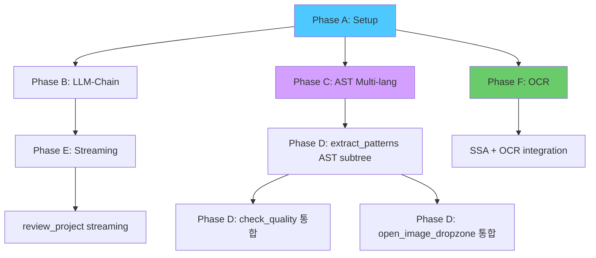

# VibeZoo SOTA 업그레이드 — Phase A~F 통합 설계서

> **작성일**: 2026-05-31  
> **대상 버전**: v0.13.0 → v0.14.0  
> **참조**: [`260531VibeZooReport.md`](../260531VibeZooReport.md) · [`major-refactor-plan.md`](major-refactor-plan.md) · [`mcp-tool-sota-upgrade.md`](mcp-tool-sota-upgrade.md)  
> **핵심 원칙**: 하위 호환성 100% 유지 · Python 표준 라이브러리 우선 · 선택적 의존성 graceful degradation · Windows 호환성 보장

---

## 목차

1. [개요 및 설계 원칙](#1-개요-및-설계-원칙)
2. [Phase A: Setup Tool — `vibezoo_setup`](#2-phase-a-setup-tool--vibezoo_setup)
3. [Phase B: LLM-도구 체인 + `tool_manifest`](#3-phase-b-llm-도구-체인--tool_manifest)
4. [Phase C: AST 멀티랭귀지 언어팩 로딩](#4-phase-c-ast-멀티랭귀지-언어팩-로딩)
5. [Phase D: 폐기/대체 통합](#5-phase-d-폐기대체-통합)
6. [Phase E: 점진적 스트리밍](#6-phase-e-점진적-스트리밍)
7. [Phase F: OCR 연동](#7-phase-f-ocr-연동)
8. [통합 구현 로드맵](#8-통합-구현-로드맵)
9. [위험 요소 및 대응](#9-위험-요소-및-대응)

---

## 1. 개요 및 설계 원칙

### 1.1 전체 아키텍처 컨텍스트

```mermaid
graph TD
    subgraph "Phase A: Setup"
        SETUP[vibezoo_setup] --> PIP[pip packages]
        SETUP --> SYS[system tools: rg, tesseract]
        SETUP --> MCP[.roo/mcp.json]
        SETUP --> ZOO[.zoo/config.json]
    end

    subgraph "Phase B: LLM-Tool Chain"
        TOOL[tool_manifest] --> CTX[ToolContext]
        CTX --> LLM[LLM analysis]
    end

    subgraph "Phase C: AST"
        AST[AstEngine._init_language] --> PY[tree-sitter-python]
        AST --> GO[tree-sitter-go]
        AST --> RS[tree-sitter-rust]
    end

    subgraph "Phase D: Deprecation"
        RP[review_project] -.->|absorbs| CQ[check_quality]
        CS[capture_screen] -.->|integrates| OID[open_image_dropzone]
        EP[extract_patterns] --> SUBTREE[AST subtree matching]
    end

    subgraph "Phase E: Streaming"
        GEN[generator pattern] --> RP2[review_project streaming]
        GEN --> SA[summarize_architecture streaming]
    end

    subgraph "Phase F: OCR"
        SSA[aggregate_spatial_pixels] --> TESS[Tesseract OCR]
        SSA --> PADDLE[PaddleOCR fallback]
        OCR_RESULT --> SSA_SUMMARY[enhanced SSA summary]
    end

    style SETUP fill:#4ec9ff
    style TOOL fill:#6acb6a
    style AST fill:#d4a0ff
    style SUBTREE fill:#ffd700
    style GEN fill:#ff6b6b
    style SSA fill:#4ec9ff
```



### 1.2 설계 원칙

| 원칙 | 설명 | 적용 |
|:---|:---|:---|
| **하위 호환성 100%** | 모든 기존 도구 시그니처 불변, 신규 파라미터는 기본값 | 전 Phase |
| **Python 표준 라이브러리 우선** | `importlib`, `subprocess`, `pathlib` 등 표준 모듈 우선 사용 | Phase A, C, F |
| **선택적 의존성 graceful degradation** | 미설치 의존성 감지 → 대체 경로 또는 명확한 설치 안내 | Phase A, C, F |
| **Windows 호환성 보장** | `Path` 기반 경로 처리, `os.name` 분기, PowerShell 폴백 | 전 Phase |
| **Crow Memory rule 연동** | `tool_manifest`가 Crow `life_context` 레지스터에 저장되어 LLM 시스템 프롬프트에 주입 | Phase B |

### 1.3 현재 코드베이스 기준

| 모듈 | 파일 | 현재 상태 |
|:---|:---|:---|
| 진입점 | [`mcp-servers/bridge/__init__.py`](../mcp-servers/bridge/__init__.py) | `register_all_tools(mcp)` — 11개 그룹 등록 |
| AST 엔진 | [`mcp-servers/bridge/ast_engine.py`](../mcp-servers/bridge/ast_engine.py) | `AstEngine` — TS/JS tree-sitter만 구현, Python/Go/Rust는 `NODE_TYPES` 정의만 있고 `_init_language()` 미구현 |
| SSA | [`mcp-servers/bridge/tools/ssa.py`](../mcp-servers/bridge/tools/ssa.py) | `aggregate_spatial_pixels()` + `open_image_dropzone()` — OCR 없음 |
| Whiteboard | [`mcp-servers/bridge/tools/whiteboard.py`](../mcp-servers/bridge/tools/whiteboard.py) | `capture_screen()` 3단계 fallback + `WhiteboardDataConverter` |
| Integrated | [`mcp-servers/bridge/tools/integrated.py`](../mcp-servers/bridge/tools/integrated.py) | `review_project()` 순차 동기 호출 |
| Base | [`mcp-servers/bridge/tools/_base.py`](../mcp-servers/bridge/tools/_base.py) | `BaseTool` — `partial_result()` placeholder |
| Config | [`mcp-servers/bridge/config.py`](../mcp-servers/bridge/config.py) | `VERSION = "0.13.0"`, `SOURCE_EXTS`, 경로 상수 |

---

## 2. Phase A: Setup Tool — `vibezoo_setup`

### 2.1 목표

한 번의 호출로 VibeZoo 운영에 필요한 모든 의존성을 설치하고, MCP 글로벌 설정 및 `.zoo/config.json`을 자동 구성한다.

### 2.2 설치 대상 매트릭스

#### 2.2.1 Python 패키지 (pip)

| 패키지 | 용도 | 필수 | 비고 |
|:---|:---|:---:|:---|
| `fastmcp` | MCP 서버 프레임워크 | ✅ | 핵심 의존성 |
| `tree-sitter` | AST 파서 코어 | ✅ | Phase C |
| `tree-sitter-python` | Python AST | ⚡ | 선택적 |
| `tree-sitter-go` | Go AST | ⚡ | 선택적 |
| `tree-sitter-rust` | Rust AST | ⚡ | 선택적 |
| `tree-sitter-languages` | 통합 언어팩 (fallback) | ⚡ | TS/JS 포함 |
| `opencv-contrib-python-headless` | SSA 이미지 분석 | ⚡ | `_CV2_AVAILABLE` |
| `numpy` | 수치 연산 | ⚡ | OpenCV 의존 |
| `Pillow` | 이미지 I/O, 스크린샷 | ⚡ | `capture_screen` |
| `pytesseract` | OCR (Tesseract 바인딩) | ⚡ | Phase F |
| `paddleocr` | OCR fallback (중국어/한글 강점) | ⚡ | Phase F |
| `mss` | 크로스플랫폼 스크린샷 | ⚡ | `capture_screen` fallback |
| `requests` | HTTP 클라이언트 (Crow) | ⚡ | `crow_client` |

#### 2.2.2 시스템 도구

| 도구 | 용도 | Windows 설치 방법 | Linux/macOS |
|:---|:---|:---|:---|
| `ripgrep` (rg) | 초고속 코드 검색 | `winget install BurntSushi.ripgrep.MSVC` 또는 `choco install ripgrep` | `apt install ripgrep` / `brew install ripgrep` |
| `tesseract` | OCR 엔진 | `winget install UB-Mannheim.TesseractOCR` 또는 GitHub 릴리스 | `apt install tesseract-ocr` / `brew install tesseract` |
| `git` | 버전 관리, git grep | 일반적으로 사전 설치 | `apt install git` / `brew install git` |

### 2.3 `vibezoo_setup` 도구 설계

**파일 위치**: [`mcp-servers/bridge/tools/setup.py`](../mcp-servers/bridge/tools/setup.py) (신규)

```python
# bridge/tools/setup.py — VibeZoo Setup Tool

@mcp.tool
def vibezoo_setup(
    target: str = "all",
    python_packages: Optional[str] = None,
    system_tools: Optional[str] = None,
    configure_mcp: bool = True,
    configure_zoo: bool = True,
    dry_run: bool = False,
) -> str:
    """
    VibeZoo 운영 환경을 한 번에 설정합니다.

    Args:
        target: 설치 대상 ("all" | "python" | "system" | "config")
        python_packages: 설치할 Python 패키지 (쉼표 구분, 생략 시 기본 세트)
        system_tools: 설치할 시스템 도구 (쉼표 구분, 생략 시 기본 세트)
        configure_mcp: .roo/mcp.json 글로벌 SSE MCP 설정 자동 구성 여부
        configure_zoo: .zoo/config.json 자동 구성 여부
        dry_run: 실제 설치 없이 계획만 출력

    Returns:
        설치 진행 상황 및 결과 보고서 (마크다운)
    """
```

#### 2.3.1 내부 아키텍처

```python
class SetupManager:
    """의존성 설치 및 설정 관리자"""

    def __init__(self, dry_run: bool = False):
        self._dry_run = dry_run
        self._results: list[dict] = []

    # ── 1. Python 패키지 설치 ──

    def install_python_packages(self, packages: list[str]) -> dict:
        """
        pip install 실행. 패키지별 개별 설치 → 실패해도 계속 진행.

        Returns:
            {
                "success": ["fastmcp", "tree-sitter", ...],
                "failed": [{"package": "paddleocr", "reason": "..."}],
                "skipped": ["tree-sitter-python"],  # 이미 설치됨
            }
        """
        import subprocess, importlib, sys

        for pkg in packages:
            # 이미 설치되어 있는지 확인
            try:
                importlib.import_module(pkg.replace("-", "_"))
                skipped.append(pkg)
                continue
            except ImportError:
                pass

            # pip install 실행
            cmd = [sys.executable, "-m", "pip", "install", pkg]
            if self._dry_run:
                self._results.append({"action": "pip_install", "package": pkg, "dry_run": True})
                continue

            result = subprocess.run(cmd, capture_output=True, text=True, timeout=120)
            if result.returncode == 0:
                success.append(pkg)
            else:
                failed.append({"package": pkg, "reason": result.stderr[:200]})

    # ── 2. 시스템 도구 설치 ──

    def install_system_tools(self, tools: list[str]) -> dict:
        """
        OS별 설치 명령어 실행.

        - Windows: winget → choco → 직접 다운로드 URL 안내
        - Linux: apt-get (Debian/Ubuntu) → 안내
        - macOS: brew → 안내
        """
        import platform, subprocess

        system = platform.system()

        for tool in tools:
            if self._check_tool_installed(tool):
                skipped.append(tool)
                continue

            if system == "Windows":
                self._install_windows_tool(tool)
            elif system == "Linux":
                self._install_linux_tool(tool)
            elif system == "Darwin":
                self._install_macos_tool(tool)

    def _check_tool_installed(self, tool: str) -> bool:
        """시스템 도구 설치 여부 확인 (PATH 검색)"""
        import shutil
        return shutil.which(tool) is not None

    def _install_windows_tool(self, tool: str):
        """Windows 도구 설치 — winget 우선, choco 차선, 수동 안내"""
        # winget 시도
        winget_map = {
            "rg": "BurntSushi.ripgrep.MSVC",
            "tesseract": "UB-Mannheim.TesseractOCR",
        }
        if tool in winget_map:
            if self._try_winget(winget_map[tool]):
                return

        # chocolatey 시도
        choco_map = {
            "rg": "ripgrep",
            "tesseract": "tesseract",
        }
        if tool in choco_map and shutil.which("choco"):
            subprocess.run(["choco", "install", choco_map[tool], "-y"])

        # 수동 설치 안내 (URL 제공)
        manual_urls = {
            "rg": "https://github.com/BurntSushi/ripgrep/releases",
            "tesseract": "https://github.com/UB-Mannheim/tesseract/wiki",
        }
        if tool in manual_urls:
            self._results.append({
                "action": "manual_install",
                "tool": tool,
                "url": manual_urls[tool],
                "note": "자동 설치 실패. 위 URL에서 수동 설치하세요."
            })

    # ── 3. MCP 설정 구성 ──

    def configure_mcp_global(self, port: int = 9027, server_name: str = "vibezoo") -> dict:
        """
        .roo/mcp.json 글로벌 SSE MCP 설정 생성/갱신.

        대상 경로 (우선순위):
        1. VS Code workspace/.roo/mcp.json
        2. ~/.roo/mcp.json (글로벌)
        3. 프로젝트 루트의 .roo/mcp.json

        생성되는 JSON 구조:
        {
            "mcpServers": {
                "vibezoo": {
                    "transport": "sse",
                    "url": "http://127.0.0.1:{port}/sse",
                    "description": "VibeZoo MCP Bridge — 35+ code analysis tools",
                    "autoStart": true,
                    "autoStartCommand": "python mcp-servers/vibezoo_mcp_bridge.py --port {port}"
                }
            }
        }
        """
        import json, os
        from pathlib import Path

        mcp_config = {
            "mcpServers": {
                server_name: {
                    "transport": "sse",
                    "url": f"http://127.0.0.1:{port}/sse",
                    "description": "VibeZoo MCP Bridge — 35+ code analysis tools with AST, SSA, OCR",
                    "autoStart": True,
                    "autoStartCommand": f"python mcp-servers/vibezoo_mcp_bridge.py --port {port}"
                }
            }
        }

        # 기존 설정 병합
        for candidate in self._get_mcp_config_paths():
            if candidate.exists():
                existing = json.loads(candidate.read_text())
                existing.setdefault("mcpServers", {})
                existing["mcpServers"][server_name] = mcp_config["mcpServers"][server_name]
                candidate.write_text(json.dumps(existing, indent=2, ensure_ascii=False))
                return {"status": "merged", "path": str(candidate)}

        # 신규 생성
        target = self._get_mcp_config_paths()[0]
        target.parent.mkdir(parents=True, exist_ok=True)
        target.write_text(json.dumps(mcp_config, indent=2, ensure_ascii=False))
        return {"status": "created", "path": str(target)}

    # ── 4. .zoo/config.json 구성 ──

    def configure_zoo(self) -> dict:
        """
        .zoo/config.json 생성/갱신.

        {
            "version": "0.14.0",
            "project": "VibeZoo",
            "mcp_port": 9027,
            "crow_url": "http://localhost:9020",
            "features": {
                "ast": {"enabled": true, "languages": ["python", "go", "rust", "typescript"]},
                "ocr": {"enabled": true, "engine": "tesseract"},
                "ssa": {"enabled": true, "detail": "auto"},
                "streaming": {"enabled": true, "chunk_size": 5000}
            }
        }
        """
```

#### 2.3.2 설치 진행 상황 출력 포맷

```markdown
# 🚀 VibeZoo Setup Report

## Python Packages
| Package | Status | Note |
|---------|--------|------|
| fastmcp | ✅ Installed | v2.0.0 |
| tree-sitter | ✅ Installed | v0.21.0 |
| tree-sitter-python | ⚡ Skipped | Already installed |
| paddleocr | ❌ Failed | No matching distribution |

## System Tools
| Tool | Status | Path |
|------|--------|------|
| rg (ripgrep) | ✅ Available | C:\Program Files\ripgrep\rg.exe |
| tesseract | ⚠️ Manual | https://github.com/UB-Mannheim/tesseract/wiki |
| git | ✅ Available | C:\Program Files\Git\bin\git.exe |

## MCP Configuration
- Status: ✅ Created
- Path: `C:\Users\...\.roo\mcp.json`
- Server: `vibezoo` → `http://127.0.0.1:9027/sse`

## Zoo Configuration
- Status: ✅ Created
- Path: `.zoo/config.json`

## Summary
- ✅ 8 packages installed
- ⚡ 3 packages skipped (already installed)
- ❌ 1 package failed
- ⚠️ 1 tool needs manual installation
```

### 2.4 `bridge/tools/__init__.py` 등록 확장

```python
# bridge/tools/__init__.py — setup 모듈 추가
from bridge.tools.setup import register as reg_setup

# register_all_tools() 내 호출 목록에 reg_setup 추가
# (setup은 항상 첫 번째로 등록)
```

---

## 3. Phase B: LLM-도구 체인 + `tool_manifest`

### 3.1 핵심 개념

```
┌─────────────┐     ┌──────────────────┐     ┌─────────────┐
│   MCP Tool  │────▶│   ToolContext    │────▶│    LLM      │
│ (데이터 수집) │     │ (구조화된 데이터)   │     │ (의미 분석)  │
└─────────────┘     └──────────────────┘     └─────────────┘
      │                      │                      │
      │ tool_manifest        │ Crow Memory          │ 최종 결과
      │ (LLM 지시서)          │ (rule 저장)           │ (고품질 출력)
      ▼                      ▼                      ▼
┌─────────────┐     ┌──────────────────┐     ┌─────────────┐
│ Crow Memory │     │ LLM System       │     │ MCP Response│
│ life_context│     │ Prompt [User Bias]│     │ (마크다운)   │
└─────────────┘     └──────────────────┘     └─────────────┘
```

### 3.2 `tool_manifest` JSON 스키마

각 도구가 자신의 `tool_manifest`를 포함하여 LLM이 도구의 역할과 한계를 정확히 이해하고 적절히 활용할 수 있게 한다.

```json
{
  "$schema": "https://vibezoo.dev/schemas/tool-manifest-v1.json",
  "tool_name": "explain_code",
  "version": "1.0.0",
  "category": "analysis",
  "role": "data_collector",
  "description": {
    "short": "지정된 라인의 코드 컨텍스트를 AST로 분석하여 구조화된 데이터를 수집",
    "what_it_does": [
      "tree-sitter AST로 해당 라인을 감싸는 함수/클래스/블록 식별",
      "함수 시그니처, 파라미터, 반환 타입 추출",
      "해당 심볼의 참조 위치 검색",
      "git blame으로 최근 수정자/커밋 메시지 조회",
      "관련 테스트 파일 검색"
    ],
    "what_it_does_not_do": [
      "코드의 의미나 의도를 스스로 판단하지 않음",
      "버그 여부를 판단하지 않음",
      "리팩토링 제안을 생성하지 않음"
    ]
  },
  "llm_instruction": {
    "role": "You are the semantic analyzer for explain_code results.",
    "input_format": "ToolContext with fields: language, symbol_info, enclosing_scope, references, git_blame, related_tests",
    "task": "Analyze the collected data and produce a natural language explanation of what this code does, why it exists, and how it fits into the broader codebase.",
    "output_format": "Markdown with sections: Summary, Context, Data Flow, Related Code, Caveats",
    "confidence": "Mark uncertain inferences with [추정] tag. Mark AST-confirmed facts without tag.",
    "examples": [
      {
        "input_summary": "Line 42 in src/auth.ts: function verifyJWT(token: string): User | null",
        "output_excerpt": "### Summary\n이 함수는 JWT 토큰을 검증하는 미들웨어입니다..."
      }
    ]
  },
  "crow_memory_rules": [
    {
      "register": "life_context",
      "key": "explain_code_pipeline",
      "value": "explain_code 도구가 수집한 데이터를 분석할 때는: 1) AST 컨텍스트(함수/클래스) 먼저 확인, 2) git blame으로 최근 변경 의도 파악, 3) 관련 테스트로 예상 동작 검증, 4) [추정] 태그로 불확실한 부분 표시"
    }
  ],
  "tool_context_schema": {
    "language": "string (detected programming language)",
    "symbol_info": {
      "name": "string",
      "kind": "function | class | method | variable | interface | type_alias | unknown",
      "signature": "string (full function/class signature)",
      "line_range": [1, 42]
    },
    "enclosing_scope": {
      "type": "module | class | function | block",
      "name": "string",
      "line_range": [1, 100]
    },
    "references": [
      {"file": "string", "line": 1, "type": "call | read | write | import"}
    ],
    "git_blame": {
      "author": "string",
      "date": "2026-05-15",
      "commit_message": "string",
      "commit_hash": "abc123"
    },
    "related_tests": [
      {"file": "string", "test_name": "string", "line": 1}
    ]
  }
}
```

### 3.3 `ToolContext` 클래스

**파일 위치**: [`mcp-servers/bridge/tool_context.py`](../mcp-servers/bridge/tool_context.py) (신규)

```python
# bridge/tool_context.py — LLM-도구 체인 데이터 전달 구조

from dataclasses import dataclass, field, asdict
from typing import Optional, Any
import json


@dataclass
class ToolContext:
    """
    도구가 수집한 데이터를 LLM에 전달하는 표준화된 컨테이너.

    각 도구는 자신의 tool_manifest에 정의된 tool_context_schema에
    맞춰 ToolContext를 채운 후, 결과 문자열에 포함하여 반환한다.

    LLM은 이 구조화된 데이터를 기반으로 의미 분석/판단을 수행한다.
    """

    tool_name: str
    tool_version: str = "1.0.0"
    category: str = "analysis"

    # 핵심 수집 데이터
    language: str = ""
    data: dict[str, Any] = field(default_factory=dict)

    # 메타데이터
    collection_timestamp: str = ""
    source_files: list[str] = field(default_factory=list)
    confidence: str = "high"  # high | medium | low

    # LLM 지시 컨텍스트
    llm_instruction: str = ""  # tool_manifest에서 복사된 지시 텍스트
    suggested_analysis_steps: list[str] = field(default_factory=list)

    def to_markdown(self) -> str:
        """LLM이 이해하기 쉬운 마크다운 형식으로 직렬화"""
        lines = []
        lines.append(f"## ToolContext: `{self.tool_name}` v{self.tool_version}")
        lines.append(f"- **Language**: {self.language}")
        lines.append(f"- **Confidence**: {self.confidence}")
        lines.append(f"- **Source files**: {', '.join(self.source_files[:10])}")

        if self.llm_instruction:
            lines.append(f"\n### LLM Instruction\n{self.llm_instruction}")

        if self.suggested_analysis_steps:
            lines.append("\n### Suggested Analysis Steps")
            for i, step in enumerate(self.suggested_analysis_steps, 1):
                lines.append(f"{i}. {step}")

        if self.data:
            lines.append("\n### Collected Data")
            lines.append("```json")
            lines.append(json.dumps(self.data, indent=2, ensure_ascii=False, default=str))
            lines.append("```")

        return "\n".join(lines)

    def to_crow_rule(self, register: str = "life_context") -> dict:
        """Crow Memory rule 형식으로 변환"""
        return {
            "key": f"{self.tool_name}_context",
            "value": json.dumps({
                "tool": self.tool_name,
                "language": self.language,
                "instruction": self.llm_instruction,
                "steps": self.suggested_analysis_steps,
            }, ensure_ascii=False),
            "register": register,
        }


# ── 도구별 ToolContext 팩토리 ──

def make_explain_code_context(
    file_path: str,
    line_number: int,
    language: str,
    symbol_info: dict,
    enclosing_scope: dict,
    references: list[dict],
    git_blame: Optional[dict] = None,
    related_tests: Optional[list[dict]] = None,
) -> ToolContext:
    """explain_code 도구용 ToolContext 생성"""
    ctx = ToolContext(
        tool_name="explain_code",
        category="analysis",
        language=language,
        data={
            "file_path": file_path,
            "line_number": line_number,
            "symbol_info": symbol_info,
            "enclosing_scope": enclosing_scope,
            "references": references,
            "git_blame": git_blame or {},
            "related_tests": related_tests or [],
        },
        source_files=[file_path] + [r["file"] for r in references],
        suggested_analysis_steps=[
            "1. Identify what the code does based on symbol name and signature",
            "2. Explain the enclosing scope context (class/module role)",
            "3. Trace data flow through references (where inputs come from, where outputs go)",
            "4. Check git blame for recent change intent",
            "5. Verify expected behavior against related tests",
            "6. Mark uncertain inferences with [추정] tag",
        ],
        llm_instruction=(
            "You are the semantic analyzer for explain_code. "
            "Analyze the collected AST data, git blame, and references. "
            "Produce a natural language explanation with: Summary, Context, "
            "Data Flow, Related Code, and Caveats sections. "
            "Mark uncertain inferences with [추정] tag."
        ),
    )
    return ctx


def make_generate_tests_context(
    source_path: str,
    language: str,
    functions: list[dict],
    imports: list[dict],
    existing_tests: list[dict],
) -> ToolContext:
    """generate_tests 도구용 ToolContext 생성"""
    ctx = ToolContext(
        tool_name="generate_tests",
        category="tester",
        language=language,
        data={
            "source_path": source_path,
            "functions": functions,
            "imports": imports,
            "existing_tests": existing_tests,
        },
        source_files=[source_path],
        suggested_analysis_steps=[
            "1. For each function, identify input types and edge cases",
            "2. Generate test cases for: normal operation, boundary values, null/undefined, error conditions",
            "3. If async functions, include timing/delay scenarios",
            "4. Generate mock/stub templates for external dependencies",
            "5. Check existing tests to avoid duplication",
        ],
        llm_instruction=(
            "You are the test generator for generate_tests. "
            "Given function signatures and types, produce concrete, runnable test cases. "
            "Include: happy path, edge cases (null, empty, boundary), error paths, "
            "and mock templates. Use the project's test framework (jest/pytest/go test)."
        ),
    )
    return ctx


def make_find_bugs_context(
    target_path: str,
    suspicious_patterns: list[dict],
    crow_past_bugs: list[dict],
    code_metrics: dict,
) -> ToolContext:
    """find_bugs 도구용 ToolContext 생성"""
    ctx = ToolContext(
        tool_name="find_bugs",
        category="integrated",
        language="mixed",
        data={
            "target_path": target_path,
            "suspicious_patterns": suspicious_patterns,
            "past_bugs_from_crow": crow_past_bugs,
            "code_metrics": code_metrics,
        },
        suggested_analysis_steps=[
            "1. Classify each suspicious pattern by severity (P0: crash risk, P1: logic bug, P2: code smell)",
            "2. Cross-reference with Crow past bug patterns for similar issues",
            "3. For each bug, provide: location, probable cause, suggested fix, impact estimate",
            "4. Prioritize by: severity × occurrence frequency × file importance",
        ],
        llm_instruction=(
            "You are the bug analyzer for find_bugs. "
            "Classify and prioritize potential bugs found by static analysis. "
            "Use Crow Memory past patterns to identify recurring issues. "
            "For each bug, explain WHY it is likely a bug, not just WHERE it is."
        ),
    )
    return ctx


def make_suggest_refactor_context(
    target_path: str,
    dependency_map: dict,
    pattern_duplications: list[dict],
    call_graph: dict,
    crow_style_rules: list[dict],
) -> ToolContext:
    """suggest_refactor 도구용 ToolContext 생성"""
    ctx = ToolContext(
        tool_name="suggest_refactor",
        category="integrated",
        language="mixed",
        data={
            "target_path": target_path,
            "dependency_map": dependency_map,
            "pattern_duplications": pattern_duplications,
            "call_graph": call_graph,
            "crow_style_rules": crow_style_rules,
        },
        suggested_analysis_steps=[
            "1. Identify files with excessive dependencies (hub modules)",
            "2. Detect circular dependencies and propose break strategies",
            "3. Find duplicated code patterns and suggest extraction",
            "4. Analyze call graph for God functions (high fan-out) and dead code (zero fan-in)",
            "5. For each suggestion, provide: before/after code example, impact estimate, migration steps",
        ],
        llm_instruction=(
            "You are the refactoring advisor for suggest_refactor. "
            "Analyze dependency maps, patterns, and call graphs to produce "
            "concrete, actionable refactoring suggestions. Each suggestion must include: "
            "specific file:line references, before/after code examples, "
            "estimated impact, and step-by-step migration guide."
        ),
    )
    return ctx
```

### 3.4 LLM-도구 체인 파이프라인

```python
# bridge/llm_pipeline.py (신규)

class LLMToolPipeline:
    """
    데이터 수집(도구) → LLM 분석 → 결과 취합 파이프라인.

    사용 패턴:
    1. 도구 호출 → ToolContext 생성 (구조화된 데이터 수집)
    2. ToolContext를 마크다운으로 변환하여 LLM에 전달
    3. LLM이 의미 분석/판단 수행
    4. 최종 결과를 Crow Memory에 저장 (재사용)
    """

    @staticmethod
    def prepare_for_llm(tool_name: str, context: ToolContext) -> str:
        """
        도구 수집 데이터를 LLM이 처리할 수 있는 형태로 변환.

        Returns:
            LLM 프롬프트에 포함될 마크다운 문자열
        """
        manifest = _load_manifest(tool_name)
        parts = []

        # 1. tool_manifest의 LLM 지시서
        if manifest and "llm_instruction" in manifest:
            parts.append(f"## Tool: {tool_name}\n")
            parts.append(f"### LLM Role\n{manifest['llm_instruction']['role']}\n")
            parts.append(f"### Task\n{manifest['llm_instruction']['task']}\n")
            parts.append(f"### Output Format\n{manifest['llm_instruction']['output_format']}\n")

        # 2. ToolContext 데이터
        parts.append(context.to_markdown())

        return "\n\n".join(parts)

    @staticmethod
    def ingest_result_to_crow(tool_name: str, context: ToolContext,
                               llm_result: str, polarity: float = 0.5):
        """
        LLM 분석 결과를 Crow Memory에 저장하여 향후 유사 요청 시 참조.
        """
        from bridge.crow_client import try_crow_ingest
        import json

        payload = {
            "tool": tool_name,
            "context_summary": json.dumps(context.data, default=str)[:500],
            "llm_result_summary": llm_result[:1000],
            "timestamp": time.time(),
        }
        try_crow_ingest(
            json.dumps(payload, ensure_ascii=False),
            register="arch",
        )
```

### 3.5 우선 적용 도구

Phase B는 다음 4개 도구에 우선 적용:

| 도구 | ToolContext | LLM 역할 | 기대 효과 |
|:---|:---|:---|:---|
| [`generate_tests`](../mcp-servers/bridge/tools/tester.py) | 함수 시그니처 + 타입 + 기존 테스트 | 실제 테스트 로직 생성, 경계값/에지케이스 자동 생성 | 빈 템플릿 → 실행 가능한 테스트 |
| [`explain_code`](../mcp-servers/bridge/tools/analysis.py) | AST 컨텍스트 + git blame + 참조 | 자연어 의미 설명, 데이터 흐름 추적, 의도 추론 | "이 라인은 import입니다" → "JWT 검증 미들웨어입니다" |
| [`find_bugs`](../mcp-servers/bridge/tools/integrated.py) | 의심 패턴 + Crow 과거 버그 + 코드 메트릭 | 버그 심각도 분류, 근본 원인 분석, 수정 제안 | "console.log 발견" → "P0: null pointer 가능성" |
| [`suggest_refactor`](../mcp-servers/bridge/tools/integrated.py) | 의존성 맵 + 중복 패턴 + 호출 그래프 | 구체적 리팩토링 액션, Before/After 코드, 영향도 | "파일이 큽니다" → "handleAuth()에서 JWT 검증을 validateToken()으로 추출" |

---

## 4. Phase C: AST 멀티랭귀지 언어팩 로딩

### 4.1 현재 상태 진단

[`AstEngine`](../mcp-servers/bridge/ast_engine.py) (390줄):
- `_init_legacy_tree_sitter()` — TS/JS 전용, `tree-sitter-languages` 또는 개별 언어팩(`tree-sitter-typescript` 등) 사용
- `LANGUAGES` 딕셔너리는 `.py`, `.go`, `.rs`를 정의했지만 실제 파서 초기화 없음
- `NODE_TYPES`에 Python/Go/Rust 노드 타입 매핑 정의됨 (구조 준비 완료)
- `parse()`, `extract_calls()`, `extract_imports()`, `extract_fields()` 모두 TS/JS만 처리

### 4.2 `_init_language()` 실제 구현

```python
# bridge/ast_engine.py — 확장

class AstEngine:
    """
    멀티랭귀지 tree-sitter AST 파서.
    tree-sitter 미설치 시 regex 폴백 (기존 동작 유지).
    """

    # 언어별 Python 패키지명
    _LANG_PACKAGES = {
        'python':     ('tree_sitter_python', 'language'),
        'go':         ('tree_sitter_go', 'language'),       # tree-sitter-go (PyPI)
        'rust':       ('tree_sitter_rust', 'language'),      # tree-sitter-rust (PyPI)
        'typescript': ('tree_sitter_typescript', 'language'),
        'javascript': ('tree_sitter_javascript', 'language'),
    }

    def __init__(self):
        self._parsers: dict[str, object] = {}       # 언어별 Parser 인스턴스
        self._languages: dict[str, object] = {}     # 언어별 Language 객체
        self._initialized: set[str] = set()         # 초기화 완료된 언어
        self._init_errors: dict[str, str] = {}      # 초기화 실패 사유
        self._thread_lock = threading.Lock()

        # 하위 호환: 레거시 TS/JS 파서
        self._legacy_ts_parser = None
        self._legacy_ts_lang = None
        self._legacy_available = False

    # ── 멀티랭귀지 초기화 ──

    def _init_language(self, lang_name: str) -> bool:
        """
        특정 언어의 tree-sitter 파서 지연 초기화.

        Args:
            lang_name: 'python' | 'go' | 'rust' | 'typescript' | 'javascript'

        Returns:
            초기화 성공 여부

        로딩 전략 (우선순위):
        1. tree-sitter-languages 통합 패키지 (get_language)
        2. tree-sitter-{lang} 개별 패키지 (language())
        3. 실패 → regex 폴백, _init_errors에 사유 기록
        """
        if lang_name in self._initialized:
            return lang_name in self._languages

        with self._thread_lock:
            if lang_name in self._initialized:
                return lang_name in self._languages

            self._initialized.add(lang_name)

            try:
                import tree_sitter

                # 전략 1: tree-sitter-languages 통합 패키지
                try:
                    from tree_sitter_languages import get_language
                    lang_obj = get_language(lang_name)
                    parser = tree_sitter.Parser()
                    parser.set_language(lang_obj)
                    self._languages[lang_name] = lang_obj
                    self._parsers[lang_name] = parser
                    return True
                except (ImportError, Exception) as e1:
                    pass  # 전략 2로 진행

                # 전략 2: tree-sitter-{lang} 개별 패키지
                if lang_name in self._LANG_PACKAGES:
                    pkg_name, attr_name = self._LANG_PACKAGES[lang_name]
                    try:
                        mod = __import__(pkg_name, fromlist=[attr_name])
                        lang_fn = getattr(mod, attr_name)
                        lang_obj = lang_fn()  # language() 호출
                        parser = tree_sitter.Parser()
                        parser.set_language(lang_obj)
                        self._languages[lang_name] = lang_obj
                        self._parsers[lang_name] = parser
                        return True
                    except (ImportError, Exception) as e2:
                        self._init_errors[lang_name] = (
                            f"tree-sitter-{lang_name} not installed. "
                            f"Install: pip install tree-sitter-{lang_name}"
                        )

            except ImportError:
                self._init_errors[lang_name] = (
                    "tree-sitter core not installed. "
                    "Install: pip install tree-sitter"
                )
            except Exception as e:
                self._init_errors[lang_name] = f"Unexpected error: {e}"

            return False

    def _get_lang_name(self, file_ext: str) -> Optional[str]:
        """파일 확장자 → 언어명"""
        return self.LANGUAGES.get(file_ext)

    def _ensure_language(self, lang_name: str) -> bool:
        """언어 파서가 초기화되었는지 확인, 필요시 초기화"""
        if lang_name in self._languages:
            return True
        return self._init_language(lang_name)

    # ── 통합 parse() — 멀티랭귀지 ──

    def parse(self, content: str, file_ext: str) -> dict:
        """
        파일 전체 파싱 → 구조적 정보 반환 (멀티랭귀지).

        TS/JS 외 언어에서도 AST 우선 시도, 실패 시 regex 폴백.
        """
        lang_name = self._get_lang_name(file_ext)
        if not lang_name:
            return {}

        # 하위 호환: TS/JS는 레거시 파서 우선
        if file_ext in TS_JS_EXTS:
            return self._parse_legacy(content, file_ext)

        # 신규 언어: _init_language() 시도
        if not self._ensure_language(lang_name):
            return {}  # regex 폴백은 extract_*() 함수에서 처리

        try:
            parser = self._parsers[lang_name]
            tree = parser.parse(bytes(content, "utf-8"))
            root = tree.root_node

            functions = []
            classes = []
            calls = []

            # 노드 타입 매핑 가져오기
            node_types = self.NODE_TYPES.get(lang_name, {})
            func_types = set(node_types.get('function', []))
            class_types = set(node_types.get('class', []))
            struct_types = set(node_types.get('struct', []))
            call_types = set(node_types.get('call', []))

            def walk(node, depth=0):
                if depth > 50:
                    return
                node_type = node.type

                # 함수/메서드 추출
                if node_type in func_types:
                    name_node = node.child_by_field_name("name")
                    if name_node:
                        start = node.start_point
                        end = node.end_point
                        fn_name = content[name_node.start_byte:name_node.end_byte]
                        # 파라미터 추출 시도
                        params_node = node.child_by_field_name("parameters")
                        params = ""
                        if params_node:
                            params = content[params_node.start_byte:params_node.end_byte]
                        functions.append({
                            "name": fn_name,
                            "line": start[0] + 1,
                            "end_line": end[0] + 1,
                            "type": node_type,
                            "params": params,
                        })

                # 클래스/구조체 추출
                elif node_type in class_types or node_type in struct_types:
                    name_node = node.child_by_field_name("name")
                    if name_node:
                        start = node.start_point
                        end = node.end_point
                        classes.append({
                            "name": content[name_node.start_byte:name_node.end_byte],
                            "line": start[0] + 1,
                            "end_line": end[0] + 1,
                            "type": node_type,
                        })

                # 호출 추출
                elif node_type in call_types:
                    func_node = node.child_by_field_name("function")
                    if func_node:
                        call_name = content[func_node.start_byte:func_node.end_byte]
                        calls.append({
                            "name": call_name,
                            "line": node.start_point[0] + 1,
                        })

                for child in node.children:
                    walk(child, depth + 1)

            walk(root)
            return {
                "functions": functions,
                "classes": classes,
                "calls": calls,
            }
        except Exception:
            return {}

    # ── 확장된 extract_calls (멀티랭귀지) ──

    def extract_calls(self, content: str, file_ext: str) -> list:
        """함수 호출 노드 추출 — 멀티랭귀지 AST + regex 폴백"""
        # TS/JS → 레거시
        if file_ext in TS_JS_EXTS:
            if self._init_legacy_tree_sitter():
                return self._extract_calls_legacy(content, file_ext)

        # 신규 언어 → 통합 parse()
        ast = self.parse(content, file_ext)
        if ast.get("calls"):
            return ast["calls"]

        # Regex 폴백 (기존 동작 유지)
        return self._extract_calls_regex(content, file_ext)

    def _extract_calls_regex(self, content: str, file_ext: str) -> list:
        """Regex 기반 함수 호출 추출 (범용 폴백)"""
        calls = []
        patterns = {
            '.py': r'\b(\w+)\s*\(',
            '.go': r'\b(\w+)\s*\(',
            '.rs': r'\b(\w+)\s*[!(]',
            '.ts': r'\b(\w+)\s*\(',
            '.js': r'\b(\w+)\s*\(',
        }
        pattern = patterns.get(file_ext, r'\b(\w+)\s*\(')
        for i, line in enumerate(content.split('\n'), 1):
            for m in re.finditer(pattern, line):
                name = m.group(1)
                if name not in ('if', 'for', 'while', 'switch', 'return', 'import', 'from',
                                'def', 'class', 'func', 'fn', 'let', 'const', 'var', 'pub'):
                    calls.append({"name": name, "line": i})
        return calls

    # ── is_available() 확장 ──

    def is_available(self, lang: str = None) -> bool:
        """특정 언어(또는 전체) AST 지원 여부"""
        if lang is None:
            return self._legacy_available or len(self._languages) > 0
        if lang in ('typescript', 'javascript'):
            return self._legacy_available
        return lang in self._languages

    # ── 오류 정보 제공 ──

    def get_init_errors(self) -> dict:
        """언어별 초기화 실패 사유 반환"""
        return dict(self._init_errors)
```

### 4.3 언어별 AST 노드 타입 매핑 (기존 `NODE_TYPES` 활용)

기존 [`ast_engine.py`](../mcp-servers/bridge/ast_engine.py:27-53)의 `NODE_TYPES` 딕셔너리를 그대로 사용. 이미 Python/Go/Rust에 대한 매핑이 정의되어 있음:

| 언어 | function | class/struct | import | call |
|:---|:---|:---|:---|:---|
| Python | `function_definition` | `class_definition` | `import_statement`, `import_from_statement` | `call` |
| Go | `function_declaration`, `method_declaration` | `type_declaration` | `import_declaration` | `call_expression` |
| Rust | `function_item` | `struct_item`, `enum_item` | `use_declaration` | `call_expression` |

### 4.4 설치 안내 통합

`_init_language()` 실패 시 반환되는 오류 메시지에 패키지 설치 명령어 포함:

```python
# 예: Python 언어팩 미설치 시
{
    "python": "tree-sitter-python not installed. Install: pip install tree-sitter-python"
}
```

이 메시지는 Phase A의 `vibezoo_setup`에서 자동 설치 가능한 대상으로도 활용된다.

---

## 5. Phase D: 폐기/대체 통합

### 5.1 개요

| 대상 | 처리 방식 | 근거 |
|:---|:---|:---|
| `check_quality()` | `review_project()`에 **진정한 통합** (어댑터 제거) | `review_project`가 이미 상위집합, 별도 도구 유지 불필요 |
| `open_image_dropzone()` | `capture_screen()`에 **완전 통합** (Webview 내장 드롭존) | 외부 브라우저 열기는 "VS Code Lock-In" 위배 |
| `extract_patterns()` | AST 서브트리 매칭으로 **내부 재구현** (도구 시그니처 유지) | 폐기 대신 성능 개선, 다른 도구에서 내부 호출 |

**핵심 원칙**: 도구 시그니처는 유지하되, 내부 구현을 업그레이드된 도구로 위임하는 **어댑터 패턴** 적용. MCP 도구 목록에서 사라지지 않으므로 기존 LLM 워크플로우 영향 없음.

### 5.2 `check_quality()` → `review_project()` 완전 통합

```python
# bridge/tools/reviewer.py — check_quality() 변경

@mcp.tool
def check_quality(target_path: Optional[str] = None) -> str:
    """
    프로젝트 품질 검사 — review_project에 완전 통합됨.

    이 도구는 하위 호환성을 위해 유지되며, 내부적으로
    review_project(mode="quality")를 호출합니다.
    """
    from bridge.tools.integrated import _review_project_core

    target = target_path or str(Path.cwd())
    return _review_project_core(target, mode="quality")


# bridge/tools/integrated.py — review_project 확장

def _review_project_core(target_path: str, mode: str = "full") -> str:
    """
    review_project 코어 — mode에 따라 실행 단계 조정.

    mode="quality": 코드 품질 메트릭 중심 (기존 check_quality 대체)
    mode="full": 전체 분석 (기존 review_project)
    """
    sections = []
    sections.append(_markdown_header("Project Review Report"))
    sections.append(f"> Target: `{target_path}` | Mode: `{mode}`\n")

    # ── 공통: 코드 검색 (TODO/FIXME/HACK/BUG) ──
    if mode in ("full", "quick"):
        sections.append("## 🔍 Code Search\n")
        # ... 기존 search_codebase 로직 ...

    # ── 공통: 코드 리뷰 ──
    if mode in ("full", "quality"):
        sections.append("## 📝 Code Review\n")
        # ... 기존 review_code 로직 (품질 메트릭 포함) ...

    # ── mode="quality" 전용: 품질 메트릭 ──
    if mode == "quality":
        sections.append("## 📊 Quality Metrics\n")
        sections.append(_compute_quality_metrics(target_path))
        # - 파일 수, 총 라인 수, 함수/클래스 수
        # - 주석 밀도 (주석 라인 / 총 라인)
        # - TODO/FIXME 밀도
        # - Cyclomatic complexity (AST 기반 분기문 카운팅)
        # - 품질 등급 (A~F)

    # ── mode="full" 전용: 패턴 분석 ──
    if mode == "full":
        sections.append("## 📊 Pattern Analysis\n")
        # ... 기존 extract_patterns 로직 ...

    return "\n\n---\n\n".join(sections)


def _compute_quality_metrics(target_path: str) -> str:
    """코드 품질 메트릭 계산 (기존 check_quality 통합)"""
    root = Path(target_path)
    total_files = 0
    total_lines = 0
    total_comment_lines = 0
    total_todo = 0
    total_fixme = 0
    complexity_scores = []

    for p in _iter_project_files_cached(root, SOURCE_EXTS, DEFAULT_EXCLUDE_DIRS):
        content = _read_file_content(p)
        if not content:
            continue
        total_files += 1
        lines = content.split('\n')
        total_lines += len(lines)

        for line in lines:
            stripped = line.strip()
            if stripped.startswith('#') or stripped.startswith('//') or stripped.startswith('/*'):
                total_comment_lines += 1
            if 'TODO' in stripped:
                total_todo += 1
            if 'FIXME' in stripped:
                total_fixme += 1

        # Cyclomatic complexity (간단 추정: if/for/while/except/case 수)
        branch_count = sum(1 for l in lines
                          if re.search(r'\b(if|elif|for|while|except|case)\b', l))
        complexity_scores.append(branch_count)

    if total_files == 0:
        return "- No source files found.\n"

    comment_density = total_comment_lines / max(total_lines, 1) * 100
    avg_complexity = sum(complexity_scores) / max(len(complexity_scores), 1)
    todo_density = total_todo / max(total_files, 1)

    # 등급 산정
    if comment_density > 20 and avg_complexity < 10 and todo_density < 1:
        grade = "A"
    elif comment_density > 10 and avg_complexity < 20 and todo_density < 3:
        grade = "B"
    elif comment_density > 5 and avg_complexity < 30:
        grade = "C"
    elif avg_complexity < 50:
        grade = "D"
    else:
        grade = "F"

    lines = []
    lines.append(f"| Metric | Value |")
    lines.append(f"|--------|-------|")
    lines.append(f"| Files | {total_files} |")
    lines.append(f"| Total Lines | {total_lines} |")
    lines.append(f"| Comment Density | {comment_density:.1f}% |")
    lines.append(f"| Avg. Cyclomatic Complexity | {avg_complexity:.1f} |")
    lines.append(f"| TODO Count | {total_todo} |")
    lines.append(f"| FIXME Count | {total_fixme} |")
    lines.append(f"| **Quality Grade** | **{grade}** |")
    return "\n".join(lines) + "\n"
```

### 5.3 `open_image_dropzone()` → `capture_screen()` 통합

```python
# bridge/tools/whiteboard.py — capture_screen() 확장

@mcp.tool
def capture_screen(source: str = "screen") -> str:
    """
    화면 캡처 + 이미지 업로드를 통합.

    Args:
        source: "screen" (기본, 화면 캡처) | "dropzone" (드롭존 열기)

    - screen: 현재 화면을 캡처하여 화이트보드에 표시
    - dropzone: VS Code Webview 드롭존을 열어 이미지 업로드
    """
    if source == "dropzone":
        return _open_dropzone_in_webview()

    # 기존 capture_screen 로직 (3단계 fallback)
    return _capture_screen_impl()


def _open_dropzone_in_webview() -> str:
    """VS Code Webview 내장 드롭존 열기 (open_image_dropzone 통합)"""
    from base64 import b64encode

    html_b64 = b64encode(_DROPZONE_HTML.encode('utf-8')).decode('utf-8')
    data = {
        "action": "open_dropzone",
        "html_b64": html_b64,
        "title": "VibeZoo Image Drop Zone",
        "timestamp": time.time(),
    }
    _atomic_write_json(WHITEBOARD_ACTION_FILE, data, indent=2)

    return (_markdown_header("Image Drop Zone", "📸")
            + "Drop zone opened in VS Code Webview.\n\n"
            + "1. Drag & drop an image into the Webview\n"
            + "2. Image will be saved to `~/.vibezoo-cache/dropped_image.png`\n"
            + "3. Then call `aggregate_spatial_pixels(image_path='...')` to analyze\n\n"
            + "💡 **Tip**: Use `capture_screen()` (without arguments) to capture your screen directly.\n"
            + _markdown_footer())


# bridge/tools/ssa.py — open_image_dropzone() → 어댑터

@mcp.tool
def open_image_dropzone() -> str:
    """
    (Deprecated) 이미지 드롭존 열기 — capture_screen에 통합됨.

    내부적으로 capture_screen(source="dropzone") 호출로 위임.
    하위 호환성을 위해 유지됩니다.
    """
    from bridge.tools.whiteboard import capture_screen
    return capture_screen(source="dropzone")
```

### 5.4 `extract_patterns()` → AST 서브트리 매칭 재구현

```python
# bridge/tools/deep_analyzer.py — extract_patterns() 재구현

# AST 서브트리 매칭 패턴 라이브러리
_PATTERN_TEMPLATES = {
    # 언어 중립 패턴 (모든 언어에 적용 가능한 AST 구조)
    "try_catch": {
        "description": "try-catch / try-except error handling",
        "languages": ["typescript", "python", "go", "rust"],
        "node_types": {
            "typescript": ["try_statement"],
            "python": ["try_statement"],
            "go": [],  # Go는 error return 패턴
            "rust": [],  # Rust는 Result 타입
        },
        "is_antipattern": False,
    },
    "callback_hell": {
        "description": "Nested callbacks (3+ depth) — antipattern",
        "languages": ["typescript", "python"],
        "detection": "nested_callback_depth",  # AST 깊이 분석
        "is_antipattern": True,
    },
    "god_class": {
        "description": "Class with excessive methods (>20) — antipattern",
        "languages": ["typescript", "python", "rust"],
        "detection": "method_count_threshold",
        "threshold": 20,
        "is_antipattern": True,
    },
    "long_method": {
        "description": "Method exceeding 50 lines — code smell",
        "languages": ["typescript", "python", "go", "rust"],
        "detection": "line_count_threshold",
        "threshold": 50,
        "is_antipattern": True,
    },
    "async_await": {
        "description": "async/await usage pattern",
        "languages": ["typescript", "python", "rust"],
        "node_types": {
            "typescript": ["await_expression"],
            "python": ["await"],
            "rust": ["await_expression"],
        },
        "is_antipattern": False,
    },
    "dependency_injection": {
        "description": "Constructor/property injection pattern",
        "languages": ["typescript", "python"],
        "detection": "constructor_param_usage",
        "is_antipattern": False,
    },
}


def _extract_patterns_ast(target_path: str, min_occurrences: int = 3) -> str:
    """
    AST 서브트리 매칭으로 구조적 패턴 탐지.

    기존 키워드 카운팅(content.count("async ")) → tree-sitter AST 노드 타입 매칭.
    """
    ast_engine = AstEngine()
    root = Path(target_path)
    results = defaultdict(lambda: {"count": 0, "files": [], "examples": []})

    for p in _iter_project_files_cached(root, SOURCE_EXTS, DEFAULT_EXCLUDE_DIRS):
        ext = p.suffix
        lang = ast_engine._get_lang_name(ext)
        if not lang:
            continue

        content = _read_file_content(p)
        if not content:
            continue

        # AST 파싱 (지원 언어만)
        if ast_engine._ensure_language(lang) or ext in TS_JS_EXTS:
            ast = ast_engine.parse(content, ext)
        else:
            ast = {}

        for pattern_name, template in _PATTERN_TEMPLATES.items():
            if lang not in template.get("languages", []):
                continue

            matched = False
            example = ""

            # AST 노드 타입 매칭
            if "node_types" in template:
                target_types = template["node_types"].get(lang, [])
                if ast.get("functions"):
                    # AST 결과에서 노드 타입 검사
                    for func in ast.get("functions", []):
                        if func.get("type") in target_types:
                            matched = True
                            example = f"{p}:{func['line']} — {func['name']}"
                            break

            # 깊이/개수 기반 탐지
            elif "detection" in template:
                det = template["detection"]
                if det == "nested_callback_depth":
                    depth = _compute_callback_depth(content, lang)
                    if depth >= 3:
                        matched = True
                        example = f"{p}: max callback depth = {depth}"
                elif det == "method_count_threshold":
                    threshold = template.get("threshold", 20)
                    class_methods = _count_methods_per_class(ast)
                    for cls_name, count in class_methods.items():
                        if count >= threshold:
                            matched = True
                            example = f"{p}: {cls_name} has {count} methods (threshold: {threshold})"
                            break
                elif det == "line_count_threshold":
                    threshold = template.get("threshold", 50)
                    for func in ast.get("functions", []):
                        fn_lines = func.get("end_line", 0) - func.get("line", 0)
                        if fn_lines >= threshold:
                            matched = True
                            example = f"{p}:{func['line']} — {func['name']} ({fn_lines} lines)"
                            break

            if matched:
                results[pattern_name]["count"] += 1
                if str(p) not in results[pattern_name]["files"]:
                    results[pattern_name]["files"].append(str(p))
                if len(results[pattern_name]["examples"]) < 3:
                    results[pattern_name]["examples"].append(example)

    # 결과 포맷팅
    lines = []
    lines.append("## Pattern Analysis (AST Subtree Matching)\n")

    for pattern_name, data in sorted(results.items(), key=lambda x: -x[1]["count"]):
        if data["count"] < min_occurrences:
            continue
        template = _PATTERN_TEMPLATES[pattern_name]
        tag = "⚠️ ANTIPATTERN" if template.get("is_antipattern") else "📊 PATTERN"
        lines.append(f"### {tag}: {template['description']}")
        lines.append(f"- **Occurrences**: {data['count']} (in {len(data['files'])} files)")
        if data["examples"]:
            lines.append(f"- **Examples**:")
            for ex in data["examples"]:
                lines.append(f"  - `{ex}`")
        lines.append("")

    if len(lines) <= 2:
        lines.append("- No structural patterns met the minimum occurrence threshold.\n")

    return "\n".join(lines)
```

---

## 6. Phase E: 점진적 스트리밍

### 6.1 핵심 개념

Generator 패턴을 활용하여 `review_project`, `summarize_architecture` 등의 통합 도구가 전체 결과를 기다리지 않고 부분 결과를 먼저 반환할 수 있게 한다.

```
기존: [────── 전체 분석 (30초) ──────] → 한 번에 결과 반환
신규: [검색 완료] → [리뷰 진행중...] → [품질 분석중...] → [패턴 분석중...]
       ↓              ↓                  ↓                    ↓
      부분 결과 1    부분 결과 2        부분 결과 3          최종 결과
```

### 6.2 MCP에서의 Generator 지원

FastMCP/MCP 프로토콜이 Python generator를 직접 지원하지 않으므로, **청크 단위 진행 상황 보고** 방식을 사용:

```python
# bridge/tools/_base.py — BaseTool 확장

class BaseTool:
    """도구 기본 클래스 — 검증, 부분 결과, 에러 보고 + 스트리밍 지원"""

    # ── 기존 partial_result() 확장 ──

    @staticmethod
    def progress_chunk(tool_name: str, stage: str, progress: float,
                       message: str, data: dict = None) -> str:
        """
        점진적 스트리밍 — 진행 상황 청크 반환.

        LLM이 이 청크를 받아 사용자에게 "진행 중..." 피드백을 제공할 수 있음.

        Args:
            tool_name: 도구명
            stage: 현재 단계 (예: "search", "review", "quality", "patterns")
            progress: 진행률 (0.0 ~ 1.0)
            message: 사람이 읽을 수 있는 진행 메시지
            data: 현재 단계의 부분 결과 데이터

        Returns:
            JSON 청크 (구조화된 진행 정보)
        """
        import json
        chunk = {
            "type": "progress",
            "tool": tool_name,
            "stage": stage,
            "progress": round(progress, 2),
            "message": message,
        }
        if data:
            chunk["partial_data"] = data
        return json.dumps(chunk, ensure_ascii=False)

    @staticmethod
    def final_result(tool_name: str, result: str) -> str:
        """최종 결과 마커"""
        import json
        return json.dumps({
            "type": "final",
            "tool": tool_name,
            "result": result,
        }, ensure_ascii=False)


# bridge/tools/integrated.py — review_project 스트리밍 적용

@mcp.tool
def review_project(target_path: str, streaming: bool = False) -> str:
    """
    search_codebase + review_code + check_quality + extract_patterns 통합.
    streaming=True일 경우 점진적으로 부분 결과 반환.

    Args:
        target_path: 분석 대상 디렉토리 경로
        streaming: 점진적 결과 반환 여부 (기본 False, 하위 호환)
    """
    err = _validate_string(target_path, "target_path")
    if err:
        return _markdown_header("Error", "❌") + f"**{err}**\n" + _markdown_footer()

    if not streaming:
        # 하위 호환: 기존 동기식 전체 결과
        return _review_project_full(target_path)

    # 스트리밍 모드: 단계별 진행 상황 + 부분 결과
    return _review_project_streaming(target_path)


def _review_project_streaming(target_path: str) -> str:
    """review_project — 점진적 스트리밍 구현"""
    chunks = []
    root = Path(target_path)

    total_stages = 4
    stages = [
        ("search", "코드 검색 중...", 0.0),
        ("review", "코드 리뷰 중...", 0.25),
        ("quality", "품질 메트릭 계산 중...", 0.50),
        ("patterns", "패턴 분석 중...", 0.75),
    ]

    for i, (stage, msg, base_progress) in enumerate(stages):
        chunks.append(BaseTool.progress_chunk(
            "review_project", stage, base_progress, msg
        ))

        if stage == "search":
            # 1단계: search_codebase 실행 + 부분 결과
            search_terms = ["TODO", "FIXME", "HACK", "BUG"]
            partial_search = []
            fn = _get_search_codebase()
            for term in search_terms:
                result, ok = _run_tool("search_codebase", query=term, max_results=10)
                if ok:
                    partial_search.append({"term": term, "result": result[:500]})
            chunks.append(BaseTool.progress_chunk(
                "review_project", "search", base_progress + 0.20,
                f"코드 검색 완료 — {len(search_terms)}개 패턴 검색됨",
                {"search_results": partial_search}
            ))

        elif stage == "review":
            # 2단계: review_code (상위 5개 파일)
            reviewed_files = []
            fn = _get_review_code()
            for j, p in enumerate(_iter_project_files_cached(root, SOURCE_EXTS, DEFAULT_EXCLUDE_DIRS)):
                if j >= 5:
                    break
                review, ok = _run_tool("review_code", file_path=str(p))
                if ok:
                    reviewed_files.append({"file": str(p), "summary": review[:300]})
            chunks.append(BaseTool.progress_chunk(
                "review_project", "review", base_progress + 0.20,
                f"코드 리뷰 완료 — {len(reviewed_files)}개 파일 검토됨",
                {"reviewed_files": reviewed_files}
            ))

        elif stage == "quality":
            # 3단계: 품질 메트릭 (check_quality 통합)
            quality_metrics = _compute_quality_metrics(target_path)
            chunks.append(BaseTool.progress_chunk(
                "review_project", "quality", base_progress + 0.20,
                "품질 메트릭 계산 완료",
                {"quality_metrics": quality_metrics[:500]}
            ))

        elif stage == "patterns":
            # 4단계: 패턴 분석
            fn = _get_extract_patterns()
            patterns, ok = _run_tool("extract_patterns", target_path=target_path, min_occurrences=3)
            chunks.append(BaseTool.progress_chunk(
                "review_project", "patterns", base_progress + 0.20,
                "패턴 분석 완료",
                {"pattern_summary": patterns[:500]}
            ))

    # 최종 결과에 모든 청크 포함
    final_data = {
        "chunks": [json.loads(c) for c in chunks],
        "final_report": _review_project_full(target_path)[:3000],
    }
    return BaseTool.final_result("review_project",
                                 json.dumps(final_data, ensure_ascii=False, indent=2))
```

### 6.3 `summarize_architecture` 점진적 스트리밍

```python
# bridge/tools/scout.py — summarize_architecture() 점진적 스트리밍

@mcp.tool
def summarize_architecture(target_path: Optional[str] = None, streaming: bool = False) -> str:
    """
    프로젝트 아키텍처 요약. streaming=True 시 1차 요약 먼저 반환.

    Args:
        target_path: 분석 대상 경로
        streaming: True → 1차 요약 먼저, 의존성 분석은 별도 표시
    """
    if not streaming:
        return _summarize_architecture_full(target_path)

    # 1차 요약 (빠름: 파일/디렉토리 통계)
    quick = _quick_summary(target_path)

    # 2차 분석 (느림: 의존성 그래프) — 별도 호출로 진행 중임을 표시
    deps_note = ("\n\n> ⏳ **의존성 분석 진행 중...** "
                 "`map_dependencies()`를 호출하여 상세 의존성 정보를 확인하세요.\n")

    return quick + deps_note


def _quick_summary(target_path: str) -> str:
    """1차 요약: 파일 통계 + 디렉토리 구조 (3초 이내)"""
    root = Path(target_path)
    lines = []
    lines.append(_markdown_header("Architecture Quick Summary"))

    # 파일 확장자 통계
    ext_counts = Counter()
    total_files = 0
    for p in _iter_project_files_cached(root, SOURCE_EXTS, DEFAULT_EXCLUDE_DIRS):
        ext_counts[p.suffix] += 1
        total_files += 1

    lines.append(f"## File Distribution ({total_files} source files)")
    for ext, count in ext_counts.most_common():
        lang = AstEngine.LANGUAGES.get(ext, "unknown")
        lines.append(f"- `{ext}` → {lang}: {count} files")

    # 최상위 디렉토리 구조
    lines.append("\n## Top-level Structure")
    for child in sorted(root.iterdir()):
        if child.name.startswith('.') or child.name in DEFAULT_EXCLUDE_DIRS:
            continue
        icon = "📁" if child.is_dir() else "📄"
        lines.append(f"- {icon} `{child.name}/`" if child.is_dir() else f"- {icon} `{child.name}`")

    lines.append(_markdown_footer())
    return "\n".join(lines)
```

---

## 7. Phase F: OCR 연동

### 7.1 목표

[`aggregate_spatial_pixels()`](../mcp-servers/bridge/tools/ssa.py)에 OCR 기능을 통합하여 이미지 내 텍스트를 추출하고, SSA 분석 결과에 텍스트 컨텍스트를 추가한다.

### 7.2 OCR 엔진 선택 및 폴백

| 엔진 | 장점 | 단점 | 우선순위 |
|:---|:---|:---|:---:|
| **Tesseract** (`pytesseract`) | 영어 정확도 높음, 경량, 오프라인 | 한글/중국어 인식률 낮음, 시스템 설치 필요 | 1순위 (기본) |
| **PaddleOCR** (`paddleocr`) | 다국어(한글/중국어/일본어) 강점, 딥러닝 기반 | 무거움(모델 다운로드), 설치 복잡 | 2순위 (fallback) |

```python
# bridge/ocr_engine.py (신규)

class OcrEngine:
    """
    OCR 엔진 — Tesseract 우선, PaddleOCR fallback.

    선택적 의존성: 둘 다 없으면 OCR 비활성화 (기존 SSA 동작 유지).
    """

    def __init__(self):
        self._tesseract_available: Optional[bool] = None
        self._paddle_available: Optional[bool] = None
        self._active_engine: Optional[str] = None

    def is_available(self) -> bool:
        """어떤 OCR 엔진이든 사용 가능한지"""
        return self._check_tesseract() or self._check_paddle()

    def _check_tesseract(self) -> bool:
        """Tesseract 사용 가능 여부"""
        if self._tesseract_available is not None:
            return self._tesseract_available

        try:
            import pytesseract
            # Tesseract 실행 파일 확인
            import subprocess
            result = subprocess.run(
                ['tesseract', '--version'],
                capture_output=True, text=True, timeout=5
            )
            if result.returncode == 0:
                self._tesseract_available = True
                self._active_engine = "tesseract"
                return True
        except Exception:
            pass

        self._tesseract_available = False
        return False

    def _check_paddle(self) -> bool:
        """PaddleOCR 사용 가능 여부"""
        if self._paddle_available is not None:
            return self._paddle_available

        try:
            from paddleocr import PaddleOCR
            # 경량 테스트 (모델 다운로드 없이)
            self._paddle_available = True
            if not self._active_engine:
                self._active_engine = "paddleocr"
            return True
        except ImportError:
            self._paddle_available = False
            return False

    def extract_text(self, image_path: str, lang: str = "auto") -> dict:
        """
        이미지에서 텍스트 추출.

        Args:
            image_path: 이미지 파일 경로
            lang: OCR 언어 ("auto", "eng", "kor", "chi_sim", "jpn")

        Returns:
            {
                "engine": "tesseract" | "paddleocr" | "none",
                "text_blocks": [
                    {
                        "text": "Hello World",
                        "confidence": 95.0,
                        "bbox": [x, y, w, h],        # 바운딩 박스
                        "position": "top-left",        # 공간 위치
                        "size": "medium",              # 텍스트 크기
                    },
                    ...
                ],
                "full_text": "Hello World\n...",       # 전체 텍스트
                "text_density": 0.05,                  # 텍스트 영역 비율
            }
        """
        if self._check_tesseract():
            return self._extract_tesseract(image_path, lang)
        elif self._check_paddle():
            return self._extract_paddle(image_path, lang)
        else:
            return {
                "engine": "none",
                "text_blocks": [],
                "full_text": "",
                "text_density": 0.0,
                "error": "No OCR engine available. Install: pip install pytesseract (requires tesseract system package) or pip install paddleocr"
            }

    def _extract_tesseract(self, image_path: str, lang: str) -> dict:
        """Tesseract OCR로 텍스트 추출"""
        import pytesseract
        from PIL import Image
        import cv2
        import numpy as np

        img = cv2.imread(image_path)
        if img is None:
            # 한글 경로 대응
            with open(image_path, 'rb') as f:
                file_bytes = np.frombuffer(f.read(), np.uint8)
            img = cv2.imdecode(file_bytes, cv2.IMREAD_COLOR)

        h, w = img.shape[:2]
        gray = cv2.cvtColor(img, cv2.COLOR_BGR2GRAY)

        # 전처리: adaptive threshold로 텍스트 영역 강조
        thresh = cv2.adaptiveThreshold(
            gray, 255, cv2.ADAPTIVE_THRESH_GAUSSIAN_C,
            cv2.THRESH_BINARY, 11, 2
        )

        # Tesseract 언어 설정
        tesseract_lang = "eng"  # 기본
        if lang == "kor":
            tesseract_lang = "kor+eng"
        elif lang == "chi_sim":
            tesseract_lang = "chi_sim+eng"
        elif lang == "jpn":
            tesseract_lang = "jpn+eng"

        # OCR 실행 (데이터 + 바운딩 박스)
        try:
            data = pytesseract.image_to_data(
                thresh, lang=tesseract_lang,
                output_type=pytesseract.Output.DICT
            )
        except Exception:
            # 언어팩 없으면 영어로 fallback
            data = pytesseract.image_to_data(
                thresh, lang="eng",
                output_type=pytesseract.Output.DICT
            )

        text_blocks = []
        full_lines = []

        for i, text in enumerate(data['text']):
            if text.strip():
                conf = int(data['conf'][i]) if data['conf'][i] != '-1' else 50
                x, y, bw, bh = (data['left'][i], data['top'][i],
                                data['width'][i], data['height'][i])

                # 공간 위치 분류
                h_pos = "left" if x < w / 3 else "right" if x > 2 * w / 3 else "center"
                v_pos = "top" if y < h / 3 else "bottom" if y > 2 * h / 3 else "middle"

                # 텍스트 크기
                if bh < 15:
                    size = "small"
                elif bh < 35:
                    size = "medium"
                else:
                    size = "large"

                text_blocks.append({
                    "text": text.strip(),
                    "confidence": conf,
                    "bbox": [x, y, bw, bh],
                    "position": f"{v_pos}-{h_pos}",
                    "size": size,
                })
                full_lines.append(text.strip())

        # 텍스트 밀도
        text_area = sum(b[2] * b[3] for b in [tb["bbox"] for tb in text_blocks])
        text_density = text_area / (w * h) if w * h > 0 else 0

        return {
            "engine": "tesseract",
            "text_blocks": text_blocks,
            "full_text": "\n".join(full_lines),
            "text_density": round(text_density, 4),
        }

    def _extract_paddle(self, image_path: str, lang: str) -> dict:
        """PaddleOCR로 텍스트 추출 (fallback)"""
        from paddleocr import PaddleOCR

        paddle_lang = "en" if lang in ("auto", "eng") else "korean" if lang == "kor" else "ch"
        ocr = PaddleOCR(use_angle_cls=True, lang=paddle_lang, show_log=False)
        result = ocr.ocr(image_path, cls=True)

        text_blocks = []
        full_lines = []

        if result and result[0]:
            for line in result[0]:
                bbox, (text, confidence) = line
                x, y = int(bbox[0][0]), int(bbox[0][1])
                bw = int(bbox[2][0] - bbox[0][0])
                bh = int(bbox[2][1] - bbox[0][1])

                text_blocks.append({
                    "text": text,
                    "confidence": round(confidence * 100, 1),
                    "bbox": [x, y, bw, bh],
                    "position": "auto",
                    "size": "auto",
                })
                full_lines.append(text)

        return {
            "engine": "paddleocr",
            "text_blocks": text_blocks,
            "full_text": "\n".join(full_lines),
            "text_density": 0.0,  # PaddleOCR은 bbox 기반 계산
        }
```

### 7.3 SSA + OCR 통합

```python
# bridge/tools/ssa.py — aggregate_spatial_pixels() OCR 확장

@mcp.tool
def aggregate_spatial_pixels(image_path: str, detail: str = "auto",
                              ocr: bool = True, ocr_lang: str = "auto") -> str:
    """
    Statistical Spatial Aggregator v3 + OCR.

    Args:
        image_path: 분석할 이미지 파일 경로
        detail: 분석 상세도 ("auto", "quick", "full")
        ocr: OCR 텍스트 추출 여부 (기본 True)
        ocr_lang: OCR 언어 ("auto", "eng", "kor", "chi_sim", "jpn")

    Returns:
        마크다운 형식의 이미지 분석 보고서 (SSA + OCR 통합)
    """
    # ... 기존 SSA 분석 ...

    # OCR 통합
    ocr_section = ""
    if ocr:
        try:
            from bridge.ocr_engine import OcrEngine
            ocr_engine = OcrEngine()
            if ocr_engine.is_available():
                ocr_result = ocr_engine.extract_text(image_path, lang=ocr_lang)
                ocr_section = _format_ocr_section(ocr_result, img.shape)
                # SSA 자연어 요약에 OCR 정보 추가
                if ocr_result["text_blocks"]:
                    summary_lines.append(
                        f"📝 OCR: {len(ocr_result['text_blocks'])} text blocks detected "
                        f"({ocr_result['engine']})"
                    )
            else:
                ocr_section = ("\n### OCR\n"
                               "- ⚠️ OCR not available. Install Tesseract: "
                               "`pip install pytesseract` + system package, "
                               "or `pip install paddleocr`\n")
        except ImportError:
            ocr_section = ("\n### OCR\n"
                           "- ⚠️ OCR module not loaded. Run `vibezoo_setup()` to install.\n")

    report = raw_ssa_report + ocr_section
    # ... 나머지 ...


def _format_ocr_section(ocr_result: dict, img_shape: tuple) -> str:
    """OCR 결과를 마크다운으로 포맷팅"""
    lines = []
    lines.append(f"\n### OCR Text Extraction ({ocr_result['engine']})")

    if ocr_result.get("error"):
        lines.append(f"- {ocr_result['error']}\n")
        return "\n".join(lines)

    blocks = ocr_result.get("text_blocks", [])
    if not blocks:
        lines.append("- No text detected in image.\n")
        return "\n".join(lines)

    # 블록 요약
    h, w = img_shape[:2]
    lines.append(f"- **Text blocks**: {len(blocks)}")
    lines.append(f"- **Text density**: {ocr_result.get('text_density', 0):.2%}")
    lines.append(f"- **Avg confidence**: {sum(b['confidence'] for b in blocks) / len(blocks):.0f}%")

    # 상위 블록 (신뢰도 순)
    top_blocks = sorted(blocks, key=lambda b: -b['confidence'])[:10]
    lines.append("\n| # | Text | Conf | Position | Size |")
    lines.append("|---|------|------|----------|------|")
    for i, b in enumerate(top_blocks, 1):
        text = b['text'][:50] + ('…' if len(b['text']) > 50 else '')
        lines.append(f"| {i} | {text} | {b['confidence']:.0f}% | {b['position']} | {b['size']} |")

    # 전체 텍스트
    full = ocr_result.get("full_text", "")
    if full:
        lines.append(f"\n<details>\n<summary>Full extracted text ({len(full)} chars)</summary>\n\n```\n{full[:2000]}\n```\n</details>\n")

    return "\n".join(lines)
```

### 7.4 Crow Memory 연동

OCR 분석 결과를 `context` 레지스터에 저장하여 향후 유사 이미지 분석 시 참조:

```python
# SSA + OCR 결과 저장
try_crow_ingest(
    json.dumps({
        "action": "ssa_ocr",
        "image": os.path.basename(image_path),
        "ocr_engine": ocr_result["engine"],
        "text_blocks": len(ocr_result["text_blocks"]),
        "dominant_colors": dominant_colors,
        "object_pct": fg_pct,
        "timestamp": time.time(),
    }),
    register="context"
)
```

---

## 8. 통합 구현 로드맵

### 8.1 Phase 간 의존성



### 8.2 구현 순서

| 순서 | Phase | 내용 | 신규 파일 | 수정 파일 |
|:---:|:---|:---|:---|:---|
| 1 | **A** | `vibezoo_setup` 도구 + `SetupManager` | `bridge/tools/setup.py` | `bridge/tools/__init__.py`, `bridge/config.py` |
| 2 | **C** | `AstEngine._init_language()` 실제 구현 | — | `bridge/ast_engine.py` |
| 3 | **D-3** | `extract_patterns` AST 서브트리 매칭 | — | `bridge/tools/deep_analyzer.py` |
| 4 | **B** | `ToolContext` + `tool_manifest` + `LLMToolPipeline` | `bridge/tool_context.py`, `bridge/llm_pipeline.py` | `bridge/tools/tester.py`, `bridge/tools/analysis.py`, `bridge/tools/integrated.py` |
| 5 | **D-1** | `check_quality` → `review_project` 완전 통합 | — | `bridge/tools/reviewer.py`, `bridge/tools/integrated.py` |
| 6 | **D-2** | `open_image_dropzone` → `capture_screen` 통합 | — | `bridge/tools/whiteboard.py`, `bridge/tools/ssa.py` |
| 7 | **E** | 점진적 스트리밍 (`review_project`, `summarize_architecture`) | — | `bridge/tools/_base.py`, `bridge/tools/integrated.py`, `bridge/tools/scout.py` |
| 8 | **F** | OCR 엔진 + SSA 통합 | `bridge/ocr_engine.py` | `bridge/tools/ssa.py` |

### 8.3 파일 변경 요약

| 파일 | 변경 유형 | 설명 |
|:---|:---|:---|
| `bridge/config.py` | 수정 | `VERSION = "0.14.0"`, OCR 설정 상수 추가 |
| `bridge/tools/__init__.py` | 수정 | `reg_setup` 추가 |
| `bridge/tools/_base.py` | 수정 | `progress_chunk()`, `final_result()` 메서드 추가 |
| **`bridge/tools/setup.py`** | **신규** | `vibezoo_setup` 도구 + `SetupManager` |
| **`bridge/tool_context.py`** | **신규** | `ToolContext` 데이터클래스 + 팩토리 함수 |
| **`bridge/llm_pipeline.py`** | **신규** | `LLMToolPipeline` 클래스 |
| **`bridge/ocr_engine.py`** | **신규** | `OcrEngine` 클래스 (Tesseract + PaddleOCR) |
| `bridge/ast_engine.py` | 수정 | `_init_language()` 구현, `parse()` 멀티랭귀지 확장 |
| `bridge/tools/deep_analyzer.py` | 수정 | `extract_patterns` AST 서브트리 매칭 재구현 |
| `bridge/tools/reviewer.py` | 수정 | `check_quality` → `_review_project_core(mode="quality")` |
| `bridge/tools/integrated.py` | 수정 | `_review_project_core()` + `_compute_quality_metrics()` + 스트리밍 |
| `bridge/tools/scout.py` | 수정 | `summarize_architecture` 스트리밍 + `_quick_summary()` |
| `bridge/tools/whiteboard.py` | 수정 | `capture_screen(source="dropzone")` 통합 |
| `bridge/tools/ssa.py` | 수정 | `aggregate_spatial_pixels` OCR 통합, `open_image_dropzone` 어댑터 |
| `bridge/tools/tester.py` | 수정 | `generate_tests` LLM-도구 체인 적용 |
| `bridge/tools/analysis.py` | 수정 | `explain_code` LLM-도구 체인 적용 |

---

## 9. 위험 요소 및 대응

| # | 위험 | 영향 | 대응 방안 |
|:---:|:---|:---|:---|
| R1 | **tree-sitter 언어팩 설치 실패** | AST 멀티랭귀지 무력화 | `_init_language()` 실패 시 `_init_errors`에 사유 기록, `is_available()`로 체크 후 regex 폴백. `vibezoo_setup`이 자동 설치 시도 |
| R2 | **Tesseract 시스템 설치 필요** | OCR 기능 무력화 | PaddleOCR fallback, 둘 다 없으면 OCR 비활성화 + 설치 안내. SSA 기존 분석은 영향 없음 |
| R3 | **스트리밍 응답이 LLM에 혼란** | 사용자 경험 저하 | `streaming` 파라미터 기본값 `False` (하위 호환). 스트리밍 활성화 시 구조화된 JSON 응답으로 LLM이 파싱 가능 |
| R4 | **도구 시그니처 변경으로 기존 워크플로우 중단** | 사용자 경험 저하 | 모든 신규 파라미터는 기본값으로 하위 호환 유지. `check_quality`, `open_image_dropzone`은 함수 유지 + 내부 위임 |
| R5 | **Windows PowerShell 실행 정책** | `vibezoo_setup` 시스템 도구 설치 실패 | `-ExecutionPolicy Bypass` 사용, 실패 시 수동 설치 URL 제공 |
| R6 | **PaddleOCR 모델 다운로드 용량** | 초기 구동 지연 | Tesseract 우선 사용. PaddleOCR은 명시적 fallback. `vibezoo_setup`에서 선택적 설치로 안내 |
| R7 | **AST 서브트리 매칭 성능** | 대규모 프로젝트에서 느림 | `FileCache` L1 캐시 활용, `_PATTERN_TEMPLATES` 최적화. 1000개 파일 기준 3초 목표 |

---

> **결론**: 이 설계는 6개 Phase에 걸쳐 VibeZoo MCP Bridge를 SOTA급 도구로 업그레이드합니다.  
> Phase A는 설치 장벽을 제거하고, Phase B는 LLM과 도구의 협업을 구조화하며, Phase C는 AST 분석의 언어 범위를 확장합니다.  
> Phase D는 중복/저품질 도구를 정리하고, Phase E는 사용자 체감 응답성을 개선하며, Phase F는 이미지 분석에 OCR을 더해 완성도를 높입니다.  
> **모든 변경은 하위 호환성을 100% 유지**하며, **선택적 의존성은 graceful degradation**으로 처리됩니다.
