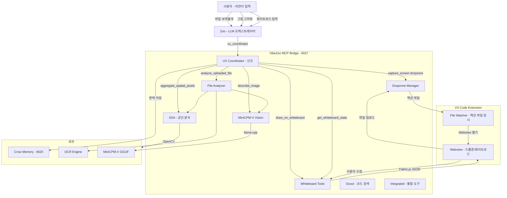
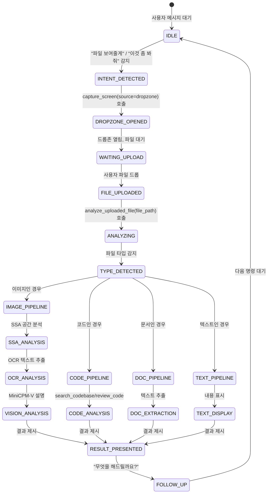
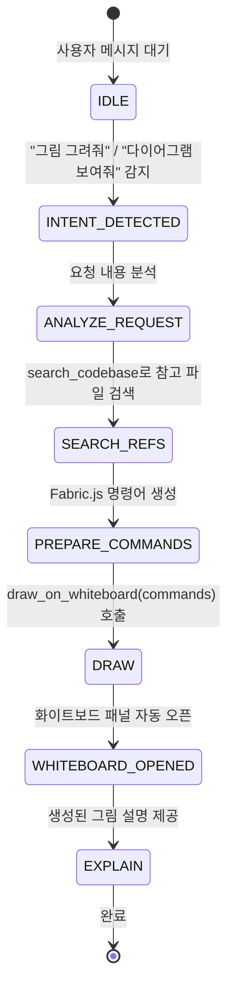
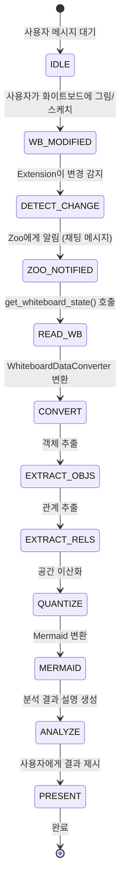

# VibeZoo 사용자 경험(UX) 워크플로우 설계 문서

> 버전: 1.0 | 날짜: 2026-06-02 | 모드: Architect

---

## 1. 현재 아키텍처 분석

### 1.1 전체 구조

```
vibezoo_mcp_bridge.py + bridge/ 패키지 (모듈형, FastMCP @9027 SSE)
├── bridge/
│   ├── config.py              ── 상수/경로 중앙 관리
│   ├── tool_context.py        ── ToolContext + Manifest 레지스트리
│   ├── tools/
│   │   ├── _base.py           ── BaseTool (검증, 진행률, 결과)
│   │   ├── scout.py           ── search_codebase, find_references, summarize_architecture
│   │   ├── reviewer.py        ── review_code, check_quality
│   │   ├── deep_analyzer.py   ── analyze_call_graph, map_dependencies, extract_patterns, reverse_engineer
│   │   ├── tester.py          ── generate_tests, analyze_coverage
│   │   ├── whiteboard.py      ── draw_on_whiteboard, get_whiteboard_state, capture_screen
│   │   ├── fix_loop.py        ── auto_fix_status, retry_build, check_intervention
│   │   ├── integrated.py      ── review_project, find_bugs, suggest_refactor, generate_docs
│   │   ├── analysis.py        ── explain_code, analyze_changes, review_pr, refactor_across_files
│   │   ├── knowledge.py       ── learn_project, recall_project, learn_preference, get_preferences
│   │   ├── web.py             ── fetch_page, web_search
│   │   ├── ssa.py             ── aggregate_spatial_pixels
│   │   ├── setup.py           ── vibezoo_setup
│   │   ├── file_analyzer.py   ── analyze_uploaded_file
│   │   └── __init__.py        ── register_all_tools() 진입점
│   ├── vision/
│   │   └── minicpm.py         ── MiniCPM-V GGUF 래퍼
│   ├── ast_engine.py          ── Tree-sitter AST 엔진
│   ├── search_engine.py       ── 코드 검색 엔진
│   ├── file_cache.py          ── L1/L2 파일 캐시
│   ├── ocr_engine.py          ── OCR 엔진 (Tesseract/PaddleOCR)
│   ├── llm_pipeline.py        ── LLM 파이프라인
│   ├── result_ranker.py       ── BM25 결과 랭킹
│   └── utils.py               ── 공통 유틸리티
├── crow_memory_server.py      ── Crow Memory (FastMCP @9020)
└── extension/                  ── VS Code Extension
```

### 1.2 도구 등록 구조 (중요 발견)

**현재 이중 등록 구조가 존재함:**

| 도구 | 메인 파일 inline 등록 | tools/ 모듈 등록 | 충돌 위험 |
|------|-------------------|----------------|---------|
| `search_codebase` | ✅ (@632) | ✅ (scout.py) | **높음** |
| `find_references` | ✅ | ✅ (scout.py) | **높음** |
| `summarize_architecture` | ✅ | ✅ (scout.py) | **높음** |
| `learn_project` | ✅ (@3615) | ✅ (knowledge.py) | **높음** |
| `recall_project` | ✅ (@3674) | ✅ (knowledge.py) | **높음** |
| `learn_preference` | ✅ (@3748) | ✅ (knowledge.py) | **높음** |
| `get_preferences` | ✅ (@3812) | ✅ (knowledge.py) | **높음** |
| `open_dropzone` | ✅ (@4007) | ❌ | 없음 |
| `open_image_dropzone` | ✅ (@3981) | ❌ | 없음 |
| `review_code` | ❌ | ✅ (reviewer.py) | 없음 |
| `draw_on_whiteboard` | ❌ | ✅ (whiteboard.py) | 없음 |
| `aggregate_spatial_pixels` | ❌ | ✅ (ssa.py) | 없음 |
| `analyze_uploaded_file` | ❌ | ✅ (file_analyzer.py) | 없음 |

**`tools/__init__.py`의 `register_all_tools()`는 브릿지 v2에서 명시적으로 호출되지 않고 있음** — 즉, 실제로는 메인 파일의 inline 등록만 활성화되고, 모듈 버전은 데드코드 상태일 가능성이 높음.

### 1.3 기존 파일 분석 파이프라인 (file_analyzer.py)

파일 업로드 → 타입 감지 → 분석 파이프라인:
```
이미지: SSA(OpenCV) → OCR(Tesseract/Paddle) → MiniCPM-V(Vision LLM)
문서:  PyMuPDF(PDF) / python-docx(DOCX) → 텍스트 추출
코드:  인코딩 감지 → 내용 읽기 → 구문 하이라이팅
텍스트: 인코딩 감지 → 내용 읽기
바이너리: Hex 덤프
```

### 1.4 화이트보드 변환 파이프라인 (whiteboard.py)

```
Fabric.js JSON
  → extract_objects (도형/텍스트/선/그룹 추출)
  → extract_relationships (연결/포함/근접/정렬)
  → quantize_spatial (좌표→그리드, 크기→범주, 색상→색상명)
  → to_mermaid (Mermaid 다이어그램 변환)
  → fabric_json_to_text (통합 마크다운 보고서)
```

### 1.5 현재 문제점

| 문제 | 설명 | 심각도 |
|------|------|--------|
| **도구 중복 등록** | inline + module 이중 등록으로 혼란 | 🔴 높음 |
| **워크플로우 부재** | 각 도구는 독립적, 자동 연계 없음 | 🔴 높음 |
| **의도 감지 불가** | LLM이 수동으로 도구를 선택해야 함 | 🟡 중간 |
| **드롭존 후처리 누락** | 드롭존 열기 → 파일 업로드 후 자동 분석 없음 | 🟡 중간 |
| **화이트보드 수동 분석** | `get_whiteboard_state()` 호출 후 사용자가 직접 분석 도구 호출 | 🟡 중간 |

---

## 2. 시스템 아키텍처 (제안)



---

## 3. 3가지 핵심 워크플로우 상세 설계

### 3.1 파일 공유 패턴 (File Sharing Flow)

**상태 전이:**



**구현 방식 — `ux_coordinator` 신규 도구:**

```python
# 새로운 MCP 도구: ux_coordinator
# Zoo가 호출하면 현재 문맥을 분석하여 최적의 워크플로우 제안

@mcp.tool
def ux_coordinator(intent: str, context: str = "") -> str:
    """사용자 의도를 분석하여 최적의 VibeZoo 워크플로우를 제안하고 실행합니다.
    
    Args:
        intent: 감지된 사용자 의도 (file_share, drawing_request, whiteboard_input, 
                code_analysis, general_question)
        context: 추가 문맥 정보 (선택)
    """
    # 의도별 워크플로우 디스패치
```

### 3.2 그림 요청/생성 패턴 (Drawing Flow)

**상태 전이:**



**핵심: `generate_docs` 도구(`integrated.py`)가 이미 이 패턴의 일부를 구현 중** — `draw_on_whiteboard`를 내부 호출하여 아키텍처 다이어그램을 자동 생성함.

### 3.3 화이트보드 입력 패턴 (Whiteboard Input Flow)

**상태 전이:**



---

## 4. 수정이 필요한 파일 목록

### 4.1 신규 파일

| 파일 | 설명 | 우선순위 |
|------|------|----------|
| `bridge/tools/ux_coordinator.py` | UX 워크플로우 코디네이터 (신규 도구) | 🔴 필수 |
| `bridge/intent_detector.py` | 자연어 의도 감지 모듈 (키워드+패턴 기반) | 🔴 필수 |
| `plans/ux-workflow-design.md` | 본 설계 문서 | 🔴 필수 |

### 4.2 수정 파일 (기존 코드 변경)

| 파일 | 변경 내용 | 영향 범위 | 우선순위 |
|------|-----------|----------|----------|
| `bridge/tools/__init__.py` | `ux_coordinator` 등록 추가 (1줄) | 최소 | 🔴 필수 |
| `vibezoo_mcp_bridge.py` | `tools/__init__.py`의 `register_all_tools()` 호출 추가 (v2는 _archive/로 이동됨) | 중간 | ✅ 완료 |
| `bridge/tools/whiteboard.py` | `get_whiteboard_state()` 결과에 분석 제안 힌트 추가 | 최소 | 🟡 권장 |
| `bridge/tools/file_analyzer.py` | `analyze_uploaded_file()` 후속 질문 제안 추가 | 최소 | 🟡 권장 |
| `bridge/tools/integrated.py` | `generate_docs()`에 `mode="workflow"` 추가 | 최소 | 🟢 선택 |

### 4.3 변경하지 않는 파일 (기존 기능 유지)

| 파일 | 이유 |
|------|------|
| `bridge/vision/minicpm.py` | 이미 충분히 잘 구현됨, 변경 불필요 |
| `bridge/tools/ssa.py` | SSA 분석은 file_analyzer가 이미 연계 사용 중 |
| `bridge/tools/scout.py` | 검색 기능 변경 불필요 |
| `bridge/tools/reviewer.py` | 리뷰 기능 변경 불필요 |
| `bridge/tools/analysis.py` | 분석 기능 변경 불필요 |
| `bridge/tools/knowledge.py` | 지식 관리 기능 변경 불필요 |
| `bridge/tools/web.py` | 웹 기능 변경 불필요 |
| `bridge/config.py` | 설정 변경 불필요 (새 상수만 추가 가능) |

---

## 5. 구현 상세

### 5.1 `bridge/intent_detector.py` — 자연어 의도 감지

```python
"""
자연어 의도 감지 모듈.
LLM 없이 키워드 + 패턴 매칭으로 사용자 의도를 빠르게 분류.
Zoo가 ux_coordinator를 호출할 때 힌트로 사용.
"""

# 의도 시그니처: (의도명, 우선순위, 키워드_리스트, 컨텍스트_키워드)
INTENT_SIGNATURES = [
    ("file_share", 10, [
        "파일", "보여줄게", "보여줘", "올릴게", "업로드", "첨부", "드래그",
        "이미지", "사진", "스크린샷", "캡처", "png", "jpg", "pdf",
        "show you", "upload", "attach", "file", "image", "screenshot"
    ], []),
    ("drawing_request", 9, [
        "그림", "그려줘", "다이어그램", "차트", "시각화", "그래프",
        "draw", "diagram", "chart", "visualize", "graph",
        "아키텍처", "구조도", "플로우", "흐름도"
    ], []),
    ("whiteboard_input", 8, [
        "화이트보드", "칠판", "그렸어", "그려놨어", "스케치",
        "whiteboard", "sketch", "drew", "drawing"
    ], []),
    ("code_analysis", 7, [
        "코드", "분석", "리뷰", "버그", "리팩터", "검색",
        "code", "analyze", "review", "bug", "refactor", "search"
    ], []),
    ("project_setup", 5, [
        "설치", "설정", "셋업", "초기화",
        "install", "setup", "init", "configure"
    ], []),
]

def detect_intent(user_message: str) -> list[tuple[str, int, float]]:
    """사용자 메시지에서 의도를 감지하여 (의도명, 우선순위, 신뢰도) 목록 반환"""
    ...

def get_workflow_hints(intent: str) -> dict:
    """의도에 따른 워크플로우 힌트 반환 (Zoo가 사용할 도구 체인 제안)"""
    ...
```

### 5.2 `bridge/tools/ux_coordinator.py` — UX 코디네이터

```python
"""
VibeZoo UX Coordinator — 사용자 의도에 따라 최적의 도구 체인을 제안/실행.
Zoo(LLM)가 이 도구를 호출하여 워크플로우 자동화.
"""

from bridge.intent_detector import detect_intent, get_workflow_hints

def register(mcp):
    @mcp.tool
    def ux_coordinator(intent: str = "auto", user_message: str = "",
                       context: str = "") -> str:
        """사용자 의도를 분석하고 최적의 VibeZoo 도구 체인을 제안합니다.
        
        Zoo는 이 도구를 사용하여:
        1. 사용자 메시지에서 의도 자동 감지 (intent="auto")
        2. 의도에 맞는 도구 체인 제안 받기
        3. 다음 액션 결정에 참고
        
        Args:
            intent: 의도 유형 ("auto"=자동감지, "file_share", "drawing_request", 
                    "whiteboard_input", "code_analysis", "project_setup")
            user_message: 사용자 원본 메시지 (intent="auto"일 때 필요)
            context: 추가 문맥 (현재 화이트보드 상태, 열린 파일 등)
        
        Returns:
            마크다운 형식의 워크플로우 제안
        """
        ...
    
    @mcp.tool
    def auto_analyze_after_drop(file_path: str, 
                                 user_intent: str = "") -> str:
        """드롭존 업로드 후 자동 분석 파이프라인 실행.
        
        capture_screen(dropzone) → 사용자 파일 업로드 → 이 도구 호출
        파일 타입에 따라 SSA→OCR→MiniCPM 또는 코드 분석 자동 실행
        
        Args:
            file_path: 업로드된 파일 경로
            user_intent: 사용자의 후속 의도 (분석/번역/리뷰 등)
        
        Returns:
            종합 분석 보고서 + 후속 제안
        """
        ...
    
    @mcp.tool
    def auto_analyze_whiteboard() -> str:
        """화이트보드 내용을 자동 분석합니다.
        
        get_whiteboard_state() + WhiteboardDataConverter 변환 + 
        SSA(이미지인 경우) + MiniCPM(이미지인 경우) 통합 실행
        
        Returns:
            화이트보드 분석 보고서 + Mermaid 다이어그램
        """
        ...
```

### 5.3 기존 도구 설명 개선

**`capture_screen` (whiteboard.py:861)** — 설명 업데이트:

```python
@mcp.tool
def capture_screen(source: str = "screen") -> str:
    """화면을 캡처하거나 드롭존을 엽니다.
    
    사용자가 "파일 보여줄게", "이것 좀 봐줘" 등의 표현을 쓸 때 
    source="dropzone"으로 호출하여 파일 업로드 UI를 띄우세요.
    
    드롭존에서 파일 업로드 후에는 auto_analyze_after_drop()을 호출하여
    자동 분석을 실행하세요.
    ...
    """
```

**`analyze_uploaded_file` (file_analyzer.py:274)** — 설명 업데이트:

```python
@mcp.tool
def analyze_uploaded_file(file_path: str) -> str:
    """드롭존에 업로드된 파일을 분석합니다.
    
    파일 타입 자동 감지 → 분석 파이프라인 실행:
    - 이미지: SSA 공간 분석 → OCR 텍스트 추출 → MiniCPM-V 비전 분석
    - 코드: 내용 읽기 → 구문 분석 제안
    - 문서: PDF/DOCX 텍스트 추출
    
    분석 완료 후 사용자에게 "무엇을 해드릴까요?" 후속 질문을 제안합니다.
    ...
    """
```

**`get_whiteboard_state` (whiteboard.py:914)** — 결과에 분석 힌트 추가:

```python
# 결과末尾에 추가:
output += "\n> 💡 화이트보드 내용을 자동 분석하려면 `auto_analyze_whiteboard()`를 호출하세요.\n"
```

---

## 6. 구현 순서 (단계별 실행 계획)

### Phase 1: 기반 모듈 (최소 변경, 최대 효과)

| 단계 | 작업 | 파일 | 설명 |
|------|------|------|------|
| 1.1 | `intent_detector.py` 생성 | `bridge/intent_detector.py` (신규) | 키워드 기반 의도 감지 + 워크플로우 힌트 |
| 1.2 | `ux_coordinator.py` 생성 | `bridge/tools/ux_coordinator.py` (신규) | `ux_coordinator` 도구 등록 |
| 1.3 | `__init__.py` 수정 | `bridge/tools/__init__.py` | `reg_ux` 추가 (1줄) |

### Phase 2: 자동 분석 도구

| 단계 | 작업 | 파일 | 설명 |
|------|------|------|------|
| 2.1 | `auto_analyze_after_drop` 구현 | `bridge/tools/ux_coordinator.py` | 드롭존→분석 파이프라인 자동화 |
| 2.2 | `auto_analyze_whiteboard` 구현 | `bridge/tools/ux_coordinator.py` | 화이트보드→분석 파이프라인 자동화 |

### Phase 3: 기존 도구 개선

| 단계 | 작업 | 파일 | 설명 |
|------|------|------|------|
| 3.1 | `capture_screen` 설명 업데이트 | `bridge/tools/whiteboard.py` | 드롭존+자동분석 힌트 추가 |
| 3.2 | `analyze_uploaded_file` 설명 업데이트 | `bridge/tools/file_analyzer.py` | 후속 질문 제안 문구 추가 |
| 3.3 | `get_whiteboard_state` 힌트 추가 | `bridge/tools/whiteboard.py` | `auto_analyze_whiteboard` 연결 |

### Phase 4: 통합 및 테스트

| 단계 | 작업 | 파일 | 설명 |
|------|------|------|------|
| 4.1 | 도구 등록 확인 | `bridge/tools/__init__.py` | 모든 도구 정상 등록 확인 |
| 4.2 | `list_subagents` 업데이트 | `vibezoo_mcp_bridge.py` | UX Coordinator 에이전트 추가 (v2는 _archive/로 이동) |
| 4.3 | health check 업데이트 | `vibezoo_mcp_bridge.py` | intent_detector 상태 포함 |

---

## 7. 테스트 계획

### 7.1 단위 테스트

| 테스트 | 대상 | 검증 내용 |
|--------|------|-----------|
| `test_intent_file_share` | `intent_detector.py` | "파일 보여줄게" → file_share 감지 |
| `test_intent_drawing` | `intent_detector.py` | "그림 그려줘" → drawing_request 감지 |
| `test_intent_whiteboard` | `intent_detector.py` | "화이트보드 봐줘" → whiteboard_input 감지 |
| `test_intent_unknown` | `intent_detector.py` | 의미 없는 입력 → general_question 폴백 |
| `test_workflow_hints` | `intent_detector.py` | file_share 의도 → dropzone + analyze 힌트 반환 |

### 7.2 통합 테스트

| 테스트 | 시나리오 | 예상 흐름 |
|--------|----------|-----------|
| `test_file_share_flow` | "이 이미지 좀 분석해줘" → 드롭존 → 파일 업로드 | `ux_coordinator` → `capture_screen(dropzone)` → `auto_analyze_after_drop` |
| `test_drawing_flow` | "프로젝트 구조 다이어그램 그려줘" | `ux_coordinator` → `generate_docs` → `draw_on_whiteboard` |
| `test_whiteboard_flow` | 사용자가 화이트보드에 UML 그림 | `get_whiteboard_state` → `auto_analyze_whiteboard` |
| `test_code_analysis` | "이 코드 버그 찾아줘" | `ux_coordinator` → `find_bugs` |

### 7.3 수동 테스트

| 테스트 | 방법 |
|--------|------|
| `test_e2e_file_share` | 실제 Zoo와 대화하며 "파일 보여줄게" → 드롭존 → 업로드 → 분석 완료 확인 |
| `test_e2e_whiteboard` | 화이트보드에 사각형 3개 + 연결선 그리기 → Zoo에게 "이거 분석해줘" → Mermaid 변환 확인 |
| `test_e2e_drawing` | "간단한 플로우차트 그려줘" → 화이트보드에 그림 나타나는지 확인 |

### 7.4 회귀 테스트

| 테스트 | 검증 내용 |
|--------|-----------|
| `test_existing_tools` | 기존 MCP 도구(search_codebase, review_code 등) 정상 동작 확인 |
| `test_crow_memory` | Crow Memory 연동(search_codebase, recall_project 등) 정상 |
| `test_bridge_startup` | Bridge v2 시작 시 모든 도구 등록 오류 없음 |

---

## 8. 요약

### 8.1 핵심 변경 사항

1. **신규 파일 2개**: `bridge/intent_detector.py`, `bridge/tools/ux_coordinator.py`
2. **기존 파일 수정 4개**: `__init__.py`(1줄), `whiteboard.py`(설명만), `file_analyzer.py`(설명만), `vibezoo_mcp_bridge.py`(list_subagents만) — v2는 _archive/로 이동됨
3. **총 코드 변경량**: 약 300~400줄 (신규) + 약 30줄 (기존 수정)

### 8.2 최소 변경 원칙 준수

- ✅ 기존 도구 모듈(scout, reviewer, ssa, minicpm 등)은 전혀 변경하지 않음
- ✅ 기존 분석 파이프라인(file_analyzer의 SSA→OCR→MiniCPM)을 그대로 재사용
- ✅ 기존 WhiteboardDataConverter를 그대로 재사용
- ✅ `integrated.py`의 `generate_docs`가 이미 whiteboard 통합 패턴을 갖고 있으므로 이를 확장

### 8.3 사용자 편의성 개선 효과

| 현재 | 개선 후 |
|------|---------|
| Zoo가 수동으로 여러 도구 호출 | `ux_coordinator` 한 번으로 워크플로우 제안 |
| 드롭존 열기 → 수동 분석 호출 | `auto_analyze_after_drop`으로 자동 연계 |
| 화이트보드 읽기 → 수동 분석 | `auto_analyze_whiteboard`로 자동 분석 |
| 도구 선택에 망설임 | `intent_detector`로 최적 도구 제안 |

---

> **이 설계는 Code 모드에서 구현됩니다. `switch_mode`로 Code 모드 전환 후 Phase 1부터 순차적으로 구현하세요.**
