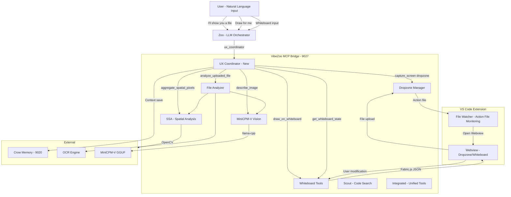
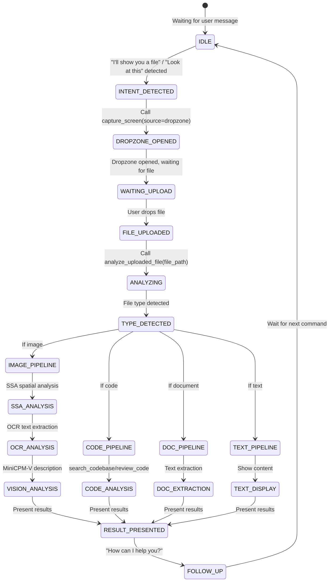
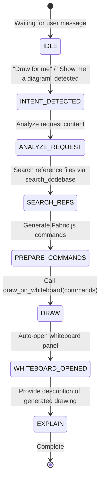
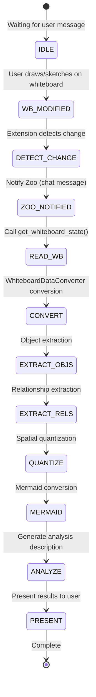

# VibeZoo User Experience (UX) Workflow Design Document

> Version: 1.0 | Date: 2026-06-02 | Mode: Architect

---

## 1. Current Architecture Analysis

### 1.1 Overall Structure

```
vibezoo_mcp_bridge.py + bridge/ package (modular, FastMCP @9027 SSE)
├── bridge/
│   ├── config.py              ── Constants/path central management
│   ├── tool_context.py        ── ToolContext + Manifest registry
│   ├── tools/
│   │   ├── _base.py           ── BaseTool (validation, progress, result)
│   │   ├── scout.py           ── search_codebase, find_references, summarize_architecture
│   │   ├── reviewer.py        ── review_code, check_quality
│   │   ├── deep_analyzer.py   ── analyze_call_graph, map_dependencies, extract_patterns, reverse_engineer
│   │   ├── tester.py          ── generate_tests, analyze_coverage
│   │   ├── whiteboard.py      ── draw_on_whiteboard, get_whiteboard_state, capture_screen
│   │   ├── fix_loop.py        ── auto_fix_status, retry_build, check_intervention
│   │   ├── integrated.py      ── review_project, find_bugs, suggest_refactor, generate_docs
│   │   ├── analysis.py        ── explain_code, analyze_changes, review_pr, refactor_across_files
│   │   ├── knowledge.py       ── learn_project, recall_project, learn_preference, get_preferences
│   │   ├── web.py             ── fetch_page, web_search
│   │   ├── ssa.py             ── aggregate_spatial_pixels
│   │   ├── setup.py           ── vibezoo_setup
│   │   ├── file_analyzer.py   ── analyze_uploaded_file
│   │   └── __init__.py        ── register_all_tools() entry point
│   ├── vision/
│   │   └── minicpm.py         ── MiniCPM-V GGUF wrapper
│   ├── ast_engine.py          ── Tree-sitter AST engine
│   ├── search_engine.py       ── Code search engine
│   ├── file_cache.py          ── L1/L2 file cache
│   ├── ocr_engine.py          ── OCR engine (Tesseract/PaddleOCR)
│   ├── llm_pipeline.py        ── LLM pipeline
│   ├── result_ranker.py       ── BM25 result ranking
│   └── utils.py               ── Common utilities
├── crow_memory_server.py      ── Crow Memory (FastMCP @9020)
└── extension/                  ── VS Code Extension
```

### 1.2 Tool Registration Structure (Important Discovery)

**Current dual registration structure:**

| Tool | Main File Inline Registration | tools/ Module Registration | Conflict Risk |
|------|---------------------------|------------------------|---------|
| `search_codebase` | ✅ (@632) | ✅ (scout.py) | **High** |
| `find_references` | ✅ | ✅ (scout.py) | **High** |
| `summarize_architecture` | ✅ | ✅ (scout.py) | **High** |
| `learn_project` | ✅ (@3615) | ✅ (knowledge.py) | **High** |
| `recall_project` | ✅ (@3674) | ✅ (knowledge.py) | **High** |
| `learn_preference` | ✅ (@3748) | ✅ (knowledge.py) | **High** |
| `get_preferences` | ✅ (@3812) | ✅ (knowledge.py) | **High** |
| `open_dropzone` | ✅ (@4007) | ❌ | None |
| `open_image_dropzone` | ✅ (@3981) | ❌ | None |
| `review_code` | ❌ | ✅ (reviewer.py) | None |
| `draw_on_whiteboard` | ❌ | ✅ (whiteboard.py) | None |
| `aggregate_spatial_pixels` | ❌ | ✅ (ssa.py) | None |
| `analyze_uploaded_file` | ❌ | ✅ (file_analyzer.py) | None |

**`register_all_tools()` in `tools/__init__.py` is not being explicitly called from bridge v2** — meaning, only inline registration in the main file is active, and module versions are likely dead code.

### 1.3 Existing File Analysis Pipeline (file_analyzer.py)

File upload → Type detection → Analysis pipeline:
```
Image: SSA(OpenCV) → OCR(Tesseract/Paddle) → MiniCPM-V(Vision LLM)
Document: PyMuPDF(PDF) / python-docx(DOCX) → Text extraction
Code: Encoding detection → Content reading → Syntax highlighting
Text: Encoding detection → Content reading
Binary: Hex dump
```

### 1.4 Whiteboard Conversion Pipeline (whiteboard.py)

```
Fabric.js JSON
  → extract_objects (shape/text/line/group extraction)
  → extract_relationships (connection/inclusion/proximity/alignment)
  → quantize_spatial (coordinates→grid, size→category, color→color name)
  → to_mermaid (Mermaid diagram conversion)
  → fabric_json_to_text (integrated markdown report)
```

### 1.5 Current Issues

| Issue | Description | Severity |
|-------|-------------|----------|
| **Tool duplicate registration** | Inline + module dual registration causes confusion | 🔴 High |
| **No workflow** | Each tool is independent, no automatic chaining | 🔴 High |
| **No intent detection** | LLM must manually select tools | 🟡 Medium |
| **Missing dropzone post-processing** | Dropzone open → no auto analysis after file upload | 🟡 Medium |
| **Manual whiteboard analysis** | User must manually call analysis tool after `get_whiteboard_state()` | 🟡 Medium |

---

## 2. System Architecture (Proposed)



---

## 3. 3 Core Workflow Detailed Design

### 3.1 File Sharing Flow

**State Transition:**



**Implementation — New `ux_coordinator` Tool:**

```python
# New MCP tool: ux_coordinator
# Zoo calls this to analyze current context and suggest optimal workflow

@mcp.tool
def ux_coordinator(intent: str, context: str = "") -> str:
    """Analyzes user intent and suggests/executes the optimal VibeZoo workflow.
    
    Args:
        intent: Detected user intent (file_share, drawing_request, whiteboard_input, 
                code_analysis, general_question)
        context: Additional context information (optional)
    """
    # Workflow dispatch by intent
```

### 3.2 Drawing Request/Generation Flow

**State Transition:**



**Core: `generate_docs` tool (`integrated.py`) already implements part of this pattern** — it internally calls `draw_on_whiteboard` to auto-generate architecture diagrams.

### 3.3 Whiteboard Input Flow

**State Transition:**



---

## 4. Files to Modify

### 4.1 New Files

| File | Description | Priority |
|------|-------------|----------|
| `bridge/tools/ux_coordinator.py` | UX Workflow Coordinator (new tool) | 🔴 Required |
| `bridge/intent_detector.py` | Natural language intent detection module (keyword+pattern based) | 🔴 Required |
| `plans/ux-workflow-design.md` | This design document | 🔴 Required |

### 4.2 Files to Modify (Existing Code Changes)

| File | Change Content | Impact | Priority |
|------|----------------|--------|----------|
| `bridge/tools/__init__.py` | Add ux_coordinator registration (1 line) | Minimal | 🔴 Required |
| `vibezoo_mcp_bridge.py` | Add `register_all_tools()` call from `tools/__init__.py` (v2 moved to _archive/) | Medium | ✅ Completed |
| `bridge/tools/whiteboard.py` | Add analysis suggestion hint to `get_whiteboard_state()` result | Minimal | 🟡 Recommended |
| `bridge/tools/file_analyzer.py` | Add follow-up question suggestion to `analyze_uploaded_file()` | Minimal | 🟡 Recommended |
| `bridge/tools/integrated.py` | Add `mode="workflow"` to `generate_docs()` | Minimal | 🟢 Optional |

### 4.3 Files Not Modified (Keep Existing Functionality)

| File | Reason |
|------|--------|
| `bridge/vision/minicpm.py` | Already well implemented, no changes needed |
| `bridge/tools/ssa.py` | SSA analysis already used by file_analyzer |
| `bridge/tools/scout.py` | Search functionality unchanged |
| `bridge/tools/reviewer.py` | Review functionality unchanged |
| `bridge/tools/analysis.py` | Analysis functionality unchanged |
| `bridge/tools/knowledge.py` | Knowledge management unchanged |
| `bridge/tools/web.py` | Web functionality unchanged |
| `bridge/config.py` | Settings unchanged (new constants may be added) |

---

## 5. Implementation Details

### 5.1 `bridge/intent_detector.py` — Natural Language Intent Detection

```python
"""
Natural language intent detection module.
Quickly classifies user intent using keyword + pattern matching without LLM.
Used as hint when Zoo calls ux_coordinator.
"""

# Intent signatures: (intent_name, priority, keyword_list, context_keywords)
INTENT_SIGNATURES = [
    ("file_share", 10, [
        "file", "show", "upload", "attach", "drag",
        "image", "photo", "screenshot", "capture", "png", "jpg", "pdf",
        "보여줄게", "보여줘", "올릴게", "업로드", "첨부", "파일", "이미지", "사진", "스크린샷", "캡처"
    ], []),
    ("drawing_request", 9, [
        "draw", "diagram", "chart", "visualize", "graph",
        "architecture", "flow", "structure",
        "그림", "그려줘", "다이어그램", "차트", "시각화", "그래프", "아키텍처", "구조도", "플로우", "흐름도"
    ], []),
    ("whiteboard_input", 8, [
        "whiteboard", "sketch", "drew", "drawing",
        "화이트보드", "칠판", "그렸어", "그려놨어", "스케치"
    ], []),
    ("code_analysis", 7, [
        "code", "analyze", "review", "bug", "refactor", "search",
        "코드", "분석", "리뷰", "버그", "리팩터", "검색"
    ], []),
    ("project_setup", 5, [
        "install", "setup", "init", "configure",
        "설치", "설정", "셋업", "초기화"
    ], []),
]

def detect_intent(user_message: str) -> list[tuple[str, int, float]]:
    """Detects intent from user message and returns (intent_name, priority, confidence) list"""
    ...

def get_workflow_hints(intent: str) -> dict:
    """Returns workflow hints based on intent (proposed tool chain for Zoo)"""
    ...
```

### 5.2 `bridge/tools/ux_coordinator.py` — UX Coordinator

```python
"""
VibeZoo UX Coordinator — Proposes/executes optimal tool chain based on user intent.
Zoo(LLM) calls this tool for workflow automation.
"""

from bridge.intent_detector import detect_intent, get_workflow_hints

def register(mcp):
    @mcp.tool
    def ux_coordinator(intent: str = "auto", user_message: str = "",
                       context: str = "") -> str:
        """Analyzes user intent and proposes the optimal VibeZoo tool chain.
        
        Zoo uses this tool to:
        1. Auto-detect intent from user message (intent="auto")
        2. Get tool chain proposal matching intent
        3. Reference for next action decision
        
        Args:
            intent: Intent type ("auto"=auto-detect, "file_share", "drawing_request", 
                    "whiteboard_input", "code_analysis", "project_setup")
            user_message: Original user message (needed when intent="auto")
            context: Additional context (current whiteboard state, open files, etc.)
        
        Returns:
            Markdown-formatted workflow proposal
        """
        ...
    
    @mcp.tool
    def auto_analyze_after_drop(file_path: str, 
                                 user_intent: str = "") -> str:
        """Runs auto analysis pipeline after dropzone upload.
        
        capture_screen(dropzone) → user file upload → call this tool
        Auto-runs SSA→OCR→MiniCPM or code analysis based on file type
        
        Args:
            file_path: Uploaded file path
            user_intent: User's follow-up intent (analysis/translation/review etc.)
        
        Returns:
            Comprehensive analysis report + follow-up suggestions
        """
        ...
    
    @mcp.tool
    def auto_analyze_whiteboard() -> str:
        """Automatically analyzes whiteboard content.
        
        Integrates get_whiteboard_state() + WhiteboardDataConverter conversion + 
        SSA(if image) + MiniCPM(if image)
        
        Returns:
            Whiteboard analysis report + Mermaid diagram
        """
        ...
```

### 5.3 Existing Tool Description Improvements

**`capture_screen` (whiteboard.py:861)** — Description update:

```python
@mcp.tool
def capture_screen(source: str = "screen") -> str:
    """Captures screen or opens dropzone.
    
    When the user says "I'll show you a file", "Look at this", 
    call with source="dropzone" to open the file upload UI.
    
    After file upload via dropzone, call auto_analyze_after_drop() to
    run automatic analysis.
    ...
    """
```

**`analyze_uploaded_file` (file_analyzer.py:274)** — Description update:

```python
@mcp.tool
def analyze_uploaded_file(file_path: str) -> str:
    """Analyzes files uploaded to the dropzone.
    
    Auto file type detection → analysis pipeline execution:
    - Image: SSA spatial analysis → OCR text extraction → MiniCPM-V vision analysis
    - Code: Content reading → syntax analysis suggestions
    - Document: PDF/DOCX text extraction
    
    After analysis, suggests follow-up question "How can I help you?"
    ...
    """
```

**`get_whiteboard_state` (whiteboard.py:914)** — Add analysis hint to result:

```python
# Add at the end of result:
output += "\n> 💡 To auto-analyze whiteboard content, call `auto_analyze_whiteboard()`.\n"
```

---

## 6. Implementation Order (Step-by-Step Execution Plan)

### Phase 1: Base Modules (Minimal Change, Maximum Effect)

| Step | Task | File | Description |
|------|------|------|-------------|
| 1.1 | Create `intent_detector.py` | `bridge/intent_detector.py` (new) | Keyword-based intent detection + workflow hints |
| 1.2 | Create `ux_coordinator.py` | `bridge/tools/ux_coordinator.py` (new) | Register `ux_coordinator` tool |
| 1.3 | Modify `__init__.py` | `bridge/tools/__init__.py` | Add `reg_ux` (1 line) |

### Phase 2: Auto Analysis Tools

| Step | Task | File | Description |
|------|------|------|-------------|
| 2.1 | Implement `auto_analyze_after_drop` | `bridge/tools/ux_coordinator.py` | Dropzone→analysis pipeline automation |
| 2.2 | Implement `auto_analyze_whiteboard` | `bridge/tools/ux_coordinator.py` | Whiteboard→analysis pipeline automation |

### Phase 3: Existing Tool Improvements

| Step | Task | File | Description |
|------|------|------|-------------|
| 3.1 | Update `capture_screen` description | `bridge/tools/whiteboard.py` | Add dropzone+auto-analysis hint |
| 3.2 | Update `analyze_uploaded_file` description | `bridge/tools/file_analyzer.py` | Add follow-up question suggestion |
| 3.3 | Add `get_whiteboard_state` hint | `bridge/tools/whiteboard.py` | Connect to `auto_analyze_whiteboard` |

### Phase 4: Integration and Testing

| Step | Task | File | Description |
|------|------|------|-------------|
| 4.1 | Verify tool registration | `bridge/tools/__init__.py` | Confirm all tools registered correctly |
| 4.2 | Update `list_subagents` | `vibezoo_mcp_bridge.py` | Add UX Coordinator agent (v2 moved to _archive/) |
| 4.3 | Update health check | `vibezoo_mcp_bridge.py` | Include intent_detector status |

---

## 7. Test Plan

### 7.1 Unit Tests

| Test | Target | Verification |
|------|--------|-------------|
| `test_intent_file_share` | `intent_detector.py` | "I'll show you a file" → file_share detected |
| `test_intent_drawing` | `intent_detector.py` | "Draw for me" → drawing_request detected |
| `test_intent_whiteboard` | `intent_detector.py` | "Look at the whiteboard" → whiteboard_input detected |
| `test_intent_unknown` | `intent_detector.py` | Meaningless input → general_question fallback |
| `test_workflow_hints` | `intent_detector.py` | file_share intent → dropzone + analyze hint returned |

### 7.2 Integration Tests

| Test | Scenario | Expected Flow |
|------|----------|---------------|
| `test_file_share_flow` | "Analyze this image" → dropzone → file upload | `ux_coordinator` → `capture_screen(dropzone)` → `auto_analyze_after_drop` |
| `test_drawing_flow` | "Draw project structure diagram" | `ux_coordinator` → `generate_docs` → `draw_on_whiteboard` |
| `test_whiteboard_flow` | User draws UML on whiteboard | `get_whiteboard_state` → `auto_analyze_whiteboard` |
| `test_code_analysis` | "Find bugs in this code" | `ux_coordinator` → `find_bugs` |

### 7.3 Manual Tests

| Test | Method |
|------|--------|
| `test_e2e_file_share` | Actually talk to Zoo, "I'll show you a file" → dropzone → upload → verify analysis completion |
| `test_e2e_whiteboard` | Draw 3 rectangles + connecting lines on whiteboard → "Analyze this" in Zoo → verify Mermaid conversion |
| `test_e2e_drawing` | "Draw a simple flowchart" → verify drawing appears on whiteboard |

### 7.4 Regression Tests

| Test | Verification |
|------|-------------|
| `test_existing_tools` | Verify existing MCP tools (search_codebase, review_code, etc.) work normally |
| `test_crow_memory` | Verify Crow Memory integration (search_codebase, recall_project, etc.) |
| `test_bridge_startup` | No tool registration errors on Bridge v2 startup |

---

## 8. Summary

### 8.1 Key Changes

1. **2 new files**: `bridge/intent_detector.py`, `bridge/tools/ux_coordinator.py`
2. **4 existing files modified**: `__init__.py` (1 line), `whiteboard.py` (description only), `file_analyzer.py` (description only), `vibezoo_mcp_bridge.py` (list_subagents only) — v2 moved to _archive/
3. **Total code change**: ~300~400 lines (new) + ~30 lines (existing modification)

### 8.2 Minimal Change Principle Compliance

- ✅ Existing tool modules (scout, reviewer, ssa, minicpm, etc.) not changed at all
- ✅ Existing analysis pipeline (file_analyzer's SSA→OCR→MiniCPM) reused as-is
- ✅ Existing WhiteboardDataConverter reused as-is
- ✅ `integrated.py`'s `generate_docs` already has whiteboard integration pattern, extended from it

### 8.3 User Convenience Improvement Effect

| Before | After |
|--------|-------|
| Zoo manually calls multiple tools | One `ux_coordinator` call for workflow proposal |
| Dropzone open → manual analysis call | `auto_analyze_after_drop` for automatic chaining |
| Read whiteboard → manual analysis | `auto_analyze_whiteboard` for automatic analysis |
| Hesitation in tool selection | `intent_detector` suggests optimal tool |

---

> **This design will be implemented in Code mode. Switch to Code mode via `switch_mode` and implement sequentially from Phase 1.**
