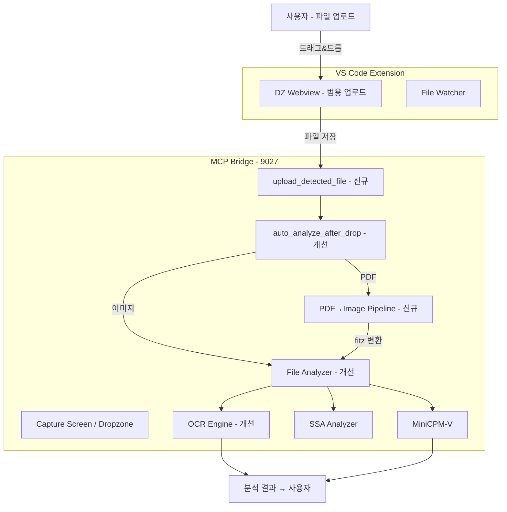

# VibeZoo v2 업그레이드 설계 문서

> 버전: v0.15.0 | 날짜: 2026-06-02 | 실제 사용 피드백 기반

---

## 0. 배경 및 문제 진단

2026-06-02 실제 VibeZoo 사용 중 발견된 부족한 점을 진단하고 개선 방안을 설계합니다.
사용자가 KOICA CTS 공모 PDF 파일을 드랍존에 업로드 → 분석해달라고 요청 → 결과 제공까지의 워크플로우에서 다음과 같은 문제가 발견되었습니다:

| # | 문제 | 심각도 | 근본 원인 |
|---|------|--------|-----------|
| 1 | **드랍존이 이미지 전용** | 🔴 높음 | `_DROPZONE_HTML`의 메시지가 "Drag & drop an image"로 제한적, 저장 경로가 `.png` 고정 |
| 2 | **PDF 스캔문서 분석 실패** | 🔴 높음 | `file_analyzer.py`의 PDF 핸들러가 `page.get_text()`만 수행. 텍스트 없는 스캔 PDF는 빈 결과 반환 |
| 3 | **auto_analyze_after_drop 미연동** | 🟡 중간 | PDF 타입 처리시 단순히 "analyze_uploaded_file()로 분석 가능" 메시지만 표시 |
| 4 | **OCR 신뢰도 낮음 (49%)** | 🟡 중간 | Tesseract 한국어 OCR 정확도가 불충분. 이미지 전처리 부재 |

---

## 1. 전체 아키텍처 변경도



## 2. 수정 대상 파일 및 상세 변경

### Phase 1: 드랍존 범용화 (whiteboard.py + config.py)

#### 2.1 `config.py` — 업로드 경로 개선

**현재**: `UPLOADED_IMAGE_PATH = str(_TEMP_DIR / "vibezoo_uploaded_image.png")` (항상 `.png`)

**변경**: 확장자를 보존하는 동적 경로로 변경

```python
# config.py — 추가
import uuid
UPLOADED_IMAGE_PATH = str(_TEMP_DIR / "vibezoo_uploaded_image.png")  # 하위 호환 유지
DEFAULT_UPLOAD_NAME = "dropped_image.png"

def get_uploaded_path(filename: str = None) -> str:
    """파일명 기반 업로드 경로 반환. 없으면 기본값."""
    if filename and os.path.splitext(filename)[1]:
        safe_name = str(uuid.uuid4())[:8] + "_" + os.path.basename(filename)
        return str(HOME_DIR / ".vibezoo-cache" / safe_name)
    return str(HOME_DIR / ".vibezoo-cache" / DEFAULT_UPLOAD_NAME)
```

#### 2.2 `whiteboard.py` — 드롭존 HTML 멀티타입 지원

**_DROPZONE_HTML 변경 (58번째 줄 근처)**:

```html
<!-- 현재 -->
<p>Drag & drop an image here<br>or <strong>click to browse</strong></p>
<p class="hint">Supports all file types: images, PDF, DOCX, TXT, code, etc.</p>

<!-- 변경 (아이콘 + 더 명확한 메시지) -->
<p>Drag & drop a file here<br>or <strong>click to browse</strong></p>
<p class="hint">📸 Images 📄 PDF 📝 DOCX 📋 TXT 💻 Code — all file types supported</p>
```

**_open_dropzone_in_webview() 변경 (815번째 줄)**:

```python
# 반환 메시지 업데이트
return (_markdown_header("File Drop Zone", "📎")
        + "Drop zone opened in VS Code Webview.\n\n"
        + "1. Drag & drop any file (images, PDF, DOCX, TXT, code) into the Webview\n"
        + "2. File will be saved to `~/.vibezoo-cache/upload_*.{ext}`\n"
        + "3. After upload, call `auto_analyze_after_drop(file_path='...')` to analyze\n\n"
        + "💡 **Tip**: Use `capture_screen()` (without arguments) to capture your screen directly.\n"
        + _markdown_footer())
```

### Phase 2: PDF 스캔문서 파이프라인 (file_analyzer.py 신규)

#### 2.3 `file_analyzer.py` — `_analyze_pdf_fallback()` 함수 추가

PDF에서 텍스트가 추출되지 않을 때 이미지 변환 → OCR 파이프라인으로 폴백:

```python
# file_analyzer.py — 신규 함수 (214번째 줄, 기존 PDF 처리 블록 내부에서 호출)

def _analyze_pdf_as_image(path: str, lines: list) -> None:
    """PDF를 이미지로 변환하여 분석 파이프라인 (SSA → OCR → MiniCPM) 실행.
    
    텍스트 추출 불가능한 스캔 문서 PDF 처리.
    """
    try:
        import fitz
        doc = fitz.open(path)
        if doc.page_count == 0:
            lines.append("⚠️ PDF has no pages.")
            doc.close()
            return
        
        page = doc[0]  # 첫 페이지만 분석
        pix = page.get_pixmap(dpi=200)  # 200 DPI로 렌더링
        img_path = path + "_page1.png"
        pix.save(img_path)
        doc.close()
        
        lines.append(f"### 📊 PDF → Image Analysis (page 1, {page.rect.width}x{page.rect.height}px)")
        lines.append("")
        
        # SSA
        try:
            from bridge.tools.ssa import _analyze_image, _imread_korean_safe, _summarize_ssa_results
            import cv2
            img_raw = _imread_korean_safe(img_path)
            if img_raw is not None:
                orig_h, orig_w = img_raw.shape[:2]
                target_w = 640
                target_h = int(orig_h * (target_w / orig_w))
                img_resized = cv2.resize(img_raw, (target_w, target_h))
                ssa_report = _analyze_image(img_resized, detail="full", orig_w=orig_w, orig_h=orig_h)
                ssa_summary = _summarize_ssa_results(ssa_report)
                if ssa_summary:
                    lines.append(ssa_summary)
                lines.append(ssa_report)
        except Exception as e:
            lines.append(f"SSA analysis skipped: {e}")
        
        # OCR (한국어 우선)
        try:
            from bridge.ocr_engine import OcrEngine
            ocr = OcrEngine()
            if ocr.is_available():
                result = ocr.ocr(img_path, lang="kor", detail="full")
                md = OcrEngine.ocr_to_markdown(result)
                lines.append(md)
        except Exception as e:
            lines.append(f"OCR skipped: {e}")
        
        # MiniCPM
        try:
            from bridge.vision.minicpm import describe_image, is_available
            if is_available():
                desc = describe_image(img_path, 
                    "이 PDF 문서의 내용을 한국어로 자세히 읽어주세요. 모든 텍스트를 추출해주세요.")
                if desc:
                    lines.append("### 🤖 Vision Analysis (MiniCPM-V)")
                    lines.append(desc)
        except Exception:
            pass
        
        # 임시 파일 정리
        try:
            os.remove(img_path)
        except Exception:
            pass
            
    except ImportError:
        lines.append("⚠️ PyMuPDF not installed (required for scanned PDF analysis)")
    except Exception as e:
        lines.append(f"⚠️ PDF image analysis failed: {e}")
```

**기존 PDF 블록 수정 (213-231행)**:

`page.get_text()`가 빈 텍스트를 반환할 경우 `_analyze_pdf_as_image()` 호출:

```python
# 224행 부근 변경
text = page.get_text()
if text.strip():
    lines.append(f"\n**Page {i+1}:**")
    lines.append(f"```\n{text[:2000]}\n```")
else:
    # 스캔 문서: 이미지 변환 → OCR/MiniCPM 파이프라인
    _analyze_pdf_as_image(path, lines)
    break  # 첫 페이지만 처리하고 종료
```

### Phase 3: auto_analyze_after_drop 강화 (ux_coordinator.py)

#### 2.4 `ux_coordinator.py` — PDF 파일 자동 분석 추가

`auto_analyze_after_drop()`의 doc_exts 처리 부분(159-186행)에서 PDF에 대해 `analyze_uploaded_file()`을 직접 호출하도록 변경:

```python
elif ext in doc_exts:
    response.append("📄 **문서 파일**이 감지되었습니다.")
    response.append("분석을 위해 내용을 추출합니다...")
    
    try:
        if ext in {'.txt', '.md', '.rst', '.csv', '.tsv'}:
            # ... (기존 텍스트 읽기 코드 유지) ...
        elif ext == '.pdf':
            # PDF: file_analyzer의 analyze_file() 직접 호출 (스캔 문서 대응)
            from bridge.tools.file_analyzer import analyze_file
            analysis = analyze_file(file_path)
            response.append(analysis)
        else:
            response.append(f"DOCX/XLSX 파일입니다. `analyze_uploaded_file()`로 상세 분석 가능합니다.")
    except Exception as e:
        response.append(f"파일 읽기 실패: {e}")
```

### Phase 4: OCR 전처리 개선 (ocr_engine.py)

#### 2.5 `ocr_engine.py` — 이미지 전처리 추가

```python
# _ocr_tesseract 메서드에 이미지 전처리 단계 추가 (234행 근처, pil_img 변환 후)

def _preprocess_for_ocr(self, pil_img) -> Image:
    """OCR 정확도 향상을 위한 이미지 전처리"""
    try:
        import cv2
        import numpy as np
        
        # PIL → OpenCV 변환
        cv_img = cv2.cvtColor(np.array(pil_img), cv2.COLOR_RGB2BGR)
        
        # 그레이스케일 변환
        gray = cv2.cvtColor(cv_img, cv2.COLOR_BGR2GRAY)
        
        # Adaptive Thresholding (조명 불균일 보정)
        binary = cv2.adaptiveThreshold(
            gray, 255, cv2.ADAPTIVE_THRESH_GAUSSIAN_C,
            cv2.THRESH_BINARY, 31, 10
        )
        
        # 노이즈 제거
        denoised = cv2.fastNlMeansDenoising(binary, None, 10, 7, 21)
        
        return Image.fromarray(denoised)
    except Exception:
        # OpenCV 없으면 원본 반환
        return pil_img

# _ocr_tesseract에서 pil_img = Image.open(image_path) 후에:
pil_img = self._preprocess_for_ocr(pil_img)
```

### Phase 5: cleanup 및 테스트 파일 정리

#### 2.6 `_extract_pdf.py`, `_extract_pdf_v2.py` 삭제

임시 테스트 파일 제거.

---

## 3. 구현 순서

| Phase | 항목 | 파일 | 변경 규모 |
|-------|------|------|-----------|
| **P1** | 드랍존 범용화 | [`whiteboard.py`](mcp-servers/bridge/tools/whiteboard.py) | ~10줄 |
| **P1** | 업로드 경로 개선 | [`config.py`](mcp-servers/bridge/config.py) | ~15줄 신규 |
| **P2** | PDF 스캔문서 파이프라인 | [`file_analyzer.py`](mcp-servers/bridge/tools/file_analyzer.py) | ~70줄 신규 + 5줄 수정 |
| **P3** | auto_analyze_after_drop 강화 | [`ux_coordinator.py`](mcp-servers/bridge/tools/ux_coordinator.py) | ~10줄 수정 |
| **P4** | OCR 이미지 전처리 | [`ocr_engine.py`](mcp-servers/bridge/ocr_engine.py) | ~25줄 신규 + 2줄 수정 |
| **P5** | cleanup | `_extract_pdf.py`, `_extract_pdf_v2.py` | 삭제 |

**예상 총 변경량**: ~140줄 신규 + ~27줄 수정

---

## 4. 변경 후 예상 워크플로우

```
사용자: "드랍존 열어줘"
  → Zoo: capture_screen(dropzone)
  → 드랍존 오픈 (📎 File Drop Zone)

사용자: PDF 파일 드래그&드롭
  → upload_{uuid}_{filename}.pdf 저장
  
Zoo: auto_analyze_after_drop(upload_path)
  → PDF 감지 → analyze_file() 호출
  → PyMuPDF로 텍스트 추출 시도
  → 텍스트 없으면: fitz로 이미지 변환 (200 DPI)
  → SSA 공간 분석
  → OCR (Tesseract, 전처리 적용, kor+eng)
  → MiniCPM-V 비전 분석
  → 결과 종합 → 사용자에게 제시
  → "무엇을 해드릴까요?" 후속 질문
```

---

## 5. 영향도 및 위험

| 항목 | 영향 | 위험 |
|------|------|------|
| 드랍존 메시지 변경 | 하위 호환 OK (기능 변경 없음) | 없음 |
| 업로드 경로 개선 | 기존 `dropped_image.png` 하위 호환 유지 | 없음 |
| PDF 스캔문서 파이프라인 | 기존 PDF 분석에 폴백 추가 (정상 PDF 영향 없음) | PyMuPDF 메모리 사용 (단일 페이지만 처리) |
| OCR 전처리 | 기존 OCR 결과 품질 향상 | OpenCV 없으면 원본 폴백 |
| auto_analyze_after_drop 강화 | 문서 타입 처리 강화 | 없음 |

---

> **이 설계는 Code 모드에서 구현됩니다. `switch_mode`로 Code 모드 전환 후 Phase 1~5 순차 구현하세요.**
