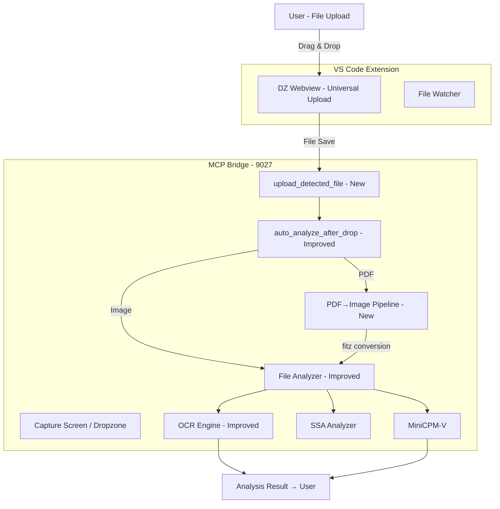

# VibeZoo v2 Upgrade Design Document

> Version: v0.15.0 | Date: 2026-06-02 | Based on Real Usage Feedback

---

## 0. Background and Problem Diagnosis

Diagnose shortcomings discovered during actual VibeZoo usage on 2026-06-02 and design improvement plans.
The following problems were found in the workflow of a user uploading a KOICA CTS proposal PDF to the dropzone → requesting analysis → receiving results:

| # | Problem | Severity | Root Cause |
|---|---------|----------|------------|
| 1 | **Dropzone image-only** | 🔴 High | `_DROPZONE_HTML` message limited to "Drag & drop an image", save path fixed to `.png` |
| 2 | **PDF scanned document analysis failure** | 🔴 High | PDF handler in `file_analyzer.py` only performs `page.get_text()`. Textless scanned PDF returns empty results |
| 3 | **auto_analyze_after_drop not integrated** | 🟡 Medium | PDF type handling only shows "analyzable via analyze_uploaded_file()" message |
| 4 | **Low OCR confidence (49%)** | 🟡 Medium | Tesseract Korean OCR accuracy insufficient. No image preprocessing |

---

## 1. Overall Architecture Change Diagram



## 2. Target Files and Detailed Changes

### Phase 1: Dropzone Generalization (whiteboard.py + config.py)

#### 2.1 `config.py` — Upload Path Improvement

**Current**: `UPLOADED_IMAGE_PATH = str(_TEMP_DIR / "vibezoo_uploaded_image.png")` (always `.png`)

**Change**: Dynamic path preserving extension

```python
# config.py — addition
import uuid
UPLOADED_IMAGE_PATH = str(_TEMP_DIR / "vibezoo_uploaded_image.png")  # Maintain backward compatibility
DEFAULT_UPLOAD_NAME = "dropped_image.png"

def get_uploaded_path(filename: str = None) -> str:
    """Returns upload path based on filename. Default if none."""
    if filename and os.path.splitext(filename)[1]:
        safe_name = str(uuid.uuid4())[:8] + "_" + os.path.basename(filename)
        return str(HOME_DIR / ".vibezoo-cache" / safe_name)
    return str(HOME_DIR / ".vibezoo-cache" / DEFAULT_UPLOAD_NAME)
```

#### 2.2 `whiteboard.py` — Dropzone HTML Multi-type Support

**`_DROPZONE_HTML` Change (around line 58)**:

```html
<!-- Current -->
<p>Drag & drop an image here<br>or <strong>click to browse</strong></p>
<p class="hint">Supports all file types: images, PDF, DOCX, TXT, code, etc.</p>

<!-- Change (icon + clearer message) -->
<p>Drag & drop a file here<br>or <strong>click to browse</strong></p>
<p class="hint">📸 Images 📄 PDF 📝 DOCX 📋 TXT 💻 Code — all file types supported</p>
```

**`_open_dropzone_in_webview()` Change (line 815)**:

```python
# Return message update
return (_markdown_header("File Drop Zone", "📎")
        + "Drop zone opened in VS Code Webview.\n\n"
        + "1. Drag & drop any file (images, PDF, DOCX, TXT, code) into the Webview\n"
        + "2. File will be saved to `~/.vibezoo-cache/upload_*.{ext}`\n"
        + "3. After upload, call `auto_analyze_after_drop(file_path='...')` to analyze\n\n"
        + "💡 **Tip**: Use `capture_screen()` (without arguments) to capture your screen directly.\n"
        + _markdown_footer())
```

### Phase 2: PDF Scanned Document Pipeline (file_analyzer.py New)

#### 2.3 `file_analyzer.py` — Add `_analyze_pdf_fallback()` Function

When text cannot be extracted from PDF, fallback to image conversion → OCR pipeline:

```python
# file_analyzer.py — new function (line 214, called inside existing PDF processing block)

def _analyze_pdf_as_image(path: str, lines: list) -> None:
    """Convert PDF to image and run analysis pipeline (SSA → OCR → MiniCPM).
    
    Handles scanned document PDFs where text extraction is impossible.
    """
    try:
        import fitz
        doc = fitz.open(path)
        if doc.page_count == 0:
            lines.append("⚠️ PDF has no pages.")
            doc.close()
            return
        
        page = doc[0]  # Analyze only first page
        pix = page.get_pixmap(dpi=200)  # Render at 200 DPI
        img_path = path + "_page1.png"
        pix.save(img_path)
        doc.close()
        
        lines.append(f"### 📊 PDF → Image Analysis (page 1, {page.rect.width}x{page.rect.height}px)")
        lines.append("")
        
        # SSA
        try:
            from bridge.tools.ssa import _analyze_image, _imread_korean_safe, _summarize_ssa_results
            import cv2
            img_raw = _imread_korean_safe(img_path)
            if img_raw is not None:
                orig_h, orig_w = img_raw.shape[:2]
                target_w = 640
                target_h = int(orig_h * (target_w / orig_w))
                img_resized = cv2.resize(img_raw, (target_w, target_h))
                ssa_report = _analyze_image(img_resized, detail="full", orig_w=orig_w, orig_h=orig_h)
                ssa_summary = _summarize_ssa_results(ssa_report)
                if ssa_summary:
                    lines.append(ssa_summary)
                lines.append(ssa_report)
        except Exception as e:
            lines.append(f"SSA analysis skipped: {e}")
        
        # OCR (Korean priority)
        try:
            from bridge.ocr_engine import OcrEngine
            ocr = OcrEngine()
            if ocr.is_available():
                result = ocr.ocr(img_path, lang="kor", detail="full")
                md = OcrEngine.ocr_to_markdown(result)
                lines.append(md)
        except Exception as e:
            lines.append(f"OCR skipped: {e}")
        
        # MiniCPM
        try:
            from bridge.vision.minicpm import describe_image, is_available
            if is_available():
                desc = describe_image(img_path, 
                    "Please read this PDF document's content in detail. Extract all text.")
                if desc:
                    lines.append("### 🤖 Vision Analysis (MiniCPM-V)")
                    lines.append(desc)
        except Exception:
            pass
        
        # Cleanup temp file
        try:
            os.remove(img_path)
        except Exception:
            pass
            
    except ImportError:
        lines.append("⚠️ PyMuPDF not installed (required for scanned PDF analysis)")
    except Exception as e:
        lines.append(f"⚠️ PDF image analysis failed: {e}")
```

**Existing PDF Block Modification (lines 213-231)**:

When `page.get_text()` returns empty text, call `_analyze_pdf_as_image()`:

```python
# Around line 224
text = page.get_text()
if text.strip():
    lines.append(f"\n**Page {i+1}:**")
    lines.append(f"```\n{text[:2000]}\n```")
else:
    # Scanned document: image conversion → OCR/MiniCPM pipeline
    _analyze_pdf_as_image(path, lines)
    break  # Process only first page and exit
```

### Phase 3: auto_analyze_after_drop Enhancement (ux_coordinator.py)

#### 2.4 `ux_coordinator.py` — Add PDF File Auto Analysis

Change the doc_exts processing part (lines 159-186) in `auto_analyze_after_drop()` to directly call `analyze_uploaded_file()` for PDF:

```python
elif ext in doc_exts:
    response.append("📄 **Document file** detected.")
    response.append("Extracting content for analysis...")
    
    try:
        if ext in {'.txt', '.md', '.rst', '.csv', '.tsv'}:
            # ... (existing text reading code kept) ...
        elif ext == '.pdf':
            # PDF: directly call file_analyzer's analyze_file() (for scanned documents)
            from bridge.tools.file_analyzer import analyze_file
            analysis = analyze_file(file_path)
            response.append(analysis)
        else:
            response.append(f"DOCX/XLSX file. Can analyze with `analyze_uploaded_file()` for details.")
    except Exception as e:
        response.append(f"File read failed: {e}")
```

### Phase 4: OCR Preprocessing Improvement (ocr_engine.py)

#### 2.5 `ocr_engine.py` — Add Image Preprocessing

```python
# Add image preprocessing step to _ocr_tesseract method (near line 234, after pil_img conversion)

def _preprocess_for_ocr(self, pil_img) -> Image:
    """Image preprocessing for improved OCR accuracy"""
    try:
        import cv2
        import numpy as np
        
        # PIL → OpenCV conversion
        cv_img = cv2.cvtColor(np.array(pil_img), cv2.COLOR_RGB2BGR)
        
        # Grayscale conversion
        gray = cv2.cvtColor(cv_img, cv2.COLOR_BGR2GRAY)
        
        # Adaptive Thresholding (uneven illumination correction)
        binary = cv2.adaptiveThreshold(
            gray, 255, cv2.ADAPTIVE_THRESH_GAUSSIAN_C,
            cv2.THRESH_BINARY, 31, 10
        )
        
        # Noise removal
        denoised = cv2.fastNlMeansDenoising(binary, None, 10, 7, 21)
        
        return Image.fromarray(denoised)
    except Exception:
        # Return original if OpenCV not available
        return pil_img

# In _ocr_tesseract, after pil_img = Image.open(image_path):
pil_img = self._preprocess_for_ocr(pil_img)
```

### Phase 5: Cleanup and Test File Cleanup

#### 2.6 Delete `_extract_pdf.py`, `_extract_pdf_v2.py`

Remove temporary test files.

---

## 3. Implementation Order

| Phase | Item | File | Change Size |
|-------|------|------|-------------|
| **P1** | Dropzone generalization | [`whiteboard.py`](mcp-servers/bridge/tools/whiteboard.py) | ~10 lines |
| **P1** | Upload path improvement | [`config.py`](mcp-servers/bridge/config.py) | ~15 lines new |
| **P2** | PDF scanned document pipeline | [`file_analyzer.py`](mcp-servers/bridge/tools/file_analyzer.py) | ~70 lines new + 5 lines modified |
| **P3** | auto_analyze_after_drop enhancement | [`ux_coordinator.py`](mcp-servers/bridge/tools/ux_coordinator.py) | ~10 lines modified |
| **P4** | OCR image preprocessing | [`ocr_engine.py`](mcp-servers/bridge/ocr_engine.py) | ~25 lines new + 2 lines modified |
| **P5** | Cleanup | `_extract_pdf.py`, `_extract_pdf_v2.py` | Delete |

**Estimated total change**: ~140 lines new + ~27 lines modified

---

## 4. Expected Workflow After Changes

```
User: "Open dropzone"
  → Zoo: capture_screen(dropzone)
  → Dropzone opens (📎 File Drop Zone)

User: Drag & drop PDF file
  → upload_{uuid}_{filename}.pdf saved
  
Zoo: auto_analyze_after_drop(upload_path)
  → PDF detected → analyze_file() called
  → PyMuPDF text extraction attempt
  → No text: fitz image conversion (200 DPI)
  → SSA spatial analysis
  → OCR (Tesseract, preprocessing applied, kor+eng)
  → MiniCPM-V vision analysis
  → Results compiled → presented to user
  → "How can I help you?" follow-up question
```

---

## 5. Impact and Risk

| Item | Impact | Risk |
|------|--------|------|
| Dropzone message change | Backward compatible OK (no functional change) | None |
| Upload path improvement | Maintain backward compatibility with existing `dropped_image.png` | None |
| PDF scanned document pipeline | Fallback added to existing PDF analysis (no impact on normal PDF) | PyMuPDF memory usage (processes only single page) |
| OCR preprocessing | Improved quality of existing OCR results | Returns original if OpenCV not available |
| auto_analyze_after_drop enhancement | Strengthened document type processing | None |

---

> **This design will be implemented in Code mode. Switch to Code mode via `switch_mode` and implement Phase 1~5 sequentially.**
